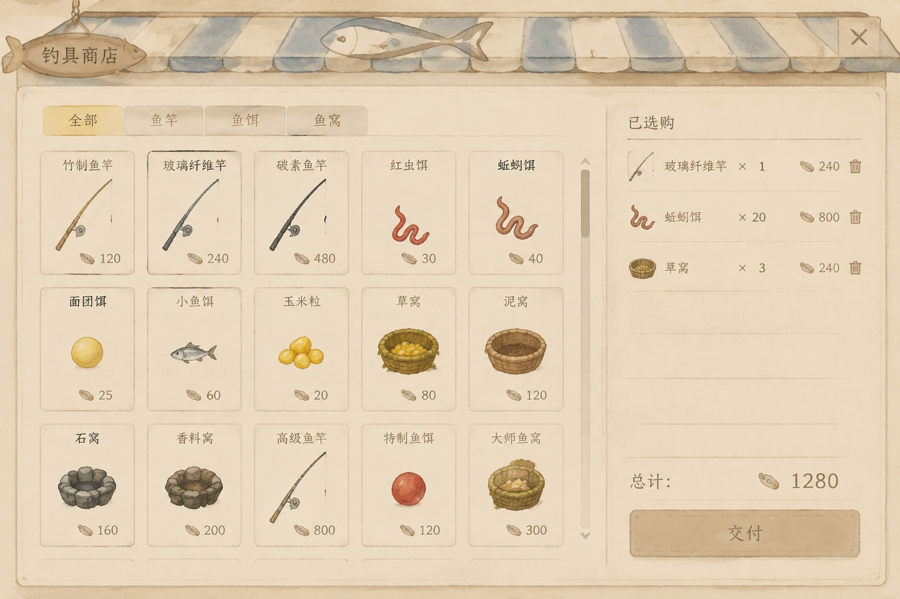

# 商店购物车与批量支付子技术方案

文档状态：需求确认版，待 C++ 接线、UE 编译与 PIE 运行核对。

更新时间：2026-08-31

适用范围：商店商品点击进入购物车、右侧已选购列表、购物车数量与总价、资金不足支付禁用提示、批量支付、支付成功后发货到营地公共仓库、商店货架刷新触发时机、最终商品价格数值、`WBP_CatShop` 整体视觉重做。

不覆盖范围：营地公共仓库取用到个人库存的既有服务器链路、背包/营地仓库等完全非商店页面的逻辑重构。

## 事实来源清单

- 用户提供的目标商店界面截图：`Docs/Architecture/References/商店购物车目标界面.png`。
- 用户确认的购物车口径：整单原子提交、垃圾桶删除一个选购单位、购物车数量表示选购单数、免费项进入购物车、按钮文案使用“支付”、成功后清空、全局支付不可用即可。
- 用户确认的商店表口径：商店商品规模会持续扩展，商品上架和价格应由策划维护 DataTable；程序不能继续通过 C++ 默认数组逐项维护最终商品。
- `Source/Catfishing/UI/Shop/CatShopTypes.h`、`CatShopModel.*`、`CatShopWidget.*`、`CatShopPageController.*`：当前商店 MVC 和单商品购买入口。
- `Source/Catfishing/Framework/Game/CatGameplayTypes.*`：当前单商品商店 RPC、来源摊位距离证明、营地公共仓库解析。
- `Source/Catfishing/ShopEconomy/CatShopEconomyService.*`、`CatShopOrderCoordinator.*`、`CatShopInventoryComponent.*`：当前公款、货架库存、账本、单商品支付与发货链路。
- `Docs/Architecture/商店库存与营地公共仓库子技术方案.md`：商店库存、营地公共仓库和购买后入公共仓库的既有方案。
- `Docs/Architecture/局阶段环境与昼夜循环子技术方案.md`：`DayIndex`、`DayActive` 和局内昼夜阶段口径，用于确定商店进货刷新挂接点。

## 已确认口径

- 商店最终交互是先选购，再支付。商品点击不再直接购买，而是先进入购物车。
- 购物车支付必须是整单原子提交：任何一项库存不足、资金不足或营地公共仓库无法接收，都不能出现只买成一部分。
- 购物车数量表示“选了几单”，不是 `FCatShopCatalogEntry::PurchaseQuantity`。例如某条商品单次购买发 5 个，购物车显示 `x3` 表示买 3 单，最终交付 15 个。
- 商品点击使购物车对应条目数量加 1；右侧垃圾桶删除一个选购单位。数量大于 1 时减 1，数量等于 1 时移除该行。
- 免费领取项也进入购物车，价格按 0 计入总价，并与付费项一起通过“支付”按钮交付。
- 支付按钮文本使用“支付”。
- 购物车总价来自所有已选购条目的 `UnitPrice * CartCount` 合计。资金不足时支付按钮不可用，鼠标悬停提示文案固定为：`资金不足，无法购买！`
- 支付成功后清空购物车。支付失败时保留购物车，玩家可以删减条目或等待公款、库存、营地仓库状态变化后重试。
- 公款或货架快照变化导致购物车不可支付时，不做单行标红、单行禁用或单行失效态；只让支付按钮整体不可用，并给出全局原因。
- `FCatShopViewState::Entries` 是当前商店完整货架数据在本地同步后的唯一商品事实。分类按钮不修改它，购物车也不另存价格、库存或交付数量。
- 左侧商品页读取本地 `DisplayedEntries`。`DisplayedEntries` 只由当前 `ViewState.Entries` 和当前分类过滤覆盖出来，不同步到服务器，也不作为结算事实。
- 商店关闭后再次打开默认回到“全部”分类；新页面从最新 `ViewState.Entries` 重新覆盖一次 `DisplayedEntries`。
- 商店出售表的目标形态改为策划可维护的 DataTable。程序只维护行结构、加载校验、运行转换和交易裁决，不负责逐个商品写死上架数据。
- 当前目标截图里的 15 个商品只是本轮目标样例和价格锚点，不代表最终商店商品规模上限。后续新增商品应主要通过新增表行和对应商品定义/图标资源完成。
- 旧商店表入口需要在重构中清理干净。`UCatShopInventoryComponent` 的 C++ 默认商品数组、组件内联固定/随机数组和旧 `UCatShopCatalogDefinition` 资产口径不能继续作为正式运行分支。
- 商店刷新触发时机纳入本方案。这里的“刷新”指货架重新进货、随机池重新抽取或每日库存重置，不是 Widget 重新渲染。
- 最终商品价格数值纳入本方案。当前 C++ 默认表里的小数值或免费占位价不能继续当正式价格。
- 商店页面视觉以目标截图为准，覆盖整个 `WBP_CatShop`，不只覆盖右侧购物车。

## 目标界面参考



目标界面由一张商店页完成，不再拆成临时白盒按钮：

- 顶部是钓具商店牌匾和关闭按钮。
- 左侧是商品分类页签，当前目标页签为“全部、鱼竿、鱼饵、鱼窝”。
- 左侧主体是可滚动商品卡网格，每张卡展示名称、图标和价格。
- 右侧是“已选购”列表，每行展示商品图标、名称、选购单数、小计和垃圾桶。
- 右下是购物车总价和“支付”按钮。
- 资金不足时，“支付”按钮不可提交；鼠标悬停时在鼠标旁显示 `资金不足，无法购买！`

## 目标商品与价格

目标价格以用户截图为准。实现时应把 `FCatShopSaleEntry::UnitPrice`、展示名、分类和图标对齐这张表；当前源码默认价格只是占位。若某个商品还缺正式 `UCatEquipmentDefinition`，不能用无关旧定义冒充，应补正式定义或暂不上架。

| 分类 | 商品名 | 目标单价 | 说明 |
| --- | --- | ---: | --- |
| 鱼竿 | 竹制鱼竿 | 120 | 初级竿价格，不再按当前保底免费占位处理。 |
| 鱼竿 | 玻璃纤维竿 | 240 | 目标图中购物车示例为 1 单，小计 240。 |
| 鱼竿 | 碳素鱼竿 | 480 | 中高阶鱼竿。 |
| 鱼竿 | 高级鱼竿 | 800 | 高阶鱼竿。 |
| 鱼饵 | 红虫饵 | 30 | 数量显示按购物车选购单数，不按交付数量混写。 |
| 鱼饵 | 蚯蚓饵 | 40 | 目标图中购物车示例为 20 单，小计 800。 |
| 鱼饵 | 面团饵 | 25 | 普通鱼饵。 |
| 鱼饵 | 小鱼饵 | 60 | 普通鱼饵。 |
| 鱼饵 | 玉米粒 | 20 | 普通鱼饵。 |
| 鱼饵 | 特制鱼饵 | 120 | 高阶鱼饵。 |
| 鱼窝 | 草窝 | 80 | 目标图中购物车示例为 3 单，小计 240。 |
| 鱼窝 | 泥窝 | 120 | 普通鱼窝。 |
| 鱼窝 | 石窝 | 160 | 普通鱼窝。 |
| 鱼窝 | 香料窝 | 200 | 高阶鱼窝。 |
| 鱼窝 | 大师鱼窝 | 300 | 高阶鱼窝。 |

## 当前源码事实

- `Source/Catfishing/UI/Shop/CatShopTypes.h` 已经包含商品展示行、分类展示行、购物车行、购物车总价、支付按钮可用性和支付禁用原因。
- `Source/Catfishing/UI/Shop/CatShopModel.cpp` 仍从 `ACatfishingGameState::GetShopEconomySnapshot()` 和来源摊位 `UCatShopInventoryComponent` 生成真实商品数组，并在每次刷新时从最新 `Entries` 重算购物车行与总价。
- `Source/Catfishing/UI/Shop/CatShopWidget.cpp` 已经移除点商品立即购买/免费领取入口；商品卡只发加购意图，购物车行只发删除一份意图，支付按钮只发整车支付意图。
- `UCatShopWidget` 的分类选择只改当前客户端的 `BlueprintSelectedCategoryId`，再从最新 `ViewState.Entries` 覆盖生成 `BlueprintDisplayedEntries`；分类状态不会写回 Model 或服务器。
- `WBP_CatShop` 是主页面，负责参考图式整体视觉；`WBP_CatShopGoodsItem` 与 `WBP_CatShopCartLine` 是功能解耦后的重复子控件，C++ 不再运行时生成整页布局。
- `UCatShopPageController` 已经改成购物车语义：加购/删除只修改本地 Model，支付时构造 `FCatShopCartCommand` 并提交批量支付 RPC。
- `Source/Catfishing/Framework/Game/CatGameplayTypes.cpp` 的购物车提交只接受 EntryId 与次数，服务器会重新查价、查库存、扣公款并交付到营地公共仓库。
- `Source/Catfishing/ShopEconomy/CatShopOrderCoordinator.cpp` 已经按整车原子提交处理：先问营地公共仓库能否整批收货，再扣公款和货架库存，再发货并确认交付。
- `Source/Catfishing/ShopEconomy/CatShopInventoryComponent.cpp` 已经从策划维护的 DataTable 读取商店目录；固定上架和随机候选都由同一张表表达。
- `Source/Catfishing/Framework/Game/CatGameplayTypes.cpp` 进入新 `DayActive` 并递增 `DayIndex` 后会调用 `UCatShopEconomyService::AdvanceShopDay()`；这是商店每日进货刷新的挂接点。

## 商店表目标口径

目标商店表必须面向策划配置。策划添加、下架、改价、改分类、改排序、改库存、改随机权重时，不应要求程序修改 C++ 默认数组。程序的责任是定义表行结构、读取 DataTable、做完整校验、把合法行转换成运行货架，并在服务端交易时只相信当前运行货架事实。

主入口建议改为 `UDataTable`，行结构继承 `FTableRowBase`。每一行表达一个可上架商品，至少包含当前 `FCatShopSaleEntry` 已有字段，以及商品页需要的新字段：

```cpp
USTRUCT(BlueprintType)
struct FCatShopCatalogTableRow : public FTableRowBase
{
	GENERATED_BODY()

	UPROPERTY(EditAnywhere, BlueprintReadOnly)
	FName EntryId = NAME_None;

	UPROPERTY(EditAnywhere, BlueprintReadOnly)
	FName DefinitionId = NAME_None;

	UPROPERTY(EditAnywhere, BlueprintReadOnly)
	ECatShopEntryKind EntryKind = ECatShopEntryKind::Unknown;

	UPROPERTY(EditAnywhere, BlueprintReadOnly)
	FName DisplayCategoryId = NAME_None;

	UPROPERTY(EditAnywhere, BlueprintReadOnly)
	int32 PurchaseQuantity = 1;

	UPROPERTY(EditAnywhere, BlueprintReadOnly)
	int32 UnitPrice = -1;

	UPROPERTY(EditAnywhere, BlueprintReadOnly)
	int32 InitialStock = 0;

	UPROPERTY(EditAnywhere, BlueprintReadOnly)
	bool bUnlimitedStock = false;

	UPROPERTY(EditAnywhere, BlueprintReadOnly)
	bool bEnabled = true;

	UPROPERTY(EditAnywhere, BlueprintReadOnly)
	FName RefreshPoolId = NAME_None;

	UPROPERTY(EditAnywhere, BlueprintReadOnly)
	int32 RefreshWeight = 0;

	UPROPERTY(EditAnywhere, BlueprintReadOnly)
	int32 SortOrder = 0;
};
```

`DisplayCategoryId` 是商品页分类，不等于 `ECatShopEntryKind`。`ECatShopEntryKind` 只说明交付类型，例如装备发放或数量物发放；鱼竿、鱼饵、鱼窝这类页签必须有自己的展示分类字段。分类不建议写成 C++ enum，否则策划新增分类仍然要改程序；“全部”应是 UI 生成的虚拟页签，不要求每一行商品都填成全部。

DataTable 可以覆盖大量商品行；当前截图价格表只是需要先填入的目标数据。若策划未来增加新品，默认流程应是新增 `UCatEquipmentDefinition` 或等价商品定义、补图标资源、在商店 DataTable 增加行，再由现有加载和校验逻辑进入货架。若未来页签也需要策划配置，应再加一张轻量分类表，保存 `DisplayCategoryId`、显示名、排序和图标；商品表只引用分类 ID。

DataTable 行应同时表达固定货架和随机候选，不再用 `FixedEntries` 与 `RandomEntries` 两个 C++ 数组拆口径。固定商品可以使用空 `RefreshPoolId` 或明确的上架策略字段表示每次都进入货架；随机商品用 `RefreshPoolId + RefreshWeight` 表示候选池和权重。随机池每次抽几条可以放在摊位配置或一张轻量刷新规则表里，但商品本身仍只维护在策划商品表中。

现有 `UCatShopCatalogDefinition`、`ShopCatalog` 软引用、`FixedSaleEntries`、`RandomSaleEntries`、C++ 构造函数里的 `MakeDefaultSaleEntry()` / `MakeDefaultRandomEntry()` 默认商品表，都属于迁移对象。重构完成后，正式运行路径不保留这些旧入口；如果迁移期间需要临时对照，也只能作为短期过渡，交付前必须删除或从运行路径断开。缺少正式 DataTable 时商店应关闭目录并输出配置错误，而不是回退到旧默认商品。

## 领域状态

货架商品事实由 `FCatShopViewState::Entries` 承载。它来自商店出售表、摊位库存快照和公款经济快照的同步结果，是左侧商品显示、右侧购物车反查和本地支付可用性计算共同读取的商品事实。分类选择不写入、不重排、不删减这份数组。

`DisplayedEntries` 属于当前客户端的商品页显示缓存，建议放在 `UCatShopWidget` 或同一层本地 View 状态中。它不参与同步，也不是第二份货架数据。它只能通过同一个 `RefreshDisplayedEntries()` 从当前 `ViewState.Entries` 和本地 `CurrentCategory` 过滤覆盖生成。

`RefreshDisplayedEntries()` 的调用时机只有两类：玩家点击分类时，先更新本地 `CurrentCategory`，再过滤当前 `ViewState.Entries`；商店真实数据同步完成时，不改当前分类，直接用最新 `ViewState.Entries` 再执行同一次过滤。这样商店货架变化和玩家切分类走同一条显示刷新路径。

商店关闭后当前页面生命周期结束，`DisplayedEntries` 和 `CurrentCategory` 一起销毁。下一次打开商店时，页面默认选中“全部”，再从最新同步到的 `ViewState.Entries` 覆盖 `DisplayedEntries`。若未来要记住上次分类，也只能作为本地玩家 UI 偏好保存，不能写进商店 Model 或货架数据。

购物车属于本次打开商店页面的本地选购序列，可由 `UCatShopModel` 持有。它不是服务器库存，不复制，不写入 GameState，不作为公款或货架权威。页面关闭或支付成功后清空。

一条购物车数据只需要保存当前摊位范围内的 `EntryId` 和选购单数。展示时再用当前 `FCatShopViewState::Entries` 反查名字、价格、库存和单次交付数量。这样右侧购物车每行仍然对应真实商店目录项，而不是 WBP 自己保存的一份假商品。

建议内部数据：

```cpp
USTRUCT(BlueprintType)
struct FCatShopCartLineView
{
	GENERATED_BODY()

	UPROPERTY(BlueprintReadOnly)
	FName EntryId = NAME_None;

	UPROPERTY(BlueprintReadOnly)
	FName DefinitionId = NAME_None;

	UPROPERTY(BlueprintReadOnly)
	int32 CartCount = 0;

	UPROPERTY(BlueprintReadOnly)
	int32 PurchaseQuantity = 1;

	UPROPERTY(BlueprintReadOnly)
	int32 DeliveryQuantity = 0;

	UPROPERTY(BlueprintReadOnly)
	int32 UnitPrice = 0;

	UPROPERTY(BlueprintReadOnly)
	int32 LineTotalPrice = 0;

	UPROPERTY(BlueprintReadOnly)
	FText DisplayNameText;

	UPROPERTY(BlueprintReadOnly)
	FText DisplayText;
};
```

`FCatShopViewState` 扩展：

```cpp
UPROPERTY(BlueprintReadOnly)
TArray<FCatShopCartLineView> CartLines;

UPROPERTY(BlueprintReadOnly)
int32 CartTotalPrice = 0;

UPROPERTY(BlueprintReadOnly)
bool bCanPayCart = false;

UPROPERTY(BlueprintReadOnly)
FText CartTotalText;

UPROPERTY(BlueprintReadOnly)
FText PayButtonText;

UPROPERTY(BlueprintReadOnly)
FText PayDisabledReasonText;
```

`PayButtonText` 固定写为“支付”。`PayDisabledReasonText` 在资金不足时必须写为 `资金不足，无法购买！`。其他不可支付原因可以继续使用全局文案，例如“请选择商品”“商店数据未同步，无法支付”“商品库存不足，无法支付”“正在等待商店结果同步”。

## Model 规则

`UCatShopModel` 新增购物车写口：

```cpp
bool AddEntryToCart(FName EntryId);
bool RemoveOneCartItem(FName EntryId);
void ClearCart();
```

规则：

1. `AddEntryToCart` 只接受当前 `ViewState.Entries` 中存在的 `EntryId`。
2. 有限库存商品最多加到当前公开库存 `RemainingStock`；无限库存商品不受货架库存限制，但仍要防止非正数和整型溢出。
3. `RemoveOneCartItem` 每次只减少 1 个购物车选购单位。减到 0 时移除该购物车行。
4. `Refresh` 时重新从当前商品投影计算 `CartLines`、`CartTotalPrice` 和 `bCanPayCart`。
5. 货架、公款或商品目录变化时，购物车行不自动删除；如果当前事实已经无法支持这笔购物车，直接让 `bCanPayCart=false`。
6. `bCanPayCart` 至少要求页面打开、经济快照可用、购物车非空、没有 pending、总价不超过团队公款、每条有限库存的 `CartCount` 不超过当前剩余库存。
7. `UCatShopModel` 不保存分类选择，也不维护 `DisplayedEntries`。分类属于当前客户端 View 状态，Model 只提供完整 `ViewState.Entries` 和购物车结果。

`FCatShopEntryView::bActionEnabled` 不再表示“能不能购买”，而应降级为“能不能加入购物车”。资金不足不阻止玩家把商品放入购物车，只阻止最终支付。

## 商店刷新触发时机

“商店刷新触发时机”指当前货架什么时候重新进货或重新抽随机池。它不等于 `UCatShopWidget::RenderShop()` 这种 UI 重绘，也不等于支付后余额和库存数字刷新。

目标规则：

1. 商店摊位进入 World 时，`UCatShopInventoryComponent::BeginPlay()` 仍构建首份货架，保证关卡开局有可展示商品。
2. 每次局内 `DayIndex` 增加并进入新的 `DayActive` 时，触发一次当日进货。这个时机由 `ACatfishingGameModeBase` 推进 Run 阶段时调用商店服务，不由商店 UI 自己决定。
3. 当日进货应覆盖两类变化：标记为每日补货的有限商品重置库存；需要每日换货的随机商品重新从随机池抽取。
4. 打开商店页面不触发随机换货。玩家反复打开同一个商店，只看到当前天已经确定的货架。
5. 支付成功只刷新公款、货架剩余库存和购物车状态，不触发随机换货。
6. 显式调试或运营刷新仍可走 `RefreshShopInventoryFromCatalog()`，但它是人工或系统命令入口，不是玩家打开商店的副作用。

实现上，现有 `AdvanceShopDay(NewDayIndex)` 只处理每日补货，不换随机货架。若最终要求“每天换一批货”，需要在同一个 `DayIndex` 递增边界上为每个已注册摊位调用一次 `RefreshShopInventoryFromCatalog()`，并用稳定 `RequestId` 保证同一天同摊位不会重复抽取。

## View 规则

正式商店 WBP 已按最终形态处理，C++ 不应再设计“以后补 UI”的路径。C++ 只需要提供稳定字段和意图出口，让 WBP 把左侧商品、右侧购物车、总价和支付按钮接上。

左侧商品页不直接绑定完整 `ViewState.Entries`，而是绑定本地 `DisplayedEntries`。`UCatShopWidget::RenderShop()` 收到新的 `ViewState` 后先保存最新完整状态，再调用 `RefreshDisplayedEntries()`。分类按钮只更新 `CurrentCategory` 并调用同一个 `RefreshDisplayedEntries()`。该函数每次整表覆盖 `DisplayedEntries`，不在旧数组上做增量增删，避免价格、库存、可加入状态残留旧值。

`DisplayedEntries` 的排序沿用 `ViewState.Entries` 的排序结果，过滤时不重新随机、不重新排序。当前分类没有商品时，左侧网格显示为空；右侧购物车、总价和支付状态仍按购物车与完整 `ViewState.Entries` 计算。

`UCatShopWidget` 建议保留现有 `BP_RenderShop(ViewState)` 作为正式渲染扩展点，同时新增三个意图出口：

```cpp
void RequestAddEntryToCart(FName EntryId);
void RequestRemoveOneCartItem(FName EntryId);
void RequestPayCart();
```

左侧商品行调用 `RequestAddEntryToCart`。右侧购物车垃圾桶调用 `RequestRemoveOneCartItem`，它删除一个选购单位，不是整行清空。支付按钮调用 `RequestPayCart`。

资金不足悬停提示属于 WBP 表现层。C++ 只提供 `bCanPayCart=false` 和 `PayDisabledReasonText=资金不足，无法购买！`。WBP 可以用支付按钮外层可命中的容器承接 hover，这样即使按钮视觉上不可点，鼠标移入时仍能在鼠标旁显示提示文字。

## Controller 规则

`UCatShopPageController` 改成购物车语义：

- 商品动作入口不再提交单商品 RPC，而是调用 `UCatShopModel::AddEntryToCart()`。
- 购物车删除入口调用 `UCatShopModel::RemoveOneCartItem()`。
- 支付入口读取 `ViewState.CartLines` 和 `ViewState.CartTotalPrice`，在本地明显不可支付时只写拒绝回显，不发服务器请求。
- 通过本地校验后生成一个 `RequestId`，记录单个购物车 pending，再调用批量支付 RPC。

正式 UI 不再保留“点商品立即购买/领取”的运行入口。`RequestPurchaseEntry()` 和 `RequestFreeClaimEntry()` 这类旧入口应从源码、WBP 和拼装文档中移除，不能与购物车支付并行形成两条购买口径。

## 服务端批量支付

为了满足整单原子提交，不应在客户端或 PageController 中循环调用现有单商品 RPC。循环单商品会遇到公款版本推进、库存中途变化和半成功问题。

建议新增批量支付命令：

```cpp
USTRUCT(BlueprintType)
struct FCatShopCartLineCommand
{
	GENERATED_BODY()

	UPROPERTY(BlueprintReadWrite)
	FName EntryId = NAME_None;

	UPROPERTY(BlueprintReadWrite)
	int32 CartCount = 0;
};
```

PlayerController 新增 RPC：

```cpp
UFUNCTION(Server, Reliable, BlueprintCallable, Category = "Catfishing|Shop")
void ServerSubmitShopCartAtKiosk(ACatShopKioskActor* ShopKiosk,
	const TArray<FCatShopCartLineCommand>& Lines,
	FGuid RequestId,
	int64 ExpectedWalletRevision);
```

RPC 层仍只接受来源摊位作为距离证明，不接受客户端提交价格、库存、`DefinitionId`、`PurchaseQuantity`、总价或收货仓库。`ShopInventoryId` 仍由服务器从 `ShopKiosk->GetShopInventory()` 取得。

服务端必须先合并重复 `EntryId`，拒绝空购物车、非正数量和溢出数量。随后按当前摊位库存逐项解析目录：

- `LineTotalPrice = Entry.UnitPrice * CartCount`
- `DeliveryQuantity = Entry.PurchaseQuantity * CartCount`
- 有限库存要求 `RemainingStock >= CartCount`
- 总价要求 `Wallet.Balance >= CartTotalPrice`

免费项不走单独 UI 分支。服务端按当前目录价格计算，白名单保底项总价为 0，并可以在账本中继续标记为 `FreeClaim`；非白名单但价格为 0 的条目若当前购买写口允许，也按当前服务端策略处理，客户端不参与判断。

## 批量交付与原子性

整单原子成立的关键是交付前置校验必须按整批物品算，而不是每行单独问一次。两个商品各自单独能放进营地仓库，不代表它们合起来也能放进去。

因此 `ACatCampInventoryActor` 需要补一组批量接口或等价的整批模拟校验：

```cpp
ECatDomainCommandError ValidateAddItemsFromAuthority(FGuid RequestId,
	int64 ExpectedRevision,
	const TArray<FCatCampInventoryAddItemRequest>& Items) const;

FCatDomainCommandResult AddItemsFromAuthority(FGuid RequestId,
	int64 ExpectedRevision,
	const TArray<FCatCampInventoryAddItemRequest>& Items);
```

`FCatCampInventoryAddItemRequest` 只表达商店发货意图里的定义和数量；校验时用公共仓库当前槽位副本模拟整批堆叠和空槽占用，成功提交时再归一化成带 `ItemInstanceId` 的 `FCatRunInventorySlot`、一次性写回快照、递增版本并广播。这样支付前置校验和真实入库使用同一组规则。

批量支付顺序：

1. PlayerController 校验来源摊位、玩家身份和摊位距离。
2. PlayerController 在当前 World 中解析 `ACatCampHubActor::ResolvePublicInventoryForShopOrder()`。
3. `UCatShopOrderCoordinator` 接收购物车命令。
4. `UCatShopEconomyService` 或协调器解析当前目录、库存、总价和交付明细。
5. 在扣钱前调用营地公共仓库整批接收预检。
6. 所有前提成立后，一次性扣总价，并按每条 `EntryId` 扣对应 `CartCount` 次货架库存。
7. 写入购物车交易账本。账本可以每个 EntryId 一条记录，但同属一个购物车 `RequestId`。
8. 调用营地公共仓库整批入库。
9. 用同一个 `RequestId` 或购物车交付回执确认账本交付完成。
10. owning client 收到成功结果后，Model 清空购物车并等待公开经济快照刷新。

如果第 1 到第 5 步任一失败，公款、货架库存、账本和营地仓库都不写。第 6 步以后不应再出现可预期失败；如果出现运行依赖异常，必须返回明确错误并保留可重试的幂等链路。

## 账本与复制

当前公开经济快照 `FCatShopPublicEconomySnapshot` 已经能展示余额、货架库存和公开交易记录。购物车支付不需要新增一份客户端经济状态。

账本有两种可行落法：

- 保持每条商品一个 `FCatShopTransactionRecord`，同一个购物车支付共用 `RequestId`。优点是现有公开交易结构改动较小，仍能显示每种商品买了多少。
- 新增购物车级交易记录，再在记录里保存多行商品。优点是账本语义更完整，但改动面更大。

本轮建议采用第一种：每条商品一条交易记录，同一个购物车支付共用 `RequestId` 和同一个提交时刻。钱包只扣一次总价，钱包版本只推进一次；每条记录保存自己的 `EntryId`、`DefinitionId`、`PurchaseQuantity * CartCount`、`WalletDelta` 分摊金额和交付状态。

公开快照仍由 `ACatfishingGameModeBase::PublishShopEconomySnapshot()` 重建。客户端商店 Model 收到 `OnShopEconomySnapshotChanged` 后刷新商品库存、公款、购物车可支付状态和结果文本。

## 需要避免的错误方向

- 不让左侧商品按钮继续直接调用单商品购买 RPC。
- 不在 WBP 中保存价格、库存、总价或交付数量作为权威事实。
- 不让客户端提交总价、`DefinitionId`、`PurchaseQuantity`、库存版本或营地仓库引用。
- 不用循环单商品 RPC 假装购物车支付；这会破坏整单原子。
- 不把垃圾桶做成删除整行；它只删除一个选购单位。
- 不在公款或库存变化时做复杂单行失效态；支付整体不可用即可。
- 不因为免费项进购物车就保留一条“免费立即领取”的正式 UI 路径。
- 不改变商店发货目标：支付成功后仍进入营地公共仓库，不直接进入玩家个人 `UCatEquipmentComponent`。
- 不保留 C++ 默认商品数组、组件内联固定/随机数组或旧 `UCatShopCatalogDefinition` 作为正式商品来源。
- 不在正式 DataTable 缺失时回退到开发期默认商品；缺表应暴露配置错误并 fail-closed。

## 实现落点

优先阅读和修改顺序：

1. `Source/Catfishing/UI/Shop/CatShopTypes.h`：补购物车行 View、支付状态字段和批量支付命令 DTO。
2. `Source/Catfishing/UI/Shop/CatShopModel.h/.cpp`：持有购物车序列，计算购物车行、总价和支付禁用原因。
3. `Source/Catfishing/UI/Shop/CatShopWidget.h/.cpp`：把立即购买意图改成加入购物车、删除一个选购单位和支付购物车三个出口，并在本地维护 `CurrentCategory`、`DisplayedEntries` 与 `RefreshDisplayedEntries()`。
4. `Source/Catfishing/UI/Shop/CatShopPageController.h/.cpp`：把商品点击、购物车删除、支付按钮转成 Model 写口或批量支付 RPC。
5. `Source/Catfishing/Framework/Game/CatGameplayTypes.h/.cpp`：新增 `ServerSubmitShopCartAtKiosk` 和服务端转发函数，保持来源摊位距离证明和营地解析规则。
6. `Source/Catfishing/ShopEconomy/CatShopInventoryComponent.h/.cpp`：补按 `CartCount` 扣减同一 `EntryId` 的货架库存能力。
7. `Source/Catfishing/ShopEconomy/CatShopEconomyService.h/.cpp`：补购物车级预检、总价扣款、账本写入和幂等缓存。
8. `Source/Catfishing/ShopEconomy/CatShopOrderCoordinator.h/.cpp`：新增购物车协调入口，串起付款前整批交付预检、付款、整批发货和交付确认。
9. `Source/Catfishing/Camp/CatCampInventoryActor.h/.cpp`：补整批接收预检和整批入库，保证多条商品合计容量按同一次快照判断。
10. `Content/UI/Shop/WBP_CatShop.uasset`：按目标截图完成商店整体视觉，包含分类页签、商品卡网格、右侧已选购列表、总价区、支付按钮和鼠标跟随提示。
11. 商店 DataTable：建立策划可维护的正式商品表，把商品展示名、分类、图标和 `UnitPrice` 对齐目标商品与价格表，并保证新增商品不需要改 C++ 默认数组。
12. `UCatShopInventoryComponent`：把当前 `ShopCatalog`、内联固定表和随机池读取口径重构为 DataTable 主入口；删除正式路径中的 C++ 默认商品数组和旧资产读取分支。
13. `Source/Catfishing/ShopEconomy/CatShopCatalogDefinition.h/.cpp`：若不再被正式 DataTable 方案需要，删除旧 `UPrimaryDataAsset` 商店目录类型，并同步清理 include、资源引用和文档旧口径。
14. `Docs/Development/UI_WBP拼装接口清单.md`：实现完成后同步商店 WBP 接口口径；这是接线文档，不写测试报告或验收报告。

## 完成判定

- 左侧点击商品只改变购物车，不扣钱、不扣货架、不发营地仓库。
- 分类按钮只改变本地 `CurrentCategory` 并覆盖 `DisplayedEntries`，不改变 `ViewState.Entries`。
- 商店真实数据同步后直接重新执行 `RefreshDisplayedEntries()`；当前分类保持不变，关闭重开则默认回到“全部”。
- 右侧购物车显示每个 `EntryId` 的选购单数、小计和购物车总价。
- 垃圾桶每次只删除一个选购单位，减到 0 才移除该行。
- 购物车总价大于团队公款时，支付按钮不可用，悬停提示为 `资金不足，无法购买！`
- 支付成功后购物车清空，公款按总价扣减，货架按每条 `CartCount` 扣减，营地公共仓库收到 `PurchaseQuantity * CartCount` 的物品。
- 支付失败后购物车保留，公款、货架库存和营地公共仓库不出现半写入。
- 正式 UI 不再存在商品点击立即购买或免费立即领取的运行路径。
- `WBP_CatShop` 的整体视觉与目标截图一致：左侧分类和商品卡、右侧已选购列表、总价和支付区都在同一页中完成。
- 运行商店价格与目标商品价格表一致，不再使用当前源码默认占位价格。
- 正式商店商品来自策划维护的 DataTable；新增普通商品、改价、改分类、改排序和上下架不需要程序改 C++ 默认数组。
- 旧商店目录入口已清理：正式运行路径不再读取 C++ 默认商品数组、组件内联固定/随机数组或旧 `UCatShopCatalogDefinition`。
- 新一天进入 `DayActive` 时触发当日进货；打开商店和支付成功都不触发随机换货。
