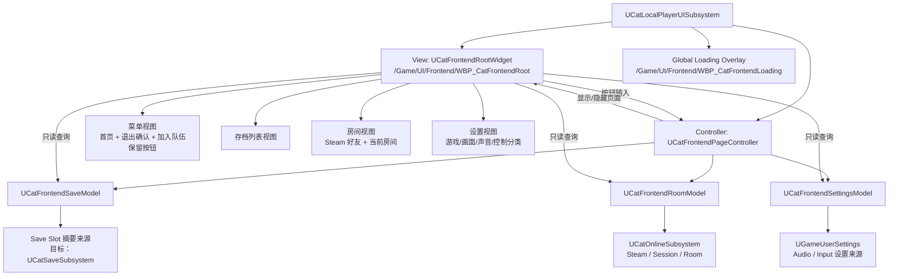

# 主界面子技术文档

文档状态：技术设计草案（2026-09-07）。**2026-09-15 盘点：已实现**——`Source/Catfishing/UI/Frontend/` 十个源文件与 `Content/UI/Frontend/` 九个 WBP 与本文目标清单一致，清理清单也已做完；现行接口合同看 `UI_WBP拼装接口清单.md`，本文只留作设计依据。设计真值已从飞书迁到 `Knowledge/Design/GDD 系统分册/ui/主界面.md`。

范围：本文只描述玩家进入玩法前的 Frontend 主界面技术拆分、C++/WBP 接线、数据模型职责和被替换入口清理。本文不讨论进入营地后的 HUD、局内保存菜单、暂停菜单、图鉴、组队管理、钓鱼玩法 UI 或其他局内 UI。本文不是测试报告或验收报告。

## 事实来源

- 飞书策划案：`小猫钓鱼 / GDD 系统分册 / ui / 主界面`，`node_token=OEqkw02J2iHso9keQ1Yc7Wsdnpe`，`document_id=D5h8dp1Ipoukd4xFHMPcHcHznvf`，`revision_id=309`。
- 整体策划案入口：飞书知识库空间 `小猫钓鱼`，`space_id=7670823117626870757`，空间描述为“小猫钓鱼项目设计文档”；顶层愿景文档为 `北极星愿景`，`node_token=EOdZwzK8wiDtZNkLTcXcEEWxnid`，`document_id=ET5MdaUHRorYnhxZqS9c60TMnrc`，`revision_id=41`。
- 飞书策划案读取时间：2026-09-07；用户确认主标题使用“北极星愿景”。UI 主界面页的图片文字是示例图文案，不作为正式游戏名。
- 主界面流程笔记：`Docs/Development/主界面重构设计笔记.md`。
- WBP 拼装合同：`Docs/Development/UI_WBP拼装接口清单.md`。
- UI 架构口径：`Docs/Architecture/项目技术方案.md` 中的 UMG MVC、业务 UI 分模块和“不同 UI 模块不能共享一个大状态对象”规则。
- 当前前台 UI 源码：`Source/Catfishing/UI/Frontend/` 中的 Root、PageController、SaveModel、RoomModel、SettingsModel `.h/.cpp`，以及 `Source/Catfishing/UI/CatLocalPlayerUISubsystem.h/.cpp`、`Source/Catfishing/UI/CatUISettings.h/.cpp`；`CatTravelWidget.h/.cpp` 与 LocalPlayer 白盒专线已删除。
- 当前 Online 源码：`Source/Catfishing/Online/CatOnlineTypes.h`、`Source/Catfishing/Online/CatOnlineSubsystem.h/.cpp`。
- 当前存档事实：`Source/Catfishing/Save/CatSaveSubsystem.h/.cpp`、`Source/Catfishing/Save/CatRunSaveGame.h`，以及 Equipment、Camp、FishContainers 的受控导出/恢复接口；`Source/Catfishing/Profile/CatProfileSaveGame.h`、`Source/Catfishing/Profile/CatProfileSubsystem.h/.cpp` 和 `Docs/Development/SavePersistenceDiscussionNotes.md` 用于核对长期档案与世界 Save 的边界。
- 用户确认口径（2026-09-07）：主界面不拆临时版本，按一次性完成的正式闭环设计；背景最终同时支持静态和动态；`加入队伍` 暂只保留按钮；设置分类为游戏、画面、声音、控制；存档页改为类似 Minecraft 的单页列表；Save 首批保存库存内容和角色位置；邀请码必须真实可用；`UCatTravelWidget` 和相关测试脚本口径删除。
- 用户确认口径（2026-09-08）：进入游戏和退出到主菜单的加载表现必须是 Lyra/CommonLoadingScreen 式全局遮罩，不是 Frontend Root 或局内 ESC 菜单的子页面；进入游戏用 Start、地图包、旅行、World、BeginPlay 和本地 UI 的真实 gate 合成总进度，退出到主菜单只显示真实等待状态，也不得用计时器硬等或做兜底延迟。
- 人工决策补充（2026-09-07，主线程转交）：对现有 Steam 语音不支持麦克风选择、语音输入模式且需额外接线的问题，用户明确答复“允许暂时不可用”。本轮保留这两项设置行与真实禁用原因，不保存无效偏好，其他原范围不变。
- 设置实现与资产生成入口：`Source/Catfishing/UI/Frontend/CatFrontendSettingsModel.h/.cpp`、`Source/Catfishing/Settings/CatGameUserSettings.h/.cpp`、`Source/CatfishingEditor/UI/CatFrontendWidgetAuthoringLibrary.h/.cpp`、`Scripts/create_frontend_assets.py`；Root 软类已接线，`Config/DefaultGame.ini` 已精确包含 `/Game/UI/Frontend`、`/Game/Audio/Settings`。
- 实施证据边界：`.codex/state/frontend-online-context.json` 的被替换入口、创建即旅行和缺少 Save 域接口记录属于改动前基线；本段与文末记录当前源码状态，正文原有改造说明保留设计语义。构建失败记录为 `Saved/Logs/FrontendIntegrationBuild.log`、`Saved/Logs/FrontendIntegrationBuild2.log`；修复进度与待重编安排来自主线程交接，尚无完整构建通过或 runtime 证据。
- 加载遮罩迟到就绪回归事实（2026-09-11，主线程转交）：用户确认问题表现为一直卡加载；根因是遮罩刷新只依赖 Online/Pawn 广播，`GameState`、`BeginPlay` 或 HUD 晚到时没有再次刷新。修复入口为 `Source/Catfishing/UI/CatLocalPlayerUISubsystem.h/.cpp`，回归入口为 `Source/CatfishingEditor/UI/Tests/CatLoadingReadinessTests.cpp` 的 `Catfishing.Editor.UI.Loading.LateReadinessNetwork`，证据日志包括 `Saved/Logs/LoadingReadiness-Red.log`、`Saved/Logs/LoadingReadiness-Final-v2.log`、`Saved/Logs/LoadingReadiness-EditorBuild.log`、`Saved/Logs/LoadingReadiness-GameBuild.log`。

## 当前结论

新版主界面应新增正式 `UI/Frontend` 体系，不继续改造 `UCatTravelWidget`。`UCatTravelWidget` 是白盒入口，它的按钮语义是 `Host Session`、`Find Sessions`、`Join First Result`、`Leave Session`，不符合飞书主界面图 01 到图 08 的产品流程。

主界面按一次性完成的正式闭环设计，不拆“先临时能跑、后面再补完整”的开发版本。Save/Persistence 的首批保存内容明确为库存内容和角色位置；保存框架、槽位列表、读写流程、异步加载、房间创建、Steam 好友邀请、邀请码和被替换入口清理要作为同一轮主界面闭环处理。

主菜单正式标题使用“北极星愿景”。背景承载层需要同时支持静态图和动态背景，具体素材后续提供，C++ 不写死素材形态。

目标结构不是一个大 `FrontendModel`，而是一个 `PageController` 管流程，三个 Model 管三类数据来源：

```text
UCatFrontendPageController
├─ UCatFrontendSaveModel
├─ UCatFrontendRoomModel
└─ UCatFrontendSettingsModel
```

`PageController` 持有入口来源、当前选中的存档槽和跨页跳转规则。三个 Model 维护各自数据来源、查询函数和变化通知，不生成额外的页面数据包。View 读取 Model，View 把玩家输入交给 Controller，Controller 调用 Model 或切换 View；Root Widget 不再按一份页面状态二次判断。

WBP 拆分按业务通信边界决定，不按参考图逐页拆。没有独立 Model、独立消息发送或独立刷新节奏的页面，不单独拆成一套 C++ 基类和 WBP。

## 技术结构图



## 目标文件与资产落位

源码落位建议放在 `Source/Catfishing/UI/Frontend/`，仍属于当前 `Catfishing` Runtime 模块，不新增 UE 模块。

```text
Source/Catfishing/UI/Frontend/
├─ CatFrontendRootWidget.h
├─ CatFrontendRootWidget.cpp
├─ CatFrontendPageController.h
├─ CatFrontendPageController.cpp
├─ CatFrontendSaveModel.h
├─ CatFrontendSaveModel.cpp
├─ CatFrontendRoomModel.h
├─ CatFrontendRoomModel.cpp
├─ CatFrontendSettingsModel.h
└─ CatFrontendSettingsModel.cpp
```

各页面需要的数据直接由对应 Model 持有并通过只读函数暴露。存档页读 `CatFrontendSaveModel`，房间页读 `CatFrontendRoomModel`，设置页读 `CatFrontendSettingsModel`。不单独建立 `Types.h` 文件，不建立集中式类型桶，也不让 Model 先拼一份额外的显示数据包。

WBP 资产落位建议统一放在 `/Game/UI/Frontend`，避免重新使用历史根目录 UI 资产。

```text
/Game/UI/Frontend/
├─ WBP_CatFrontendRoot
├─ WBP_CatFrontendMenu
├─ WBP_CatFrontendSaveList
├─ WBP_CatFrontendRoom
├─ WBP_CatFrontendSettings
├─ WBP_CatFrontendLoading  # 全局遮罩内容，不嵌入 Root
├─ WBP_CatSaveSlotRow
├─ WBP_CatRoomFriendRow
└─ WBP_CatRoomPlayerSlot
```

首页和退出确认属于同一个菜单业务面，`加入队伍` 当前只作为按钮保留，不单独拆页面。存档列表、房间和设置有不同的数据来源或异步刷新节奏，可以独立为子 WBP。Loading WBP 是 LocalPlayer UI 直接盖到视口最高层的遮罩内容，不属于 Root 的页面切换器。存档槽、好友行和玩家槽是动态列表条目，可以单独做条目 WBP。

Root WBP 的背景层要拆成静态背景承载和动态背景承载两种资产位。两种形态都属于主菜单视觉表现，不影响 Controller、Model 或页面流程。

`Config/DefaultGame.ini` 需要把 `/Game/UI/Frontend` 加入显式 Cook 目录。不要改成收集 `/Game/UI` 根目录；根目录收集会把历史残留资源重新打包进发布包。

## 页面流程

```text
主菜单首页
├─ 开始游戏
│  └─ 选择存档列表
│     └─ Steam 好友 / 当前房间
│        └─ 开始游戏
│           └─ 全局 Loading 遮罩
├─ 加入队伍
│  └─ 保留按钮，后续策划确定后再接流程
├─ 设置
│  └─ 主界面设置
└─ 退出游戏
   └─ 退出确认
```

`开始游戏` 进入完整主流程：存档列表、创建当前房间、邀请好友、房主点击开始游戏、异步加载。`加入队伍` 当前只保留首页按钮，不推导加入房间、准备或搜索房间规则。加载完成后的玩法内界面不属于本文。

## Root Widget 职责

`UCatFrontendRootWidget` 是唯一被 `UCatLocalPlayerUISubsystem` 创建的主界面根 WBP 基类。它是 View，不负责业务判断：

- 接收 `PageController` 初始化。
- 持有菜单、存档列表、房间和设置视图引用。
- 响应 `PageController` 的明确切页调用，例如 `ShowMenu()`、`ShowSaveList()`、`ShowRoom()`、`ShowFrontendSettings()`。
- 菜单视图内部处理退出确认弹层；它和首页共用同一业务面，不额外拆成一个独立页面类。
- 页面刷新时只读查询对应 Model，不在 Root 里重新归纳业务状态。
- 把按钮点击转成玩家意图函数，例如 `RequestStartGameFlow()`、`RequestSelectSaveSlot()`、`RequestInviteFriend()`、`RequestStartRoomGame()`。

Root Widget 不直接调用 `UCatOnlineSubsystem`、不直接读写 SaveGame、不直接应用画面或声音设置。

## PageController 职责

`UCatFrontendPageController` 是主界面流程的唯一调度者。它不拼显示数据，不持有 Steam 好友数组，不读写存档内容，也不直接改设置值。

它应该持有的状态是：

- 入口来源：当前只承接 `开始游戏`。
- 当前选中的存档槽标识；只有从 `开始游戏 -> 选择存档` 进入房间时必须存在。
- 当前是否处于待处理命令，例如创建房间、读取存档、开始游戏旅行或异步加载。

它负责的跳转是：

- `开始游戏`：进入存档列表，要求 `SaveModel` 刷新槽位摘要。
- `选择存档并确认`：记录选中槽位，要求 `RoomModel` 创建当前房间，再切到房间视图。
- `加入队伍`：按 2026-09-14 用户确认，打开好友房间与邀请链接/完整 Lobby ID 输入页；通过 RoomModel 转交 Online，不创建本地存档槽。
- `房主开始游戏`：要求 `RoomModel` 提交正式开始命令，随后由 LocalPlayer UI 根据 Online 快照显示全局 Loading 遮罩。
- `设置`：进入 `FrontendSettingsPage`，由 `SettingsModel` 提供当前设置快照。
- `退出游戏`：打开 `ExitConfirmModal`，确认后退出程序，取消后回首页。

Controller 切页时直接调用 Root Widget 的显示函数，不通过页面编号或动作编号做二次分发。

## SaveModel

`UCatFrontendSaveModel` 只服务存档列表视图。它的目标数据来源是 Save/Persistence 模块的槽位摘要接口，不是 `UCatProfileSaveGame`。

当前代码事实是：`UCatProfileSaveGame` 保存 Grant Journal、图鉴、印记索引、解锁和装备选择，属于本地玩家长期档案；它不保存策划图里存档卡需要的第几天、地点、游玩时间、最近保存时间、供品进度和本局恢复数据。因此主界面存档页不能用 Profile 拼出存档卡。

存档页样式改为类似 Minecraft 的单页存档列表，不采用参考图里的大型横向切换卡。SaveModel 内部维护槽位列表、选中槽位、是否可载入、是否可新建、是否可删除和最近结果文本。存档页通过只读函数读取这些字段，例如读槽位数量、读某个槽位摘要、读当前选中槽位、读按钮是否可用。

Save/Persistence 要随主界面一起补正式框架：槽位列表、创建、保存、读取、删除、读取后进入房间和加载链路都要跑通。首批正式保存字段是库存内容和角色位置；其他本局状态后续扩展时再进入 Save 模块，不能用 Profile 或临时内存数据冒充存档系统。

## RoomModel

`UCatFrontendRoomModel` 为前台房间及局内组队面板提供只读视图，聚合 Online 的本地准备状态、Steam 好友、真实联机成员及邀请码；本地成员不会伪装成 Steam Lobby 成员。

当前入口（2026-09-16）：新局或读档后，`RoomModel::CreateRoom → Online::RequestPrepareLocalRoom` 先进入本地准备房间，无 Steam、PIE 均可单人开始。`bLocalRoomActive` 表达本地生命周期，平台 Session 仍为 NoSession、角色仍为 None。房间现有邀请按钮在此状态显示“开启联机”，通过 `EnableOnlineRoom → RequestCreateSession` 显式验证 Steam 登录与独立运行环境，再按原流程启动 Frontend Listen、创建 Session 和 Admission；失败保留本地存档。联机成功后恢复邀请/房间设置能力。`RequestStartHostedGame` 对本地采用不带 listen 的独立旅行，对在线 Host 保持原预载和监听交接。局中单人不能直接开启联机，须保存返回准备房间。当前加入仍经统一密码/邀请码/邀请准入；详情与三层证据见《主界面重构设计笔记》相应日期章节。

RoomModel 需要推动 Online 层形成两个阶段：

```text
创建/加入房间
└─ 留在 Frontend，刷新当前房间页

房主点击开始游戏
└─ 提交正式预载和旅行，显示全局 Loading 遮罩，再进入玩法地图
```

RoomModel 内部维护房间名、访问策略、真实可用邀请码、人数、本人是否房主、好友列表、玩家槽位和最近结果文本。房间页通过只读函数读取这些字段，例如读好友数量、读某个好友行、读玩家槽位、读开始游戏按钮是否可用。

RoomModel 不向 WBP 暴露 `ECatOnlineUIAction`。Host/Find/Join/AcceptInvite/Leave 是调试按钮语义，新主界面只暴露“邀请好友”“离开房间”“开始游戏”等产品语义。准备状态当前不作为开始游戏条件；房主可以直接开始游戏。

## SettingsModel

`UCatFrontendSettingsModel` 只服务 `FrontendSettingsPage`。它负责读取当前设置、维护未应用的页面草稿、提交应用和恢复默认。

设置页固定四个分类：游戏、画面、声音、控制。画面设置优先接 `UGameUserSettings`。声音设置应接项目正式音频设置来源。控制分类入口保留在设置页内；控制项具体字段还没在当前主界面资料中展开，不能用临时按键表冒充正式控制设置。

2026-09-17 用户确认接入麦克风选择，替代此前该项暂不可用的决定。`IsMicrophoneSettingAvailable()` 读取 UE 5.8 Win64 Steam 实际设备枚举结果；`IsInputModeSettingAvailable()` 仍为 false，尚无按键发言的输入动作生命周期接线。输入设备通过同一 OSS 采集器切换，不新增发送链路；详见本文末尾麦克风设置交付记录。

Root 与局内菜单共用 `MicrophoneComboBox`、`MicrophoneUnavailableText`，设备选择只写 Model 草稿，Apply 后切换并保存成功选择；Cancel 丢弃草稿，恢复默认先选择平台默认草稿。`VoiceInputModeComboBox` 已接入禁用、常开、按住 V 说话；OSS Voice 未就绪时显示实际原因并禁止提交。原控件名保留，生成器及正式 WBP 的初始提示同步迁移，不重建人工布局。

SettingsModel 内部维护当前标签、各设置项当前值、未应用修改、当前焦点项说明、是否可应用和最近结果文本。设置页通过只读函数读取这些字段，通过 Controller 提交应用、取消和恢复默认。

## Loading 状态

Loading 不再是 Frontend Root 的子页面，也不再是局内 ESC 菜单里的局部等待面板。`/Game/UI/Frontend/WBP_CatFrontendLoading` 作为全局遮罩内容，由 `UCatLocalPlayerUISubsystem` 在 Online 快照进入 Start、Leave、TravelQueued、TravelingToLake 或 TravelingToFrontend 等等待阶段时加到最高层视口。

遮罩暂不单独建第四个 Model。它从 `FCatOnlineSnapshot`、Lyra 式引擎切图 gate 和本地 UI 就绪事实派生阶段文本，例如“正在读取游戏世界”“正在启动游戏世界”“正在准备玩家界面”“正在保存并收尾当前游戏”“正在关闭当前房间”“正在读取主菜单世界”“正在创建主菜单界面”。进入游戏的进度条由这些真实 gate 合成总进度，地图包区间读取引擎异步百分比，后续旅行、LoadMap、BeginPlay 和 UI 装配只在对应事实成立时跳到下一段；显示层按模型值直接写入。退出到主菜单不显示进度条，后续可由资产侧用旋转动画表现忙碌。

主界面任务必须顺带实现异步加载能力，加载表现必须来自全局遮罩的真实阶段文本、Online 模型层的地图包百分比和引擎 WorldContext/LoadMap/BeginPlay/UI 就绪事实。进入游戏允许按真实 gate 权重合成总进度，但不得用固定倒计时、定时器伪进度、硬等延迟或所谓兜底等待。

## LocalPlayer 接线

`UCatLocalPlayerUISubsystem` 仍是合适的 Frontend UI 生命周期入口，因为 Frontend GameMode 不生成默认 Pawn，只保留 Controller 承载 LocalPlayer UI。

需要改造的职责：

- 持有 `FrontendRootWidget`、全局 Loading WBP、`FrontendPageController` 和三个 Model 的 transient 引用。
- 从 `UCatUISettings` 读取 `FrontendRootWidgetClass` 创建根 WBP。
- Online 快照变化时刷新全局 Loading 遮罩的阶段和地图包百分比，并通知 `RoomModel`；RoomModel 变更后通知房间页刷新。
- Controller 切换、World 切换或进入玩法后，解绑 Frontend 的 Delegate 并移除 Root Widget。
- 不再创建 `UCatTravelWidget::StaticClass()`。
- 不再保留 `OnlineWidget`、`ActionHandle`、`HandleActionRequested()`、`RefreshOnlineWidgetForCurrentController()` 这条白盒专线。

`CatUISettings` 只保留 Frontend Root 配置；Loading 遮罩直接复用正式 Frontend Loading WBP：

```text
FrontendRootWidgetClass = /Game/UI/Frontend/WBP_CatFrontendRoot.WBP_CatFrontendRoot_C
Global Loading WBP = /Game/UI/Frontend/WBP_CatFrontendLoading.WBP_CatFrontendLoading_C
```

加载失败时应暴露错误并保持无主界面根 WBP，不创建原生替身。

## Online 改造边界

Online 仍然是 Session、邀请、旅行和失败收口的事实持有者。Frontend 不应该绕过 Online 直接 `OpenLevel`、`ServerTravel` 或执行 ConsoleCommand。

需要新增或调整的 Online 语义：

- 创建房间但停留在 Frontend。
- 房主点击开始游戏后再发起旅行。
- 当前房间玩家槽、房主身份、人数上限、可用邀请码和房间访问策略的只读快照。
- Steam 好友列表和邀请状态的只读快照或适配器。
- 异步加载发起和进度回传；主界面不能再只依赖同步旅行结果。

如果这些事实仍不在 Online/Room 层，RoomModel 不能自己制造第二份房间真相。

## 被替换入口清理清单

实现主界面时，白盒入口必须从受影响功能闭包里删除或改成明确的历史描述：

- 删除 `Source/Catfishing/UI/CatTravelWidget.h`。
- 删除 `Source/Catfishing/UI/CatTravelWidget.cpp`。
- 移除 `UCatLocalPlayerUISubsystem` 中对 `UCatTravelWidget` 的 include、forward declaration、`OnlineWidget`、`ActionHandle`、`HandleActionRequested()`、`RefreshOnlineWidgetForCurrentController()`、`ShouldShowOnlineTravelWidget()`、`RemoveOnlineWidget()`。
- 若 `ECatOnlineUIAction` 删除后无运行时消费者，应从 `Source/Catfishing/Online/CatOnlineTypes.h` 移除。
- 删除或改正仍断言 `UCatTravelWidget`、`Host Session`、`Find Sessions`、`Join First Result`、`Leave Session` 的测试脚本口径。
- 更新 `Docs/Development/UI_WBP拼装接口清单.md`，不再把 `UCatTravelWidget` 写成可拼装入口。
- 更新 `Knowledge/Framework/PROJECT_MAP.md`，不再把 `UCatTravelWidget` 写成 Frontend 到 Lake 的正式入口。

当前运行模式暂停测试脚本创作；测试脚本需要删除或改正这一点属于已确认方向，但具体执行要服从当时 Harness 运行模式，不能把脚本断言当作新主界面的权威。

## 实施顺序

1. 建立 `UI/Frontend` C++ 合同：Root Widget、PageController、SaveModel、RoomModel、SettingsModel；不新增独立类型文件或集中页面/动作分发表。
2. 给 `CatUISettings` 增加 `FrontendRootWidgetClass`，给打包配置增加 `/Game/UI/Frontend`。
3. 改造 `UCatLocalPlayerUISubsystem`，让它创建正式 Frontend Root，并删除 `UCatTravelWidget` 创建链。
4. 建立 Save/Persistence 正式框架，接 SaveModel 的真实槽位列表、创建、保存、读取和删除入口；首批保存库存内容和角色位置，链路必须完整。
5. 改造 Online，使“创建房间”和“开始游戏旅行”分开；`加入队伍` 首页按钮暂不接流程。
6. 接 RoomModel 的 Steam 好友、邀请、玩家槽和真实邀请码；房主开始游戏不等待准备状态。
7. 接 SettingsModel 的游戏、画面、声音设置；控制分类入口保留，控制项等明确字段后再实现。
8. 实现异步加载并接全局 Loading 遮罩的真实阶段文本和地图包百分比。

## 最短阅读顺序

程序员接手时先按这个顺序读：

1. `Docs/Development/主界面重构设计笔记.md`
2. `Docs/Development/主界面子技术文档.md`
3. `Docs/Development/UI_WBP拼装接口清单.md`
4. `Docs/Architecture/项目技术方案.md` 的 UMG MVC 章节
5. `Source/Catfishing/UI/CatLocalPlayerUISubsystem.h/.cpp`
6. `Source/Catfishing/UI/CatUISettings.h/.cpp`
7. `Source/Catfishing/Online/CatOnlineTypes.h`
8. `Source/Catfishing/Online/CatOnlineSubsystem.h/.cpp`
9. `Docs/Development/SavePersistenceDiscussionNotes.md`
10. `Source/Catfishing/Profile/CatProfileSaveGame.h`

## 加载遮罩迟到就绪回归复测

证据：本次修复保持真实完成条件不放宽，把既有 Slate `PostTick` 覆盖到全局遮罩整个生命周期，`Hide` 时解绑；完成意图保留到真正 `Hide`，用于支持就绪回退。`Saved/Logs/LoadingReadiness-Red.log` 记录 `GameState`、`BeginPlay`、HUD 三类迟到场景均失败；`Saved/Logs/LoadingReadiness-Final-v2.log` 记录三类迟到场景全部成功，并覆盖重复订阅、回退取消完成停留和错误清理；`Saved/Logs/LoadingReadiness-EditorBuild.log` 与 `Saved/Logs/LoadingReadiness-GameBuild.log` 分别记录 Editor 与 Game Win64 Development 构建成功。

程序员入口：先看 `UCatLocalPlayerUISubsystem` 的遮罩显示、`PostTick` 刷新和 `Hide` 清理，再看自动化测试 `Catfishing.Editor.UI.Loading.LateReadinessNetwork`。

手工复测步骤：
1. 使用房主和客户端同一新包启动，不需要 `-log`。
2. 房主建世界并邀请客户端进入房间。
3. 房主在房间点击“开始游戏”，等待双方进入实际地图。
4. 观察双方角色可操作且遮罩退出；若失败，收集双方包内 `Catfishing/Saved/Logs`，不要抄写网络地址或私密玩家标识。

日志对照优先查 `Event=ui_global_loading_stage`、`gamestate_beginplay` 和 `ui_global_loading_dismissal_presented` 的顺序与阶段变化。当前尚未完成 Cook、打包成品运行和 Steam 双机验证，因此只能说明自动化与 Development 构建回归通过，不能写成人工验收或打包联机通过。

## 当前未决工程点

- 背景素材会后续提供；Root WBP 需要同时预留静态背景和动态背景承载层，不在 C++ 写死素材形态。
- `加入队伍` 后续策划未定，当前只保留首页按钮。
- 控制分类入口保留，但控制设置细项当前不做。
- 麦克风选择与三种语音输入模式已按 2026-09-17 新决定接入。设备切换的双机实测缺口与验证层级见末尾记录，其他设置要求未放宽。
- Save/Persistence 的槽目录、异步创建/读写、删除入口及库存/角色位置恢复已落源码并接领域接口；实际磁盘读写、恢复结果和联机行为尚未验证。
- Online 已落“创建房间停 Frontend、显式 Host 开始异步预载后旅行”的源码；好友、成员、邀请码、加载进度仍缺运行证据。
- Root、Controller、三 Model、LocalPlayer 接线和精确 Cook 配置已落地，`CatTravelWidget` 源码与 LocalPlayer 专线已删；9 个 WBP 和 6 个音频资产已生成并经后续复核达到 0 error / 0 warning，但正式主界面仍缺完整端到端运行证据，不能仅凭资产存在视为完成。
- Start 预载、旅行排队、前往 Lake 和失败恢复共用 LocalPlayer 宿主层保留策略；`PlayerControllerChanged` 期间受保护的已有 Frontend Root 不会被先拆掉，而是随新本地 Controller 恢复拥有者、鼠标和键盘焦点。
- 最新完整 Editor 构建已通过：`Saved/Automation/UIReach/Build-20260907-160343/Build.log` 结尾为 `Result: Succeeded`。该证据只证明当前 C++ 可编译链接，runtime、打包 Steam 双端和真实存档到房间再到异步加载的端到端证据仍未关闭，本文不作正式交付或完成声明。


### 2026-09-14 加入页扩展

此前“加入队伍暂只保留按钮”的范围已由用户本轮确认取代。现采用独立 WBP_CatFrontendJoin（好友房间＋邀请链接/完整 Lobby ID），新增 WBP_CatJoinFriendRow。Root 负责控件，PageController 转交意图，RoomModel 仍复用唯一 Online 来源，不增第四个 Model。默认房间权限 FriendsOnly。所有入口最终复用 RequestJoinInternal，Steam 外部邀请及冷启动仍由引擎插件回调衔接；不调用空实现 FindSessionById、不截断 Lobby ID 伪造六位邀请码、不增加存档或旅行旁路。

生成入口为 Scripts/generate_frontend_widgets.py → CreateMissingFrontendWidgetBlueprints(true)，只升级本轮四个资产，完整前端生成仍可以无参调用原入口。现有复制接口和控件绑定名保留，玩家文案统一为“邀请链接”。完整七列影响表、参数语义、遗留绑定说明和分层验证见《主界面重构设计笔记》2026-09-14 小节；模块整体关闭仍需要正式 Steam 双端与打包交付验收。

### 2026-09-17 局内距离语音

用户确认实现玩家远离时衰减的语音，并明确要求线性。现复用 Steam OSS 采集/传输，在 `ACatfishingPlayerState` 上原生装配 `UCatProximityVoiceComponent`。接收端从引擎的 `UVOIPTalker` 回调取得已解码音频，稳定声源组件跟随说话者 Pawn 根位置；距离由本机 Pawn 与说话者 Pawn 的世界坐标计算。空间方向使用引擎正常监听视角，语音关闭引擎的相机距离衰减，不改全局监听器或其他音效。

初始配置见 `Config/DefaultGame.ini` 的 `[/Script/Catfishing.CatVoiceSettings]`：

```ini
FullVolumeDistanceCm=300.0
SilentDistanceCm=2000.0
```

3 米内增益为 1，3～20 米增益为 `(2000 - 距离厘米) / 1700`，20 米及以外为 0。11.5 米处增益为 0.5，这是线性振幅增益，不是主观响度减半。数值可在 Project Settings 的 Catfishing Voice 或上述配置节调整，统一重启/构建双方版本后验收。要求 `0 <= FullVolumeDistanceCm < SilentDistanceCm`；非法范围、无有效身份、说话者或本机没有 Pawn 时静音。现有 Master/Voice 音量仍叠乘生效；只有接收表现变化，发送开关仍默认关闭，存档、玩法权威和复制字段不变。

游戏使用方式：两名玩家运行更新后的同一版本，通过 Steam 加入同一局并进入玩法地图；各自在设置中选择“常开”或“按住 V 说话”并应用，确认麦克风与语音音量，再让两只猫走近/远离。按键模式须按住 V；麦克风选择与输入模式在后续同日任务中接入，见后两节。准备房间只有 Steam Lobby、没有玩法 Pawn；本次没有开放大厅语音、墙体遮挡或变声。距离静音只控制接收端播放，不承诺减少网络语音流量，也不作为服务器保密边界。

影响盘点与最终结果（本节是技术交付记录，业务状态仍只在需求对齐差距清单）：

| 功能/环节 | 当前位置与引用证据 | 现有行为与目标差异 | 处理方式与目标位置 | 衔接依赖与顺序 | 回归风险与验证方式 | 处理结果与证据 |
| --- | --- | --- | --- | --- | --- | --- |
| 发送入口与偏好 | 当时的 `Settings/CatGameUserSettings.cpp::ApplyVoiceChat`（已由下文模式事务替换）；`Online/CatOnlineSubsystem.cpp` 的创建/加入回调恢复偏好（源码路径均相对 `Source/Catfishing/`） | 原有 OSS 发送和关闭清包契约保留；新增接收距离播放 | 保留唯一采集/发送入口，不增第二个语音提供方 | 原有会话成功后恢复设置→引擎接收播放 | 双机采集/传输/收听需实机；本轮只核对代码契约 | 入口未改；真实 Steam 通话未验证，不能宣称原链路已通过 |
| 身份与角色生命周期 | `Framework/Game/CatfishingPlayerState.{h,cpp}`；引擎 `OnSetUniqueId`、`OnPawnSet`；`GameModeBase` 指定 PlayerState | 原来无项目 Talker；现在身份晚到、Pawn 替换都衔接到同一接收器 | 新增 `Online/Voice/CatProximityVoiceComponent`，PlayerState 原生装配 | 身份就绪注册→Pawn 就绪更新→EndPlay 销毁注销 | 同账号旧新 State 重叠不能抢占；旧对象退出后重试 | `PlaybackLifecycle` 验证身份迟到、重叠拒绝及重试、退出注销和 World GC |
| 距离计算与播放消费者 | 引擎 Steam `FVoiceEngineSteam` 继承 `FVoiceEngineImpl`，后者调用 `UVOIPStatics`、`ApplyVoiceSettings`、`OnTalkingBegin` | 原无项目距离处理；接收音频逐帧线性调节，并保持可恢复的静音流 | `CatVoiceSettings::GetGainForDistance`；稳定 `ProximityVoiceSource` 跟随 Pawn；不叠加相机距离衰减 | 创建空间配置/声源→引擎回调→World Tick 更新 | 持续说话时远近变化、切镜头、反复开口、无身体、替换身体 | 两项 Automation 通过；使用真实 World Tick 与引擎 Synth 音频组件，语音回调为测试驱动，没有真实 PCM/网络收听证明 |
| 配置、资源与 Cook | `DefaultGame.ini` 新语音节；`DefaultEngine.ini` 的 `VoiPSoundClass`；`/Game/Audio/Settings/SC_CatVoice` 及原音频目录 Cook 项 | 新增厘米范围；原声音分类、发送默认值保留 | 空间衰减对象和稳定位置组件在运行时构造；不增加 DataAsset 或生成资产 | 原 SoundClass 已可加载→原生组件可随正常构建进入游戏 | 蓝图覆盖宿主、资源漏 Cook；编辑器读取真实地图/CDO | `verify_proximity_voice_assets.py` 确认 `/Game/NaturePackage/Maps/Showcase2` → `/Game/Game/BP_CatFishingGamemode` → 原生 PlayerState → 语音组件；SoundClass、300/2000 配置通过；新 Cook/包未运行 |
| 网络权威、UI、动画、持久化 | 既有 PlayerState UniqueId/Pawn 复制、设置页开关和音量 | 无新 RPC、无新存档、无新 UI/动画，距离只改变本机收听 | 保留原复制与设置消费者；大厅语音占位不伪装为已完成 | 现有联机和设置先就绪，接收表现才有输入 | 不得把发送受理或组件回调当双端通话成功 | diff 核对无上述协议/资产修改；正式设置 UI 的原有未验收缺口继续保留 |
| 失败与退出清理、日志 | 新组件 `RefreshPlayerBinding`、`EndPlay`；PlayerState `EndPlay` 主动 `DestroyComponent` | 原日志只覆盖发送设置；新增注册、拒绝、声源变化、解码播放回调、可听状态和清理 | `LogCatVoice`、`Event=voice_*`；常规流程 Log、拒绝 Warning；状态变化才输出 | 静音→销毁稳定声源→引擎注销 Talker；不手动只清静态表 | 避免旧对象析构误删新接收器、借用音频遗留、重复附着 | 生命周期测试通过；真实打包双端落盘日志未验证 |
| 测试、脚本、文档与旧路径 | `Online/Tests/CatProximityVoiceTests.cpp`、`Scripts/verify_proximity_voice_assets.py`、本节、唯一差距清单 | 新增针对已定义行为的验证和使用说明 | 不删除原 OSS 设置接口；未发现第二套项目距离语音实现 | 构建→行为回归→真实资产核对→记录未验收项 | 源码搜索不证明二进制无引用；正式宿主以资产读取证据为准 | 未删除资产或兼容入口；本节完成时原大厅/麦克风/输入模式缺口保留；麦克风选择随后由下一节接入，仍需硬件收音验收 |

修改前已有钓鱼模拟、物品输入、PlayerController 和相关文档并行改动，本轮未覆盖或纳入语音提交。基线 `Saved/Logs/Voice-BaselineBuild.log` 构建通过。首次新构建的测试身份构造重载歧义已修正；资产检查前两次失败分别是 Python 类名未导出及字段名称映射，已改为原生类路径和字段名。失败日志 `Voice-EditorBuild.log`、`Voice-Assets.log`、`Voice-Assets-Final.log` 保留。初次自动化遇到 Zen 连接延迟后仍完成，后续用引擎内置 `-DDC=InstalledNoZenLocalFallback`；未修改项目缓存设置。

分层证据：

- **contract**：最终 Editor/Game Development 构建通过，日志为 `Saved/Logs/Voice-EditorBuild-Verified.log`、`Saved/Logs/Voice-GameBuild-Verified.log`；`Catfishing.Online.Voice.LinearRange` 和 `PlaybackLifecycle` 共 2/2 通过，报告 `Saved/Tests/VoiceVerified/index.json`，日志 `Saved/Logs/Voice-Automation-Verified.log`。资产检查 `Saved/Tests/VoiceAssets.json` 为 PASS；`Saved/Logs/Voice-Assets-Verified.log` 为 0 error / 34 warning，包含显式 `-nosteam` 和既有植被物理数据重建警告，不认定为全项目无警告。
- **runtime_behavior**：隔离 Game World 中的原生 PlayerState、实际引擎音频组件复用、World Tick、角色替换与退出清理通过。测试以合成说话回调驱动且禁用了真实声音；真实 Steam 麦克风采集、双方传输、连续语音远近恢复、旅行/重连仍未实测。所需条件是两台设备、两个 Steam 账号、可用麦克风和同版本游戏。
- **presentation_delivery**：真实双端方向听感、线性衰减听感、开启/关闭与分类音量的实际效果、新 Cook/Development 包以及不加 `-log` 的双端日志均未验证；Frontend / Online 模块不关闭。验收时分别保留 `<打包根目录>/Catfishing/Saved/Logs` 下新生成日志，检索 `LogCatVoice`、`Event=voice_` 和原 `settings_voice_`。`voice_playback_begin` 只证明引擎交付解码音频组件，`Gain` 只证明设置的播放增益，都不能单独证明扬声器出声。


## 2026-09-17 麦克风设备设置

用户确认接入输入设备选择。本节替代此前“麦克风选择暂不可用”的口径；输入模式随后接入，现行发送行为见下一节。使用更新后的游戏，在主菜单或局内 ESC 菜单进入 **设置 → 游戏 → 麦克风设备**，选择设备后点“应用”。禁用模式更换设备不会开启网络发送；需要说话时选择“常开”或“按住 V 说话”并应用。“取消”只丢弃草稿，“恢复默认”先把麦克风草稿设为“平台默认（启动时）”，仍须应用。声音分类中的“刷新音频设备”刷新输入与输出列表，展开麦克风列表也会刷新输入列表。

输入设备选择目前限定 **UE 5.8、Win64、Steam OSS**。引擎 `IOnlineVoice` 没有公开设备切换 API，项目在 `Online/Voice/CatVoiceInputDevice.cpp` 中集中适配 `FOnlineVoiceImpl::VoiceEngine` 和 `FVoiceEngineImpl::GetVoiceCapture` 的受保护扩展点，使用合法基类成员指针，不修改引擎安装、不读私有头、不使用内存偏移，也不把真实对象转成辅助派生类。Steam 继承关系属于版本依赖；升级引擎必须重新核查，版本 gate 不自动放行。

输入 ID 是 Windows DirectSound 捕获设备 GUID 字符串，保存于本机 `GameUserSettings.ini` 的 `[/Script/Catfishing.CatGameUserSettings] AudioInputDeviceId`；空字符串为本次引擎启动时的默认设备，不承诺实时跟随 Windows 默认变更。新旧配置无需迁移，旧文件没有字段时沿用空值。采样率、声道、PCM/编码与网络协议继续由原 UE Voice 配置决定；接收端的线性距离衰减、Voice SoundClass、服务器权威与角色复制均未改变。

UE Windows Voice 在模块启动时缓存设备，并按设备名称寻址。本实现拒绝当前列表中的同名设备，避免名称歧义；新插入设备或运行中更名可能需要重启游戏。未实现热拔插监听和自动设备替换：列表刷新或应用时重新枚举；选中设备缺失时不偷偷改用其他设备。驱动打开/开始失败会尝试恢复上次已确认设备，无法恢复则停发。实际拔出、重插、独占占用等硬件场景仍需实测，不能把枚举或成功打开缓冲等同于麦克风有声。

影响盘点与实际处理（源码位置相对 `Source/Catfishing/`）：

| 功能/环节 | 当前位置与引用证据 | 现有行为与目标差异 | 处理方式与目标位置 | 衔接依赖与顺序 | 回归风险与验证方式 | 处理结果与证据 |
| --- | --- | --- | --- | --- | --- | --- |
| 采集与发送入口 | `Settings/CatGameUserSettings::ApplyVoicePreferences` → Steam `FOnlineVoiceImpl` → `FVoiceEngineImpl`；原会话恢复调用保留 | 原来只启停默认输入；现在应用指定设备和发送开关 | 新增 `Online/Voice/CatVoiceInputDevice`，同一 OSS 采集器调用 `ChangeDevice`，保持采样计数 | 停发/清包→注册→切设备→清旧 PCM 编码余数→结束 Stop 尾采集→按开关恢复 | 开口中切换、打开失败、开始失败、旧设备也失败、错误本地用户 | `InputTransaction` 使用真实 UE Voice/Engine 状态机与驱动替身通过；真实驱动仅缓冲打开通过，Steam 双端通话未验证 |
| 偏好、默认与恢复 | `CatGameUserSettings`、`RestoreVoiceChatForLocalPlayers`、World/Controller 恢复链；Model 调用 `ApplyVoicePreferences` | 原无输入字段；新增稳定 ID，默认空值，默认语音仍关闭 | `AudioInputDeviceId` Config；`SetNonVoiceSettingsToDefaults` 保留原选择直到设备事务完成 | 恢复发送前先恢复设备；成功保存新 ID；自动恢复失败保留期望选择并停发，显式应用失败反馈实际发送结果 | 默认应用失败不得丢失旧偏好；重进菜单/地图、跨进程恢复 | 配置文件实际写入 `Saved/Tests/MicrophonePreferences.ini` 并回读通过；真实 Steam 重启/旅行恢复未实测 |
| 草稿与调用方 | `UI/Frontend/CatFrontendSettingsModel` 的列表、Apply/Cancel/RestoreDefaults；Root 与 Lake 菜单共用 | 原 `IsMicrophoneSettingAvailable=false`；现在读取实际列表 | 增加 RefreshMicrophones、输入草稿与持久化比较；同一 Apply 提交输入和发送 | 选择只改草稿；网络采集由设置宿主处理；Shutdown 清空页面状态 | 缺设备不能伪装为默认；选择不能提前保存或启用语音 | `InputSettingsWidgets` 通过两个正式 WBP 的真实动态委托验证选择、取消、默认草稿及缺失显示；平台枚举结果在该测试中受控注入 |
| 正式 UI 与资产引用 | `UI/Frontend/CatFrontendRootWidget`、`UI/Save/CatLakeMainMenuWidget`；`/Game/UI/Frontend/WBP_CatFrontendSettings`、`/Game/UI/Save/WBP_CatLakeMainMenu` | 原两处禁用占位；现在下拉框显示设备与草稿 | 保留 MicrophoneComboBox/MicrophoneUnavailableText 名称，补选择/展开绑定及成对解绑 | 保留现有布局；Root 原设置子页引用不迁移 | 绑定遗漏、Slate 重建、回填递归、旧提示 | 正式包加载及 Root 实际类引用 PASS；Slate 存活期间两个消费者交互测试通过；未作完整视觉布局验收 |
| 作者入口、配置与 Cook | `Source/CatfishingEditor/UI/CatFrontendWidgetAuthoringLibrary.cpp` 两处生成入口；新 `Scripts/update_microphone_settings_widgets.py` | 生成器和正式包还写“不支持选择” | 两处初始文案/默认占位同步；脚本仅改指定提示和刷新按钮，并备份原资产 | 先编译代码→定向迁移正式包→读取引用/运行交互 | 不全量重建人工布局，不改变 Cook 包路径 | 两包迁移成功，脚本 0 error / 1 warning（显式 -nosteam）；不增 DataAsset/动画/地图配置；本轮未 Cook 或更新安装包 |
| 失败、退出与诊断 | 当时的 `CatVoiceInput::Apply`、`Detail::ApplyToVoice`（已由下一节的 Prepare/PrepareVoice 替换）；引擎持有采集器，项目只持弱引用记录 | 原发送日志不覆盖设备事务；增加失败回退 | LogCatVoiceInput，voice_input_request/applied/failed；World/NetMode/LocalUser/Device/Reason/Sending | 同步游戏线程事务，不增异步回调；失效弱引用下次事务清理，不延长 World/设备生命 | 清包、尾采集状态、失效设备、跨用户误恢复 | 回退与停发测试通过；无新服务器 RPC/复制/存档副作用；Development 双端默认日志尚未验证 |
| 测试、文档与旧路径 | `Online/Tests/CatVoiceInputDeviceTests.cpp`、既有距离语音测试、三份主界面文档及唯一差距清单 | 清理旧“麦克风永久禁用”的当前说明，保留明确标注的历史决定 | 当前文档与生成器统一；原输出接口和语音恢复入口保留；输入模式占位在下一节被正式实现替换 | 构建→资产迁移→自动化→最终 diff/引用审查 | 不将局部验收当整模块关闭 | 6 项测试通过；现有前端其他设置控件缺口仍存在，列在原模块，未扩展本轮重做 UI |

修改前基线 `Saved/Logs/Microphone-BaselineBuild.log` 成功；工作区已有 `Fishing/Simulation/CatFishingFightSimulator.cpp` 与根目录待办文档改动，本轮未覆盖或纳入提交。首轮编译暴露 Windows 音频头依赖、测试所需 SignalProcessing 链接依赖，均已补齐；后续物理测试调用缺少工厂默认设备参数也已修正。前两次 UI 自动化未持有局内 Slate 引用，导致测试委托提前拆除；修正测试生命周期后通过，没有通过改变业务预期来消除失败。失败记录保留在 `Saved/Logs/Microphone-EditorBuild*.log` 与 `Microphone-Automation.log`、`Microphone-Automation-Verified.log`。

分层证据：

- **contract**：Editor 和 Game Win64 Development 最终构建成功，日志 `Saved/Logs/Microphone-EditorBuild-Final.log`、`Saved/Logs/Microphone-GameBuild-Final.log`。正式资产迁移/引用检查 `Saved/Tests/MicrophoneAssets.json` 为 PASS；默认字段、配置保存重载、事务失败分支及旧距离算法均经过验证。
- **runtime_behavior**：`Saved/Tests/MicrophoneFinal/index.json` 中 6/6 Success，0 failed；其中 1 项带既有 `legacy_local_collection_preserved` 警告，不能称全局零警告。`InputDeviceBuffers` 实际创建并切换本机 3 个物理输入设备与 1 个默认项的 UE 捕获缓冲，确认未启动录音；`InputTransaction` 的驱动失败/成功由替身控制，UE 发送状态机真实执行；`InputSettingsWidgets` 使用正式 Root、设置页、局内 WBP 与动态事件，设备列表受控注入。真实 Steam 声音采集、远端接收、持续发言切换、旅行/重连、热拔插仍未验证。
- **presentation_delivery**：未重新 Cook/打包，原安装包尚不包含本功能；未验证双方实际听感、设置布局视觉和不加 `-log` 的双端落盘日志。Frontend / Online 模块保持 implementing。实机验收应分别保留 `<打包根目录>/Catfishing/Saved/Logs` 的新日志，检索 `LogCatVoiceInput` / `voice_input_` 与既有 `LogCatVoice` / `voice_`；应用成功只证明所请求的捕获状态，不证明远端听到了声音。


## 2026-09-17 三种语音输入模式

本节是现行输入模式口径，替代上文阶段记录中的布尔开关和输入模式暂不可用说明。主菜单与局内设置的 **游戏 → 语音输入模式** 提供“禁用 / 常开 / 按住 V 说话”，点击应用后生效；麦克风仍在同页单独选择。旧“语音聊天”复选框已从两份正式 WBP 和原生绑定、作者器合同中删除。

- 禁用：不发送自己的麦克风，仍接收其他玩家的距离语音；新用户及恢复默认均为禁用。
- 常开：拥有玩法 Pawn、游戏视口有焦点且未进入菜单或暂停时发送。菜单、失焦、无 Pawn、输入锁或旅行时停发，回到正常游戏上下文后恢复。
- 按住 V 说话：只有新的 V 按下事件允许发送，松开立即关闭网络 gate 并清待发包；进入菜单、清键、失焦、换 Pawn、旅行会清除保持态，恢复后必须重新按 V。当前固定 V，未新增键位重绑定 UI。

`[/Script/Catfishing.CatGameUserSettings] VoiceInputMode` 为唯一模式配置，值为 `Disabled / AlwaysOn / PushToTalk`。旧 `bVoiceChatEnabled=true/false` 在新键不存在时分别迁移为 AlwaysOn/Disabled；新键优先，迁移后删除旧键。选择、取消、恢复默认只写 Model 草稿；设备事务成功才更新持久化选择。设备事务失败保留旧偏好，但当前停发；需要检查设备后重新选择并应用或重启。禁用且设备选择未变时不要求旧麦克风仍在线。

`UCatVoiceTransmitSubsystem` 随 LocalPlayer 存在，临时持有实际 OSS Voice、配置时的用户索引、输入保持态与当前发送 gate。按键只调用原 UE `Start/StopNetworkedVoice`，不会重建设备或每帧写配置；快速松按沿用 UE 的 Stop 尾部采集状态机。会话成功、Controller/World 切换沿用设置恢复入口；退出前停发并释放 provider，离开中的旧 World 不因晚到会话回调重新开麦。没有新增服务器 RPC、权威裁决、玩家身份复制、声音资源、动画或 DataAsset；接收端近距 300 cm、远距 2000 cm 的线性衰减及原输出音量契约保持。

修改前记录：`Saved/Logs/VoiceModes-Baseline.log` 构建成功。已有 `Source/Catfishing/Fishing/Simulation/CatFishingFightSimulator.cpp` 和根目录待办文档属于并行改动；本轮不纳入提交。收尾时另出现 `Content/Blueprint/Actors/BP_CatAltar.uasset` 用户并行改动；编辑器的 Showcase2 未保存内容也由用户处理，本轮不纳入语音提交。初轮编译的视口 const 限定错误已修正；两次链接被用户编辑器占用 DLL 阻挡，正常保存退出后继续。首次资产迁移只脱离父控件，重载时发现孤立变量 GUID；脚本改为将已删除行及子控件移出源 WidgetTree，再同步 GUID。默认选项也改为显式保存 `DefaultOptions`，避免仅修改运行期 Options。

影响盘点与结果（源码位置相对 `Source/Catfishing/`）：

| 功能/环节 | 当前位置与引用证据 | 现有行为与目标差异 | 处理方式与目标位置 | 衔接依赖与顺序 | 回归风险与验证方式 | 处理结果与证据 |
| --- | --- | --- | --- | --- | --- | --- |
| 配置、草稿、恢复默认 | `Settings/CatGameUserSettings::{LoadSettings,ApplyVoicePreferences,RestoreVoiceChatForLocalPlayers}`；Model Apply/Cancel/RestoreDefaults 调用 | 布尔开关改为枚举，默认 Disabled；旧偏好保留语义 | 删除旧运行布尔源与 ApplyVoiceChat 包装；新键迁移仅读旧字段一次 | 先定义枚举→迁移→Model 提交 | 配置落盘回读、旧键优先级、失败不写入 | InputPreferences 最终通过；迁移、保存回读与默认值验证成立 |
| 输入与状态生命周期 | `Framework/Game/CatfishingPlayerController::{SetupInputComponent,ClearPhysicalControlInput,PreClientTravel,EndPlay}`；ModalInputMode 经 ClearPhysicalControlInput 清理 | 新增 V 按下/释放，离开上下文不沿用保持态 | `Online/Voice/CatVoiceTransmitSubsystem` 唯一运行发送状态；Controller 只转交事件 | 设备事务准备后 Configure；旅行先停发，目标 World 恢复 | 真实 Controller 键绑定/释放与菜单清理；焦点、暂停、退出、晚到回调 | `Saved/Tests/VoiceModesInventory.json` 确认两份 IMC 无 V 冲突；TransmitLifecycle 最终通过；真实物理焦点/按键待双端验收 |
| 设备与 OSS 发送 | `CatVoiceInputDevice::Prepare` 使用现有 Steam 引擎；Subsystem Dispatch 只启停/清包 | 每次按键不再经过设备重建；失败停发；缺少采集器不能误报模式就绪 | 设备适配器改为 Prepare/PrepareVoice，删除旧自动恢复发送及专属状态；非禁用模式要求有效采集器；随后由 Subsystem 轻量 gate 发送 | Suspend→设备事务→Configure；失败不释放到发送态 | 快速松按、设备计数、无设备禁用 | InputTransaction/InputDeviceBuffers/TransmitLifecycle 最终通过；真实 Steam 双端仍未验证 |
| UI 与正式资产 | Root/Lake 原生 View→同一 Model；`/Game/UI/Frontend/WBP_CatFrontendSettings`、`/Game/UI/Save/WBP_CatLakeMainMenu` | 旧 checkbox+占位下拉合为三选一 | 删除 VoiceChatRowBounds 子树和原绑定；保留 VoiceInputModeComboBox/说明名称，旧说明控件现显示使用提示或不可用原因 | 原生接线→定点迁移→从磁盘加载→真实 WBP 测试 | GUID 残留、草稿回填递归、委托解绑、不可用服务拒绝输入 | `Saved/Logs/VoiceModes-Assets-Verified.log` 0 error；Root 子页类引用与三个持久化选项 PASS |
| 作者器、脚本与 Cook | `Source/CatfishingEditor/UI/CatFrontendWidgetAuthoringLibrary.cpp` 两处构造/合同；`Scripts/update_microphone_settings_widgets.py` | 旧作者器会生成重复开关及占位 | 两套作者入口同步新模式，迁移脚本备份并移除确定的旧控件/源 GUID | 不重建人工布局，不迁移包路径 | 重载而非只看当前内存；保留 Root 的原设置子页引用 | 脚本重新加载 PASS；未新增 Cook 入口，未重新 Cook 或打包 |
| 权威与接收表现 | `CatProximityVoiceComponent` 接收远端 UVOIPTalker 并按距离调音量 | 接收、线性算法、厘米单位不变，禁用仅影响自己的发送 | 保留距离、SoundClass、复制和 Steam 传输 | 模式 gate 不建立第二条语音传输 | 原 LinearRange/PlaybackLifecycle 回归 | LinearRange/PlaybackLifecycle 最终通过；实际听感、双端包日志尚未验证 |
| 日志、测试与旧路径 | `LogCatVoiceTransmit`；`Online/Tests/CatVoiceInputDeviceTests.cpp`；本文、设计笔记、WBP 清单与唯一差距清单 | 新增模式/输入生命周期可追踪事件 | `voice_transmit_gate`、`settings_voice_mode_applied/migrated`，保留 voice_input_*；仅变化/明确请求落盘 | 同一 LocalUser 关联，记录 World/NetMode/Authority/LocalRole；无 Tick 稳态刷屏 | 代码、运行与表现证据分层，不关闭整个模块 | 旧运行字段/绑定/作者入口清理，旧说明名称有现存消费者而保留；模块仍 implementing |

分层验证结果：

- **contract**：Editor 与 Win64 Development 游戏目标最终构建通过（`Saved/Logs/VoiceModes-EditorBuild-Final.log`、`Saved/Logs/VoiceModes-GameBuild-Final.log`）；正式 WBP 从磁盘重载、Root 原设置子页引用、三个持久化默认选项通过（`Saved/Tests/MicrophoneAssets.json`、`Saved/Logs/VoiceModes-Assets-Verified.log`，0 error / 1 条显式 -nosteam 警告）。最终文本 diff 检查通过。删除旧 checkbox、布尔运行源、ApplyVoiceChat 包装和设备适配器的独立恢复发送分支；旧布尔键仅剩配置迁移和迁移测试。历史审查文档中带日期的旧证据保留，不作为当前接口说明。
- **runtime_behavior**：最终 `Saved/Tests/VoiceModesFinal/index.json` 为 7/7 Success，0 failed；其中 2 项带既有 `legacy_local_collection_preserved` 警告。InputPreferences 验证模式/设备落盘回读及旧键迁移；InputTransaction 使用真实 UE VoiceInterface/VoiceEngine 和受控物理驱动，覆盖准备后停发、失败回退、无采集器拒绝启用；TransmitLifecycle 使用自动创建的正式 LocalPlayerSubsystem 和项目 Controller，验证 V 绑定、真实释放委托、菜单清理入口、快速松按、常开/禁用、上下文丢失与返回、旅行及晚到回调，焦点允许状态与驱动状态受控注入。InputSettingsWidgets 实际加载两个正式 WBP，验证模式委托、三个选项、草稿回填/取消/默认与无 OSS 时拒绝选择；未将受控设备列表或无 Steam 环境称为平台通话验证。原 LinearRange/PlaybackLifecycle 继续通过；InputDeviceBuffers 实际打开本机 3 个输入设备和默认项的缓冲，未录音或发送。
- **presentation_delivery**：真实 Steam 双账号收听、物理按键/系统失焦、完整设置视觉、重新 Cook/打包及双端默认日志仍未验证。Frontend / Online 保持 implementing。实机验收需要更新后同版本包、两台设备和两个 Steam 账号；分别保存 `<打包根目录>/Catfishing/Saved/Logs`，检索 `LogCatVoiceTransmit` / `voice_transmit_gate` 与 `LogCatVoiceInput` / `voice_input_`。日志中的发送命令受理不代表麦克风有声或远端已经听到。


## 2026-09-17 房间语音状态与说话玩家提示

房间设置原来的 `RoomVoiceValue`、`RoomMicrophoneValue` 是脚本和正式 WBP 中的“暂未开放”静态文本，未接到已实现的输入模式。本轮改成“语音状态”和“我的输入模式”：读取本机 **已应用** 的设置，不读取设置草稿，也不把房主的模式当成全房间规则。模式仍为禁用、常开、按住 V 说话；无服务、无角色、设备未就绪、菜单/失焦暂停、等待 V 和允许发送分别显示。大厅本身仍无局内距离语音，服务可用时显示“距离语音 · 进入游戏后生效”。

局内 UI 在右上角设置入口下方装配 `UCatVoiceActivityWidget`（视口 ZOrder 5，位置为右侧留 28、顶部留 128 个 UI 单位）。只有检测到声音的玩家出现，显示玩家名和原生绘制的小喇叭波纹，多人可同时显示；自己的名字加“（你）”。名字清除换行，超宽按正式中文字体实测宽度省略。整个提示不接收鼠标和键盘，不改变 UI 焦点。局内菜单处于更高层级；旅行、换 Controller 或拆卸局内 UI 会清空提示。

本机读取既有 Steam UE Voice 采集器的归一化包络，同时要求当前发送门控和输入上下文允许、`IsLocalPlayerTalking` 为真；不另建采集器、不启停麦克风。远端读取 `UVOIPTalker` 解码包络乘以当前线性距离增益，只显示本机可听范围内的说话者。开始一条新语音流时清零旧包络，防止复用音频组件时把旧声音当成新说话。模式“常开”本身不会点亮图标。

`UCatVoiceSettings` 新增 Activity 配置：`ActivityThreshold=0.02`（归一化幅值），`ActivityAttackSeconds=0.06`（秒），`ActivityReleaseSeconds=0.25`（秒）。连续过阈值后出现；句间静音短暂淡出，禁用、松开 V、无角色、断流、超出距离和离开立即清除。参数只控制 UI，不改变 Voice 编码/VAD、音量、近远距离、存档、服务器裁决或复制协议。不同麦克风的底噪和实际语音阈值仍需实机校准。

修改前基线：上一轮 Voice 7/7；本轮没有重跑未修改前整工程构建。工作区已有祭坛资产、钓鱼模拟器、根目录待办文档改动；实施中钓鱼链出现更多并行修改，均未覆盖或纳入本轮提交。一次整工程编译被并行新增的 `CatFishingRodEscapeTests.cpp` 类型错误阻断，之后该处由并行工作修正，本轮未修改该测试。只读 Python 资产盘点最初使用 UE 未暴露的 API 失败，改用 ObjectIterator 后取得正式资产证据；不是产品运行失败。

影响盘点结果（源码路径相对 `Source/Catfishing/`）：

| 功能/环节 | 当前位置与引用证据 | 现有行为与目标差异 | 处理方式与目标位置 | 衔接依赖与顺序 | 回归风险与验证方式 | 处理结果与证据 |
| --- | --- | --- | --- | --- | --- | --- |
| 房间入口与状态消费者 | `UI/Frontend/CatFrontendRootWidget.RoomDialogs.cpp::RefreshRoomDialogPresentation/NativeTick` → `/Game/UI/Frontend/WBP_CatFrontendRoom` 四个 Voice/Microphone 文本 | 原静态占位；现读已应用模式和当前条件，0.2 秒刷新可见房间，不修改草稿 | 新增 `UI/Voice/CatVoicePresentation` 只读映射；保留原具名控件和 Root 引用 | 状态接口先准备，房间刷新后接入 | 无服务、大厅、禁用、常开、PTT、菜单及失败必须区分 | 正式 Root/Room 消费者断言通过；实际 RoomSettings 对话框渲染并目视核查新两行可见；无服务环境未冒充 Steam 联机 |
| 本机声音源 | `Online/Voice/CatVoiceTransmitSubsystem::GetOutgoingVoiceLevel` → `CatVoiceInput::GetAmplitude` → 现有 UE VoiceEngine | 发送 gate 不等于检测声音；新增只读幅值 | 沿用 UE 5.8 Win64 Steam 版本 gate、现有保护成员适配；零数据/不可用为静音 | 先检查当前 World/gate/context，再读已有引擎，不引入第二条录音链 | 本机禁用、松 V、失焦、旧 World、无声不得常亮 | TransmitLifecycle 与静音/噪声阈值回归通过；真实本机麦克风说话尚未验证 |
| 远端声音源 | PlayerState → `CatProximityVoiceComponent::OnTalkingBegin/End/UpdatePlayback` → `GetAudibleVoiceLevel/HasAudibleStream` | 已有线性播放；现提供可听包络，开始时清旧值 | 保留注册、附着、距离计算和生命周期；只新增读取 | 解码包络 × 已有距离增益 → UI | 无 Pawn、远离、断流、身份变化、组件复用 | PlaybackLifecycle 对真实 Talker/AudioComponent 验证幅值、半距衰减、范围外清零；ActivityWidget 验证远离/离开列表清理 |
| UI 装配、动画与退出 | `UI/CatLocalPlayerUISubsystem::AttachPlayerLakeUI/DetachPlayerLakeUI` 新建/移除 `UI/Voice/CatVoiceActivityWidget` | 原无提示；新增名字、波纹、短噪声过滤和句间淡出 | 原生只读 Widget，复用 `/Game/UI/Shop/F_CatShopChinese`；无新增 WBP/贴图/动画资产 | 跟随正式 HUD 装配；拆卸清空弱 PlayerState 引用 | 不抢输入、不保留离场玩家、长昵称溢出、静态绘制缓存 | ActivityWidget 在真实 Game World、PlayerArray、PlayerState 和 AudioComponent 下消费受控包络；两帧真实 RHI 输出不同，名字省略目视通过；正式玩法整图叠加未实测 |
| 参数、持久化和网络权威 | `Online/Voice/CatVoiceSettings` Activity 三字段；既有 `CatGameUserSettings::VoiceInputMode` 不变 | 新参数单位分别为归一化幅值/秒；UI 默认 0.02/0.06/0.25 | Project Settings 可调；不写新玩家偏好，不增 RPC 或复制字段 | 收发单一权威保留，UI 只观察 | 音量、线性距离、应用/取消与 V 输入回归 | 原七项 Voice 回归保留通过；无 Save/Session 协议迁移；Gameplay DataAsset 不涉及 |
| 正式资产、作者器与 Cook | `Scripts/style_frontend_room_dialogs.py` 旧占位；新 `Scripts/update_voice_room_widgets.py` 定点迁移 | 删除生成器和正式包的旧文本，保留人工布局/控件名 | 备份后仅改四个文本及自动换行，原 Root→Room 类引用保持；字体由原生 CDO 硬引用 | 构建→迁移→全新进程重载→正式消费者 | 不用源码未命中推断资产无引用；检查实际加载的全部 `/Game/UI` WBP 语音文本 | `VoiceRoomAssets.json` PASS，重载命令 0 error；没有重建整页；本轮未重新 Cook/打包 |
| 检查、日志与旧口径 | `Online/Tests`、`UI/Tests/CatVoicePresentationTests.cpp`、`Source/CatfishingEditor/UI/Tests/CatVoiceActivityWidgetTests.cpp`；三份主界面文档与差距清单 | 新增状态/阈值/真实列表消费者与渲染；改正设置注释中的旧“勾选/未接通”口径 | `LogCatVoiceUI` 的 `voice_overlay_attached`、`voice_activity_changed`；沿用收发日志 | 活动状态变化时落盘，不在 Tick 稳态刷屏，不输出玩家昵称 | World/NetMode/Authority/LocalRole/LocalUser/PlayerId 关联；检查退出和变化事件 | 测试日志有完整活动开始/结束；双端 Development 默认日志未验证，模块不关闭 |

分层证据：

- **contract**：`Saved/Logs/VoiceUI-EditorBuild-Final.log`、`Saved/Logs/VoiceUI-GameBuild-Final.log` 构建成功；`Saved/Tests/VoiceRoomAssets.json`、`Saved/Logs/VoiceUI-Assets-Verified.log` 证明正式包重载和 Root 绑定通过，全 UI 语音具名文本没有旧占位。引擎弃用告警、工具链版本提示保留，未改动引擎。
- **runtime_behavior**：`Saved/Tests/VoiceUI-Final/index.json` 10/10 Success（7 succeeded、3 succeededWithWarnings、0 failed）；三项带既有 `legacy_local_collection_preserved` 告警；ActivityWidget 另有两条显式关闭 Steam 后的 `settings_voice_apply_rejected Reason=VoiceOrLocalPlayerUnavailable`，不代表已连通真实服务。新增 ActivityEnvelope、StatusPresentation、ActivityWidget，扩展 PlaybackLifecycle 和 InputSettingsWidgets。使用真实 UE 组件/正式 WBP/真实 Slate 渲染，音频包络由测试驱动，测试带 `-nosteam -nosound`，未录制或发送麦克风。
- **presentation_delivery**：`Saved/Automation/VoiceUI/RoomSettings.png` 与 `Speakers-0.png`、`Speakers-1.png` 已目视核查；后两张的真实渲染像素不同，证明喇叭动画变化，截图中的玩家是测试身份。没有验收正式玩法整图的所有遮挡、真实 Steam 双机声音触发、真实底噪、完整 Cook/Development 包和双端默认日志；这些缺口继续归属 Frontend / Online 模块。实测日志位置为 `<打包根目录>/Catfishing/Saved/Logs`，过滤 `LogCatVoiceUI` / `voice_activity_changed`、`LogCatVoiceTransmit` / `voice_transmit_gate` 和 `LogCatVoice` / `voice_audibility_changed`；不能仅凭单端 UI 亮起证明另一端收听成功。
