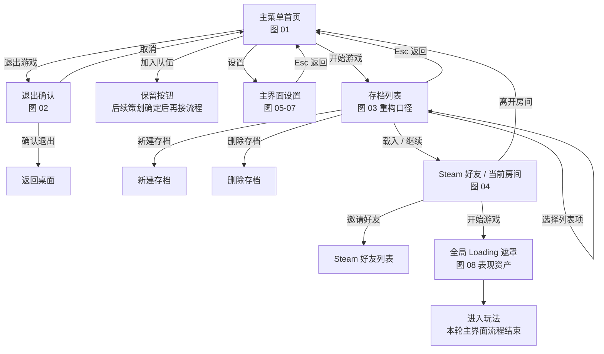

# 主界面重构设计笔记

文档状态：策划案同步稿（2026-09-07）

范围：记录主界面重构过程中参考图表达的页面结构、流转关系、控件信息和待确认口径。本轮只讨论玩家进入玩法前的主界面，不拆解进入营地后的 HUD、暂停菜单、组队管理、图鉴、局内设置或任何玩法 UI。本文是普通技术设计笔记，不是测试报告或验收报告，也不替代 `UI_WBP拼装接口清单.md` 的正式 WBP 接口合同。

## 参考目录

```text
飞书知识库
└─ 小猫钓鱼
   └─ GDD 系统分册
      └─ ui
         └─ 主界面
            ├─ 文档类型：docx
            ├─ node_token：OEqkw02J2iHso9keQ1Yc7Wsdnpe
            ├─ document_id：D5h8dp1Ipoukd4xFHMPcHcHznvf
            └─ revision_id：309

D:\UnreaProjects\Catfishing-verify-01
└─ Docs
      └─ Development
         ├─ 主界面重构设计笔记.md
         ├─ 主界面子技术文档.md
         └─ UI_WBP拼装接口清单.md
```

## 事实来源

- 参考策划案路径：飞书知识库 `小猫钓鱼 / GDD 系统分册 / ui / 主界面`。
- 参考策划案定位：`node_token=OEqkw02J2iHso9keQ1Yc7Wsdnpe`，`document_id=D5h8dp1Ipoukd4xFHMPcHcHznvf`，`revision_id=309`。
- 整体策划案入口：飞书知识库空间 `小猫钓鱼`，`space_id=7670823117626870757`，空间描述为“小猫钓鱼项目设计文档”；顶层愿景文档为 `北极星愿景`，`node_token=EOdZwzK8wiDtZNkLTcXcEEWxnid`，`document_id=ET5MdaUHRorYnhxZqS9c60TMnrc`，`revision_id=41`。
- 飞书策划案读取时间：2026-09-07；用户确认主标题使用“北极星愿景”。主界面图 01 是 UI 示例图，它的图片文字不作为正式游戏名。
- 飞书 `主界面` 策划案中的参考图。本轮只把图 01 到图 08 纳入主界面拆解；图 09 之后不推导局内 UI 或玩法 UI 需求。
- 用户先前提供的第 1 张主界面参考图：夜晚湖边、船、篝火、猫、左侧纵向菜单。
- 用户最新确认：主流程为“开始游戏 -> 存档列表 -> Steam 好友 / 当前房间 -> 全局 Loading 遮罩”；图 04 当前只承接选择存档后的房间邀请流程。首页“加入队伍”已于 2026-09-14 确认接入好友房间与邀请链接输入，见本文件同日期小节。
- 用户最新确认：存档页不采用参考图的大型横向卡片，改为类似 Minecraft 的单页存档列表；房主可以不等待准备状态直接开始；邀请码必须真实可用；加载表现必须是 Lyra/CommonLoadingScreen 式全局遮罩，进入游戏用真实 gate 合成总进度，退出到主菜单只显示真实等待状态，不靠计时器伪造进度或兜底硬等。
- 用户最新确认：背景最终同时支持静态和动态；设置分类为游戏、画面、声音、控制；Save 首批保存库存内容和角色位置。
- 人工决策补充（2026-09-07，主线程转交）：针对现有 Steam 语音不支持麦克风选择、语音输入模式且需额外接线，用户明确答复“允许暂时不可用”。仅这两项本轮允许暂不可用，仍保留设置行、显示真实禁用原因，不保存不能生效的偏好；其余范围不变。
- 设置能力源码：`Source/Catfishing/UI/Frontend/CatFrontendSettingsModel.cpp`、`Source/Catfishing/UI/Frontend/CatFrontendRootWidget.cpp`、`Source/CatfishingEditor/UI/CatFrontendWidgetAuthoringLibrary.cpp`；可用性、禁用控件与原因已有源码，正式资产尚未生成，运行表现未验证。
- `Docs/Development/UI_WBP拼装接口清单.md`：当前正式 WBP 拆分口径。
- `Docs/Development/主界面子技术文档.md`：主界面 Frontend 技术拆分、三 Model 与白盒入口清理口径。

## 主流程图



## 页面结构图

```text
MainUIRoot
├─ BackgroundLayer：静态背景承载 + 动态背景承载
├─ MenuView：首页、退出确认弹层、加入队伍保留按钮
├─ SaveListView：开始游戏后的 Minecraft 风格存档列表
├─ RoomView：选择存档后进入的 Steam 好友 / 当前房间页
├─ SettingsView：主界面设置，深色透明皮肤
├─ GlobalLoadingOverlay：异步载入或回主菜单时盖在最高层的全局遮罩
└─ ScopeBoundary：加载完成后进入玩法，本轮不继续拆局内 UI
```

## 流程文字记录

新版策划案当前可落到主界面的部分，是玩家进入玩法前的 Frontend 流程。第一张图定义首页入口，正式主标题使用“北极星愿景”；后续图明确主流程是先选择存档，再进入邀请好友和当前房间界面。

主流程是：开始游戏 -> 存档列表 -> Steam 好友 / 当前房间 -> 开始游戏 -> 全局 Loading 遮罩。存档页负责存档列表、载入、新建和删除；载入存档后进入图 04 的邀请好友界面。

2026-09-14 用户确认扩展：首页“加入队伍”打开独立加入页，左侧为 Steam 好友房间，右侧接受 Steam 邀请链接或完整 Lobby ID；不引入六位短码和公共房间大厅。图 04 左侧承载 Steam 好友搜索和邀请状态，右侧承载当前房间、玩家槽位、房间权限和真实可用邀请码。房主可以直接开始游戏，不等待准备状态。

设置在本轮只记录主界面设置：深色透明背景，标签是游戏、画面、声音、控制。图 09 之后的内容不在本轮主界面拆解范围内，不从中推导局内菜单或玩法 UI 规则。

## 逐页拆解

| 图号 | 页面 | 主要内容 | 关键交互 |
| --- | --- | --- | --- |
| 图 01 | 主菜单首页 | 全屏夜晚湖边背景；左上品牌标题使用“北极星愿景”；左侧菜单：开始游戏、加入队伍、设置、退出游戏；背景最终同时支持静态和动态 | 选择一级入口；选中项使用深青色横条、菱形指示和高亮文字 |
| 图 02 | 退出确认 | 主菜单背景压暗；中央确认弹窗；标题“退出游戏?”；提示未保存进度可能丢失 | `Esc` 取消；`Enter` 确认退出 |
| 图 03 | 选择存档 | 参考图是大型存档卡；当前实现口径改为类似 Minecraft 的单页存档列表，展示存档名、天数、地点、游玩时间、最近保存时间和关键进度 | 选择列表项；载入 / 继续；新建存档；删除存档；`Esc` 返回 |
| 图 04 | Steam 好友 / 当前房间 | 选择存档后进入的邀请好友页；左侧 Steam 好友搜索与邀请列表；右侧当前房间、玩家槽位、房间权限、真实可用邀请码 | 邀请好友；离开房间；开始游戏；`Shift + Tab` 打开 Steam 界面 |
| 图 05 | 主界面设置：游戏 | 深色透明设置页；标签为游戏、画面、声音、控制；游戏页包含语言、语音聊天、语音输入模式、麦克风设备、震动；语音输入模式与麦克风设备行保留并暂禁用，显示真实原因 | 可用项左右切换选项值；`R` 恢复默认；`Enter` 应用；`Esc` 返回；禁用项不提交或保存偏好 |
| 图 06 | 主界面设置：画面 | 显示模式、分辨率、画面质量、垂直同步、亮度、UI 缩放 | 左右调整数值或选项值；右侧说明当前项含义 |
| 图 07 | 主界面设置：声音 | 总音量、音乐音量、音效音量、环境声音、语音音量、输出设备、后台静音 | 滑条调整音量；切换设备和后台静音 |
| 图 08 | 游戏加载界面 | 全屏森林神像与猫背景；作为全局遮罩显示 Online 阶段和真实地图包加载进度，不再接存档天数或供品进度 | 加载进度展示；无主要菜单操作 |

图 09 之后暂不纳入本轮拆解。它们不作为主界面重构的控件、状态或玩法 UI 依据。

## 控件与状态清单

首页需要的最小控件是品牌标题、一级菜单、选中态、背景层和轻量状态提示层。背景层同时预留静态背景和动态背景承载。首页不展示房间列表、Session 操作按钮、Transport、Operation、Results 或调试日志。

退出确认需要一个阻塞式弹窗，信息密度很低，只确认是否返回桌面。确认按钮默认高亮，取消按钮保留键盘退路。

存档选择需要一个类似 Minecraft 的单页列表：存档名称、游戏天数、地点、游玩时间、最近保存时间、关键进度，以及载入 / 继续、新建、删除、返回操作。不采用参考图的大型横向切换卡。Save 首批落盘内容是库存内容和角色位置。

Steam 好友 / 当前房间页需要拆出两组状态：好友状态和当前房间状态。好友状态至少包括在线、游戏中、已邀请、离线；房间状态至少包括房名或地点、人数上限、访问权限、玩家槽位、房主、真实可用邀请码和开始游戏可用性。准备状态当前不作为开始游戏条件。

设置页需要统一“左侧设置项 + 右侧说明面板 + 底部键盘提示”的交互语法。当前主界面设置分类是游戏、画面、声音、控制；控制分类入口保留，控制项具体字段等待后续资料。

按最新人工决定，游戏分类中的“语音输入模式”和“麦克风设备”本轮允许暂不可用。现有 Steam 语音接线未提供输入模式切换及麦克风枚举、选择能力；界面保留两行并禁用，分别说明能力未接通和可通过系统声音设置调整默认输入设备。不虚构设备选项或保存无效偏好；此决定不扩大到语音聊天开关、声音音量或其他设置。

Loading 表现不再从存档或房间页面接收“第 n 天”、供品进度或假百分比。图 08 的资产作为全局遮罩内容使用，由 LocalPlayer UI 根据 Online 的 Start、地图包预载、Travel、PreLoadMap/PostLoadMap、World BeginPlay 和本地 UI 就绪阶段写入真实阶段文本，并把进入游戏这些真实 gate 合成为总进度。地图包区间来自 `FCatOnlineSnapshot.MapLoadProgressPercent`，后续区间只在对应事实成立后推进；显示层按模型值直接写入。退出到主菜单不显示进度条，只显示保存、拆局、销毁房间、读取主菜单、切换世界和创建主菜单 UI 等真实等待状态。

## 待确认点

- `加入队伍` 后续策划未定，当前只保留首页按钮。
- 控制分类入口保留，但控制设置细项当前不做。
- 语音输入模式、麦克风选择已获人工允许暂不可用；保留行与禁用原因的边界已确定，恢复可用仍需补充语音能力接线。该决定不表示正式 WBP 或运行效果已完成验证。


## 2026-09-14 加入队伍入口与简单 UI

本轮按用户确认方案补齐熟人组局入口。加入页沿用正式前端字体和面板布局：标题、左右两列、底部结果和返回。左侧显示 Steam GetFriendGamePlayed 确认具有本游戏 Lobby 的好友；这只是可查询目标，不承诺实际准入，也不伪造尚未读取的人数或局状态。右侧支持粘贴邀请链接或输入完整 Lobby ID。现有房间页“复制邀请码”改为“复制邀请链接”。默认 SessionAccess 从 Public 改为 FriendsOnly；链接不绕过 Steam 私密/好友准入。

架构证据：当前 UE 5.8 的 OnlineSessionInterfaceSteam.cpp::FindSessionById 直接返回失败，不能作为可用实现。好友入口使用 OSS FindFriendSession；输入入口经 CatSteamJoinLink::Parse 严格校验本 AppId、无符号 64 位数值和 Lobby 类型，RequestLobbyData 取真实 owner 后构造固定 steam://joinlobby URI。仅构造后的 URI 可交给 LaunchURL，原始输入不进入壳命令。Steam 回调再进入既有 HandleSessionUserInviteAccepted / RequestAcceptInvite / RequestJoinInternal；没有第二次 SDK JoinLobby 或 ClientTravel。冷启动 +connect_lobby 和 GameLobbyJoinRequested 的解析继续由引擎插件负责。

ResolveJoin 是唯一 Online 操作中的新阶段，查询期限为 30 秒；期满是明确失败，不是假成功。好友查询携带 epoch，成功保留 RequestId/epoch 进入 Join；链接等待对应 Lobby 的平台回调，失效后第一次同目标回调被丢弃，重新粘贴提交可重试。SDK 元数据回调与游戏线程读取使用互斥锁保护。已在其他 Session 时拒绝新加入，不自动离房。Join 成功仍建立 Client Lobby，等待原 Host ready 后进入现有加载链；世界和个人存档写入、玩法复制、容量及服务器准入规则保持原链路。

### 本轮影响与交付核对

| 功能/环节 | 当前位置与引用证据 | 现有行为与目标差异 | 处理方式与目标位置 | 衔接依赖与顺序 | 回归风险与验证方式 | 处理结果与证据 |
| --- | --- | --- | --- | --- | --- | --- |
| 加入入口与调用方 | UI/Frontend/CatFrontendRootWidget::RequestJoinParty → CatFrontendPageController::RequestJoinParty | 未开放提示改为正式加入页；输入仅为目标，无数据写入 | Root ShowJoin、Controller JoinFriend/JoinLink → RoomModel 同名入口 | 原生类、接线、WBP | 打开、提交、失败恢复、返回；正式 WBP 自动化 | 已接源码和正式 WBP；UIDeliveryReport 的 JoinPage 通过，入口、错误回显、返回均有运行证据 |
| 好友目标 | Online/CatOnlineSubsystem::RefreshFriendSnapshotFacts → FCatOnlineFriendSummary.bHasGameLobby | 邀请摘要增加真实 Lobby 存在观察；旧邀请字段不改义 | 新增 RequestJoinFriend / HandleFindJoinFriendComplete | Friends 缓存 → 定向 FindFriendSession → 统一 Join | 好友换房、满员、失效句柄、迟到回调 | 代码衔接，Editor/Game 编译通过；Steam 双端未验证 |
| 链接解析与生命周期 | Online/CatSteamJoinLink.h/.cpp → RequestJoinLink → TickPlatformInvites | 原来只有生成/复制；新增校验、元数据确认和有期限等待 | 请求归 Online，SDK helper 不拥有 Session | RequestLobbyData → 固定 URI → Steam 回调 | 格式、错误 AppId、溢出、跨线程结果、超时；解析 Automation | LinkParsing Automation 通过，非法输入与 64 位解析有证据；真人 Steam 回调待验 |
| 权威、旅行、清理 | RequestJoinInternal / HandleJoinSessionComplete / ClearOperationDelegates；GameMode 原准入 | 保留单一 Join/加载/旅行；新增解析等待成对清理；SessionFull 单独回显 | 复用现有管线，失败回 NoSession | 查询/邀请 → Join → Client Lobby → ready → Start | 重入、离房、载荷、网络失败 | 局部源码核对，不替代整场运行验收 |
| 权限配置 | Config/DefaultGame.ini [/Script/Catfishing.CatOnlineSettings] SessionAccess → CreateSession | Public 改为 FriendsOnly；无参数单位变化 | 仅改默认值；仅邀请机制保留 | 定向查询实现后切换 | 非好友持链接不能越权；真人两账号验证 | 已切换，平台权限验收未运行 |
| 资产、生成与 Cook | /Game/UI/Frontend/WBP_CatFrontendRoot、WBP_CatFrontendRoom；新增 WBP_CatFrontendJoin、WBP_CatJoinFriendRow；DefaultGame.ini 已 Cook /Game/UI/Frontend | 新页和原生好友行；邀请码显示名改为邀请链接 | CatFrontendWidgetAuthoringLibrary::CreateMissingFrontendWidgetBlueprints(true)；Scripts/generate_frontend_widgets.py | 新资产 → Root 装配 → 合同与字体检查 | BindWidget、Designer 变量、字体、比例与引用 | 保留原 RequestCopyRoomInviteCode / RoomInviteCodeText / CopyInviteCodeButton 符号：既有 WBP 仍是消费者，避免破坏未知外部蓝图引用；不再保留旧玩家文案 |
| 测试、日志、文档 | Online/Tests/CatSteamJoinLinkTests.cpp；CatfishingEditor/UI/Tests/CatFrontendJoinTests.cpp；LogCatOnline | 增加解析与实际 WBP 接线测试、默认 Log/Warning 查询事件 | 两份主界面文档和唯一差距清单更新 | 构建 → 作者库 → Automation → 截图 | contract/runtime_behavior/presentation_delivery 分层 | 本节末记录实际证据；无另建业务账本 |

基线：任务开始已有 Content/Game/BP_CatFishingGamemode.uasset 改动和根目录未跟踪的裁决同步文档，未纳入本轮改动。首次未提升权限的编译未产出有效结果；后续完整 Editor 编译通过。首次生成检查发现 JoinFriendsScrollBox 缺 Designer 变量，已补生成及既有资产迁移；同时将迁移限制为本轮四个资产，撤回生成器对其余七个原本干净资产的重存。

诊断过滤：LogCatOnline 的 online_join_friend_query、online_join_target_resolved、online_join_link_query、online_join_link_dispatched、online_join_resolution_failed、online_join_link_late_callback_ignored，与既有 online_invite_*、online_operation_* 事件关联。原始链接、Lobby/玩家 ID 和账号信息不写入本轮业务日志。正式 Development 双端仍须分别检查 Catfishing/Saved/Logs 下不带 -log 参数产生的新日志。


### 本轮最终验证证据

- `contract`：Editor 最终构建 `Saved/Logs/JoinFrontendDeliveryEditorBuild.log` 为 Succeeded；运行时源码对应的 Win64 Development 游戏构建 `Saved/Logs/JoinFrontendDeliveryGameBuild.log` 为 Succeeded。`Catfishing.Online.Join.LinkParsing` 1/1 成功，报告 `Saved/Automation/FrontendJoin/Report/index.json`；覆盖完整 64 位 ID、链接、空白、错误 AppId、非 Lobby ID、溢出、附加参数和非法字符。
- 正式资产：`Saved/Logs/JoinFrontendAssetsFinal.log` 为 0 errors / 0 warnings，`frontend_join_assets_ready` 已出现；字体及全部前端控件合同通过。AssetRegistry 确认 Join/Room 被正式 Root 引用；Root 与 JoinFriendRow 使用已有配置/代码软路径加载，不能把 AssetRegistry 的空引用列表误判为无消费者。`Config/DefaultGame.ini` 已收集 `/Game/UI/Frontend`，新 Cook 尚未运行。
- `runtime_behavior`：`Catfishing.UI.Frontend.JoinPage` 最终 1/1 成功且 0 warnings，报告 `Saved/Automation/FrontendJoin/UIDeliveryReport/index.json`，日志 `Saved/Logs/JoinFrontendUIDelivery.log`。测试实例化正式 Root/WBP，通过实际按钮委托验证首页进入加入页、缺服务错误、失败后允许重试、返回首页和解绑。此为独立测试 World，不证明平台查询和网络连接成功。引擎启动阶段的 UnifiedError 自测日志在用例开始前出现，不属于本轮 UI 测试失败。
- `presentation_delivery`：`Saved/Automation/FrontendJoin/JoinPage.png` 为正式 WBP 的 1280×720 D3D12 稳定帧，已人工检查中文、输入框、单行按钮、空列表和错误反馈；已修复初次截图的说明裁切与按钮自动折行。截图中的 Steam 服务不可用来自受控测试环境。真实好友列表长名称/满列表、不同屏幕尺寸、Steam 真人双端、新 Cook 包与双端无 -log 落盘仍未验收，模块保持未完成。

布局重建是明确操作：`CreateMissingFrontendWidgetBlueprints(true, true)` 会重建本轮 Join 页布局；日常 `Scripts/generate_frontend_widgets.py` 只传第一个 true，保留既有 Join 布局，更新接线/字体和 Root。保留的旧 CopyInviteCode 绑定名仍由现有 Room WBP 与原生反射消费，删除条件是完成全部 Blueprint/外部调用迁移；玩家可见文案已经统一为邀请链接。

## 2026-09-14 房间角色、准备与局内组队

用户最终确认：每名加入的玩家显示现有 `BP_CuteCatCharacter` 的正面动态 idle 和头顶名称；准备时打勾，未准备时不显示。其他成员都准备后房主才能开始，房主点击开始即表示自己准备。随后将目标扩展至《主界面.md》的整套 UI；尚无功能的入口允许先保留按钮，申请暂停暂不实现联机裁决。

`FCatOnlineRoomMember` 新增 Lobby 内稳定匿名 `MemberId`、`bIsLocalPlayer` 和 `bIsReady`。成员身份、人数及准备数据只从当前 Steam Lobby 读取；本地必须确实在成员列表中，未知姓名回退为“玩家”而不是从准入名单中删除。进入新 Lobby 后本地准备默认归零。`CAT_PLAYER_READY` 是成员元数据，只能由本地账号写自己的值；`CAT_GAME_READY` 保持原来的地图连接许可含义。协议版本从 1 升至 2，避免旧客户端缺少准备协议导致房间无法开始。

UI 可点击条件和 Online Host 开始入口共用 `CatOnlineRoomReadiness::CanHostStart`，验证完整且无重复的成员表、本地 owner 及其他成员准备。请求受理前与地图预载完成后各复核一次；存档许可、唯一 Start 操作、ServerTravel、Host 地图 ready 发布及客户端进图仍走原有链路。准备写入通过平台回读生成快照，不在按钮点击时伪造 UI 勾选。

`WBP_CatRoomPlayerSlot` 仍保留原三个文本控件，新增角色图像、勾选及空位标记。稳定成员标识只缓存为控件与席位的关联，同名、重排及准备刷新不重建模型。`ACatFrontendCharacterPreview` 只复制 CuteCat 蓝图默认网格和两份原有材质，以 640×768 本地捕获循环播放 `SK_CuteCat_Anim_Armature_idle_A_0`；不生成完整游戏 Character。成员离开、切页和 Widget 拆除均销毁展示 Actor。蓝图默认值直接引用 CuteCat 类、idle 和 UI 材质，供 Cook 跟随。旧普通猫与 Sitting_00 已从本轮席位默认引用和生成脚本替换；原游戏猫资产有其他消费者，保留不动。

局内 `CatLakeMainMenuController` 创建同类 RoomModel，订阅既有 Online 服务；`LakePartyPanel` 放入现有菜单 Switcher，成员、好友搜索、邀请和复制链接均消费真实快照。房主邀请从仅 Frontend 扩展为 Frontend/Lake，仍用唯一 OSS `SendSessionInviteToFriend`；不改变服务器中途加入裁决、访问权限或存档。非房主保持只读。申请暂停只回显暂未开放，图鉴页面未装配前保留明确不可用入口。

本轮影响表见任务对话；资产生成职责已拆清：`style_frontend_pages.py` 不再修改房间及成员席位；`style_frontend_room.py` 维护席位与准备，`style_lake_party.py` 维护局内菜单和组队。完整生成脚本按依赖顺序调用。保留原 RoomPlayerSlotRoot/PlayerTextColumn 作为新席位与姓名布局容器，继续使用原 GUID；没有留下脱离运行树的旧列表布局。

验证记录：最终 Editor 构建 `Saved/Logs/RoomCuteCatFinalBuild.log`、Win64 Development 构建 `RoomCuteCatFinalGameBuild.log` 均为 Succeeded。`Saved/Automation/RoomStage/Contracts/index.json` 中 RoomReadiness 与 JoinPage 共 2/2 成功，0 warnings；前者覆盖单人、同名、重排、取消准备、成员离开、成员未同步、重复成员、非房主和空名单。

`runtime_behavior`：`Scripts/verify_room_party_ui.py` 在 PIE 实例化正式 WBP，使用受控成员验证准备勾显隐、两只模型与两个空位、idle 播放且时间推进、准备刷新复用模型、成员离开销毁一只、返回菜单销毁全部；真实菜单按钮验证申请暂停提示、打开组队、返回及关闭。`Saved/Automation/RoomStage/RuntimeChecks.json` 对应检查全部为 true，字体校验和 LakeMainMenu→PartyMemberRow 的资产依赖检查亦通过。夹具不写真实 Steam 房间数据，不代表真人邀请成功。

`presentation_delivery`：实际视口为 1549×856；已检查 `RoomTwoMembersWide00008.png`、`RoomIdleSecondFrame00001.png`、`LakeCommandWide00008.png`、`LakePartyWide00008.png`（同一 RoomStage 目录，截图包含编辑器边框）。角色正面完整入镜、中文可读、四席位及派对菜单可见；修复了捕获材质 OneMinus 输入未连接、图片未填充、组队面板左上角对齐、白色搜索框和成员文案裁切。样式脚本重复执行后控件与行为一致。未覆盖所有屏幕比例、满好友列表长名称；新 Cook/Development 包、Steam 两账号准备/取消/离房/局内邀请与两端无 -log 落盘仍未验收。整套文档的局内 HUD、背包、钓鱼提示及容器页视觉复现也尚未完成，模块保持未完成。

### 影响表最终核对

| 功能/环节 | 当前位置与引用证据 | 现有行为与目标差异 | 处理方式与目标位置 | 衔接依赖与顺序 | 回归风险与验证方式 | 处理结果与证据 |
| --- | --- | --- | --- | --- | --- | --- |
| 状态与权威 | `Online/CatOnlineSubsystem::RefreshRoomSnapshotFacts/RequestSetRoomReady/RequestStartHostedGame/HandleGameplayPackagePreloadComplete` → RoomModel → Root | 原成员无准备字段；新增匿名成员 ID、本地标记、默认 false 的准备；Host 自己不阻挡开始 | 单一 Steam 成员写入和 Host 准入，既有旅行/存档许可不变；无数值单位变化 | DTO/共享规则 → Online → Model → WBP | 陈旧名单、取消准备、预载期间变化、旧客户端 | 已接；RoomReadiness 通过；真实双端未验证 |
| 协议与退出 | `CatOnlineNames::ProtocolVersion/PlayerReadyKey`、`StopLobbyFactPolling` | 协议 1→2；成员准备与地图 ready 分开；换房归零 | 原版本筛选拒绝旧协议；离房清理已有 ticker | 保留原 Start/Join/清理链 | 旧客户端不支持准备、重复写入/重复旅行 | 源码/调用链核对；无第二套 Join/Travel；打包旅行测试已等待成员快照，尚未运行 |
| 房间 UI | `CatFrontendRootWidget::RebuildRoomRows/ShowPage` → `/Game/UI/Frontend/WBP_CatRoomPlayerSlot` → `CatFrontendCharacterPreview` | 原文本行→稳定席位、正面 CuteCat idle、姓名与准备勾；空位不生成角色 | 复用原 WBP 控件名，新增可选表现绑定 | 预览 Actor/接收控件 → 行刷新与清理 → 正式资产 | 准备刷新重建、同名错位、Actor 泄漏、镜头裁切 | 正式 WBP 受控运行与截图通过；UI 原生不拥有第二份准备真值 |
| 局内邀请 | `CatLakeMainMenuController::Bind/HandleMenuActionRequested/RequestPartyInvite` → RoomModel → `Online::RequestInviteFriend` | 局内新增真实队伍/好友面板；Host 邀请范围 Frontend→Frontend/Lake | 同一 OSS SendSessionInviteToFriend；不改中途加入和访问权限裁决 | 共用好友行委托 → PartyModel → 菜单页 | 打开/关闭重复绑定、失败反馈、客户端权限 | 本机按钮及解绑通过；真人跨端邀请未验证 |
| 占位入口 | `CatLakeMainMenuWidget::RequestPausePlaceholder` → Controller | 新增申请暂停，点击仅回显暂未开放 | 用户明确允许；图鉴入口装配前禁用 | 正式菜单按钮 → 本地反馈 | 误暂停联机游戏 | 实际按钮检查通过；未调用暂停 API |
| 资产/生成/Cook | `generate_frontend_widgets.py` → `style_frontend_room.py/style_lake_party.py`；Room 源码作者器保留 Ready 控件合同 | 独立维护 Room、Party，旧 pages 脚本退出 Room 布局职责 | 复用包路径与 GUID；Party row 为 Lake WBP 硬引用，Frontend/Save 已在 Cook 目录 | 原生类 → 房间行/材质 → Party 行/菜单 | 覆盖人工资产、失去 Cook 依赖、生成后退回旧布局 | SHA256 备份在 Saved/Automation；重复运行、编译、字体及硬引用通过；新 Cook 未运行 |
| 日志/检查/文档 | `LogCatOnline/LogCatUI`；`CatRoomReadinessTests`、`verify_room_party_ui.py`；本节与唯一差距清单 | 增加准备、预览和局内邀请关键事件 | 默认 Log/Warning，匿名成员/请求关联；失败保持原正式回执 | 先实现再本机合同/运行/画面分层 | 把本机截图当平台验收 | 本节如实列证据；没有新增业务进度账本；整模块未关闭 |

基线与保留项：工作区原有 BP_CatFishingGamemode 及根目录裁决同步文档、随后并行 Fishing 变更均不纳入本轮提交；测试前未运行新的 Steam/Cook 验收。旧 CopyInviteCode 绑定仍由 Room WBP 消费，保留符号而玩家文案使用邀请链接；旧 RoomPlayerSlotRoot/PlayerTextColumn 继续用于正式布局，不能按名字误删。测试前 PIE 设置备份为 `Saved/Automation/RoomStage/EditorSettings.before.ini`。

日志过滤：`LogCatOnline` 的 `online_member_ready_requested/confirmed/rejected/observed`、`online_start_not_ready`；`LogCatUI` 的 `frontend_character_preview_created/released/failed`、`ui_lake_party_opened`、`ui_lake_party_invite_requested`。准备事件使用匿名 Member 与 Lobby 摘要，不写公开昵称或原始平台账号。
