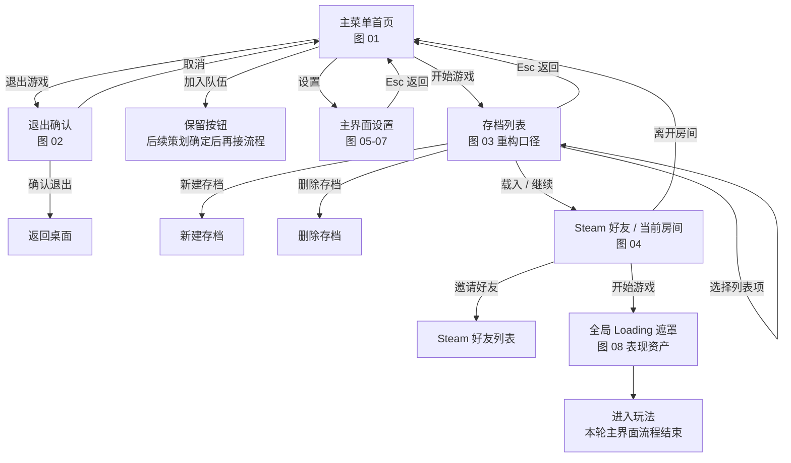

# 主界面重构设计笔记

文档状态：策划案同步稿（2026-09-07）。**2026-09-15 盘点：已完成使命**——主流程已按《主界面子技术文档》落地；页内飞书目录树与 node_token 是过程页，设计真值在 `Knowledge/Design/GDD 系统分册/ui/主界面.md`。留作历史。

范围：记录主界面重构过程中参考图表达的页面结构、流转关系、控件信息和待确认口径。本轮只讨论玩家进入玩法前的主界面，不拆解进入营地后的 HUD、暂停菜单、组队管理、图鉴、局内设置或任何玩法 UI。本文是普通技术设计笔记，不是测试报告或验收报告，也不替代 `UI_WBP拼装接口清单.md` 的正式 WBP 接口合同。

## 参考目录

```text
飞书知识库
└─ 小猫钓鱼
   └─ GDD 系统分册
      └─ ui
         └─ 主界面
            ├─ 文档类型：docx
            ├─ node_token：OEqkw02J2iHso9keQ1Yc7Wsdnpe
            ├─ document_id：D5h8dp1Ipoukd4xFHMPcHcHznvf
            └─ revision_id：309

<仓库根>（当时的工作副本 Catfishing-verify-01）
└─ Docs
      └─ Development
         ├─ 主界面重构设计笔记.md
         ├─ 主界面子技术文档.md
         └─ UI_WBP拼装接口清单.md
```

## 事实来源

- 参考策划案路径：飞书知识库 `小猫钓鱼 / GDD 系统分册 / ui / 主界面`。
- 参考策划案定位：`node_token=OEqkw02J2iHso9keQ1Yc7Wsdnpe`，`document_id=D5h8dp1Ipoukd4xFHMPcHcHznvf`，`revision_id=309`。
- 整体策划案入口：飞书知识库空间 `小猫钓鱼`，`space_id=7670823117626870757`，空间描述为“小猫钓鱼项目设计文档”；顶层愿景文档为 `北极星愿景`，`node_token=EOdZwzK8wiDtZNkLTcXcEEWxnid`，`document_id=ET5MdaUHRorYnhxZqS9c60TMnrc`，`revision_id=41`。
- 飞书策划案读取时间：2026-09-07；用户确认主标题使用“北极星愿景”。主界面图 01 是 UI 示例图，它的图片文字不作为正式游戏名。
- 飞书 `主界面` 策划案中的参考图。本轮只把图 01 到图 08 纳入主界面拆解；图 09 之后不推导局内 UI 或玩法 UI 需求。
- 用户先前提供的第 1 张主界面参考图：夜晚湖边、船、篝火、猫、左侧纵向菜单。
- 用户最新确认：主流程为“开始游戏 -> 存档列表 -> Steam 好友 / 当前房间 -> 全局 Loading 遮罩”；图 04 当前只承接选择存档后的房间邀请流程。首页“加入队伍”已于 2026-09-14 确认接入好友房间与邀请链接输入，见本文件同日期小节。
- 用户最新确认：存档页不采用参考图的大型横向卡片，改为类似 Minecraft 的单页存档列表；房主可以不等待准备状态直接开始；邀请码必须真实可用；加载表现必须是 Lyra/CommonLoadingScreen 式全局遮罩，进入游戏用真实 gate 合成总进度，退出到主菜单只显示真实等待状态，不靠计时器伪造进度或兜底硬等。
- 用户最新确认：背景最终同时支持静态和动态；设置分类为游戏、画面、声音、控制；Save 首批保存库存内容和角色位置。
- 人工决策补充（2026-09-07，主线程转交）：针对现有 Steam 语音不支持麦克风选择、语音输入模式且需额外接线，用户明确答复“允许暂时不可用”。仅这两项本轮允许暂不可用，仍保留设置行、显示真实禁用原因，不保存不能生效的偏好；其余范围不变。
- 设置能力源码：`Source/Catfishing/UI/Frontend/CatFrontendSettingsModel.cpp`、`Source/Catfishing/UI/Frontend/CatFrontendRootWidget.cpp`、`Source/CatfishingEditor/UI/CatFrontendWidgetAuthoringLibrary.cpp`；可用性、禁用控件与原因已有源码，正式资产尚未生成，运行表现未验证。
- `Docs/Development/UI_WBP拼装接口清单.md`：当前正式 WBP 拆分口径。
- `Docs/Development/主界面子技术文档.md`：主界面 Frontend 技术拆分、三 Model 与白盒入口清理口径。

## 主流程图



## 页面结构图

```text
MainUIRoot
├─ BackgroundLayer：静态背景承载 + 动态背景承载
├─ MenuView：首页、退出确认弹层、加入队伍保留按钮
├─ SaveListView：开始游戏后的 Minecraft 风格存档列表
├─ RoomView：选择存档后进入的 Steam 好友 / 当前房间页
├─ SettingsView：主界面设置，深色透明皮肤
├─ GlobalLoadingOverlay：异步载入或回主菜单时盖在最高层的全局遮罩
└─ ScopeBoundary：加载完成后进入玩法，本轮不继续拆局内 UI
```

## 流程文字记录

新版策划案当前可落到主界面的部分，是玩家进入玩法前的 Frontend 流程。第一张图定义首页入口，正式主标题使用“北极星愿景”；后续图明确主流程是先选择存档，再进入邀请好友和当前房间界面。

主流程是：开始游戏 -> 存档列表 -> Steam 好友 / 当前房间 -> 开始游戏 -> 全局 Loading 遮罩。存档页负责存档列表、载入、新建和删除；载入存档后进入图 04 的邀请好友界面。

2026-09-14 用户确认扩展：首页“加入队伍”打开独立加入页，左侧为 Steam 好友房间，右侧接受 Steam 邀请链接或完整 Lobby ID；不引入六位短码和公共房间大厅。图 04 左侧承载 Steam 好友搜索和邀请状态，右侧承载当前房间、玩家槽位、房间权限和真实可用邀请码。房主可以直接开始游戏，不等待准备状态。

设置在本轮只记录主界面设置：深色透明背景，标签是游戏、画面、声音、控制。图 09 之后的内容不在本轮主界面拆解范围内，不从中推导局内菜单或玩法 UI 规则。

## 逐页拆解

| 图号 | 页面 | 主要内容 | 关键交互 |
| --- | --- | --- | --- |
| 图 01 | 主菜单首页 | 全屏夜晚湖边背景；左上品牌标题使用“北极星愿景”；左侧菜单：开始游戏、加入队伍、设置、退出游戏；背景最终同时支持静态和动态 | 选择一级入口；选中项使用深青色横条、菱形指示和高亮文字 |
| 图 02 | 退出确认 | 主菜单背景压暗；中央确认弹窗；标题“退出游戏?”；提示未保存进度可能丢失 | `Esc` 取消；`Enter` 确认退出 |
| 图 03 | 选择存档 | 参考图是大型存档卡；当前实现口径改为类似 Minecraft 的单页存档列表，展示存档名、天数、地点、游玩时间、最近保存时间和关键进度 | 选择列表项；载入 / 继续；新建存档；删除存档；`Esc` 返回 |
| 图 04 | Steam 好友 / 当前房间 | 选择存档后进入的邀请好友页；左侧 Steam 好友搜索与邀请列表；右侧当前房间、玩家槽位、房间权限、真实可用邀请码 | 邀请好友；离开房间；开始游戏；`Shift + Tab` 打开 Steam 界面 |
| 图 05 | 主界面设置：游戏 | 深色透明设置页；标签为游戏、画面、声音、控制；游戏页包含语言、语音聊天、语音输入模式、麦克风设备、震动；语音输入模式与麦克风设备行保留并暂禁用，显示真实原因 | 可用项左右切换选项值；`R` 恢复默认；`Enter` 应用；`Esc` 返回；禁用项不提交或保存偏好 |
| 图 06 | 主界面设置：画面 | 显示模式、分辨率、画面质量、垂直同步、亮度、UI 缩放 | 左右调整数值或选项值；右侧说明当前项含义 |
| 图 07 | 主界面设置：声音 | 总音量、音乐音量、音效音量、环境声音、语音音量、输出设备、后台静音 | 滑条调整音量；切换设备和后台静音 |
| 图 08 | 游戏加载界面 | 全屏森林神像与猫背景；作为全局遮罩显示 Online 阶段和真实地图包加载进度，不再接存档天数或供品进度 | 加载进度展示；无主要菜单操作 |

图 09 之后暂不纳入本轮拆解。它们不作为主界面重构的控件、状态或玩法 UI 依据。

## 控件与状态清单

首页需要的最小控件是品牌标题、一级菜单、选中态、背景层和轻量状态提示层。背景层同时预留静态背景和动态背景承载。首页不展示房间列表、Session 操作按钮、Transport、Operation、Results 或调试日志。

退出确认需要一个阻塞式弹窗，信息密度很低，只确认是否返回桌面。确认按钮默认高亮，取消按钮保留键盘退路。

存档选择需要一个类似 Minecraft 的单页列表：存档名称、游戏天数、地点、游玩时间、最近保存时间、关键进度，以及载入 / 继续、新建、删除、返回操作。不采用参考图的大型横向切换卡。Save 首批落盘内容是库存内容和角色位置。

Steam 好友 / 当前房间页需要拆出两组状态：好友状态和当前房间状态。好友状态至少包括在线、游戏中、已邀请、离线；房间状态至少包括房名或地点、人数上限、访问权限、玩家槽位、房主、真实可用邀请码和开始游戏可用性。准备状态当前不作为开始游戏条件。

设置页需要统一“左侧设置项 + 右侧说明面板 + 底部键盘提示”的交互语法。当前主界面设置分类是游戏、画面、声音、控制；控制分类入口保留，控制项具体字段等待后续资料。

按最新人工决定，游戏分类中的“语音输入模式”和“麦克风设备”本轮允许暂不可用。现有 Steam 语音接线未提供输入模式切换及麦克风枚举、选择能力；界面保留两行并禁用，分别说明能力未接通和可通过系统声音设置调整默认输入设备。不虚构设备选项或保存无效偏好；此决定不扩大到语音聊天开关、声音音量或其他设置。

Loading 表现不再从存档或房间页面接收“第 n 天”、供品进度或假百分比。图 08 的资产作为全局遮罩内容使用，由 LocalPlayer UI 根据 Online 的 Start、地图包预载、Travel、PreLoadMap/PostLoadMap、World BeginPlay 和本地 UI 就绪阶段写入真实阶段文本，并把进入游戏这些真实 gate 合成为总进度。地图包区间来自 `FCatOnlineSnapshot.MapLoadProgressPercent`，后续区间只在对应事实成立后推进；显示层按模型值直接写入。退出到主菜单不显示进度条，只显示保存、拆局、销毁房间、读取主菜单、切换世界和创建主菜单 UI 等真实等待状态。

## 待确认点

- `加入队伍` 后续策划未定，当前只保留首页按钮。
- 控制分类入口保留，但控制设置细项当前不做。
- 语音输入模式、麦克风选择已获人工允许暂不可用；保留行与禁用原因的边界已确定，恢复可用仍需补充语音能力接线。该决定不表示正式 WBP 或运行效果已完成验证。


## 2026-09-14 加入队伍入口与简单 UI

本轮按用户确认方案补齐熟人组局入口。加入页沿用正式前端字体和面板布局：标题、左右两列、底部结果和返回。左侧显示 Steam GetFriendGamePlayed 确认具有本游戏 Lobby 的好友；这只是可查询目标，不承诺实际准入，也不伪造尚未读取的人数或局状态。右侧支持粘贴邀请链接或输入完整 Lobby ID。现有房间页“复制邀请码”改为“复制邀请链接”。默认 SessionAccess 从 Public 改为 FriendsOnly；链接不绕过 Steam 私密/好友准入。

架构证据：当前 UE 5.8 的 OnlineSessionInterfaceSteam.cpp::FindSessionById 直接返回失败，不能作为可用实现。好友入口使用 OSS FindFriendSession；输入入口经 CatSteamJoinLink::Parse 严格校验本 AppId、无符号 64 位数值和 Lobby 类型，RequestLobbyData 取真实 owner 后构造固定 steam://joinlobby URI。仅构造后的 URI 可交给 LaunchURL，原始输入不进入壳命令。Steam 回调再进入既有 HandleSessionUserInviteAccepted / RequestAcceptInvite / RequestJoinInternal；没有第二次 SDK JoinLobby 或 ClientTravel。冷启动 +connect_lobby 和 GameLobbyJoinRequested 的解析继续由引擎插件负责。

ResolveJoin 是唯一 Online 操作中的新阶段，查询期限为 30 秒；期满是明确失败，不是假成功。好友查询携带 epoch，成功保留 RequestId/epoch 进入 Join；链接等待对应 Lobby 的平台回调，失效后第一次同目标回调被丢弃，重新粘贴提交可重试。SDK 元数据回调与游戏线程读取使用互斥锁保护。已在其他 Session 时拒绝新加入，不自动离房。Join 成功仍建立 Client Lobby，等待原 Host ready 后进入现有加载链；世界和个人存档写入、玩法复制、容量及服务器准入规则保持原链路。

### 本轮影响与交付核对

| 功能/环节 | 当前位置与引用证据 | 现有行为与目标差异 | 处理方式与目标位置 | 衔接依赖与顺序 | 回归风险与验证方式 | 处理结果与证据 |
| --- | --- | --- | --- | --- | --- | --- |
| 加入入口与调用方 | UI/Frontend/CatFrontendRootWidget::RequestJoinParty → CatFrontendPageController::RequestJoinParty | 未开放提示改为正式加入页；输入仅为目标，无数据写入 | Root ShowJoin、Controller JoinFriend/JoinLink → RoomModel 同名入口 | 原生类、接线、WBP | 打开、提交、失败恢复、返回；正式 WBP 自动化 | 已接源码和正式 WBP；UIDeliveryReport 的 JoinPage 通过，入口、错误回显、返回均有运行证据 |
| 好友目标 | Online/CatOnlineSubsystem::RefreshFriendSnapshotFacts → FCatOnlineFriendSummary.bHasGameLobby | 邀请摘要增加真实 Lobby 存在观察；旧邀请字段不改义 | 新增 RequestJoinFriend / HandleFindJoinFriendComplete | Friends 缓存 → 定向 FindFriendSession → 统一 Join | 好友换房、满员、失效句柄、迟到回调 | 代码衔接，Editor/Game 编译通过；Steam 双端未验证 |
| 链接解析与生命周期 | Online/CatSteamJoinLink.h/.cpp → RequestJoinLink → TickPlatformInvites | 原来只有生成/复制；新增校验、元数据确认和有期限等待 | 请求归 Online，SDK helper 不拥有 Session | RequestLobbyData → 固定 URI → Steam 回调 | 格式、错误 AppId、溢出、跨线程结果、超时；解析 Automation | LinkParsing Automation 通过，非法输入与 64 位解析有证据；真人 Steam 回调待验 |
| 权威、旅行、清理 | RequestJoinInternal / HandleJoinSessionComplete / ClearOperationDelegates；GameMode 原准入 | 保留单一 Join/加载/旅行；新增解析等待成对清理；SessionFull 单独回显 | 复用现有管线，失败回 NoSession | 查询/邀请 → Join → Client Lobby → ready → Start | 重入、离房、载荷、网络失败 | 局部源码核对，不替代整场运行验收 |
| 权限配置 | Config/DefaultGame.ini [/Script/Catfishing.CatOnlineSettings] SessionAccess → CreateSession | Public 改为 FriendsOnly；无参数单位变化 | 仅改默认值；仅邀请机制保留 | 定向查询实现后切换 | 非好友持链接不能越权；真人两账号验证 | 已切换，平台权限验收未运行 |
| 资产、生成与 Cook | /Game/UI/Frontend/WBP_CatFrontendRoot、WBP_CatFrontendRoom；新增 WBP_CatFrontendJoin、WBP_CatJoinFriendRow；DefaultGame.ini 已 Cook /Game/UI/Frontend | 新页和原生好友行；邀请码显示名改为邀请链接 | CatFrontendWidgetAuthoringLibrary::CreateMissingFrontendWidgetBlueprints(true)；Scripts/generate_frontend_widgets.py | 新资产 → Root 装配 → 合同与字体检查 | BindWidget、Designer 变量、字体、比例与引用 | 保留原 RequestCopyRoomInviteCode / RoomInviteCodeText / CopyInviteCodeButton 符号：既有 WBP 仍是消费者，避免破坏未知外部蓝图引用；不再保留旧玩家文案 |
| 测试、日志、文档 | Online/Tests/CatSteamJoinLinkTests.cpp；CatfishingEditor/UI/Tests/CatFrontendJoinTests.cpp；LogCatOnline | 增加解析与实际 WBP 接线测试、默认 Log/Warning 查询事件 | 两份主界面文档和唯一差距清单更新 | 构建 → 作者库 → Automation → 截图 | contract/runtime_behavior/presentation_delivery 分层 | 本节末记录实际证据；无另建业务账本 |

基线：任务开始已有 Content/Game/BP_CatFishingGamemode.uasset 改动和根目录未跟踪的裁决同步文档，未纳入本轮改动。首次未提升权限的编译未产出有效结果；后续完整 Editor 编译通过。首次生成检查发现 JoinFriendsScrollBox 缺 Designer 变量，已补生成及既有资产迁移；同时将迁移限制为本轮四个资产，撤回生成器对其余七个原本干净资产的重存。

诊断过滤：LogCatOnline 的 online_join_friend_query、online_join_target_resolved、online_join_link_query、online_join_link_dispatched、online_join_resolution_failed、online_join_link_late_callback_ignored，与既有 online_invite_*、online_operation_* 事件关联。原始链接、Lobby/玩家 ID 和账号信息不写入本轮业务日志。正式 Development 双端仍须分别检查 Catfishing/Saved/Logs 下不带 -log 参数产生的新日志。


### 本轮最终验证证据

- `contract`：Editor 最终构建 `Saved/Logs/JoinFrontendDeliveryEditorBuild.log` 为 Succeeded；运行时源码对应的 Win64 Development 游戏构建 `Saved/Logs/JoinFrontendDeliveryGameBuild.log` 为 Succeeded。`Catfishing.Online.Join.LinkParsing` 1/1 成功，报告 `Saved/Automation/FrontendJoin/Report/index.json`；覆盖完整 64 位 ID、链接、空白、错误 AppId、非 Lobby ID、溢出、附加参数和非法字符。
- 正式资产：`Saved/Logs/JoinFrontendAssetsFinal.log` 为 0 errors / 0 warnings，`frontend_join_assets_ready` 已出现；字体及全部前端控件合同通过。AssetRegistry 确认 Join/Room 被正式 Root 引用；Root 与 JoinFriendRow 使用已有配置/代码软路径加载，不能把 AssetRegistry 的空引用列表误判为无消费者。`Config/DefaultGame.ini` 已收集 `/Game/UI/Frontend`，新 Cook 尚未运行。
- `runtime_behavior`：`Catfishing.UI.Frontend.JoinPage` 最终 1/1 成功且 0 warnings，报告 `Saved/Automation/FrontendJoin/UIDeliveryReport/index.json`，日志 `Saved/Logs/JoinFrontendUIDelivery.log`。测试实例化正式 Root/WBP，通过实际按钮委托验证首页进入加入页、缺服务错误、失败后允许重试、返回首页和解绑。此为独立测试 World，不证明平台查询和网络连接成功。引擎启动阶段的 UnifiedError 自测日志在用例开始前出现，不属于本轮 UI 测试失败。
- `presentation_delivery`：`Saved/Automation/FrontendJoin/JoinPage.png` 为正式 WBP 的 1280×720 D3D12 稳定帧，已人工检查中文、输入框、单行按钮、空列表和错误反馈；已修复初次截图的说明裁切与按钮自动折行。截图中的 Steam 服务不可用来自受控测试环境。真实好友列表长名称/满列表、不同屏幕尺寸、Steam 真人双端、新 Cook 包与双端无 -log 落盘仍未验收，模块保持未完成。

布局重建是明确操作：`CreateMissingFrontendWidgetBlueprints(true, true)` 会重建本轮 Join 页布局；日常 `Scripts/generate_frontend_widgets.py` 只传第一个 true，保留既有 Join 布局，更新接线/字体和 Root。保留的旧 CopyInviteCode 绑定名仍由现有 Room WBP 与原生反射消费，删除条件是完成全部 Blueprint/外部调用迁移；玩家可见文案已经统一为邀请链接。

## 2026-09-14 房间角色、准备与局内组队

用户最终确认：每名加入的玩家显示现有 `BP_CuteCatCharacter` 的正面动态 idle 和头顶名称；准备时打勾，未准备时不显示。其他成员都准备后房主才能开始，房主点击开始即表示自己准备。随后将目标扩展至《主界面.md》的整套 UI；尚无功能的入口允许先保留按钮，申请暂停暂不实现联机裁决。

`FCatOnlineRoomMember` 新增 Lobby 内稳定匿名 `MemberId`、`bIsLocalPlayer` 和 `bIsReady`。成员身份、人数及准备数据只从当前 Steam Lobby 读取；本地必须确实在成员列表中，未知姓名回退为“玩家”而不是从准入名单中删除。进入新 Lobby 后本地准备默认归零。`CAT_PLAYER_READY` 是成员元数据，只能由本地账号写自己的值；`CAT_GAME_READY` 保持原来的地图连接许可含义。协议版本从 1 升至 2，避免旧客户端缺少准备协议导致房间无法开始。

UI 可点击条件和 Online Host 开始入口共用 `CatOnlineRoomReadiness::CanHostStart`，验证完整且无重复的成员表、本地 owner 及其他成员准备。请求受理前与地图预载完成后各复核一次；存档许可、唯一 Start 操作、ServerTravel、Host 地图 ready 发布及客户端进图仍走原有链路。准备写入通过平台回读生成快照，不在按钮点击时伪造 UI 勾选。

`WBP_CatRoomPlayerSlot` 仍保留原三个文本控件，新增角色图像、勾选及空位标记。稳定成员标识只缓存为控件与席位的关联，同名、重排及准备刷新不重建模型。`ACatFrontendCharacterPreview` 只复制 CuteCat 蓝图默认网格和两份原有材质，以 640×768 本地捕获循环播放 `SK_CuteCat_Anim_Armature_idle_A_0`；不生成完整游戏 Character。成员离开、切页和 Widget 拆除均销毁展示 Actor。蓝图默认值直接引用 CuteCat 类、idle 和 UI 材质，供 Cook 跟随。旧普通猫与 Sitting_00 已从本轮席位默认引用和生成脚本替换；原游戏猫资产有其他消费者，保留不动。

局内 `CatLakeMainMenuController` 创建同类 RoomModel，订阅既有 Online 服务；`LakePartyPanel` 放入现有菜单 Switcher，成员、好友搜索、邀请和复制链接均消费真实快照。房主邀请从仅 Frontend 扩展为 Frontend/Lake，仍用唯一 OSS `SendSessionInviteToFriend`；不改变服务器中途加入裁决、访问权限或存档。非房主保持只读。申请暂停只回显暂未开放，图鉴页面未装配前保留明确不可用入口。

本轮影响表见任务对话；资产生成职责已拆清：`style_frontend_pages.py` 不再修改房间及成员席位；`style_frontend_room.py` 维护席位与准备，`style_lake_party.py` 维护局内菜单和组队。完整生成脚本按依赖顺序调用。保留原 RoomPlayerSlotRoot/PlayerTextColumn 作为新席位与姓名布局容器，继续使用原 GUID；没有留下脱离运行树的旧列表布局。

验证记录：最终 Editor 构建 `Saved/Logs/RoomCuteCatFinalBuild.log`、Win64 Development 构建 `RoomCuteCatFinalGameBuild.log` 均为 Succeeded。`Saved/Automation/RoomStage/Contracts/index.json` 中 RoomReadiness 与 JoinPage 共 2/2 成功，0 warnings；前者覆盖单人、同名、重排、取消准备、成员离开、成员未同步、重复成员、非房主和空名单。

`runtime_behavior`：`Scripts/verify_room_party_ui.py` 在 PIE 实例化正式 WBP，使用受控成员验证准备勾显隐、两只模型与两个空位、idle 播放且时间推进、准备刷新复用模型、成员离开销毁一只、返回菜单销毁全部；真实菜单按钮验证申请暂停提示、打开组队、返回及关闭。`Saved/Automation/RoomStage/RuntimeChecks.json` 对应检查全部为 true，字体校验和 LakeMainMenu→PartyMemberRow 的资产依赖检查亦通过。夹具不写真实 Steam 房间数据，不代表真人邀请成功。

`presentation_delivery`：实际视口为 1549×856；已检查 `RoomTwoMembersWide00008.png`、`RoomIdleSecondFrame00001.png`、`LakeCommandWide00008.png`、`LakePartyWide00008.png`（同一 RoomStage 目录，截图包含编辑器边框）。角色正面完整入镜、中文可读、四席位及派对菜单可见；修复了捕获材质 OneMinus 输入未连接、图片未填充、组队面板左上角对齐、白色搜索框和成员文案裁切。样式脚本重复执行后控件与行为一致。未覆盖所有屏幕比例、满好友列表长名称；新 Cook/Development 包、Steam 两账号准备/取消/离房/局内邀请与两端无 -log 落盘仍未验收。整套文档的局内 HUD、背包、钓鱼提示及容器页视觉复现也尚未完成，模块保持未完成。

### 影响表最终核对

| 功能/环节 | 当前位置与引用证据 | 现有行为与目标差异 | 处理方式与目标位置 | 衔接依赖与顺序 | 回归风险与验证方式 | 处理结果与证据 |
| --- | --- | --- | --- | --- | --- | --- |
| 状态与权威 | `Online/CatOnlineSubsystem::RefreshRoomSnapshotFacts/RequestSetRoomReady/RequestStartHostedGame/HandleGameplayPackagePreloadComplete` → RoomModel → Root | 原成员无准备字段；新增匿名成员 ID、本地标记、默认 false 的准备；Host 自己不阻挡开始 | 单一 Steam 成员写入和 Host 准入，既有旅行/存档许可不变；无数值单位变化 | DTO/共享规则 → Online → Model → WBP | 陈旧名单、取消准备、预载期间变化、旧客户端 | 已接；RoomReadiness 通过；真实双端未验证 |
| 协议与退出 | `CatOnlineNames::ProtocolVersion/PlayerReadyKey`、`StopLobbyFactPolling` | 协议 1→2；成员准备与地图 ready 分开；换房归零 | 原版本筛选拒绝旧协议；离房清理已有 ticker | 保留原 Start/Join/清理链 | 旧客户端不支持准备、重复写入/重复旅行 | 源码/调用链核对；无第二套 Join/Travel；打包旅行测试已等待成员快照，尚未运行 |
| 房间 UI | `CatFrontendRootWidget::RebuildRoomRows/ShowPage` → `/Game/UI/Frontend/WBP_CatRoomPlayerSlot` → `CatFrontendCharacterPreview` | 原文本行→稳定席位、正面 CuteCat idle、姓名与准备勾；空位不生成角色 | 复用原 WBP 控件名，新增可选表现绑定 | 预览 Actor/接收控件 → 行刷新与清理 → 正式资产 | 准备刷新重建、同名错位、Actor 泄漏、镜头裁切 | 正式 WBP 受控运行与截图通过；UI 原生不拥有第二份准备真值 |
| 局内邀请 | `CatLakeMainMenuController::Bind/HandleMenuActionRequested/RequestPartyInvite` → RoomModel → `Online::RequestInviteFriend` | 局内新增真实队伍/好友面板；Host 邀请范围 Frontend→Frontend/Lake | 同一 OSS SendSessionInviteToFriend；不改中途加入和访问权限裁决 | 共用好友行委托 → PartyModel → 菜单页 | 打开/关闭重复绑定、失败反馈、客户端权限 | 本机按钮及解绑通过；真人跨端邀请未验证 |
| 占位入口 | `CatLakeMainMenuWidget::RequestPausePlaceholder` → Controller | 新增申请暂停，点击仅回显暂未开放 | 用户明确允许；图鉴入口装配前禁用 | 正式菜单按钮 → 本地反馈 | 误暂停联机游戏 | 实际按钮检查通过；未调用暂停 API |
| 资产/生成/Cook | `generate_frontend_widgets.py` → `style_frontend_room.py/style_lake_party.py`；Room 源码作者器保留 Ready 控件合同 | 独立维护 Room、Party，旧 pages 脚本退出 Room 布局职责 | 复用包路径与 GUID；Party row 为 Lake WBP 硬引用，Frontend/Save 已在 Cook 目录 | 原生类 → 房间行/材质 → Party 行/菜单 | 覆盖人工资产、失去 Cook 依赖、生成后退回旧布局 | SHA256 备份在 Saved/Automation；重复运行、编译、字体及硬引用通过；新 Cook 未运行 |
| 日志/检查/文档 | `LogCatOnline/LogCatUI`；`CatRoomReadinessTests`、`verify_room_party_ui.py`；本节与唯一差距清单 | 增加准备、预览和局内邀请关键事件 | 默认 Log/Warning，匿名成员/请求关联；失败保持原正式回执 | 先实现再本机合同/运行/画面分层 | 把本机截图当平台验收 | 本节如实列证据；没有新增业务进度账本；整模块未关闭 |

基线与保留项：工作区原有 BP_CatFishingGamemode 及根目录裁决同步文档、随后并行 Fishing 变更均不纳入本轮提交；测试前未运行新的 Steam/Cook 验收。旧 CopyInviteCode 绑定仍由 Room WBP 消费，保留符号而玩家文案使用邀请链接；旧 RoomPlayerSlotRoot/PlayerTextColumn 继续用于正式布局，不能按名字误删。测试前 PIE 设置备份为 `Saved/Automation/RoomStage/EditorSettings.before.ini`。

日志过滤：`LogCatOnline` 的 `online_member_ready_requested/confirmed/rejected/observed`、`online_start_not_ready`；`LogCatUI` 的 `frontend_character_preview_created/released/failed`、`ui_lake_party_opened`、`ui_lake_party_invite_requested`。准备事件使用匿名 Member 与 Lobby 摘要，不写公开昵称或原始平台账号。

### 2026-09-14 大厅 CuteCat 毛发颗粒修复

基线：本轮开始时前述房间功能已提交；根目录 `裁决同步 · 程序（工程待办）.md` 为已有未跟踪文件，未修改或提交。对照基线为 `Saved/Automation/RoomStage/RoomTwoMembersWide00008.png`。原模型仍使用同一 CuteCat 皮肤与毛发材质、同一 idle；仅提高捕获分辨率不能消除毛发背光面形成的黑色颗粒。无光照颜色通道对照（00015）与均匀环境补光对照（00017、00018）确认了光照对黑斑的影响。旧 SceneColorHDR 路径还会关闭后处理，无法获得最终颜色路径的抗锯齿。

| 功能/环节 | 当前位置与引用证据 | 现有行为与目标差异 | 处理方式与目标位置 | 衔接依赖与顺序 | 回归风险与验证方式 | 处理结果与证据 |
| --- | --- | --- | --- | --- | --- | --- |
| 入口与生命周期 | `Source/Catfishing/UI/Frontend/CatFrontendRootWidget.cpp`，`UCatFrontendRoomPlayerSlotWidget::SetPreviewActive/ReleasePreview` → `ACatFrontendCharacterPreview::InitializePreview` | 保留成员身份、空席位、每成员一个本地 Actor、准备刷新复用、离房销毁；新增第二张捕获纹理 | 在原 MID 上同时绑定 CharacterTexture 与 CharacterMaskTexture；不新建成员状态 | 捕获接收方 → UI 材质 → 席位绑定 | 实际 WBP 双纹理绑定、复用与退出释放 | RuntimeChecks.json 的绑定、reuse、leave/menu release 均通过 |
| 捕获与合成 | `CatFrontendCharacterPreview.h/.cpp` 的 Capture/MaskCapture、Texture/MaskTexture → `/Game/UI/Frontend/M_UI_RoomCharacterPreview` | 单张 SceneColorHDR 改为最终色彩加独立反向透明度；均为 640×768、PF_FloatRGBA、每帧捕获；相机和动画输入不变 | 颜色使用 FinalToneCurveHDR，保存时域历史；Mask 继承同一镜头。UI 用 AlphaComposite，RGB 来自颜色、Opacity=1−Mask.A | 原生双捕获 → 材质迁移 → MID 参数绑定 | 透明边缘、遮罩方向、错误纹理绑定、重叠发黑 | 正式图 00019 和第二帧 00012 已人工检查；遮罩读取范围 0–255，绑定检查通过 |
| 补光、默认值及资源 | 同一 Actor 的 PostProcessSettings、PreviewKey/PreviewFill；原生 CDO 硬引用 `/Engine/EngineResources/GrayLightTextureCube` | 点光强度 5→1.5（保持原非平方衰减语义）；新增局部 AmbientCubemapIntensity=0.65、AmbientOcclusionIntensity=0；原猫咪材质不变 | 环境补光只作用于该 Capture，不创建全局 SkyLight；手动曝光，保留局部 GI/Reflection None | 灰色环境贴图 → Capture 配置 → 正式截图 | 过曝、毛发黑斑、资源加载、Cook | 两席位同样清晰；ambient_fill_loaded 和持久化开关检查通过；原生硬引用已接，新 Cook 未运行 |
| 渲染开关与旧路径 | Capture 组件注册会从 Archetype 与 ShowFlagSettings 重建 ShowFlags；材质生成入口为 `Scripts/style_frontend_room.py::preview_material` | 清除直接写临时 bitset、旧单纹理合成和重复即时 CaptureScene；保留每帧更新 | 统一使用 SetShowFlagSettings；生成脚本检测双参数和 AlphaComposite 后幂等返回；移除临时左右对照分支 | 先正式实现，再删除诊断试验设置 | 编辑器重启后失效、生成脚本退回旧材质 | 新进程日志确认 PostProcessing/TemporalAA/AntiAliasing=1；没有临时对照入口和旧合成图 |
| 检查、日志及文档 | `Scripts/verify_room_party_ui.py`、`LogCatUI` 的 frontend_character_preview_rendering/created/released；本节和 UI_WBP 接口清单 | 新增最终颜色、双绑定、补光加载与持久化开关核验；日志默认 Log，无 Tick 刷屏 | 保留原房间/局内菜单受控回归；增加仅迁移预览材质的运行参数 | 正式配置编译 → 新进程 WBP → 截图与 JSON → 记录 | 只凭编译误报观感完成 | 下述 contract、runtime_behavior、presentation_delivery 分层记录 |
| 网络与持久化 | 原 RoomModel/Online 准备和旅行链 | 输入 DTO、准备裁决、网络权威、存档写入和正式 WBP 布局均不变 | 不涉及逻辑修改；资产写入仅为上述 UI 材质包 | 无协议迁移或双入口 | 真人 Steam、打包与四席位性能 | 本次未运行；不以局部画面修复关闭 UI 整模块 |

验证结果：

- `contract`：`Saved/Logs/RoomPreviewAA-FinalEditorBuild.log` 与 `RoomPreviewAA-FinalGameBuild.log` 均为 Succeeded；存在引擎弃用 API、工具链和 include-order 提示，不宣称零警告。
- `runtime_behavior`：正式新进程执行 `Scripts/verify_room_party_ui.py -RoomPreviewMaterialOnly`，`Saved/Automation/RoomStage/RuntimeChecks.json` 无 error，idle 时间推进、准备复用、空席位、离房/返回菜单释放、局内菜单按钮检查全部通过。不是 Steam 双端验收。
- `presentation_delivery`：正式 WBP 截图 `Saved/Automation/RoomStage/RoomTwoMembersWide00019.png`、`RoomIdleSecondFrame00012.png` 中两只猫统一使用新设置，原高反差黑斑消除，背景透明；不是 ABP 预览灯光的逐像素复刻。
- 运行日志：`Saved/Logs/RoomPreviewAA-FinalRuntime.log`，过滤 `Event=frontend_character_preview_rendering` 可见两只 Actor 均加载 GrayLightTextureCube、AmbientIntensity=0.65；`room_party_ui_fixture_finished Error=False`。
- 限制：每个已占席位由一次捕获增加至两次，空席位无捕获，离房整组销毁；四席位 GPU 开销尚未量测，Development Cook 后的资源和画面尚未验证。没有修改全局抗锯齿/Alpha 输出配置或原 CuteCat 资产。

### 2026-09-14 创建房间时启动 UE Listen Server

入口更新：本节保留当时的实现和验证记录。2026-09-16 起新局/读档先本地准备，本节 Listen/Create 链只在玩家显式开启联机后执行，见文末本地准备章节。

用户确定后续目标：公开发现房间，普通列表/完整房间地址加入需密码；房主主动邀请与有效邀请码免密；邀请码为六位不易混淆的字母数字。创建时就启动 UE Listen Server，准备阶段准入最终接入 UE 连接体系，不采用此前讨论的独立 Steam 点对点验证通道或双 Lobby 方案作为既定实现。

本检查点只实现监听生命周期。现有 Steam Lobby 的好友权限、成员/准备、邀请与游戏开始入口继续运行；客户端仍在 Host 发布玩法 ready 后进图。前台 PreLogin 明确拒绝直接连接，不能把此阶段成果视为密码、短码或前台 UE 组队准入已经完成。后续需用真实准入管理替换这一拒绝边界，同时迁移成员、准备与切图；未完成项归唯一差距清单的 Frontend / Online 模块。2026-09-15 发现并修正了此检查点在 Steam 非无缝切图时的 socket 释放时序，当前交接以文末对应修复节为准。

基线：跟踪文件无工作区改动，根目录用户未跟踪裁决同步文档保留。没有修改 WBP、地图包、DataAsset、游戏配置、存档格式、扣费或复制字段；动画不涉及。类型 FCatFrontendListener 归 Online，GameMode 的网络入口保留在 Framework/Game。

| 功能/环节 | 当前位置与引用证据 | 现有行为与目标差异 | 处理方式与目标位置 | 衔接依赖与顺序 | 回归风险与验证方式 | 处理结果与证据 |
| --- | --- | --- | --- | --- | --- | --- |
| 开房入口 | Source/Catfishing/UI/Frontend/CatFrontendPageController.cpp::HandleSaveModelChanged → CatFrontendRoomModel::CreateRoom → CatOnlineSubsystem::RequestCreateSession | 原只创建 Session；现先确认 Frontend GameMode 和监听，再发布 Session。输入与读档许可不变 | Online/CatFrontendListener::Start 原地 UWorld::Listen | 配置/会话校验 → 监听 → CreateSession | 同步拒绝、创建失败、重复开房 | 已接；最终验证结果见下文 |
| 网络所有权 | Online/CatFrontendListener.h/.cpp → UWorld::Listen、UEngine::DestroyNamedNetDriver | 独立 Frontend 变 Listen Server；不重载 World、不伪造客户端连接 | 弱引用绑定原 World 与具体驱动，清理时检查同一实例 | 创建与失败清理成对，切图由引擎销毁旧驱动 | 原地 NetMode、重试、外部/新驱动不被误关 | 已接真实驱动 Automation；结果见下文 |
| 准入与表现 | Framework/Game/CatFrontendGameMode::PreLogin；/Game/Catfishing/Maps/Frontend；RoomModel 错误文本 | 原来无前台游戏连接；新增监听期间仍保持未开放准入。平台成员与准备数据不变 | 明确拒绝前台直连，新增 FrontendListenFailed 可恢复反馈 | 先准入边界再监听；后续授权迁移才替换 | 直连不能进入未完成的前台准备链；正式地图绑定 | 原生拒绝已接；资产引用核查结果见下文，无二进制删除 |
| 开始与退出 | Online::BeginHostTravelToGameplayMap / BeginDestroySession / HandleDestroySessionComplete / BeginTravelToFrontend / FinishOperationFailure / Deinitialize | Start 保留原预载与 ?listen 旅行；前台离房和创建失败新增监听释放 | 同一 Online 入口；Destroy 失败保留会话与监听，成功或已无 Session 才释放 | 先确认监听再 Start，精确清理不影响玩法驱动 | 失败重试、Destroy 幂等、前台离房、跨图驱动更换 | 已接；针对性测试及打包限制见下文 |
| 资产、生成、Cook 与文档 | /Game/UI/Frontend 下现有 WBP；Source/CatfishingEditor/UI/CatFrontendWidgetAuthoringLibrary.cpp；Scripts/generate_frontend_widgets.py；Config/DefaultGame.ini 的 Frontend/Save Cook 目录 | 不增加控件、资产或 Cook 路径；旧 Create API 与绑定保留 | 更新本设计笔记、主界面子技术文档及唯一差距清单；不改用户未跟踪文档 | 原生构建 → 资产只读核查 → 验证 | 二进制消费者不能以源码搜索无命中证明不存在 | 未删除兼容入口；无资产迁移 |
| 测试与日志 | Online/Tests/CatFrontendListenTests.cpp、CatOnlinePackagedTravelTests.cpp、LogCatOnline | 新增真实监听生命周期测试；打包旅行补开房前台 Listen 和退出无驱动断言 | Event=online_frontend_listen_started/stopped/rejected/failed；online_frontend_admission_rejected | 编译 → Automation → 按三层记录 | 不把本地 socket 合同测试当 Steam 双端验收 | 最终 Automation 3/3；打包断言已编译但未运行，不关闭模块 |

最终核对与验证：

- `contract`：最终代码 Editor Win64 DebugGame 构建成功，日志 `Saved/Logs/FrontendListen-EditorBuild-Verified.log`；`Saved/Automation/FrontendListen/Contracts-Verified/index.json` 中 Lifecycle、WorldSurvivesTravelGCAndReleasesAtCompletion、RoomReadiness 共 3/3 成功，0 warnings、0 failures。工具链版本、include-order 与引擎弃用 API 提示仍存在，不宣称整份启动日志零警告。
- 最终 Development 游戏目标构建成功（`Saved/Logs/FrontendListen-GameBuild-Retry.log`）。前一次 `FrontendListen-GameBuild-Verified.log` 因验证期间并行改动的 CatFrontendRootWidget 弹窗函数尚缺实现而链接失败；对应并行任务补入 RoomDialogs.cpp 后重建通过。本轮没有修改或提交这些并行 UI 文件，也不把构建成功当作其行为验收。
- `runtime_behavior`：隔离真实 Game World 与随机端口 IpNetDriver 验证原地 Listen、重复启动、非所有者不能关闭、创建失败释放及重试、Start/Destroy 失败保留、旧驱动清理不误关替换驱动、前台离房和 GameInstance 退出释放；同时调用正式 PreLogin 验证前台拒绝边界。日志 `Saved/Logs/FrontendListen-Tests-Verified.log`，未添加 `-log` 控制台参数。它不包含实际 Steam CreateSession 回调、真实旅行或双账号连接证据。
- 资产只读核查：`Saved/Automation/FrontendListen/Assets.json` 确认正式 `/Game/Catfishing/Maps/Frontend` 绑定 `/Script/Catfishing.CatFrontendGameMode`，记录 Root→Room/Join WBP 的包依赖；`Saved/Logs/FrontendListen-Assets.log` 执行成功。没有保存资产或迁移控件，保留现有 Blueprint 入口。
- `presentation_delivery`：本轮未修改画面资产，未重新做视觉验收；错误文本已接现有 RoomModel 回执。新 Cook、Development 包无控制台参数落盘以及房主/客户端两端日志仍未验证，`CatOnlinePackagedTravelTests` 新断言尚未实际运行。
- 影响表各链路已按最终 diff 核对：监听接入现有唯一 Create/Start/Leave 生命周期，失败枚举只追加以保持已有值，清理限定原 World 的同一驱动；没有第二套成员/准备状态。历史“仅 Start 才建立 Listen”的源码和主文档口径已更新。当前 Steam 准备与旧邀请链接仍有正式消费者，属于后续准入迁移的保留路径，删除条件是新凭据、成员同步和三种加入方式的端到端验收成立。

环境与并行改动：默认 Zen DDC 在隔离进程不可达，测试改用内存/本地回退；最终测试进程设置 UE_SKIP_UBT_SDK_SETUP=1 避免重复启动 SDK 检查争用构建锁，未修改项目配置。验证期间新增的 CatFrontendRootWidget.h/.cpp、CatFrontendRootWidget.RoomDialogs.cpp 并行修改与用户根目录裁决同步文档均保留并排除于本轮提交。

默认落盘事件过滤词为 `LogCatOnline` 下的 `online_frontend_listen_`、`online_frontend_admission_rejected`，并结合原 `online_operation_failed/succeeded` 的 RequestId、Epoch 检索。本机日志路径如上；实际打包双方日志证据未取得。

### 2026-09-14 房间信息、邀请与设置弹窗

范围按用户澄清划分：本轮负责 UI；另一个会话负责房间联机。保留其 `916399c6` 监听实现，不修改 Online、Framework、网络裁决、准备或旅行。开始时的并行 Online/文档差异已记录在 `Saved/Automation/RoomDialogs/baseline.diff`，未作为本轮改动提交；根目录用户未跟踪裁决同步文档未修改。UI 修改前未运行本轮 Steam/Cook 检查。房间资产迁移前按内容哈希备份至 `Saved/Automation/RoomStage/Backups`。

| 功能/环节 | 当前位置与引用证据 | 现有行为与目标差异 | 处理方式与目标位置 | 衔接依赖与顺序 | 回归风险与验证方式 | 处理结果与证据 |
| --- | --- | --- | --- | --- | --- | --- |
| 入口与调用方 | `Source/Catfishing/UI/Frontend/CatFrontendRootWidget.cpp::BindPageControls/UnbindPageControls/RequestCancel/ShowPage` → `/Game/UI/Frontend/WBP_CatFrontendRoom` | 好友侧栏改为邀请弹窗，右上角新增设置；原好友搜索、刷新、行句柄邀请保留 | 新增同类分文件 `CatFrontendRootWidget.RoomDialogs.cpp`，绑定打开/关闭/标签按钮 | 先生成命名控件，再 Root 绑定，析构解绑 | 重复绑定、返回误离房、弹窗残留 | 新进程正式 WBP 打开、标签、返回保留房间检查通过；Escape 增加 PreviewKeyDown 拦截，物理按键未自动注入 |
| 房间号显示与复制 | `RefreshRoomPresentation/RequestCopyRoomInviteCode` 读取 `RoomModel::GetSnapshot`；`RoomInviteCodeText` / `CopyInviteCodeButton` 原名保留 | 值由 JoinLobbyUri 改为完整 LobbyId 字符串；不是六位免密凭据 | 大厅摘要与邀请 ID 标签显示同一地址，复制按钮复用原剪贴板入口；无值时禁用 | 既有加入解析器已支持完整 ID，局内 URI 入口不变 | 文案与实际值不符、短码混淆 | diff 核对唯一数据来源与绑定；截图使用明确的受控 ID。真实剪贴板到另一客户端加入未验收；保留旧符号因为正式 WBP 和公开 Blueprint 接口仍消费 |
| 状态与设置生命周期 | `FCatOnlineSnapshot.RoomName/MaxPlayers/SessionAccess/bIsHost` → `RequestOpenRoomSettings/RefreshRoomDialogPresentation` | 原无设置窗；新增快照回填和本地草稿，未增加保存能力 | 名称、人数 1–4、Public/FriendsOnly/InviteOnly、密码遮罩、移除密码勾选；关闭清空密码；Save 恒禁用且有提示 | 等权威接口后接请求和成功/拒绝回执；禁止 UI 直接改 Session | 非房主修改、密码留存、虚假成功、容量语义变化 | 非房主只读、保存不可用、两组下拉选项持久化、遮罩/清空检查通过。保存、busy 完整流程、多人同步和邀请免密均未完成 |
| 布局与资产 | `Scripts/style_frontend_room.py::main` → `style_frontend_room_dialogs.py::style` → Room/FriendRow WBP | 固定窄好友侧栏替换为房间摘要；好友移入 580×640 设计单位弹窗，设置 460×610；不改屏幕像素/DPI 规则 | 保留原 Room 根、FriendsColumn/ScrollBox 及 PlayersColumn/成员槽；新增模态层和双纸张复制图标；长好友名省略 | 单内容容器先清子项再移入新容器；Combo default_options 必须序列化 | 控件脱树丢失、好友行拥挤、底部裁切、重生成退化 | 修复迁移中发现的旧 SizeBox 内容阻挡；第二次生成后四行好友完整可见，设置底部完整。Room/FriendRow 两资产有实际 diff，猫预览资产未改变 |
| 生成器与旧路径 | `Source/CatfishingEditor/UI/CatFrontendWidgetAuthoringLibrary.cpp` 房间骨架/字体修复；`Scripts/generate_frontend_widgets.py` 依次调用通用样式和房间样式 | 骨架及修复文案仍称复制邀请链接；旧房间脚本将 ID 堆入好友栏 | 默认文案同步房间 ID，删除旧 ID 入好友栏布局块；通用好友样式仍是全量生成前置步骤，由房间脚本完成最终外观 | 骨架 → 通用样式 → 房间专用样式，helper 不单独保存资产 | 两套最终生成入口、旧修复覆盖新文案 | 调用链与 diff 已核对；保留骨架，因为全量生成仍调用。未删除未知二进制引用或公开绑定；未运行全量重建其他页面 |
| 动画、Cook、持久化和权威 | Root → `UCatFrontendRoomPlayerSlotWidget` → 本地 CuteCat 预览；`Config/DefaultGame.ini` 已收集 `/Game/UI/Frontend` | 席位、idle、准备、猫材质、存档、权威裁决、复制字段均不变 | 不涉及配置、DataAsset、猫/动画或网络源码修改；只写 UI 包 | 原 Cook 目录覆盖两个正式资产，无新目录 | 弹窗刷新误销毁席位、离房泄漏、打包漏资源 | 无 Session 时不提交平台好友刷新；准备复用、idle 推进、离房及菜单释放通过。新 Cook/Development 包和真实双端日志未验证 |
| 验证、日志与文档 | `Scripts/verify_room_party_ui.py -RoomDialogChecks`、本节、UI 接口清单与唯一差距清单 | 新增弹窗受控场景，不伪造 Steam 成功 | 用正式 WBP 和按钮委托验证，截图完成后才切下一状态；任意布尔检查 false 会标记 Error；默认 LogCatUI 记录打开事件 | Editor/Game 构建 → 新进程资产保存与加载 → 画面 → 分层记录 | 单机 fixture 被误当平台验收、测试失败仍报成功 | Runtime7：30 个布尔检查全部 true，Error=False；保存/准入缺口继续挂原模块，无新业务账本 |

分层证据：

- `contract`：`Saved/Logs/RoomDialogs-EditorBuild4.log`、`RoomDialogs-GameBuild.log` 构建成功；生成器旧文案修改后另运行 `RoomDialogs-EditorFinalBuild.log`。保留工具链、引擎弃用 API 和既有 Fishing 浮点转换警告，不宣称全项目零警告。早期 Editor 链接被运行中的编辑器占用，是本轮验证环境失败，关闭后通过。
- `runtime_behavior`：`Saved/Logs/RoomDialogs-Runtime7.log` 与 `Saved/Automation/RoomStage/RuntimeChecks.json`；正式 WBP 检查包括邀请打开/ID 标签/返回、保存禁用、非房主只读、密码遮罩/清空、4/3 个下拉选项、30 项布尔回归。原动态猫与局内菜单检查保留。测试不提供真实平台好友和房主 Session，因此截图的姓名/ID/好友行属于受控表现数据。
- `presentation_delivery`：1543×854 实际视口截图 `Saved/Automation/RoomStage/RoomInviteDialog00002.png`、`RoomInviteIdDialog00002.png`、`RoomSettingsDialog00002.png`。已检查四行好友、长名字、禁用按钮、完整设置页底部。初版只能显示约两行且底部裁切，已调整，不作为交付图。实际 Steam 房间的主机可编辑状态、真实剪贴板复制、不同宽高比及手柄焦点尚未人工验收；新 Cook 未运行。
- 日志：`LogCatUI` 的 `Event=ui_room_invite_opened`、`ui_room_settings_opened` 含 World/NetMode，设置打开还含 Host；不记录密码或公开平台 ID。原在线操作继续使用 LogCatOnline；未增加第二份联机业务状态。此处本地日志不是打包双方默认落盘证据。
- 交付边界：本轮 UI 是可验证检查点，**房间设置保存及密码/邀请准入仍未完成**，保持禁用并显示原因。后续 Online 必须提供唯一权威设置入口、容量范围、密码变化状态和错误回执，再启用保存及校验；不能以本检查点关闭 Frontend / Online 模块。

### 2026-09-15 Steam 开始游戏退回大厅：监听交接修复

故障证据：`Saved/Automation/ListenHandoff/Before-SteamFailure.log` 保存了本次原始 Standalone 游戏日志。09:57:30 地图与资源预载完成；09:57:34 同一帧 776 中销毁大厅 SteamSocketsNetDriver_3，玩法图创建 SteamSocketsNetDriver_4 时提示 `Already have a listen socket on P2P vport 7777`，随后 NetDriverListenFailure 导致 Session 销毁并返回 Frontend。UE 5.8 SteamSocketsNetDriver::Shutdown 仅 MarkForDeletion，SteamSocketsSubsystem::Tick 才通过 CleanSocketInformation 关闭 socket，因此原同次 LoadMap 内销毁再监听的交接不成立。之前 IpNetDriver 生命周期通过不覆盖该平台差异。

| 功能/环节 | 当前位置与引用证据 | 现有行为与目标差异 | 处理方式与目标位置 | 衔接依赖与顺序 | 回归风险与验证方式 | 处理结果与证据 |
| --- | --- | --- | --- | --- | --- | --- |
| 开始与旅行 | Source/Catfishing/Online/CatOnlineSubsystem.cpp::HandleGameplayPackagePreloadComplete → BeginHostTravelToGameplayMap | 输入地图、Host 权限、准备与预载条件不变；原 LoadMap 同帧重建监听会冲突 | 原 Start 内先 Stop 前台监听，HandleHostListenReleased 再提交 ServerTravel | 预载成功 → 精确释放 → 后续帧 CoreTicker 完成 → OnEndFrame 提交 | Steam 同端口实际进图；不能用固定秒数推测关闭完成 | 已接；验证记录见下文 |
| 生命周期与失败 | 同文件 ClearOperationDelegates、FinishOperationFailure、BeginDestroySession；Online/CatFrontendListener::Stop | 新增帧末委托，使用已有 Epoch 和弱 World；不增加第二份成员/Session 状态 | 结束/反初始化解绑；迟到回调无副作用；交接后旅行拒绝先尝试恢复监听，不能恢复则清理 Session | 接收与取消入口 → 生产调用 → 故障回退 | 当帧不能旅行、取消解绑、旧 epoch、前台离房 | 已接；取消与迟到回调并入 Lifecycle 测试 |
| 运行消费者 | RoomModel → Online；Frontend 全局加载层 → PostLoadMap；Save 旅行许可 | 房主仍唯一裁决，准备数据、存档写入、复制字段、参数单位及 UI 入口不变 | 保留原 Start 加载遮罩、玩法角色生成、到达/离开链 | 监听交接后仍等 PostLoadMap 真实终态 | 角色生成、加载层结束、保存离开 | 由真实旅行测试验证；不新增 WBP 入口 |
| 资产与配置 | Config/DefaultEngine.ini::GameNetDriver；/Game/Catfishing/Maps/Frontend → /Game/NaturePackage/Maps/Showcase2；现有 WBP | 不改 Steam 驱动/端口默认值、地图、WBP、DataAsset、Cook 或资产生成入口；动画不涉及 | 原绑定保留，不删除未知二进制消费者 | 使用正式地图运行确认绑定，无迁移 | 用 IP fallback 掩盖平台问题 | 旅行测试加 CatOnlineRequireSteam 检查，比较前后驱动类型与端口 |
| 测试、日志及文档 | Online/Tests/CatFrontendListenTests.cpp、CatOnlinePackagedTravelTests.cpp；LogCatOnline；本节 | 新增 handoff 等待/完成/失败事件，原操作 RequestId/Epoch 延续 | 默认 Log/Warning；不输出平台账号和票据；原检查点交接口径注明已被修正 | 构建 → contract → 真实 Steam host 旅行 → 记录边界 | 不以单机 Steam host 证明好友双端加入 | 合同 3/3，实际 Steam 同端口进出图断言完成；完整旅行报告仍有环境系统错误，详见下文 |

实现边界：当前仍是 Steam Lobby 准备阶段，Frontend PreLogin 拒绝远端 UE 连接，因此交接期间没有需要保持的前台 UE 客户端连接。以后迁移前台成员到 UE 时需重新设计带队旅行。本次保持创建时监听，也没有启用 Public、密码或短码准入。

基线与隔离：修改开始时仅有用户根目录未跟踪裁决同步文档；验证期间出现的 UI C++、资产、样式/检查脚本和 ArtSource 并行改动不属于本轮，未撤销或提交。原始日志已保存。Steam 验证使用独立端口 7787 和 `-UserDir` 指向 Saved/Automation/ListenHandoff 下的隔离目录；测试只创建并删除自身的新存档。未关闭用户编辑器或游戏；确认它们已退出后才更新普通 Development 编辑器 DLL。

最终分层证据：

- `contract`：`Saved/Logs/ListenHandoff-EditorVerified.log`（Editor DebugGame）、`ListenHandoff-GameVerified.log`（Game Development）、`ListenHandoff-EditorDevelopment.log`（普通 Editor Development）均为 Succeeded。`Saved/Automation/ListenHandoff/ContractsFinal/index.json` 为 Lifecycle、WorldSurvivesTravelGCAndReleasesAtCompletion、RoomReadiness 3/3 成功，0 warnings/failed。最终测试实际使用 `UnrealEditor-Win64-DebugGame-Cmd.exe`，日志确认 Build Configuration=DebugGame；仅给普通程序加 `-debug` 的早期结果加载的是旧 Development，仅作复现基线。
- `runtime_behavior`：`Saved/Logs/ListenHandoff-Development.log` 是更新后普通 Development 独立游戏的真实 Steam 回归。ReleaseFrame=20658，TravelFrame=20659；大厅 SteamSocketsNetDriver_0 和玩法 SteamSocketsNetDriver_1 均监听 7787，Host 进入 Showcase2、Pawn 已占有、UI ready/加载遮罩关闭、保存离开、返回 Frontend、无驱动/无 Session、删除自身测试槽的断言均完成。未再出现 P2P 端口冲突。此前最终 DebugGame 的 `ListenHandoff-Final.log` 也记录相同进出图行为。
- 完整旅行报告不标为通过：`Saved/Automation/ListenHandoff/Development/index.json` 唯一 error 为主动离开时的 `environment_evaluation_failed ... TimeOfDayUnavailable`，与 DebugGame Steam 回归一致。该路径来自 `Environment/CatConfiguredEnvironmentProvider::EvaluateEnvironment`，具体退出时序根因未确认，已记录于唯一差距清单的 Run / Environment / Social；本轮不修改环境系统或过滤该错误。所有旅行行为断言完成不等于整份报告绿灯。
- 测试环境限制：IP 生命周期夹具须单独在 `-nosteam` 条件下执行；尝试把它与 Steam 游戏模式合并时因 SocketSubsystem 不匹配而 InitBindSockets 失败，该组合结果不计为合同通过。最终 ContractsFinal 已按隔离条件重跑。重建期间并行 UI 的新声明短暂缺少定义导致链接失败，待对应实现补齐后重建通过；未为其添加占位函数。
- `presentation_delivery`：正式地图与现有 UI 消费者通过实际运行，NullRHI 下只验证了 UI 就绪及遮罩生命周期，未做人眼画面验收。没有修改本轮资产、默认端口或 Cook 配置；新 Cook、打包双方日志与好友客户端跟随仍未运行，不关闭 Frontend / Online 模块。

最终 diff 和调用链已核对：Start 仍是唯一操作，监听交接使用原 Epoch/RequestId；清理入口统一移除帧末委托，销毁中的 Session 不会再次旅行；原加载/保存/准备入口及其二进制消费者保留。没有改引擎 Steam 插件、增加强制全局 socket 清理或固定秒数延时。日志过滤词：`online_host_listen_release_queued`、`online_host_listen_handoff_completed/failed`、`HostTravelHandoff`；以上日志均使用 abslog 文件输出，未添加 `-log` 控制台参数。

### 2026-09-15 房间营地流程与按钮对齐

依据 `Knowledge/Design/GDD 系统分册/ui/主界面.md` 的十格流程图 `M17wbpNXuoPiyAx47fbcgl50n0V.png`，并逐张对照 FKueba（大厅）、OAt8（邀请）、Zip6（设置）、YW1（队员）原图。图片内自动描述的其他游戏名不作为项目要求。保留用户确认的 CuteCat 正面 idle、未准备不显示勾、房主点击开始视作自己准备，以及邀请免密码/ID 需要密码的目标口径；后两种准入与房间设置保存由并行 Online 任务实现。本轮没有修改 Online、Framework、旅行、监听或权威准备规则。

基线：开始于 UI 检查点 `76160875`，只有根目录 `裁决同步 · 程序（工程待办）.md` 为已有未跟踪文件；随后并行监听修复 `12fea510` 已进入 HEAD，完整保留。运行前检查编辑器无未保存内容包、地图且 PIE 未运行。修改前本轮 Steam 双端和 Cook 检查未运行。目标 WBP 按 SHA256 备份于 `Saved/Automation/RoomStage/Backups`。修改前影响盘点在任务对话中已完成，以下汇总同一盘点及交付结果。

| 功能/环节 | 当前位置与引用证据 | 现有行为与目标差异 | 处理方式与目标位置 | 衔接依赖与顺序 | 回归风险与验证方式 | 处理结果与证据 |
| --- | --- | --- | --- | --- | --- | --- |
| 背景与布局入口 | `Scripts/generate_frontend_widgets.py` → `style_frontend_room.py` → `style_frontend_room_dialogs.py`；Root `StaticBackgroundImage` | 原共用主菜单码头背景、说明面板；目标为营地、存档卡和篝火席位 | 新 `style_frontend_room_scene.py` 由唯一房间入口调用；Room `RoomBackgroundSource` 硬引用 `/Game/UI/Texture/Frontend/T_UI_Frontend_CampNight`；Root `RefreshRoomScene/ResetRoomScene` 切换 | 先准备原稿/Texture/WBP，再 Root 消费 | 纹理漏 Cook、返回仍显示营地、旧文案回写；引用检查和正式画面 | 已接营地及返回背景；旧说明生成段已移除。原码头仍被首页使用，必须保留。资产引用通过；新 Cook 未运行 |
| 按钮、输入与图标 | `style_frontend_room_dialogs.py::compact_button/frame/copy_icon/style` → Room/FriendRow；scene → 原动作按钮 | Python 两参数 Margin 只设左/上，导致文字偏右下、边框缺边；好友过于拥挤 | 四侧对称留白、水平/垂直居中；邀请 500×640、圆角细框、四行列表；复制/设置图标用 UMG 图形 | 复用既有按钮名与委托，保存原包 | 已保存样式失效、长名挤掉按钮、换字体缺图标；重启后截图与槽检查 | 房间及共享好友行已修正，截图可见四行及中心文字。空反馈折叠，旧文字头像已脱离运行树 |
| 成员与准备 | `CatFrontendRootWidget.cpp::RebuildRoomRows/RenderRoomSnapshot` → `CatFrontendRoomModel::CanStartSnapshot` → `CatOnlineRoomReadiness::CanHostStart`；`WBP_CatRoomPlayerSlot` | 保留容量、GUID、名称、房主、本地/准备布尔含义；增加入场表现 | `ConfigureRow/NativeTick` 在新 GUID 时淡入 0.45 秒；空位保持“+ / 等待加入”；准备复用捕获 | 接收原 Snapshot，再更新既有成员行；仅 UI 缓存 | Host 误受自己准备阻挡、未准备可开始、动画重建/泄漏 | 单房主、队员未准备、四人准备、房主隐式准备、Actor 复用和离开释放均受控验证；真实复制未验收 |
| 存档卡与加入提示 | `RefreshRoomScene` ← Online Snapshot + `CatFrontendSaveModel::GetActiveSlotId/GetSlotSummaries` | 原无卡片/入场通知；不伪造第 27 天等文案 | 房主显示活动槽名称与 DayIndex、PlayedDurationSeconds/60 向下取整分钟；无天数显示“新的旅程”，客户端摘要未同步则明确说明；同 Lobby 新非本地 GUID 提示 3.5 秒 | 首次快照建立展示集合，后续差分；切页/销毁清理 | 首帧误报加入、重复刷新刷提示、跨房间残留；差分与超时检查 | 已接并验证新增提示出现/过期；不新增存档写入、网络状态或计时权威 |
| 邀请、复制与确认 | Root `RequestInviteFriend` → 原 PageController/RoomModel/Online；`RequestCopyRoomInviteCode/RequestCopyRoomLink/ShowRoomNotice` | 旧仅反馈文字；目标为发送、复制确认与返回大厅 | 同句柄 bHasInvited 的成功转变才显示发送提示；ID 和 URI 各复制真实字段；Notice 关闭优先于离房 | 平台请求原入口先完成，再 UI 观察；无新准入入口 | 误报已加入、用短码替 ID、重复邀请；按句柄与错误检查，提示切换夹具 | 已接成功观察与提示，发送后按钮禁用；仅受控提示画面，不代表真实好友收到。完整 ID/URI 接口与旧 BP 绑定名保留 |
| 设置与解散 | Room `RoomNameInput/RoomCapacityInput/RoomAccessInput/RoomPasswordInput` → `RefreshRoomDialogPresentation`；`DismissRoomButton` → 确认 → 原 `RequestLeaveRoom` | 纵向输入改横向行；队员只读；原没有专用解散确认 | 控件草稿、1–4 人、Public/FriendsOnly/InviteOnly 含义保持；关闭清密码；Save 恒禁用；Host 才显示解散 | 权威保存/回执接通前不启用 Save；确认仍交现有退出权威 | 密码残留、错误赋权、绕过退出；只读与清理验证 | 表现已接，非 Host 只读、Host 可编辑草稿/保存禁用通过；实际设置保存、密码、解散双端结果未验证 |
| 共享消费者与未开放控件 | FriendRow 原类被房间与局内组队共同使用；`style_lake_party.py` → `WBP_CatLakeMainMenu`；scene 的聊天/图鉴/最近玩家/语音 | 保留局内按钮、原请求和暂停占位；不制造演示好友/聊天用于生产 | FriendRow 共享边框、状态色和已发送禁用；未开放项目禁用或明确说明 | 保留现有成员、菜单与 UISettings 配置绑定；不新增 DataAsset | 局内回退/关闭失效、占位被当功能；原局内回归 | 局内组队打开/返回/关闭、暂停反馈通过；语音/聊天/最近玩家/大厅图鉴仍未开放，图标不冒充 Steam 头像 |
| 资源、验证、日志与旧路径 | ArtSource 原稿 → `camp_texture` 导入；`verify_room_party_ui.py -RoomDialogChecks`；`LogCatUI` | 正式 WBP 承担表现；不另造 UI 运行入口、业务账本或测试假平台 | 新事件记录打开、加入、复制、发送确认；旧公开控件保持；图形替换清理旧 AvatarFallback；本文与接口清单/原差距模块更新 | Editor/Game → 资产保存 → 新进程重载及画面 | 编译绿灯误当平台验收；不明二进制引用误删 | 新原稿/Texture/三个 WBP 已落地；其他配置、DataAsset、Cook 入口与业务持久化不涉及修改。资产/脚本旧段已清，外部 BP 引用未全库穷举，故保留公开绑定名 |

最终分层证据：

- `contract`：`Saved/Logs/RoomFlow-EditorFinal2Build.log` 与 `RoomFlow-GameFinalBuild.log` 均 Succeeded。这两次构建覆盖本轮最终 C++；之后的修改仅为样式、检查脚本与文档。保留既有工具链/引擎弃用 API 警告。最后独立重载与重复生成记录为 `RoomFlow-RepeatAuthoring.log`，206 个控件的名称、类型、父级与顺序一致，无 Python 错误或 WBP GUID ensure。CampNight 硬引用和局内成员 WBP 依赖检查通过，不等同 Cook 通过。
- `runtime_behavior`：`Saved/Logs/RoomFlow-Runtime6.log` 与 `Saved/Automation/RoomStage/RuntimeChecks.json`，51 个布尔检查全部 true，`Event=room_party_ui_fixture_finished Error=False`。使用正式 WBP 的受控 DTO、成员配置函数及按钮委托，覆盖弹窗/标签/确认返回、非房主只读、Host 草稿与 Save 禁用、密码遮罩/清空、单人/未准备/四人准备、房主隐式准备、加入提示超时、idle 推进、角色复用/释放和局内菜单回归。好友行与提示文本为表现夹具，未发送真实 Steam 邀请，未验证实际剪贴板内容或双端准入。
- `presentation_delivery`：已逐张查看同目录 `RoomInviteDialog00007.png`、`RoomAllReady00003.png`、`RoomMemberJoined00003.png`，并检查本轮 Host/非 Host 设置、单人/未准备、ID 标签、邀请成功和复制提示截图。游戏视口 1543×854，确认按钮文字居中、邀请四行可见、复制与设置图标可辨认、头像替换生效、动态猫位置与准备勾清晰、营地背景覆盖视口。背景恢复沿原菜单链执行；其他比例、实际四人 Steam 房间与新打包画面未在本轮验收。

失败尝试与清理：早期 Rider 资产调用遇到线程/编辑器崩溃，后改独立 UE Python 进程生成，未保存用户资产。Runtime4 迁移掉旧 `FriendAvatarFallback` 时触发旧变量 GUID 提示；引擎编译清理并保存。Runtime5 又发现复合设置按钮错误经过纯文字构造器，重复生成会丢失文字与图标；已改为显式构造同名 Button/HorizontalBox/Text，Runtime6 无 GUID ensure，独立 RepeatAuthoring 证明重复执行层级不变。旧“围炉等你”和文字头像已从生产脚本/控件树退出，复制绑定的过期 URI 注释已修正。未知外部 BP 对公开按钮/请求的引用未穷举，故不删除这些兼容入口。

日志边界：启动阶段的 `LogAutomationTest: Error: Condition failed` 在改前 `RoomDialogs-Runtime7.log` 已存在，根因未确认；不能把整份编辑器日志称为零错误。受控局内好友刷新会得到 FriendsInterfaceUnavailable，未连接平台是夹具边界。新 `LogCatUI` 过滤词为 `ui_room_invite_opened`、`ui_room_settings_opened`、`ui_room_member_arrived`、`ui_room_invite_confirmed`、`ui_room_id_copied`、`ui_room_link_copied`/`ui_room_link_copy_rejected`；不输出密码、票据或完整邀请凭据。

收尾时并行任务新增的 Config/DefaultEngine.ini、Catfishing.Build.cs、Online 类型/准入文件等仍保留于工作区，未纳入 UI 提交，不能将先前 UI 构建当作这些后续改动的验证。设置保存、密码/短码准入、真实 Steam 收到邀请及双端加入、真实解散、聊天/最近玩家/语音/大厅图鉴和 Cook 仍未完成。功能缺口继续归唯一差距清单原 Frontend / Online 模块，本检查点不关闭模块。

### 2026-09-15 公开房间与房主准入检查点

本节是当前实现口径，前文按日期保留历史验证。默认房间改为 Public；加入页展示公开房间、好友房间及邀请码入口；房主设置的名称、1–4 人容量、访问范围和密码接入实际 Online 请求。普通列表、好友房间和完整 ID/链接按照房主密码校验；**游戏内房主主动邀请按钮**登记目标账号十分钟免密授权，完整六位码免密码。Steam overlay 中自行发出的邀请没有本项目发送回执，不能保证同样免密。空密码草稿表示保留，勾选移除才清除，密码不持久化。

基线：前一监听旅行修复为 `12fea510`；实施期间并行 UI 任务提交 `091187c2`，其营地布局、确认弹窗、居中样式保留。未纳入根目录裁决同步待办文档。最初两个正式 WBP 保存因编辑器占用失败，编辑器退出后第三次保存成功；失败尝试未作为通过证据。改前没有运行本轮准入检查，既有 Host 旅行退出的 `TimeOfDayUnavailable` 和编辑器启动 `Condition failed` 不算本轮新增失败。

| 功能/环节 | 当前位置与引用证据 | 现有行为与目标差异 | 处理方式与目标位置 | 衔接依赖与顺序 | 回归风险与验证方式 | 处理结果与证据 |
| --- | --- | --- | --- | --- | --- | --- |
| 公开搜索入口 | `Source/Catfishing/UI/Frontend/CatFrontendPageController.cpp::RequestJoinParty` → RoomModel `RefreshPublicRooms` → `Online/CatOnlineSubsystem.cpp::RequestFindSessions/HandleFindSessionsComplete` | 原只有好友/链接 UI；新增名称、房主、人数、密码标记及加入状态，默认 Public | 保留 OSS 查询及 opaque 句柄，正式 Join WBP 接入列表；单次最多 50 条、沿 OSS 地域规则 | 先 DTO/生产查询，再 Root 消费 | 自身大厅、满员和不可发现房间不能误报可搜索；真实跨账号仍待验收 | 已接；正式 WBP 行及禁用表现通过；单账号 Steam 查询与自身过滤验证见下 |
| 房主权威与传输 | `Online/CatRoomAdmission.h/.cpp`；`CatOnlineSubsystem.Rooms.cpp::BeginRoomAdmission` → `RequestJoinInternal`；`Config/DefaultEngine.ini` CatAdmissionNetDriver | 新增授权，不信任客户端自报“被邀请”；密码只在 SteamSockets Beacon RPC 中传递 | UE Online Beacon 使用主端口 +1，严格 SteamSocketsP2P 对端身份；每账号 5 次/分钟，有界来源表；一次 30 秒席位预留，已入房期间续期 | 主机创建成功后开 Beacon；先授权再 OSS Join；所有入口复用 | 错密、伪造来源、最后席位竞争、超时、取消；规则契约及真实双端 | 规则测试通过；真实远端 Beacon 握手、回执和对端身份仍未验证 |
| 六位码与定向邀请 | `CatRoomAdmission::GenerateCode/AuthorizePeer/Invite`；`Online/CatSteamCodeSearch.cpp::Begin`；Online `RequestJoinLink/JoinCodeCandidate/RequestInviteFriend` | 旧完整 ID 不是凭据；新增不含易混字符的六位字母数字码 | 主机内存持有完整码；Steam 只公布前三位路由，全球过滤项目/协议/地图；多个候选显示供选择，房主核对完整码；不承诺全局唯一 | 查询 → 原 Steam URI 解析 → 同一授权/Join；发送成功才登记目标账号 | 同前缀/同完整码碰撞、Steam 索引传播；搜索有截止和重试 | 全球查询找到本机真实 Public 房间；大小写/长度/错误码/邀请免密契约通过；双端及真实碰撞候选点击未验收 |
| 成员、准备与进图 | Online `RefreshRoomSnapshotFacts/TickLobbyFacts` → Snapshot → RoomModel；`Framework/Game/CatfishingGameModeBase.cpp::PreLogin` | 保留 Steam 成员/准备媒介，只展示已授权成员；玩法连接新增身份/授权校验 | 房主维护授权唯一权威，公开脱敏成员摘要；同时观察真实 UE 玩家占位；Frontend 客户端发现房主更换时退出 | 先授权再成员展示，再沿 ready 进入玩法 | 未授权 Lobby 成员、离开 Lobby 但仍占 UE 席位、房主离开；真实多人回归 | 已接调用链；准备契约通过；跨端复制、重连/中途加入与房主退出仍未验收 |
| 生命周期与清理 | Online `HandleCreateSessionComplete/HandlePostLoadMap/HandleDestroySessionComplete/ClearOperationDelegates` → Admission Start/Suspend/Resume/Stop/Cancel | 创建时主 Listen 保留；新增随 World 交接的准入监听 | 保留延后一引擎帧释放主 Steam 端口的修复；退出注销并销毁 Beacon HostObject，清凭据、授权和回调 | 原 FrontendListener → Beacon；切图先停，PostLoad 恢复 | 同端口重绑、Actor 残留、过期回执；本机 Steam Host/退出测试 | 初次真实 Steam Host 开始/返回日志有主/准入监听交接；旅行退出测试仍遇既有 TimeOfDayUnavailable，不能记整体通过；最终清理测试见下 |
| 设置与失败回执 | RoomDialogs `RequestSaveRoomSettings` → RoomModel → Online `RequestUpdateRoomSettings/HandleRoomSettingsComplete` | 原 Save 禁用；现在只允许 Frontend 空闲 Host 保存，容量不能低于有效席位 | OSS Update 成功后应用内存密码；失败恢复本地 SessionSettings 并报错；公开辅助事实失败有重试与限频诊断 | 唯一 Online 请求串行化；成功快照驱动 UI | 平台更新可能部分成功，失败后的远端完全回滚未验证；密码不回填 | 真实 Steam 名称/容量/设密/移除/清理通过；双端同步及平台失败注入未验证 |
| 正式 UI、资产与生成 | `UI/Frontend/CatFrontendRootWidget.PublicRooms.cpp`；`/Game/UI/Frontend/WBP_CatFrontendJoin`、`WBP_CatFrontendRoom`、共用 `WBP_CatJoinFriendRow`；Editor authoring `BuildJoinWidget/RebuildPublicRoomBrowser`；`Scripts/upgrade_public_room_widgets.py/style_frontend_room_dialogs.py` | 加入页三栏、密码提示；房间邀请 ID 页增独立短码复制；设置启用真实保存 | 原根 WBP 引用 Join/Room，共用行由原生 LoadClass 消费；正式包增量保存；冷启动加入要求密码时切到 Join 页 | 数据 → 原生绑定 → 资产生成/字体修复 → 新进程表现检查 | 生成覆盖并行 UI、遮罩/清空、旧绑定失效、Cook 引用 | Assets3 成功保存；UI2 正式页面 5 项检查全真，已查看两张截图；短码复制与设置端到端点击尚未双端验证 |
| 配置、持久化、日志和旧口径 | `DefaultGame.ini` SessionAccess；`Catfishing.Build.cs`；`Online/Tests/CatRoomAdmissionTests.cpp/CatPublicRoomSteamTests.cpp`；`Scripts/verify_room_party_ui.py/verify_public_room_ui.py`；本节及唯一差距清单 | 协议 2→3，旧版本房间不混搜；密码/授权无落盘写入；动画/存档格式不涉及 | Lobby 自定义键统一 OSS 类型后缀 `_s`；成员 ready 键保留原名；删除短码转用全局查询后的无效 OSS 分支；新增默认 Log/Warning | 先配置/类型接入，再构建和实际流程 | 敏感日志、静态检查替代实机、错误旧文案 | 无新增密码/完整短码日志；构建及分层证据见下；无旧入口删除风险被静默忽略 |

当前准备阶段采用 **UE Beacon 准入 + 已授权 Steam Lobby 成员/ready**；主 Frontend GameNetDriver 的 PreLogin 继续拒绝远端游戏连接，Gameplay PreLogin 才核验授权。前文“后续必须把所有前台成员迁移为 UE 客户端”属于早期迁移设想，本实现不依赖该迁移，也没有声称完成 UE 前台组队复制。完整 ID/链接、好友列表、原 Blueprint 按钮符号仍由正式 WBP/平台回调消费，保留并接入同一授权入口；没有另留一条免校验 Join 路径。未删除未确认引用的二进制资产。

Steam 查询边界：普通查询由 UE 主动排除自身已加入 Lobby（本地引擎 `OnlineSessionAsyncLobbySteam.cpp` 的 `IsMemberOfLobby` 分支）；原测试期待房主能普通搜索到自己，现已依据源码修正。Steam RequestLobbyList 只返回可加入、未满的 Public/Invisible Lobby；满员禁用能反映已有/受控摘要，不能承诺新搜索枚举所有满员或私有大厅。六位码的公开前缀会降低剩余秘密空间，因此配合限频，不能作为高强度访问凭据；大规模候选超过 50 条及全球唯一性未提供。FriendsOnly/InviteOnly 的平台限制仍生效，短码全球发现仅适用于公开可发现的房间。

验证记录：

- `contract`：`Saved/Automation/PublicRooms/ContractsDelivery/index.json`，最终准入/FrontendListen/RoomReadiness；Editor/Game Development 构建日志为 `Saved/Logs/PublicRooms-EditorDelivery.log`、`PublicRooms-GameDelivery.log`。
- `runtime_behavior`：`Saved/Automation/PublicRooms/Delivery/index.json` 与 `Saved/Logs/PublicRooms-Delivery.log`；真实 Steam 单账号创建、更新房名/容量/密码、全局邀请码路由发现、普通 OSS 自身过滤、移除密码、退出及 Beacon HostObject 清理。前两次 Discovery 的不正确自身搜索断言不算通过；第一次全球查询还受刚创建的索引传播影响，生产查询已有截止重试。
- `presentation_delivery`：`Saved/Logs/PublicRooms-Assets3.log` 正式资产保存成功；`Saved/Logs/PublicRooms-UI2.log` 与 `Saved/Automation/PublicRooms/UI/checks.json` 五项全真。已目视检查 `PublicRooms00000.png`、`RoomPassword00000.png`，房间名称/人数/密码状态、滚动列表、遮罩输入清晰。样例房间来自 DTO fixture，不能证明多人联机。

未完成验收：新包 Cook、无额外参数的 Development 包双方落盘日志、两个 Steam 账号的普通密码/主动邀请/短码三条准入、真实碰撞候选、过期与断线/重连、四人竞争最后席位及中途加入、平台更新失败补偿。当前环境只有单个登录 Steam 账号，不能用同账号两进程替代。默认诊断过滤 `LogCatOnline`、`room_admission_requested/decision/listening/stopped`、`room_members_published`、`room_facts_publish_failed`；上述日志位于工程 Saved，**不是新打包双方证据**。Frontend / Online 保持 implementing，不关闭模块。

## 2026-09-15 加入页与加载页背景

范围是用户截图中的三栏加入页和开始后的全局加载遮罩，复用现有 LakeNight/CampNight。基线 HEAD 为 `091187c2`，开始时公开房间/准入任务正在修改同工作区，原状态、二进制 diff 与目标包备份在 `Saved/Automation/FrontendBackdrops/PreChange`；实施期间该任务形成 `4fe00eeb` 检查点，本轮以该提交后的三栏资产继续增量修改，不改其 Online、配置与网络代码。没有运行中的用户编辑器，无需关闭用户进程。

| 功能/环节 | 当前位置与引用证据 | 现有行为与目标差异 | 处理方式与目标位置 | 衔接依赖与顺序 | 回归风险与验证方式 | 处理结果与证据 |
| --- | --- | --- | --- | --- | --- | --- |
| 页面入口与布局 | `CatFrontendRootWidget::ShowJoin → ShowPage` 使用 `/Game/UI/Frontend/WBP_CatFrontendJoin`；`BuildJoinWidget` 创建三栏 | 不透明 `JoinRootShade` 挡住 Root 的 LakeNight；目标为透明外层与三个半透明底板 | `Scripts/style_frontend_backdrops.py::style_join` 保留原控件，包裹各列并居中按钮 | 在公开房间作者器之后应用；`style_frontend_pages.py` 也调用同一接收方 | 保留公开/好友/代码和密码显示绑定；检查运行列宽、按钮及密码展开 | 已接入；Final 日志与 JoinLake/JoinPasswordLake00002 截图确认三栏、按钮及密码展开布局 |
| 全局加载生命周期 | `CatLocalPlayerUISubsystem::ShowGlobalLoadingScreen` 用 GameInstance 创建 `WBP_CatFrontendLoading` 并 AddToViewport；Root 可在旅行时释放 | 旧 WBP 无独立背景；目标为完整视口营地画面 | `style_loading` 新增 BackgroundImage/ScaleToFill、轻度遮罩和独立 ScaleToFit 状态区域 | 先硬引用现有 CampNight，再装入原状态文本与进度条 | 4:3 不留上下边；背景不依赖旧 World 或 Root；宽屏/4:3 运行框检查 | 已保存并在新进程加载；LoadingCamp/LoadingCampFourThree/LoadingReturnCamp00002 目视确认背景覆盖 |
| 状态接收与旧资产 | `RefreshGlobalLoadingScreenPresentation` 按名字写 `LoadingDayTextBlock/LoadingDetailTextBlock/LoadingHintText/LoadingProgressTextBlock/LoadingProgressBar`；旧包只有 11 控件，缺 Detail，残留 `LoadingSacrificeProgressTextBlock` | 补齐已存在原生读取接口；旧献祭占位不再出现在画面 | 新增同名 Detail 接收方；旧献祭文本清空并折叠，名字保留 | 不删除现有变量；百分比仍为原生 0–100 到控件 0–1 转换，Start 显示/Leave 折叠时序保持 | 核查类型、写入/显示/折叠；旧字段外部二进制引用未确认，后续须经编辑器引用/蓝图图表审查后删除 | 原始控件保留；旧控件不再输出内容；删除尚未完成，不以源码无命中证明资产无引用 |
| 数据、权威及退出 | Online Snapshot → LocalPlayer UI；HideGlobalLoadingScreen 清理 Slate 回调与实例 | 请求 ID、真实进度、准入、复制、完成等待、错误回退与释放规则均不变 | 不涉及本轮业务代码修改；Save、DataAsset、动画亦不涉及 | 复用既有单一权威和状态消费者 | 表现 fixture 不证明跨账号联机或真实旅行；不扩大为网络改造 | 状态合同保留，实际旅行本轮未运行 |
| 生成、资源与 Cook | `generate_frontend_widgets.py` 在 room 纹理准备后调用样式；`upgrade_public_room_widgets.py` 在重建三栏后调用；DefaultGame.ini 的 PackagingSettings 已 Cook `/Game/UI/Frontend` | 防止再次生成恢复黑底；Loading 不继承 Root 资源 | 复用 `/Game/UI/Texture/Frontend/T_UI_Frontend_CampNight` 硬引用，无新贴图或配置键 | 先资产准备，再装配样式；同名控件重复运行复用 | 编译 WBP、重复运行、硬引用与截图；新 Cook 未运行 | 已接生成入口；Final 重复执行 Join 42→42、Loading 21→21，未产生嵌套或重复控件，不新增第二套 UI 状态 |
| 日志、验证及文档 | `LogCatUI` 的 `ui_global_loading_screen_shown/stage/hidden`；新脚本 `verify_frontend_backdrops.py` | 只变资产表现，沿用 Development 既有阶段日志，不新增高频轮询日志 | 作者器写 `frontend_backdrop_applied`，夹具输出截图/JSON；接口文档修正 Root 承载加载层的旧口径 | 资产编译→运行表现→目视核查→检查点 | 启动已有 `LogAutomationTest: Condition failed`，不归为本轮通过；夹具不发邀请/创建业务存档 | 最终分层结果见下文 |

最终验证与剩余边界：

- `contract`：`Saved/Logs/FrontendBackdrops-Final.log` 中 Join、Loading 正式 WBP 编译保存成功；重复运行控件总数为 42→42 与 21→21，原控件名称和类型保留。Root 原本已经硬引用 LakeNight，Loading 编译后并在新进程实例中的 `LoadingBackgroundImage` 资源确认为 CampNight。未修改 C++、配置、贴图、存档或网络状态；本轮 C++ 构建、新 Cook/打包未运行。
- `runtime_behavior`：`Scripts/verify_frontend_backdrops.py` 在真实 PIE 中加载正式 Root 和 Loading 类，最终 `Saved/Automation/FrontendBackdrops/checks.json` 的 16 项表现断言全真、error=null。覆盖列表呈现、密码初始隐藏/展开/遮罩/撤销清空、四个按钮内容对齐、加载背景资源、进度值保留及返回状态折叠。DTO 房间和 42% 是只用于截图的夹具数据，不写入生产资产，不代表真实平台邀请或旅行完成；真实 Start/Leave 生命周期本轮未重跑。
- `presentation_delivery`：已目视检查同目录 `JoinPasswordLake00002.png`、`LoadingCamp00002.png`、`LoadingCampFourThree00002.png`，以及 `LoadingReturnCamp00002.png`。最终密码的取消/确认并排，完整保留底板边距；三栏透明度允许看见湖景，加载层营地背景铺满自身范围。4:3 是 PIE 内 960×720 固定预览框，框外黑色属于夹具留空；框内没有上下补边。这不是独立 4:3 游戏窗口或新打包多屏验收。
- 几何证据边界：此编辑器的装饰控件 GetCachedGeometry/GetPaintSpaceGeometry 返回 0×0；早期“零等于零”的覆盖比较不能用作成功证据，已删除这些无效断言并保留原始观测，尺寸与溢出按截图验收。前几轮还修正了 Python 反射 API 名称及旧资产缺失 Detail 控件，最终日志无 Python 异常。启动时已有 `LogAutomationTest: Condition failed` 仍出现，2026-09-14 的 `RoomDialogs-Runtime7.log` 已存在同样错误，不宣称整份引擎日志无错误。
- 清理：未保留第二张加入页背景或第二套加载进度；两处生成入口统一调用同一背景样式。已改正接口文档中“Frontend Root 承载加载遮罩”的旧说法。旧 `LoadingSacrificeProgressTextBlock` 清空折叠但未删除，外部二进制图表引用尚未确认；须通过编辑器检查所有引用和变量图表再移除。该剩余项与新包/真实旅行验收继续归 Frontend / Online 模块，模块不关闭。

## 2026-09-15 入房连接超时修复

范围：仅修复好友、邀请和房间列表共用的入房连接时限、错误反馈与取消。PIE 开房、离线单人及玩法地图连接失败保持独立缺口。

故障基线：客户端原始日志在 16:59:01.986 请求入房，16:59:06.990 明确记录 `ConnectionTimeout / Threshold: 5.00`，随后记录 `closed by app before we got connected`。房主 `Saved/Logs/Catfishing_3.log` 第一条连接没有到达授权，第二条连接有 `room_admission_decision Result=Accepted`。两端时钟存在偏差，不用跨机器墙钟差值计算延迟。修改前工作区有鱼体、交互距离、资产和差距清单的并行改动，本轮不包含这些改动。基线 Automation 启动受 Zen 服务权限阻塞，未执行测试，不计为通过。

| 功能/环节 | 当前位置与引用证据 | 现有行为与目标差异 | 处理方式与目标位置 | 衔接依赖与顺序 | 回归风险与验证方式 | 处理结果与证据 |
| --- | --- | --- | --- | --- | --- | --- |
| 时限配置与驱动 | `Source/Catfishing/Online/CatOnlineSettings.h/.cpp`、`CatRoomAdmission.cpp::InitBase/BeginClient/ResumeListener`；`Config/DefaultGame.ini` 的 `[/Script/Catfishing.CatOnlineSettings]` | 原 Beacon 初始 5 秒、总请求 15 秒；目标建连 20 秒、总请求 30 秒，单位均为秒 | 集中配置；初始化时应用到两端 Cat Beacon，严格要求时限递增；连接后的无响应时限与总请求配置一致 | 先装载配置，再创建驱动；不改变 GameNetDriver 或其他 Beacon | 检查实际驱动属性；真实 Socket 连续 6.2 秒无响应应仍待连接；总请求必须结束 | 已实施；实际两端驱动为 20/30 秒，6.2 秒无包仍保持连接，截止与时限排序断言通过 |
| 调用与外层兜底 | `CatOnlineSubsystem.cpp::RequestJoinInternal` → `CatOnlineSubsystem.Rooms.cpp::BeginRoomAdmission` | 外层入房兜底由 20 秒变为 35 秒；其他查房时限不变 | 读取同一设置；授权后仍只调用一次 OSS Join | 先授权再加入；保持操作 epoch | 外层到期分类、重复完成、迟到事件 | 已实施；配置与调用链核对通过；外层兜底代码已编译，实际 35 秒兜底未单独运行 |
| 权威与回执 | `CatRoomAdmission.cpp::ServerAuthorize/ClientDecision/AuthorizePeer` | 保留 RPC 参数、密码/邀请/席位与 Steam 身份规则；回执增加当前 Beacon 所有权检查 | 原生创建的 Host/Client 保留；Host 已握手对象寿命由固定 20 秒接入请求时限 | 单一房主授权；取消先清当前客户端，再销毁旧连接 | 错密、满员、过期、旧回执不能结束新请求 | 已实施；AdmissionContract 通过；旧 Beacon、错误 RequestId、重复回执断言通过；真实 Steam 身份链待双账号验证 |
| 错误与生命周期 | `HandleNetworkFailure/OnFailure/Tick/CompleteClient/CancelClient`；`CatOnlineTypes.h` | 传输超时不再泛化为房主不可用 | 追加 `AdmissionTimedOut/AdmissionConnectionFailed`，保持已有枚举值；日志记录 RequestId、Actor、World、NetMode、Role、时限和耗时 | 引擎失败类型在压平前分类；结束后唯一回调；取消不调用成功回执 | 超时/失败/取消后均能重试；不记录地址、凭据或账号 | 已实施；网络超时分类、无关驱动隔离、截止唯一回调、取消后重试断言通过 |
| UI 与资产 | `UI/Frontend/CatFrontendRoomModel` → `CatFrontendPageController::RequestCancel` → `CatFrontendRootWidget::RefreshJoinPresentation`；`/Game/UI/Frontend/WBP_CatFrontendRoot`、`WBP_CatFrontendJoin` | 入房等待时返回可用；错误说明连接失败，不猜测房主正在开始游戏 | 复用现有按钮及结果文本；仅尚未提交 OSS Join 时可取消 | 先取消原生请求、推进 epoch，再返回首页 | 正式 WBP 加载、按钮可用、点击取消、超时文案 | 已实施；正式 WBP 返回按钮、Model 绑定、点击取消及超时文案断言通过；Rider 资产继承索引查询未发现 Cat Admission Host/Client 的 Blueprint 派生；没有修改或删除资产 |
| 资源、持久化与表现 | 入房阶段尚未提交玩法旅行；存档、奖励、动画、DataAsset 均不涉及 | 契约保持；不改玩法规则与单人入口 | 无新增持久化写入或资产生成步骤 | 无数据迁移 | 最终 diff 限定范围 | 最终 diff 已核对，不涉及存档、奖励、动画、DataAsset 或资产迁移 |
| 构建、检查与文档 | `Online/Tests/CatRoomAdmissionTimeoutTests.cpp`、既有 `CatRoomAdmissionTests.cpp`；项目 Editor/Game 目标；本节 | 新增驱动等待、错误分类、取消与 UI 消费者验证；保留授权规则测试 | 不改 Cook/资产生成入口；默认配置随常规构建使用；本节不构成第二份进度账本 | 编译 → Automation → Development 构建 → 双账号复测 | 按 contract/runtime_behavior/presentation_delivery 分层 | Editor 与 Game Development 构建通过；分层证据及未验证项见下 |

本轮删除入房请求原来的 15 秒和外层 20 秒硬编码，替换入房 Beacon 对通用 5 秒默认值的依赖；其他查房、房间设置时限有不同职责，保留原义。无待删除旧类或废弃 RPC。

构建盘点补充：Editor 首次构建在并行改动的 `Source/CatfishingEditor/Fishing/Tests/CatFishBehaviorNetworkTests.cpp::FVerify::Update` 因 `UCatFishAnimInstance` 只有前置声明报 C2027/C2672。仅补齐 `Fishing/Presentation/CatFishAnimInstance.h` 引用作为构建依赖，不改鱼类测试逻辑；该行独立检查点，不包含文件中的并行改动。Editor 重编译通过；独立检查点 `e659c83a`。新 Development 包的 Steam 双账号首次加入、邀请加入、取消后重试及双方默认落盘日志尚未验证，现有 Frontend / Online 模块级验收缺口保持未关闭。打包复测日志位于 `<打包根目录>/Catfishing/Saved/Logs`；过滤 `LogCatOnline` 的 `room_admission_requested/connected/connection_failed/completed/deadline_expired/cancelled` 与 `online_admission_started/cancelled`，用 `RequestId` 关联，不根据跨机器时间差推断耗时。

验证记录：

- `contract`：既有 AdmissionContract 通过；时限顺序、错误分类、回执关联和取消断言通过。Editor 构建日志为 `Saved/Logs/AdmissionTimeout-EditorBuild-Final2.log`；Game Development 构建日志为 `Saved/Logs/AdmissionTimeout-GameBuild.log`（其后只调整测试中已知资产错误的登记时序，生产代码未变）。
- `runtime_behavior`：使用独立 IpNetDriver 定义运行真实 Cat Beacon，在房主不 Tick、不回包时客户端持续 6.2 秒仍待连接；网络失败通过引擎类型受控注入，验证超时分类、唯一完成、取消/迟到回执及重试。未验证 Steam 中继实际延迟、35 秒外层兜底实际计时。
- `presentation_delivery`：加载正式 Root/Join WBP，实际点击返回按钮，验证清理 Beacon、推进 epoch、恢复无房间状态及超时文案。设置页九个既有缺失控件以精确事件名登记为预期错误，测试日志明确列出；设置资产补齐后须移除此隔离，不据此宣称整套 UI 验收完成。
- 首轮新增测试因夹具缺少 Viewport 绑定失败，修正后业务断言均通过；随后发现 CreateWidget 在预期错误登记前就校验设置资产，已前移登记。最终 `Saved/Automation/AdmissionTimeoutFinal2/index.json` 显示 AdmissionContract、AdmissionTimeout 均 Success、0 errors；后者 2 条 Warning 为测试刻意触发的超时。完整日志为 `Saved/Logs/AdmissionTimeout-Tests-Final2.log`，明确加载本轮 9351 模块。

### 2026-09-15 加入页搜索期间的编辑与返回

触发情况：从主菜单打开加入页会自动提交普通房间搜索，输入、粘贴和返回原来都受统一空闲条件限制，玩家只能等待。现在普通搜索期间允许编辑、粘贴和返回；加入及刷新仍等待原查询结束。返回只是页面导航，Steam 查询继续完成；再次进入复用同一请求，输入保留。邀请码检索会自动加入，因此明确不当作普通后台搜索，也不改变现有准入取消规则。

改前记录：鱼类、交互距离、准入超时修复等并行改动已在工作区，包括 Online 与部分 UI 同名文件；本轮只提交自身差异。开始时没有运行本轮测试。并行 Editor 构建出现 CatFishBehaviorNetworkTests 对 UCatFishAnimInstance 不完整类型的编译错误，与本轮源码无关，不能混记为本轮已验证。

| 功能/环节 | 当前位置与引用证据 | 现有行为与目标差异 | 处理方式与目标位置 | 衔接依赖与顺序 | 回归风险与验证方式 | 处理结果与证据 |
| --- | --- | --- | --- | --- | --- | --- |
| 状态读取与启用 | `Source/Catfishing/Online/CatOnlineSubsystem.h::IsFindingPublicRooms` → `UI/Frontend/CatFrontendRoomModel.Rooms.cpp` → `CatFrontendRootWidget.cpp::RefreshJoinPresentation` | 原所有按钮共用 idle；拆分可编辑与可加入，普通 Find/Frontend/无房间角色且无待接受邀请才放开编辑 | 新增只读查询；无新状态缓存、复制或权威入口；加入/刷新保留串行门禁 | Online 分类 → Model 查询 → View | 不得把短码自动加入误作普通查房；正式 WBP 状态检查 | 已接；验证结果见下 |
| 导航与回执 | `CatFrontendPageController.cpp::RequestCancel/RequestJoinParty`，Online `HandleFindSessionsComplete` → RoomModel → Controller/View | 原查房阻止返回和重新进入；现在允许切页，复用请求，旧结果不抢回页面 | 保留平台生命周期，导航不假装取消，不重复提交 | 原搜索保持 → 切页/重复进入 → 原回执收尾 | 重复请求、输入丢失、迟到回执导航；使用真实回调处理函数和按钮委托 | 已接；验证结果见下 |
| UI、资源及清理 | `/Game/UI/Frontend/WBP_CatFrontendRoot` → `WBP_CatFrontendJoin`；原生 `BindPageControls`；`CatFrontendRootWidget.PublicRooms.cpp` | 原有输入/粘贴/返回控件保留，普通搜索提示补充可先输入 | 无二进制迁移、无新资产；现有 authoring/style 脚本继续生成相同控件，删除统一 idle 对编辑/返回的旧限制 | 原绑定直接消费新逻辑 | 旧编辑器仍加载旧 C++；正式 WBP 新进程验证 | 资产与生成路径未改，无无引用旧类；密码/动画/存档/持久化/玩法公式不涉及 |
| 验证、配置和日志 | `Source/Catfishing/UI/Tests/CatJoinSearchInteractionTests.cpp`；`LogCatUI`；本节 | 新增受控搜索回执驱动正式 Model/Controller/WBP 回归；不改变搜索权限、限额、超时和 Cook 入口 | 默认 Log 的 `frontend_search_page_left/reopened` 记录 RequestId、Epoch、World、NetMode；测试专用好友访问仅用于注入查询状态 | 构建 → 交互回归 → 差异核对 | 本地 WBP 测试不能替代实际 Steam 搜索或打包 | 验证结果见下；不关闭 Frontend / Online 模块 |

JoinSearch 验证结果：

- `contract`：Editor Win64 DebugGame 完整构建及最终增量构建通过，日志为 `Saved/Automation/JoinSearch/EditorBuild.log`、`EditorBuild2.log`；Game Win64 Development 构建通过，日志为同目录 `GameBuild.log`。最终 diff 保留平台搜索、密码、成员准入、配置和资产生成契约，无待清理的第二套状态或旧入口。
- `runtime_behavior`：`Catfishing.UI.Frontend.JoinSearchInteraction` 最终通过，`Saved/Automation/JoinSearch/Report2/index.json` 为 succeeded=1、succeededWithWarnings=0、failed=0。覆盖编辑/粘贴/返回启用，加入及刷新禁用；点击返回、再次进入保持同一查询、epoch 和输入；成功回执不抢回页面；成功与失败均恢复操作，短码自动加入仍锁定。`Runtime2.log` 的 `frontend_search_page_left/reopened` 记录同一 RequestId 和 Epoch=1，分别为 QueryContinues、ReuseQuery。
- `presentation_delivery`：测试加载正式 Root/Join WBP 并执行按钮委托，验证实际控件启用状态及页面切换。未修改二进制资产；本轮未新增截图、Cook、新包或 Steam 双账号验收，因此不宣称真实平台端到端已验证。
- 首轮测试因夹具缺少 LocalPlayer 的 Viewport 绑定而未连接到实际 Online Model，另遇到改前日志已有的设置页九类缺失控件。修正夹具绑定后保留原交互断言；仅对只读检查确认仍缺失的具体设置控件事件登记预期错误，并校验 Root 确实引用该设置资产。设置资产缺口未修复、未据此关闭，继续记录在唯一需求差距清单中。最终测试通过不能替代设置页验收。

该局部修复不改变 Frontend / Online 的模块级未验收项。打包复测仍需核对双方 `<打包根目录>/Catfishing/Saved/Logs` 默认日志；本轮证据均来自工程内构建与受控交互测试。

## 2026-09-16 本地准备房间与离线单人

目标：新局或读档后先进入本地准备房间；可直接单人出发，现有邀请按钮在本地状态显示“开启联机”，显式成功后才提供平台邀请。局中不进行离线转联网，保存返回准备房间后开启。离线不创建 NamedSession、不启动 Listen 或 Admission Beacon；Steam 会话状态保持真实含义。

修改前基线：跟踪文件干净，用户未跟踪裁决同步文档保留。当前分支 Develop-Debug，远端跟踪 upstream/Develop-Debug；本轮获取到 7c74fc46。已有设置页九个控件缺失与之前合并报告中的验收缺口不视为本轮修复。修改前本轮检查未运行。对照表在当前任务中先于源码修改列出，以下同步同一盘点与结果。

| 功能/环节 | 当前位置与引用证据 | 现有行为与目标差异 | 处理方式与目标位置 | 衔接依赖与顺序 | 回归风险与验证方式 | 处理结果与证据 |
| --- | --- | --- | --- | --- | --- | --- |
| 入口和本地状态 | FrontendPageController::HandleSaveModelChanged → RoomModel::CreateRoom → Online::RequestPrepareLocalRoom | 原强制 Steam Create；新增 bLocalRoomActive，NamedSession 仍 NoSession | 新入口验证已加载存档、Standalone Frontend；本地单成员摘要来源明确 | 先状态/API，再生产 UI 入口 | 新局、读档、取消、邀请互斥、失败保留载荷 | 正式建档/读档进入本地房间、取消释放再重读通过；无平台会话/监听断言通过 |
| 联机与旅行 | Online::RequestCreateSession/RequestStartHostedGame/HandleGameplayPackagePreloadComplete | 显式开启 Steam；离线复用资源与地图预载，不带 listen | bLocalOperation 冻结旅行类型，保持 SessionRole=None；成功上线才结束本地状态 | Steam 就绪 → Listen → Create → Admission；单人独立旅行 | 本地失败重试、原在线准入/旅行回归 | 无 Steam 显式开启联机拒绝且保留存档和开始按钮；独立游戏与 PIE 单人旅行通过；真实 Steam 开启联机待双账号复测 |
| 权威身份 | Framework/Game/CatfishingGameModeBase::InitNewPlayer/PreLogin/PostLogin | 无 Steam 身份原不能成为 Active；增加 CAT_LOCAL 内部身份 | 仅本地房间+Standalone+LocalController 生成；远端提供保留身份仍拒绝 | 预留、激活、原权威玩法入口 | 单人出生/玩法命令/保存，禁止开放匿名网络登录 | 两种运行方式均生成 CAT_LOCAL、出生 Pawn 并通过原玩法命令权威门禁 |
| 保存和退出 | Online::RequestLeave → BeginHostLeaveSave → Run teardown → BeginDestroySession → Frontend → ReleaseActiveRun；LakeMainMenuController::UpdateView | 本地复用唯一保存和收尾入口，跳过平台销毁 | Session/World/操作独立，完成释放后才撤销本地状态 | 保存回执 → teardown → 旅行 → 释放 | 准备取消、局内保存返回、重读，重复/迟到回执 | 实际局内菜单按钮提交保存返回；载荷释放、同槽重读 DayIndex>0 通过 |
| UI/资产/生成 | Root::RenderRoomSnapshot/RoomDialogs、RoomModel、PageController；LakeMainMenuWidget::RefreshPartyPanel；/Game/UI/Frontend/WBP_CatFrontendRoom；Scripts/style_frontend_room_scene.py 与 style_frontend_room_dialogs.py | 本地可开始，现有邀请按钮显示开启联机，组队页说明保存返回后联网 | 复用正式按钮与 TextBlock、猫预览；生成器仍提供同名控件，动态文案由唯一运行入口刷新 | Model → Controller → 原有 WBP | 实际 WBP 按钮、取消、提示、截图 | 正式 WBP 按钮与提示断言通过；本地准备和 Gameplay 截图已目视；无资产删除/迁移 |
| 配置、持久化和交付 | Config/DefaultGame.ini 的 GameplayMap、MapsToCook；Save/Profile；Online/Tests/CatLocalRoomTests.cpp；本节 | 地图、Cook、存档格式、动画和玩法计算不变 | 隔离真实存档目录跑单人闭环；默认 LogCatOnline local_room_state/identity_local_generated | 编译 → 运行 → 截图 → 远端合并回归 | contract/runtime_behavior/presentation_delivery 分层 | Editor/Game Development 编译通过；独立游戏/PIE 完整本地生命周期各 1 项通过；见下分层证据 |

本地准备只保存生命周期与成员稳定键，没有复制第二份存档或 Gameplay 权威状态。外层操作 epoch 继续拒绝旧回调；已加载载荷只从原 Save 入口释放。原 RequestCreateSession 保留给显式联机及既有 Blueprint/测试消费者，不把其语义偷换成离线成功。Steam 双账号复测与新 Cook/打包默认落盘验收另记实际结果，不能由单机测试代替。

验证结果（合并远端前检查点）：

- `contract`：`Saved/Logs/LocalRoom-EditorBuild4.log` 与 `LocalRoom-GameBuild.log` 构建成功。首次 Editor 构建发现本地身份指针的派生引用不能直接构造 `FUniqueNetIdRepl`，改为显式 `FUniqueNetIdRef` 后通过。Game 构建后仅调整测试夹具，生产逻辑未变。
- `runtime_behavior`：真实独立游戏与 Standalone PIE 均用 `-nosteam -CatLocalRoomSmoke`，隔离 UserDir；`Saved/Automation/LocalRoomStandalone2/index.json`、`LocalRoomPIE2/index.json` 各 1 项 Success、0 errors，分别 41/42 warnings。覆盖正式保存选择入口、本地准备、开启联机失败保留状态、取消后重读、Gameplay 旅行、身份/出生/权威、正式局内菜单保存返回、重读持久化日期；测试仅删除自身唯一槽。日志为 `Saved/Logs/LocalRoom-Standalone2.log` 与 `LocalRoom-PIE2.log`。
- `presentation_delivery`：已目视 `Saved/CodexLocalRoom/User/Saved/Screenshots/LocalRoom-Prepare.png` 与 `LocalRoom-Gameplay.png`；本地单成员、开启联机/开始按钮、离线提示和 Gameplay 角色/HUD 可见，实际加载遮罩关闭断言通过。既有 Fishing Stats 调试叠层仍显示。未新 Cook/打包，未完成真实 Steam 登录后的上线成功/双账号加入；不据此关闭 Frontend / Online 模块。
- 基线隔离：首次运行实际业务链通过但报告包含设置页九类缺控件及退出 `TimeOfDayUnavailable` 错误；后者亦见既有 `Saved/Logs/ListenHandoff-SteamVerified.log`。最终仅精确登记这九类已知设置错误，以及退出前登记一次环境错误；它们没有被本轮修复，必须继续跟踪。第二轮曾因测试未先打开局内菜单导致按钮未提交而失败，已改为实际 ToggleMenu 后再点击，不放宽行为断言。警告主要为旧物理资产重 Cook 提示及无声设备环境，未宣称日志无警告。
- 清理核对：新局/读档生产入口已从强制平台建房切换为本地准备；`RequestCreateSession` 仍是显式联机及已存在测试/Blueprint 的同义接口，不是废弃双入口。原平台状态、准入时限修复及资产生成契约保持；无确认无消费者而暂留的新增旧路径。局中离线转联网不支持，须保存返回准备房间。

### 2026-09-16 远端 Develop-Debug 合并核对

以本地功能检查点 `c5bcb4c7` 整合远端 `upstream/Develop-Debug` 的 `7c74fc46`（14 个远端独有提交）。未推送。用户未跟踪的裁决同步文档始终保留；本轮没有使用 reset、rebase 或覆盖整侧二进制资产的方式改写历史。

| 功能/环节 | 当前位置与引用证据 | 现有行为与目标差异 | 处理方式与目标位置 | 衔接依赖与顺序 | 回归风险与验证方式 | 处理结果与证据 |
| --- | --- | --- | --- | --- | --- | --- |
| 嘴叼物丢弃与事务 | `Source/Catfishing/Framework/Game/CatfishingPlayerController.cpp::ServerDropCarriedItem` → `Interaction/Carry/CatCarryableActor.cpp::CommitCarryRelease` → `Inventory/CatInventoryComponent::PrepareRemovalFromAuthority/FinishRemovalFromAuthority` | 本地原鱼护专用分支经库存 Drop；远端把同一实例移出事务纳入统一释放，并带 RequestId/Actor/CarryRevision 防迟到与重放 | 采用远端完整 RPC，删除已被接替的本地分支及孤立 Result 回送；单一释放权威 | 身份/代次与空间检查 → 预留原槽 → 提交移出 → 原 Actor 释放与复制 | 同一鱼护内容、拒绝不扣物、重复请求、客户端表现 | 已接；8 项 WorldActions 与正常渲染双端 Guard 用例通过；完整控制器函数与远端一致 |
| 鱼类定义资产 | `Content/Catfishing/Data/Fish/Fish_*.uasset`；`Scripts/migrate_existing_fish_use.py` → `CatFishUseAuthoringLibrary::MigrateExistingFishUseEffects` | 远端相对共同基线仅新增食用效果片段，本地另有鱼体/窗口/稀有度/体力/偏好等正式数值 | 保留全部本地原字段，再用远端作者器给可食用鱼增加 CatGE_FishExperience、ConsumeCount=1 | 三方 T3D 导出 → 比较远端增量 → 本地迁移 → 再导出逐字段比对 | 防止整包选边回退鱼表；不改变保存实例/钓鱼公式 | 16 份原字段全部相等；14 种可食用鱼补片段，湖心巨影/咸鱼按本地 IsEdible=false 不补；`Saved/CodexLocalRoom/AssetReview/verification.json` 全真；比较临时包已删除 |
| 携带验证消费者 | `Source/CatfishingEditor/Inventory/Tests/CatFishGuardCarryNetworkTests.cpp::BothSidesMatch` | 本地显式 Actor 转换、FindCarriedGuard 断言与远端新增 UI/旧代次回归兼容 | 保留两项本地核对，其余接入远端 RPC 参数及正式 UI 阶段 | 跟随生产释放入口；没有放宽断言 | 两端叼取/丢弃/重拾/移动及正式 UI | NullRHI 初次 stage=2 等待第二个地面鱼护内容超时；正常渲染独立进程完整通过，不能把 NullRHI 失败写成通过 |
| 构建依赖 | `CatSurvivalAttributeSet.cpp`、`CatFishContainerService.cpp`、`CatFishInventoryItemInstance.cpp`、`CatInventoryItemInstance.cpp` | 远端新增 include 位于自身头之前，UBT 报首头要求 | 自身头移首位并去重复 include，不改变函数逻辑 | 修正 → Editor/Game 构建 | 限定依赖顺序，存档/复制/UI/资源不涉及 | `Saved/Logs/LocalRoom-MergeEditorBuild2.log` 与 `LocalRoom-MergeGameBuild.log` 均 Succeeded |
| 配置、资产与其他消费者 | `Config/DefaultGame.ini` 的 StartingTeamWalletBalance/InteractionRadiusCentimeters；远端道具、祭坛、HUD 及其正式资产/迁移脚本 | 钱包 100→9999，交互半径 150→400 cm 是远端明确改动；其他自动合并保持其原义 | 保留数值，纠正钱包旧注释；不恢复已删除教程/废弃能力资产 | 合并新接收者、正式资产与脚本；保留本地 Online/单人入口 | 库存/丢弃/祭坛回归；当前 Gameplay 截图 | 定向测试和编译通过；截图确认远端固定教程移除；未做全部远端功能、全资产 Cook 或真人整场验收 |
| 文档与日志 | 本节、《主界面子技术文档》RoomModel、唯一差距清单 Frontend / Online；LogCatOnline、LogCatCarry | 原当前口径仍写读档后强制 Listen；需要区分本地准备和显式联机 | 更新现行入口，历史 Listen 章节加替代说明；保留默认运行日志 | 实现→消费者→验证证据→合并检查点 | 不把历史失败/新缺口宣称关闭 | 已更新，分层证据及残留见下；未新增业务进度账本 |

合并后分层证据：

- `contract`：Editor/Game Development 均构建成功；`git diff --check` 无内容错误。实际编辑器清单为本轮 9363 模块。鱼类属性导出和迁移日志为 `Saved/Logs/LocalRoom-FishExport.log`、`LocalRoom-FishMigration.log`，均 0 errors；远端对基线的非片段字段全部相等，合并对本地的非片段字段全部相等。未修改远端迁移脚本的判断规则。
- `runtime_behavior`：`Saved/Automation/LocalRoomMergeStandalone/index.json` 的独立游戏完整离线进退 1 项通过；`LocalRoomMergeRegression/index.json` 首轮 17 项为 15 通过/2 失败，其中本地 PIE、AdmissionContract/AdmissionTimeout、FrontendListen、HostExit、JoinLink 和库存单测通过。`LocalRoomMergeWorldActions/index.json` 8/8 通过，覆盖丢弃/放置、身份/物理、拒绝不消费、护内鱼保留、祭坛批次回滚/提交、售鱼 GE 钱包及重放。
- `presentation_delivery`：`LocalRoomMergeGuardRendered/index.json` 正常渲染的真实双端鱼护用例通过（0 errors、4394 warnings，大多数为旧 TestMap 静态方向光移动告警）；完整走通远端新增 UI、鱼与鱼护反复丢取、移动和旧代次校验。已目视 `Saved/CodexLocalRoom/MergeUser/Saved/Screenshots/LocalRoom-Gameplay.png`，角色/HUD 可见、加载遮罩退出、远端固定教程已移除。新 Cook/打包、真实 Steam 双账号、本地准备成功开启 Steam 后双端入房仍未验证。
- **当时的组合运行问题（GC 问题已由下节修复）**：首轮无渲染 Guard 用例在 stage=2 等待第二个鱼护及内鱼复制超时，正常渲染完整通过；不能将其泛化为所有运行模式均通过。预载生命周期测试单独在 `LocalRoomMergePreloadIsolated/index.json` 1/1 clean Success，但接在本地 PIE 旅行后强制 GC 会报告 Showcase2 的 WorldPartitionSubsystem 仍初始化而被销毁（`LocalRoom-MergeRegression.log`，该测试 29 errors 为同一 ensure 及调用栈）。独立成功不能覆盖此组合失败；具体清理归属尚未锁定，仍归 Frontend / Online 的 PIE 旅行清理缺口，不新增豁免。已有设置页九类缺控件、退出 TimeOfDayUnavailable 和新包/双账号交付边界亦继续保留，不关闭模块。

### 2026-09-16 PIE 旅行后预载 World 的 GC 清理修复

触发与基线：在 `58418fe0` 上以隔离 UserDir 执行真实 `LocalRoom.Travel`，随后运行 `Preload.WorldSurvivesTravelGCAndReleasesAtCompletion`；`Saved/Automation/LocalRoomGCBaseline/index.json` 为 1 通过/1 失败。`Saved/Logs/LocalRoom-GCBaseline.log` 明确报告原始 `/Game/NaturePackage/Maps/Showcase2.Showcase2:WorldPartitionSubsystem_0` 在 initialized 状态下销毁。修改前无已跟踪改动，用户未跟踪裁决同步文档保留。

原因：项目 `LoadPackageAsync` 在编辑器中加载 Inactive 原图，UE 的 `UEditorEngine::OnAssetLoaded → InitializeNewlyCreatedInactiveWorld` 为其初始化子系统；实际 PIE 旅行使用复制出来的 World。原实现终态只清 `PreloadedGameplayWorld/PreloadedFrontendWorld` 强引用，留下初始化的原图等待 GC。UE 的 Inactive World 虽在 BeginDestroy 调用 CleanupWorld，但此时子系统已进入不可达阶段，`FSubsystemCollectionBase::Deinitialize` 的 `IsValid` 检查会跳过它，最终触发 `UTickableWorldSubsystem::BeginDestroy` ensure。此结论来自当前 UE 5.8 本地引擎的 `EditorEngine.cpp`、`World.cpp`、`SubsystemCollection.cpp` 与实测日志；未修改引擎。

| 功能/环节 | 当前位置与引用证据 | 现有行为与目标差异 | 处理方式与目标位置 | 衔接依赖与顺序 | 回归风险与验证方式 | 处理结果与证据 |
| --- | --- | --- | --- | --- | --- | --- |
| 预载状态与生命周期 | `Source/Catfishing/Online/CatOnlineSubsystem.cpp`：地图完成回调、FinishOperationSuccess/Failure、Deinitialize；`.h` 两份预载 World | 原直接清引用；改为在 GC 前反初始化闲置原图 | 新增 ReleasePreloadedMapWorld，替换全部直接清引用；临时强引用保证 CleanupWorld 回调期间存活；仅编辑器构建清理 Inactive 且已初始化、未 BeginPlay、非 Root、无 GameInstance/WorldContext 的 World | 解除本槽占用 → 检查其他 Online 预载引用 → 最后持有者 CleanupWorld → 释放临时引用 | 不清理实际游戏/编辑器世界；共享原图不能提前清理 | 成功/失败×玩法/前台四种真实 WorldPartition 实例、共享持有者及最后持有者 Deinitialize 均通过；活动 Editor/Game/PIE/Inactive context 保持初始化 |
| 迟到回调与失败 | HandleGameplayPackagePreloadComplete、HandleFrontendPackagePreloadComplete 的 epoch/状态拒绝分支 | 原晚到成功包只记录忽略，可能同样留下初始化原图 | 从回调包获取 World 后走同一释放函数；不推进操作、不覆盖新预载持有者 | 先判旧回调，再清闲置结果；活动 World 与共享引用门禁相同 | 旧完成不能开始旅行或销毁新操作使用的 World | 两类晚到完成断言通过：原图清理、ActiveOperation 仍 None；无新增错误豁免 |
| 旅行、保存、UI/表现 | Start/Leave → 预载 → ServerTravel/ClientTravel → 快照/加载遮罩；正式 Frontend/Showcase2 与 WBP | 保留地图、身份、保存、网络权威和 UI 行为；只变无运行职责原图的清理时间 | 原到达、失败及退出接入新释放函数；旅行前继续持有地图 World | 到达/拒绝后清理；真实当前 World 仍由引擎旅行清理 | 正式按钮开始/返回、出生、载荷释放、强制 GC 与界面 | 最终正常渲染 PIE/独立游戏进退、出生、保存重读、撤加载层全部通过；截图已目视 |
| 配置、资产、生成和 Cook | `Config/DefaultGame.ini` GameplayMap；正式地图、Blueprint/WBP；既有生成/迁移脚本 | 不涉及数值、默认值、持久化字段、资产引用或动画变更 | 不修改资产、配置、生成脚本、Cook 入口；无资产删除或迁移 | 沿用当前正式资产 | 通过真实地图验证；未新增资产引用删除风险 | 最终 diff 仅 Online 源码/测试及本文和唯一差距清单；新 Cook/打包不涉及本轮验证 |
| 日志、测试及旧路径 | LogCatOnline；`Online/Tests/CatLocalRoomTests.cpp`、CatOnlinePreloadLifetimeTests.cpp | 原错误落到下一项测试；现同一旅行用例在返回后及 EndPIE 后分别强制 GC | 默认 Log 的 online_map_preload_world_released 记录 RequestId/Epoch/Purpose/ReleasedWorld/WorldType/Initialized/World/NetMode/Result；不在 Tick 轮询 | 构建 → 真实旅行与 GC → 生命周期保护回归 | 不掩盖 ensure；删除原直接清引用路径 | 所有旧清引用点已统一；原问题最终日志零命中，三层证据见下 |

验证结果：

- `contract`：`Saved/Logs/LocalRoom-GCEditorBuildFinal.log`、`LocalRoom-GCGameBuildFinal.log` 均 `Result: Succeeded`；最终编辑器加载 9364 模块。生命周期测试保留原“只有包引用会丢 World、正确 World 引用跨 GC 保活、终态释放、空包拒绝旅行”断言，追加真实初始化子系统、共享持有者、退出、迟到回调和活动世界保护。最终 diff 无格式错误。
- `runtime_behavior`：最终 `Saved/Automation/LocalRoomGCFinal/index.json` 的 7 项 Online 全通过（5 clean/2 warning），包含真实 PIE 旅行后同用例强制 GC、EndPIE 后 GC，再接独立预载生命周期测试，以及监听、退出、准入合同/超时和链接解析。`LocalRoomGCFinalStandalone/index.json` 的独立游戏旅行+预载 GC 两项全通过（1 clean/1 warning）。原报错字符串在 `LocalRoom-GCFinal.log` 与 `LocalRoom-GCFinalStandalone.log` 均零命中；真实 PIE 的原始 Showcase2 日志为 `Result=InactiveWorldCleaned Initialized=0`，实际游戏及编辑器 World 为 `EngineOwnedOrUninitialized`；共享源先 SharedPreloadRetained，再由最后持有者清理。早期修复版的无渲染组合也通过，最终加入迟到回调后重新构建并跑了上述正常渲染组合。
- `presentation_delivery`：目视 `Saved/CodexLocalRoom/GCFinalUser/Saved/Screenshots/LocalRoom-Gameplay.png` 与 `GCFinalStandaloneUser/Saved/Screenshots/LocalRoom-Gameplay.png`，PIE 和独立游戏中的角色、场景、HUD 正常可见，实际 UI 就绪/撤加载层和保存返回断言通过。无资源/布局改动；未新 Cook/打包或 Steam 双账号复验，不扩大为整个 Frontend / Online 模块关闭。
- 边界：本次 GC 缺口已解决，没有为它登记 ExpectedError。此前九类设置页控件缺失和一次退出 TimeOfDayUnavailable 的精确隔离保持原样，这两项不属于本轮修复。启动及旧物理资产/音频环境警告也未宣称消失；独立用例的 warning 通过不等于整份引擎日志没有其他历史错误。
