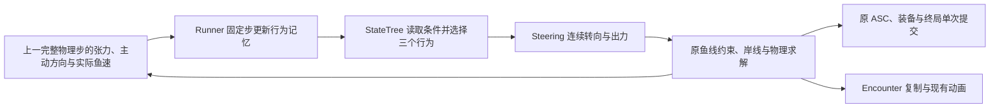

# 鱼运动与遛鱼逻辑：设计与实现

本文件持续维护鱼、线、杆、猫的运动设计与实际代码。最近更新：2026-09-08，1–4人移动合力现从加入鱼竿时生效，覆盖无Session、钩子飞行、Waiting、Probe与TrueBiteWindow；本轮影响对照、通过证据与剩余表现验收项见 [钓鱼架构 2.0.4](FishingArchitecture_zh-CN.md#204-入竿即保持队形的影响与验证2026-09-08)。鱼仍使用沿主动意图未完成距离的耗体公式，满线右键不恢复。下文日期段落中的构建和测试数字属于相应历史版本，不作为当前修复的通过证据；真人手感和新打包双端验收仍待完成。

当前猫端通过 `CatFishingGroupModel` 使用一个 N 人计算入口：个人正体力提供完整力量，主位系数 1、辅助默认 0.5；移动与站定支撑共用个人向量预算。同向加强、反向抵消、侧向改变组运动。只有主位驱动线杯和竿向，主位体力为零仍可使用队友的有效支撑操竿。Runner 每步冻结真实成员、已接受的 CMC 移动和各自 ASC，共同收线/转杆/去重持竿账单均分，个人移动及受阻用力由本人支付；体力总量只读求和，不转移余额。有效放线逐人恢复、满线不恢复、鱼力竭免正向费用保持。

生产中的单人也从入竿起使用组运动。Rod 记录成员当下位置相对共同根的偏移，入退和接力保留连续组根，不按名单下标传送角色；CMC 抑制第二份个人加速并独占身体碰撞。尚未搏斗或一轮终局后仍持竿的无载阶段，`UpdateUnloadedGroupMotionFromAuthority` 只读 ASC 的 `FishingStrength/FightStamina/MaxFightStamina`、CMC已接受移动及速度上限，使用同一个GroupModel和同一主辅系数计算主动移动目标。Rod 用成员中最小加速/制动能力把目标积分成共同速度（cm/s），再以全员胶囊sweep可行距离的最小值限制本步，复制 `UnloadedVelocity`。CMC只消费共同XY速度，保留Z、重力、Walking/Falling和碰撞/滑动；无载阶段不运行鱼模拟，不支付任何搏斗账单。已删除原生holder-only fallback及私有 `CarrierMovement`，不存在另一条单人前战移动入口。

搏斗仍由Runner接管共同运动和鱼线求解；Simulator与CMC共用切向积分，预测分别受正向、后退、侧向碰撞距离约束。`bUnloadedMovement` 与组版本、主控版本、个人加入世代和Aim域一起隔离旧运动/按键及SavedMove；它不改变 `bFightActive` 的搏斗含义。危险入水逐人退出操作组，剩余人继续，全部离开才转无人值守。`FCatFightSimulationState::CatStamina` 仍为当前主位余额镜像，不能当作团队账本；总体力和上限来自明确的GroupResult/Session总量字段。Simulator的猫移动/体力Trace是求解估算，实际各人账单查 `fishing_group_stamina_settled`，步末总变动以Runner结算为准。

`SetFishingGroupCollisionPeers` 让同竿成员彼此忽略移动碰撞；CMC只追踪自己新增的 `IgnoreActorWhenMoving`，离队或解绑时恢复这些项，保留其他系统已有的忽略。`GetExternalTractionTravelLimit(..., bAllowStepUp=false)` 的默认搏斗算法不变；无载查询开启台阶分支，grounded角色遇到可StepUp低台阶时按 `MaxStepHeight` 抬高胶囊做探测，允许CMC实际跨越。探测尊重组内忽略名单，真墙仍使用全员最小可行距离。共同速度不取消接触容差、斜坡高度差、重力和碰撞落位差，也不通过瞬移维持绝对刚性队形。

一轮取消、收获或其他终局停止鱼载荷，仍占用健康鱼竿的成员转回无载共同移动；只有本人离竿才恢复个人自由移动，破竿、收起、无人或Rod销毁则完全解绑。`SetFishExhaustedFromAuthority` 保留fight上下文、同Aim域及当前组目标，只立即清零鱼牵引与鱼转矩，下一固定步继续力竭收线，不能中间切为无载模式。`Runner::Stop` 在清理回调前置为已停止并保持幂等，避免旧终态Session稍后EndPlay清掉同竿新一场载荷。

个人移动费用的位移样本以厘米和秒保存，按成员世代归属，固定步逐段消费；低帧率同一帧追赶多步时保留剩余位移与时间，避免首步耗尽样本、后续误算原地受阻。每段仍使用原主动正功/受阻费用公式，无输入被动移动不收费，CMC 标记的瞬移不作为主动进展。同成员接力保留尚未结算的移动样本，离队再加入建立新采样域。

- 本文开头的行为部分描述第二轮阻力修正，费用部分描述本轮意图缺失模型；正式行为资产沿用第二轮已迁移结果。`/Game/Data/StateTrees/ST_FishFight` 在第一轮已从两个计时叶子迁成三行为树；第二轮的新反馈边已保存并经独立进程和当前编辑器重载确认。
- 后面的日期衔接核对保留历史改动和当时的证据；其中旧两档游速、阶段耗体、旧入口只描述相应历史版本，不作为当前公式或新验收证据。
- 折返、近岸反扑、水下三维运动、完整效用评分选路和真人双端丝滑验收均未完成；仍没有专门的鱼 Actor 网络运动插值器。
- 后续讨论继续更新本文件。业务进度与持续验收缺口只维护在 [需求对齐差距清单](Development/需求对齐差距清单.md)，本文不另建模块进度账本。

## 连续出力与三个反馈行为：阻力反馈修正（2026-09-08，第二轮）

### 玩法目标与实现范围

目标是让玩家利用走位、转杆和收线时机创造牵引窗口：鱼外冲受阻后保持出力尝试横切，横切仍受阻时重试外冲；连续对抗达到时限或外冲自然结束后短暂降低出力，再开始下一轮。恢复时限保证鱼不会靠不断换向无限维持强动作；它是玩法调度预算，不是新增的体力资源或扣费入口。

首轮实机证据为 `Saved/Automation/FishResistance-20260908/UserBefore.log`，会话 `D246F483-4C18-A639-50AC-4791567AA3DD`：约3.04 kg的电鳗正常最大推力约27.34 N，猫原始合力50 N，受杆姿态影响，本次日志有效力量约20～25 N（前两步为20和24.862 N，最大可达50 N）；鱼约24.6 s上岸，着岸前仍有72.2689/76.5体力。日志出现外冲约0.95 s即受阻转横切，以及4.1～4.8 s的缓游。着岸后原终局会把鱼体力清零，不能把这一清零误记为遛鱼已耗尽体力。这份反馈证明第一轮受控测试通过仍不足以确认对抗手感；本轮修正后的真人结果尚未取得。

第一轮横切同时降低出力和向外投影，稳态主动沿线推力仅约0.078～0.137倍正常最大推力；缓游又默认主动向内。第二轮分别修正这两处，并延长有效动作的承诺时间。在猫能实际提供50 N有效力量的条件下，27.34 N鱼仅靠正常主动推力不能保证静态顶住；这项一般力量边界不能替代本次日志中实际有效猫力的判断。第二轮未修改鱼力量、猫力量或当时的收费公式来制造静态顶住的保证；本轮费用公式另见下节。

保留 `ACatFishEncounterActor + UStateTreeComponent`，不增加 AIController、Pawn 寻路或 MoveTo 位置写口。`ECatFishBehavior` 的 `OutwardRush/LateralArc/EaseOff` 表达策略；旧 `ECatFishMotionIntent` 留作现有三种动画角色的兼容投影，不再决定鱼推力、游速或阶段费用。



普通策略通过真实端点、张力与运动进展感知玩家操作，不读取鼠标来瞬间反制。当前“受阻”是上一完整物理步的承载和主动方向进展判断；没有水域路线搜索或独立的“哪一侧空间更大”感知。岸线反馈仍由 `ResolveFishSurfaceFromAuthority` 与 `RedirectFromWaterBoundary` 处理，是三个行为共同的运动约束。

### StateTree 转移与唯一行为时钟

入口为 `FCatFishBehaviorStateTask::EnterState` → `ACatFishEncounterActor::BeginFishBehaviorFromStateTree` → `UCatFishingFightRunner::BeginFishBehaviorFromStateTree`。Task 只提交行为，关闭自身 Tick；进入时由 Runner 持有的随机流冻结目标出力与最长持续时间。首次主动行为、或缓游结束重新进入主动行为时，另外采样本轮 `ActiveBoutDurationSeconds` 并清零 `ActiveBoutElapsedSeconds`；外冲与横切互换时保留两者。`HandleFixedStep` 先调用 `AdvanceFeedback`，再手动 `TickFishBehaviorFromAuthority(FixedStepSeconds)` 评估树的 `OnTick` 条件，最后执行连续转向与本步物理。

组件自动 Tick 已关闭，行为计时、负载记忆和树评估使用同一固定步。正式树读取 `MinimumDurationElapsed/DurationExpired/SustainedBlocked/NeedsRecovery`；`NeedsRecovery` 表示累计主动时长达到本轮预算，优先于受阻改道，且不被刚进入行为的局部最短承诺挡住。缓游不累计主动时长。`LowStamina` 仍是合法的作者条件接口，但正式树不再用它在每次最短承诺后立刻退出主动行为。树不持有第二份鱼体力或扣费状态，仍使用明确优先顺序的条件边，尚未使用效用评分选择器。

| 行为 | 当前目标出力默认值 | 当前树的退出顺序 | 玩家可利用的机会及边界 |
| --- | --- | --- | --- |
| `OutwardRush` 外冲 | 0.8～1.0 | 总对抗预算到期 → 缓游；否则最短承诺后持续受阻 → 横切；本状态最长时长到期 → 缓游 | 玩家可以持续牵制，但受阻首先触发有力改道，不直接等同于鱼该卸力 |
| `LateralArc` 横切 | 0.75～0.95 | 总对抗预算到期 → 缓游；否则最短承诺后持续受阻 → 外冲；本状态到期也 → 外冲 | 保持同侧弧线并保留较强向外分量；重试不会重置总预算，不保证该侧是最优路线 |
| `EaseOff` 缓游 | 0.3～0.45 | 到期且仍受阻 → 横切；否则 → 外冲 | 默认横游并降低出力，提供短窗口；不默认主动向内，不回血，也不保证张力立即消失 |

`FCatFishSteeringConfig` 原生默认最长区间为外冲2～4 s、横切1.5～3 s、缓游1.25～2 s，连续对抗预算6～10 s，局部最短承诺1.25 s。正式四性格保留第一轮外冲时长与满出力参考游速，显式更新缓游和总对抗预算；下表是本轮独立重载确认的正式数值；原生默认值和正式包配置分开记录。

| 正式性格包 `/Game/Catfishing/Data/Fish/` | 满出力参考游速 cm/s（保留） | 外冲最长区间 s（保留） | 连续对抗预算 s（本轮已重载） | 缓游最长区间 s（本轮已重载） |
| --- | --- | --- | --- | --- |
| `Fight_SmallRestless` | 110 | 3～5 | 6～8 | 1.25～1.5 |
| `Fight_MediumSteady` | 140 | 3.5～5.5 | 7～10 | 1.25～1.75 |
| `Fight_LargePredator` | 180 | 4～6 | 8～12 | 1.25～2 |
| `Fight_GiantHeavy` | 240 | 5～7 | 10～14 | 1.25～2 |

负载按 `T_previous/F_max` 归一化并以0.15 s时间常数平滑。线有实际张力、平滑负载至少0.2、主动方向上的实际速度低于上一期望自由游速的40%，才累计受阻；持续0.35 s才确认，条件消失即清累计。受阻含义和阈值本轮保留，改变的是树收到受阻事实后的选择。

低体力阈值默认30%。进入状态时低于阈值，主动状态最长时长乘0.7、缓游最长时长乘1.5；开始新一轮主动行为时，总预算也乘0.7，采样结果均受局部最短承诺下限保护。途中体力变化不会重抽已冻结的总预算，也不再凭低体力条件在1.25 s一到就退出。正常力量上限不随体力比例缩小。两种时间累计均由Runner同一固定步推进，不新增独立Ticker或体力恢复公式。

### 主动推力、连续转向和独立水阻

正常活鱼的实际推进已改为：

```text
F_max_N       = FishStrength × ForcePerStrengthNewtons
F_active_N    = F_max_N × u × SwimDirection
drag_kg_per_s = F_max_N × 100 / max(1, FullEffortSpeed_cm_per_s)
```

`u=FishEffortRatio` 是 `[0,1]` 的实际出力，不是鱼体力百分比。目标范围由行为提供；实际值每秒最多上升 0.8、下降 0.6，切状态保留当前值、方向和物理速度。水平转向继续受角速度上限约束；新结构默认 120°/s，迁移资产保留自己的旧上限。当前尚未按高速自动降低转弯能力。

外冲在有限角度内重选偏角；横切冻结左右侧并随鱼线方向连续更新目标 `normalize(Tangent + 0.9 × Outward)`。0.9是混合系数，不是归一化后的向外比例：实际向外投影约0.669，结合0.75～0.95的目标出力，稳态主动沿线推力约为0.502～0.636倍正常最大推力，同时保留切向运动。以上是主动推力投影，不是最终张力保证。

缓游仍采用 `normalize(Tangent × (1 - EaseOffInwardBias) - Outward × EaseOffInwardBias)`，本轮默认 `EaseOffInwardBias=0`，所以目标为横向；字段保留原“向内混合权重”语义供作者调整，不改名后偷偷换义，也不把恢复动作写成默认向玩家游。切入缓游时实际游向和出力继续平滑，岸线约束仍可改变目标。重新选偏角和持续时间使用固定随机流，不每步随机换边。

正常水阻只按固定满出力及满出力参考游速校准，不随 `u` 缩小。参考速度的数值下限为 1 cm/s；当前四个正式性格均高于此下限，稳定自由游速因此趋近 `u × FullEffortSpeed`。若配置低于 1 cm/s，水阻按该下限校准。实际速度仍由惯性、鱼线和岸线决定。`u=0` 只关闭主动推进，仍有水阻、惯性与牵引；它不是鱼力竭，真正力竭继续使用既定清速度与回收规则。

满力横切与低力外游是不同动作。鱼游向相对鱼线的夹角决定主动推进的沿线分量；垂直鱼线不意味着实际张力为零，张力还由惯性、两端移动、收线及约束产生。杆身与鱼线的夹角另用于杆转矩，不重复拿它衰减鱼的主动推力。

### 鱼和猫如何耗体

当前鱼耗体按本步主动方向上未完成的游动距离计费，替换此前的 `u² × 沿线投影 × 张力比例`：

```text
I_cm = 本步主动单位方向 × 实际出力u × 满出力参考游速cm/s × dt
A_cm = 最终鱼位置 − 步初鱼位置 − 本步历史位置纠偏
Progress_cm = dot(A_cm, normalize(I_cm))
Missing_cm = max(0, length(I_cm) − Progress_cm)
FishDrain_points = Missing_cm / 100 × FishStaminaPerUnfulfilledMeter
```

仅把不超过 `UE_DOUBLE_SMALL_NUMBER cm` 的缺失归零，以消除斜向稳速及世界位置加减的舍入误差；超过容差时完整计入缺失，不减去容差，也不按费用金额过滤。真实 `1e-4 cm` 缺失即使只有约 `1e-9` 点费用仍保留原结算与尾数规则。`I=0` 时四项输出都为零，即使被动拖动也不会产生此项费用。实际进展保留正负号，缺失量不限制在意图距离以内；不额外乘 `u` 或 `u²`，不以鱼线夹角或张力作为收费门槛。方向取 `Step` 已提交的 `FishEffortDirection`，不取岸线改道后的下一步目标。意图速度来自 `u × FullEffortSpeed`，没有使用受惯性影响的自由积分候选速度，因此零张力的起步、转弯也可能产生缺失；达到意图速度的自由游动不收费。这是玩法消耗指标，不将其称为严格物理机械功，也没有另加基础游动费用。

例如同一步意图5米、实际3米，实际位移与意图夹角为0°、60°、90°、120°、180°时，缺失分别为2、3.5、5、6.5、8米；原地僵持缺5米。实际前进7米、或已前进5米同时被侧移，缺失均为0。它不采用向量差的长度，侧向位移自身不会增加费用。

新字段 `FishStaminaPerUnfulfilledMeter` 是体力点/米，原生默认 `5/3`。独立标定基准为满出力参考游速180cm/s、完全僵持时耗3点/s；相同条件下四个正式参考速度110/140/180/240对应约1.833/2.333/3/4点/s。旧每秒价、每厘米价都不直接换算到此字段。新值为0可关闭这项费用，且不会因残余体力低于阈值而强制归零。

实际扣除保留明确豁免：无人操作、没有可用猫合力、猫力竭强制拖拽、鱼已力竭以及有效右键放线均不扣鱼体力。右键只在线杯尚有容量时恢复猫体力并免双方费用；满线右键按普通锁线/仍按住的左键处理，缺失耗体没有额外满线倍率。鱼上岸、坏竿和捕获仍由原权威入口裁决，上岸清空残余体力属于原玩法终局，不能记为距离费用耗尽。

猫不按鱼状态名追加倍率。移动和收线使用实际主动距离与负载，转杆使用实际主动正功，共享支撑按相对负载平方与时间收费。鱼降低出力可以间接减少猫的负担，但惯性和几何约束可能继续维持张力；进入缓游既不免猫收线费，也不使猫自动回血。

### 行为资产迁移历史、表现与验证边界

本节“本轮”指第二轮阻力调整；此次只保存Balance的过程与现行鱼价格另见“主动意图耗体衔接”。

`UCatFightPersonalityDefinition::PostLoad/MigrateLegacyMotionSettings` 保留版本0到1的首次迁移契约：用原两档游速最大值建立满出力参考游速；同为秒/角度单位的时长、重选间隔、转速上限和外冲扇区几何迁入新结构。三档出力、横切和受阻配置用独立默认值，不由旧速度比例或旧耗体倍率换算。版本1的非法配置不回退旧字段，也不因原生默认值变化而自动覆盖已有调参。本轮四个正式版本1性格的调整必须走显式、可核对的资产迁移，不借 `PostLoad` 全局重写策划配置。

本轮使用 `Scripts/migrate_fish_adaptive_behavior.py -AuditFishResistanceTuning` 只读预览及独立重载，使用互斥的 `-ApplyFishResistanceTuning` 显式更新阻力调参；原 `-ApplyFishAdaptiveMotion` 仍只负责旧模型首次迁移。新的Apply要求五个目标包匹配已审计SHA256、目标没有未保存修改、原生新字段可读，先备份，再只调整四性格的七个配置字段并调用原生成器重建树。保护范围为16 Fish、16 Presentation、17 AnimBP、`ST_FishingSession`和Balance，共51包；Balance本轮不保存，费用k不变。不增加包路径、INI绑定、Cook入口或游戏存档字段。五包保存及51包hash不变已记录于本轮 `Migration/Migration.json`，独立重载由本轮 `FreshReload/Audit.json` 和11项全true的 `Verification.json` 确认。

第一轮资产历史：修改前已用 UE 5.8.1 独立 Cmd 只读加载真实树、四性格和 16 Fish；`Saved/Automation/FishAdaptiveMotion-20260908/AssetsBeforeDetailed.json` 记录了真实两叶 Task 与互跳目标、性格数值和 Fish 引用。树没有发现生成器以外的手工拓扑。第一轮脚本显式保存了四性格、Balance和树，共六包；`MigrationNativeSettings/Migration.json` 与独立进程 `FreshReload/Audit.json` 确认三行为树、四性格版本1、参考游速110/140/180/240 cm/s及k=3，50个当时受保护包hash不变。这些证据只确认第一轮迁移，不能证明第二轮反馈边与新数值已经生效。

身体朝向继续使用主动 `SwimHeading`，服务器按角速度上限转向；鱼可以朝外游却被线侧拖。位置和旋转保留原Actor `RepMovement`，没有新增客户端位置平滑。动画读取复制的 `Behavior/u`，期望游速为 `u×FullEffortSpeed`，再用原播放倍率插值。旧三动画映射仍按实际出力滞回分类：从缓游表现升到挣扎需达到0.55，已处于挣扎则低于0.4才降档；力竭仍为 `AutoHauling`。本轮不修改WBP或17个正式AnimBP；第一轮只读审计已确认这些包共26个图、4个MotionIntent节点与2个SwimPlayRate节点，属于保留契约的消费者证据。出力区间改变会影响原阈值的触发时机，真人画面仍需检查，不能由方向连续或复制快照抵达就宣称客户端画面丝滑。

### 第二轮影响盘点与衔接结果（历史公式与证据）

本轮修改前以第一轮已落地的连续出力版本为基线；首次实机日志另存为 `Saved/Automation/FishResistance-20260908/UserBefore.log`。本轮启动时Git工作区clean，无用户并行源码改动；本轮内部Agent按职责文件分工，其他任务的历史提交保留。正式五包与51个受保护包的修改前指纹记录于本轮 `AssetsBefore.json`。下表区分已修改源码、已验证受控行为、已完成的独立重载及未取得的真人结果；不另建人工进度账本。

| 功能/环节 | 当前位置与引用证据 | 现有行为与目标差异 | 处理方式与目标位置 | 衔接依赖与顺序 | 回归风险与验证方式 | 处理结果与证据 |
| --- | --- | --- | --- | --- | --- | --- |
| 入口、状态归属与时序 | `Source/Catfishing/Fishing/Simulation/CatFishingFightRunner.cpp::HandleFixedStep/BeginFishBehaviorFromStateTree` → `CatFishSteeringModel.cpp::AdvanceFeedback/BeginBehavior`；Encounter代理仍由正式树Task调用 | 第一轮只累计单行为时长；本轮追加跨外冲/横切的总时长，单位s，缓游不累计，初次主动及恢复后才重新采样 | 新增 `FCatFishSteeringConfig::ActiveBoutDurationRangeSeconds` 和State的 `ActiveBoutElapsedSeconds/ActiveBoutDurationSeconds`；保留Runner唯一固定步、同一随机流、Actor+StateTree宿主 | 先接收配置和状态，再更新条件/生成器，最后保存正式树 | 换向重置造成无限对抗、重复Tick、预算和随机漂移；纯模型与真实树固定步测试 | 源码已接入；本轮正式树运行测试通过，验证多次受阻保留预算、恢复冻结及新一轮重置，普通WorldTick不推进；无AIController新入口 |
| 策略选择与旧条件接口 | `Source/Catfishing/Fishing/Behavior/CatFishBehaviorTypes.h`、`CatFishBehaviorStateTree.cpp`；`Source/CatfishingEditor/Fishing/CatFishStateTreeAuthoringLibrary.cpp::CreateOrUpdateDefaultFishBehaviorStateTree` → `/Game/Data/StateTrees/ST_FishFight` | 第一轮低体力最短承诺后早退、横切所有出口缓游；本轮预算恢复优先，横切受阻/到期重试外冲 | 新增只读 `NeedsRecovery`；保留8条真实树边，恢复边不受局部Min阻挡；`LowStamina`保留作者接口，正式树不再引用其早退边 | 模型条件先就绪，再生成及迁移已确认指纹的树；不在Step内建立第二棵策略树 | 恢复优先级被受阻边抢占、低体力来不及转向；实际正式树与Steering同跑 | 正式树运行测试通过，包括恢复越过局部Min、低体力缓游后完成转向/出力且仍有有效外冲；树与四性格五包已保存并经独立重载确认 |
| 连续方向与实际出力 | `Source/Catfishing/Fishing/Simulation/CatFishSteeringModel.h/.cpp::UpdateTargetDirection/Step` 被Runner调用 | 横切0.4～0.7且bias0.2 → 0.75～0.95且bias0.9；缓游0.15～0.35且inward0.45 → 0.3～0.45且inward0；Min0.65 → 1.25 s | 原字段保留含义并显式调值，连续转速120°/s、出力升0.8/s降0.6/s继续；不改实际位置写口或瞬间反射 | 先新配置，再原Step执行，物理仍只读实际u和方向 | 朝向/出力跳变、横切退化为直游、缓游主动帮收线；连续输出与相同物理输入对照 | 本轮受控Steering+Simulator三种子测量显示强鱼横切减慢实际收线、弱鱼提高承载；真实树连续输出测试通过；不等于真人手感验收 |
| 原生默认与四正式性格 | `FCatFishSteeringConfig` → `Source/Catfishing/Data/CatFishPersonalityDefinition.cpp::MigrateLegacyMotionSettings` → `CatFishingSession::TryEnterHookedFightFromAuthority`冻结配置；四个`Fight_*`包见上表 | 原生总预算6～10 s；正式四类分别6～8/7～10/8～12/10～14 s，缓游缩为1.25～1.5/1.25～1.75/1.25～2/1.25～2 s | 显式迁移七字段；保留版本1、参考游速、原外冲/横切时长、低体力倍率及版本0首次迁移契约，不自动覆盖其他新调参 | 确认原包与新反射字段后保存，再独立进程读取数值及引用 | 只改C++默认而正式DA仍旧值、覆盖策划并行改动；SHA256、迁移JSON、独立重载及原生迁移测试 | 本轮Migration报告五包保存、七字段和八边符合目标；51保护hash相同；独立重载及相关代码回归已通过 |
| 物理与鱼猫费用 | `CatFishingFightRunner.cpp::HandleFixedStep` → `CatFishingFightSimulator.cpp::Step/FinalizeResolvedStep` → `CatFishingFightWorkModel.cpp::ComputeFishEffortDrain` | 本轮只改变方向、实际u及动作持续比例；`uFmax`、固定水阻、`ku²Gdt`和猫原费用不变 | 保留力量上限、k=3及共同张力；不加状态倍率、重复式费用或保证鱼力胜过猫力 | 同一物理步读取平滑输出，最终地形结算后仍单次支付 | 调AI时暗改力量/费用、主动投影与实际张力混淆；强弱鱼同猫力、横切与恢复对照及原费用回归 | `Tests.log` 的 `fish_resistance_measured` 有强鱼65 N/猫50 N及弱鱼27.34 N对照；原费用契约回归通过，完整真人交换效率仍未验收 |
| 岸线、强拖与失败退出 | `CatFishSteeringModel.cpp::RedirectFromWaterBoundary/Step`、`CatFishingFightRunner.cpp::ResolveFishSurfaceFromAuthority/Stop`、Encounter停止代理 | 保留真实岸线约束、连续转向、猫零体力无助手强拖和原力竭/上岸/坏竿终局；强拖时新增总预算也应冻结 | 沿原优先级和清理入口；不新增自主Teleport、放线或免除强拖条件 | 普通反馈/树Tick只在非强拖阶段运行，Step执行强拖覆盖，退出恢复原连续控制 | 新预算在强拖期间偷偷到期、近岸反射或停树残留；强拖暂停恢复、地形与退出回归 | 本轮相关回归及真实树停止/代理清理通过；无新增终局入口，真人岸线全程画面未验收 |
| 网络权威、复制与回执 | Runner服务器权威状态 → `Source/Catfishing/Fishing/Actors/CatFishEncounterActor` 的原表现快照和RepMovement → `CatFishAnimInstance` | 新预算仅Runner内部记忆；客户端仍接收既有Behavior/u/位置旋转，不上传自报鱼力或预算 | 保留原服务器裁决与复制路径，不新增RPC、输入回执或网络状态副本 | 固定步最终结果后仍沿原发布顺序 | 房主有变化而客户端未收到、单端日志冒充联机；同Session的applied/received事件核对 | 本轮Listen/Client四份快照在同一Session成功复制，见下方证据；新Development包及真人双端未验收 |
| 持久化、装备与副作用 | `CatFishingSession` → 原ASC、Equipment同一鱼竿实例与捕获事务；Balance保持原包 | 行为时长和预算不进入存档，不新增鱼/猫扣费和耐久写入；玩法结果仍由原入口提交 | 不涉及新存档格式、持久化键或事务入口；配置资产保存仅限已确认五包 | 最终物理和终局提交顺序保留 | 新策略引发重复扣体/磨损或覆盖Balance；相关原生产链回归、保护包hash | 本轮原链回归无新增失败；Balance在51个保护包内且hash相同；既有StarterRod150/500差异单独保留 |
| 正式资产、脚本与Cook | `Scripts/migrate_fish_adaptive_behavior.py` 的 `-AuditFishResistanceTuning/-ApplyFishResistanceTuning`；四`Fight_*`与`ST_FishFight`；原Settings/INI绑定 | 第一轮自适应树已落盘，不能再用“两叶首次迁移”冒充本轮升级；本轮按已知五包指纹显式改七字段/八边 | 原脚本新增互斥阻力调参入口，先备份再保存；保护16 Fish+16 Presentation+17 AnimBP+会话树+Balance共51包 | 目标无未保存修改、原生字段可读、SHA256符合才写；写后独立重载 | 重建策划手工树、误存其他包、旧默认未被Cook；目标/保护hash和独立加载 | 五包迁移已保存、51包不变；`Verification.json`独立重载11项检查全true。包路径、INI绑定和Cook入口不增加，本轮未重新Cook或打包 |
| UI、动画与身体表现 | Encounter原 `FCatFishEncounterPresentationState` → `Source/Catfishing/Fishing/Presentation/CatFishAnimInstance`；17个正式AnimBP和原WBP | 行为/实际u数值节奏改变，三动画滞回0.55/0.4、主动SwimHeading、播放率与RepMovement保留 | 不改WBP/AnimBP资产，不增加动画接口；`MotionIntent`仍是有已确认消费者的表现投影 | 原生产u和方向→原复制→原动画消费 | Ease实际u仍可能跨表现滞回区、身体侧拖与画面跳动；消费者回归及真人双端 | 本轮复制回归通过；17AnimBP在保护范围，第一轮图审计作消费者证据；真人画面未验收，不宣称专用插值已实现 |
| 测试、日志与文档 | `Fishing/Tests/CatFishBehaviorStateTreeRuntimeTests.cpp`与行为/阻力相关测试；`CatFishingFightRunner.cpp::BeginFishBehaviorFromStateTree`；本文、`Docs/DataAsset字段含义.md`、`Docs/FishingCoreFlow_zh-CN.md`、`Docs/StateTreeTutorial_zh-CN.md` | 第一轮只验证分支正确但实机偏弱；本轮增加预算与实际受力结果验证，日志保留切换前事实 | `fishing_behavior_phase_entered`保留原PreviousElapsed/Duration，仅新增ActiveBoutElapsedSeconds、ActiveBoutDurationSeconds、PreviousBoutElapsedSeconds、PreviousBoutDurationSeconds四字段，保持Session/Actor/World/Authority关联与状态变化输出；同步当前口径并标历史 | 先源码/正式资产，后受控回归与双端事件，再真人；持续缺口仍归唯一进度入口 | 旧报告冒充本轮通过、热更脏资产或只有编辑器日志；新报告和时间核对 | Editor/Game构建成功；165项159clean+5warning+1既有失败、0未运行。文档与历史边界本轮同步；热更过程异常仅存档，不当作有效验收 |

### 第二轮验证证据与仍需验收的内容

本节短路径相对 `Saved/Automation/FishResistance-20260908/`。

- `contract`：`BuildEditor.log/BuildGame.log` 均为Succeeded；`Report/index.json` 共165项，159 clean、5 warning、1 failed、0 notRun/inProcess，即164项通过。唯一失败仍为 `StarterRodPreservesMaximumDurabilityBaseline` 的150/500既有差异。正式树、总预算、低体力有效动作、连续输出及原费用/强拖等本轮回归通过。
- `runtime_behavior`：`Tests.log` 中 `Event=fish_resistance_measured` 使用真实Steering+Simulator，连续运行6 s，前2 s用于稳定，统计后4 s，三个随机种子下，65 N鱼对50 N猫的新横切实际收线速度为28.188/30.598/38.463 cm/s，旧横切均为80 cm/s；新横切张力为50 N，旧为35.611～37.339 N。新缓游仍可收线80 cm/s、张力29.037～29.058 N。27.34 N弱鱼的新横切仍可被收线80 cm/s，但张力由旧14.980～15.707 N提高到27.350～28.915 N。这是受控模型对照，不能替代真实玩家输入、整场地形和手感验收。
- `runtime_behavior`：实际Listen/Client收到外冲、横切、缓游、力竭四份快照，同一 `SessionId=B1C7CAD1-43E9-850A-0B69-E6948CC97FFB` 的 `fishing_behavior_applied/fishing_behavior_received` 分别对应权威端和客户端。五包迁移成功、51保护包hash相同见 `Migration/Migration.json`；`FreshReload/Audit.json` 为独立进程只读审计，`saved_assets=[]`；`Verification.json` 的11项检查全部为true，确认四DA数值、八条真实树边、51保护包、16 Fish引用、Settings及全部56包磁盘hash与记录一致。
- `presentation_delivery`：本轮未重新Cook或打包，未取得修正后的真人房主/客户端手感、高延迟及鱼/线/杆/角色全程画面证据；新Development包不加 `-log` 的双端落盘也未验收。不能关闭Fishing模块。

过程记录：`HotReloadAttempt.log` 保留热更重实例结构不一致的失败尝试，当时未保存任何脏资产；随后使用完整重启和正式构建取得上述代码验证结果。热更过程日志不作为迁移成功或运行生效的证据。`MigrationGuardChecks.json` 的10项迁移保护检查通过，属于脚本契约证据；`ConnectedEditorAudit.json` 在重新启动的Editor进程17300中实读新原生配置、四DA和八边均符合预期，`dirty_content=[]`，当前编辑器世界为原Frontend入口。当前进程已加载新实现，不等于修正后的真人操作已验收。

### 第一轮验证证据（历史，不替代第二轮结果）

第一轮证据统一位于 `Saved/Automation/FishAdaptiveMotion-20260908/`，下列短路径均相对该目录；本节“本轮”指当时的第一轮实现。

- `contract`：`FinalEditorBuild.log/FinalGameBuild.log` 均为 Succeeded；最终清理未使用友元和旧诊断临时变量后，`CleanupEditorBuild.log/CleanupGameBuild.log` 也均通过，玩法计算未再改变。`FinalReport/index.json` 为163项，157 clean、5 warning、1 failed、0 notRun/inProcess，即162项通过。唯一失败是既有 `StarterRodPreservesMaximumDurabilityBaseline`：测试仍期望150，用户正式资产实际500；未覆盖该资产或降低断言。连续出力/固定水阻、`u²G`、零出力与力竭区别、猫费用独立、右键免耗、强拖、性格版本及正式树反馈分支等本轮用例通过。
- `runtime_behavior`：正式树固定步分支、方向/出力连续性、强拖暂停/恢复、Runner参与者、原ASC/Equipment相关回归和真实地形夹具通过。`FinalTests.log` 的 `SurfaceRecovery` 记录 ReleaseX=-61.507352、FinalX=30.367648、76步/3.8秒；原120步上限保留。真实 Listen/Client 在同一 `SessionId=8E2A353D-41A8-474A-81B6-FBAC85B7EA63` 收到外冲、横切、缓游、力竭四份快照，`fishing_behavior_applied` 为 NetMode=2/Authority=true，`fishing_behavior_received` 为 NetMode=3/Authority=false。这是受控瞬态PIE的真实复制，尚未覆盖整场正式地图输入、Steam准入、真人走位及全部会话端到端行为。
- `presentation_delivery`：未重新打包，未验证真人房主/客户端手感、高延迟、鱼/线/杆/角色全程画面以及新Development包不加 `-log` 的双端落盘。不以构建、资产审计或PIE快照测试关闭Fishing模块。

基线与中间失败单独保留：`BaselineReport/index.json` 最初147项，139 clean、4 warning、4 failed；除耐久外的两项BrokenRodPack和一项FirstRodInteract属于并行Service问题，最终报告中已消失，不能归功于鱼AI。首轮 `ImplementationBuild.log` 在并行Inventory语法及日志分类编译错误处失败，后续重试及最终构建成功。`DeliveryReport` 还出现两项本轮夹具问题：Participant缺少真实Session/Rod且保留立即Calm旧断言；Surface未逐步回写惯性速度。两者修正夹具后在FinalReport通过，未用放宽120步等原行为条件来掩盖失败。两次早期 `Migration*.log` 的Settings反射读取失败均发生在保存前；脚本改用 `load_class` 加原生CamelCase字段后完成六包保存和独立重载，不以中间报告冒充成功。

### 第一轮影响盘点与衔接结果（历史，2026-09-08）

修改前记录：本轮接入前资产相关 `git status` 无并行修改，源码工作区存在其他任务的 Inventory 等改动；只读资产快照已保存。本表按最终源码、迁移和测试结果填写；尚未完成的真人、打包和整链验收明确保留，不另设业务进度入口。

| 功能/环节 | 当前位置与引用证据 | 现有行为与目标差异 | 处理方式与目标位置 | 衔接依赖与顺序 | 回归风险与验证方式 | 处理结果与证据 |
| --- | --- | --- | --- | --- | --- | --- |
| 入口、状态与时钟 | `Source/Catfishing/Fishing/Actors/CatFishEncounterActor::StartFishBehaviorFromAuthority/TickFishBehaviorFromAuthority` → `Source/Catfishing/Fishing/Behavior/CatFishBehaviorStateTree` → `Source/Catfishing/Fishing/Simulation/CatFishingFightRunner::BeginFishBehaviorFromStateTree/HandleFixedStep` | 两个 Task 自计时改为三个行为，Runner 唯一固定步记忆；无 AIController | 替换旧 `BeginBehaviorStateFromStateTree` 与 Task 倒计时；关闭组件自动 Tick，树条件只读 | 先反馈/执行器，再 Task/条件，随后迁正式树 | 重复 Tick、切状态跳转/出力突变、强拖恢复；树到 Runner 受控运行 | 正式树已保存并FreshReload为adaptive；FinalReport的FormalTreeSelectsFeedbackBranchesOnlyAtFixedSteps通过，任务/树停止回归通过；整场真人链未验收 |
| 连续方向与策略 | `Source/Catfishing/Fishing/Simulation/CatFishSteeringModel::BeginBehavior/AdvanceFeedback/Step/RedirectFromWaterBoundary` 被 Runner 调用 | 概率向内/假动作模型改为外冲、同侧横切、缓游；持续受阻和低体力可触发切换 | 新 `Source/Catfishing/Fishing/Behavior/CatFishBehaviorTypes` 和 `FCatFishSteeringConfig/State`；岸线原入口继续 | 先固定步反馈，再树选边，再方向/出力与物理 | 阈值抖动、横切无限重复、换线方向和撞岸；纯模型及实际树测试 | FinalReport的ContinuousEffortHeadingAndPersistentArcSide、BlockageUsesCommittedLoadAndActualProgress、ShoreFeedback及ExhaustedCatOverride用例通过；不宣称水域最优选路 |
| 推力、水阻与核心费用 | `Source/Catfishing/Fishing/Simulation/CatFishingFightSimulator::Step/FinalizeResolvedStep` → `CatFishingFightWorkModel::ComputeFishEffortDrain` | 同一推力/两档水阻及阶段费用改为 `uFmax`、固定水阻、`3u²Gdt` 默认；无重复沿线距离费 | 单一模拟器就地替换，输出 `FishEffortRatio/FishOppositionRatio`，猫费用不读鱼行为 | 先新输入和纯计算，再 Session 冻结与 Runner 发布 | 零出力惯性、自由游动、斜向/纯横向、右键、最终地形卸载；单位和行为测试 | FinalReport的ContinuousFishEffortChangesPropulsionWithoutChangingWaterDrag、FishEffortCostUsesSquaredActualEffortAndOppositionTime及Effort/右键/零出力用例通过；旧阶段/距离算法退出运行 |
| 配置、默认与数据迁移 | `Source/Catfishing/Data/CatFishPersonalityDefinition::MigrateLegacyMotionSettings`、`Source/Catfishing/Fishing/Config/CatFishingFightBalanceDefinition` → `CatFishingSession::TryEnterHookedFightFromAuthority`；`DefaultGame.ini [/Script/Catfishing.CatFishingSettings]` 的原三入口 | 四性格旧速度/时长迁入新参考；新出力/费用独立默认，INI 路径不变 | `AdaptiveMotionVersion=1/AdaptiveSteeringConfig/FullEffortMovementSpeedCentimetersPerSecond`；Balance 新每秒价；受控迁移脚本 | 先读取已核实资产、原生迁移与检查，再保存和独立重载 | 覆盖用户新调参、单位套用、漏四性格/16 ID引用；JSON前后和原生 readiness | MigrationNativeSettings保存6包，FreshReload确认4性格版本1/速度110、140、180、240与k=3，50保护hash相同；两项Personality版本/单位回归通过 |
| 资源、权威、回执与退出 | `FightRunner::HandleFixedStep/Stop` → ASC；`CatFishingSession` → Equipment 原实例；Encounter 表现复制 | 保留服务器单次扣体/磨损/终局，强拖暂停普通树，力竭回收不新增鱼AI | 沿原写口；Stop停树并清定时器/代理，力竭停树进入回收；不宣称清空Steering反馈内存，不建第二份存档/随机/账本 | 最终地形与费用完成后再提交和发布 | 双扣、助手/换人/取消、坏竿与同期力竭；受控真实 Actor 链 | FinalReport的Participant/Service/Session/力竭回归通过；四份真实Listen/Client快照有对应applied/received事件；未覆盖整场正式输入及打包，额外存档格式不涉及 |
| UI、动画和身体 | `Source/Catfishing/Fishing/Actors/CatFishingActorTypes.h::FCatFishEncounterPresentationState` → Encounter/`Source/Catfishing/Fishing/Presentation/CatFishAnimInstance`；正式 base + 16 Child AnimBP | 主动朝向独立于位移；新增 Behavior/u；旧 MotionIntent 只映射三动画，WBP不新增输入 | 保留 RepMovement/原播放率插值，追加只读表现字段与滞回；不重写17AnimBP | 先生产真实出力，再复制与原动画消费 | 动画阈值抖动、被拖朝向、代理跳动；C++消费者审计和真人双端 | FinalReport的17AnimBP审计通过：26图/4个MotionIntent/2个SwimPlayRate节点；正式表现契约与四快照复制通过；仍为RepMovement，真人画面未验收 |
| 正式树、生成脚本和 Cook | `/Game/Data/StateTrees/ST_FishFight`；`CatFishStateTreeAuthoringLibrary::CreateOrUpdateDefaultFishBehaviorStateTree`；`Scripts/create_fish_behavior_state_tree.py` | 旧完成后互跳树改为3叶8条反馈边；会话树及资产入口保留 | 生成器已替换；`migrate_fish_adaptive_behavior.py` 先指纹检查/备份，最后切树 | 接收方编译就绪 → 迁DA/Balance → 迁树 → reload/运行 → 原Cook | 覆盖手工树、漏Cook新结构；指纹、前后拓扑、打包重载 | 旧树指纹审计后完成迁移，FreshReload确认3叶新结构；50个保护包不变，正式树固定步测试通过；本轮Cook/打包未运行，新地图入口不涉及 |
| 旧入口与兼容载荷 | 旧人格字段、Balance旧鱼费/低体力字段；`MotionIntent` 与三动画；历史旧 `/Game/UI/WBP_CatLakeReach` 的当前引用状态未复核 | 旧费用/两阶段随机公式停止运行；必要序列化身份暂留 | 源码旧算法及脚本旧价清理；Deprecated字段只供版本0迁移或未确认资产身份，旧枚举供正式动画 | 完成全部旧包/图引用审计与迁移后，才可删反射载荷 | 二进制图、外部引用漏查；图节点与版本审计，不能用文本无命中证明无引用 | 旧算法已替换、正式4DA已版本1；旧包重载迁移及未完成的全Content/外部BP字段审计要求保留Deprecated，MotionIntent有4个图节点消费者；删除条件明确，不新增旧运行方案 |
| 测试、日志和文档 | `Fishing/Tests`、`CatfishingEditor/Fishing/Tests`、`Build/Automation/RunCatAutomation.ps1`；`LogCatFishing` 与本文 | 用连续出力/反馈契约取代只绑定旧公式的期望，保留原玩法契约；事件输出新语义 | 原日志和测试入口更新，新增资产消费者审计；本文同步现行与历史边界 | 按真实链完成contract，再运行和真人表现 | 旧报告冒充新证据、单端日志冒充双端；新报告/时间/事件核对 | 最终Editor/Game成功；FinalReport为157clean+5warning+1既有耐久失败、0notRun；FinalTests及迁移/重载证据见上文，历史/中间失败未冒充通过 |
| 文档消费者 | `Docs/DataAsset字段含义.md` 的平衡/性格表、`StateTreeTutorial_zh-CN.md` 的单鱼树章节、`FishingArchitecture_zh-CN.md` 的宿主/运动/配置、`FishingCoreFlow_zh-CN.md` 的搏斗入口 | 原文仍指向两状态、两档游速或旧费用，易误导新调参 | 同轮改为三反馈行为、独立出力/满力参考和新费用，历史证据保留边界 | 源码职责核对后同步文档，不修改无关装备流程 | 错导航、旧公式复活；逐段与新符号/配置核对 | 五份当前口径已同步并通过diff检查；新资产与测试证据已补齐，历史表仍为历史，真人/打包未验收 |

## 当前实现概况

当前源码使用连续主动推力、固定正常水阻、共同鱼线张力、有限出力收线和持久鱼速度。猫端由 CharacterMovement 执行真实移动与碰撞，鱼端使用服务器固定步；这是交错推进的约束模型，尚不是完整的三维刚体/接触摩擦求解器。鱼仍在水面平面上求解，再由现有地形入口解析岸线和坡面。不可满足的竿尖高差保留几何误差，不凭空抬鱼或放线。

### 线放尽后的输入与费用（2026-09-08）

用户确认：已放线长度达到鱼竿最大线长后，继续按右键等同于没有按右键，不恢复猫体力；鱼向外发力且鱼线绷紧时，直接进入现有锁线角力。判据由 `FCatFishingFightSimulator::IsLineAtMaximum` 统一比较已放出的 `LineLengthCentimeters` 与 `MaximumLineLengthCentimeters`，单位均为 cm，不是鱼与竿尖的直线距离。线放尽后鱼游近形成余线也不恢复右键回体；只有实际收短到上限以下，线杯重新有余量，持续按住的右键才可再次放线回体。线杯有余量时，仍不要求鱼正在向外游或本步实际出线。

输入入口仍为 Ability → CommandComponent → Session → Runner。Runner 保留原始 `bSlackHeld` 按键事实；线杯有余量时右键优先于左键，满线时 `RefreshCatAction` 忽略右键，恢复仍按住的左键 `Pull`，否则为 `None` 锁线。右键首次按下的转向意图重设仍沿用原 Session 入口，不因满线伪造释放或二次按下。未满线开始、在本步实际出线至上限时，`FinalizeResolvedStep` 按最终线长取消本步回体与双方免耗；后续步继续按有效输入走同一个求解器。

满线不新增全员固定扣费、第二份体力算法或耐久惩罚。猫仍按已经完成的移动/收线、转杆正功和持续支撑付费，主辅共同收线、转杆和支撑费用按有出力且有余额的成员均分；鱼现按沿本步主动意图未完成的距离付费（下方满线历史验证仍对应当时旧公式）；耐久仍只磨损本场绑定的鱼竿实例。满线本身不额外收费；是否扣鱼体力由实际意图缺失决定，余线或向内游动不是独立的免耗条件。

`ResolveFishSurfaceFromAuthority` 在开步线杯尚有余量时，允许按最终岸线落点重算并封顶本步实际出线；候选碰到上限、随后被岸线阻挡且实际没有放满时，不提前取消回体。最终费用重算后，Runner 按最终线长刷新有效动作再交给 Session 快照，原 ASC/Equipment 仍只提交一次。零体力强制拖水已覆盖成 `None` 的动作不在最终刷新时被残留右键改回放线；无人值守、鱼力竭回收免耗、坏竿和逃脱终局仍保留各自既定规则，力竭收尾处于满线时同样不能借右键回体。

本次不增加平衡参数、INI 绑定、DataAsset 字段或资产迁移入口，既有 `SlackStaminaRegenPerSecond` 的单位和未满线行为不变。修改前工作区干净；历史已记录初级竿500/150耐久断言及两项坏竿收纳夹具准备失败。旧满线免耗/回体断言与文档口径已替换，不新增独立满线费用算法；原始按键和首次重设入口仍有明确的 Command/Session 消费者。历史“满线张力不阻止右键回体”规则与相应通过报告只说明当时版本，不再作为现行契约或本次验收证据。

本轮验证后发现外部并行任务正在修改 `Source/Catfishing/Fishing/Simulation/CatFishingFightWorkModel.cpp/.h`，将 `ComputeFishEffortDrain` 迁至 `ComputeFishIntentDrain`。这两文件的改动保留且不纳入本次满线修复提交；下列构建与回归对应迁移前鱼费用模型上的满线修复，尚未验证与该进行中迁移组合后的行为。本节费用说明也以这一已验证版本为边界，不能据此判断并行迁移已经完成或无需组合回归。

contract：证据位于 `Saved/Automation/LineLimit-20260908/`。`BuildGame.log` 的 Game Win64 Development 与 `BuildEditorDebug.log` 的 Editor Win64 DebugGame 构建成功；`BuildEditor.log` 的普通 Editor Development 源码编译成功，但已打开的 UnrealEditor 占用 DLL，完整链接失败。最终 `DebugReport/index.json` 为162项：155 clean、6 warning、1 failed、0 notRun；唯一失败仍是 `StarterRodPreservesMaximumDurabilityBaseline` 要求150、正式资产实际500，未改此范围外资产。警告涉及既有旧 `WBP_CatLakeReach` 父类缺失、终态/危险水深诊断，日志另含 EOS_NoConnection 环境信息。`DebugTests.log` 明确记录 `Build Configuration: DebugGame` 并加载本轮新 DebugGame DLL。`BaselineReport` 的旧用例1/1和 `Report/index.json` 的161项（160通过、1既有耐久失败）均实际运行旧 Development DLL，只作为修改前基线，不能替代本次回归。

runtime_behavior：本轮三项满线用例通过，覆盖满线右键与锁线的同模型受力/体力/耐久对照、当步放满、最终实际线长重算、鱼游近形成余线、实际收短后恢复，以及线杯有余量时移动/转杆不妨碍回体。真实 ASC/Runner 的参与者用例验证原始右键保留、满线有效输入、主辅资源与恢复；`LiveAndExhaustedFishTraverseRealShoreGapAndSlope` 通过实际水域/岸线消费者覆盖候选满线但岸挡回未实际放满、原已满线不因鱼游近回体。四项 SlackAim 通过，继续验证 Command→Session→Runner 输入边沿及真实 Rod 转向/努力契约；零体力拖水与既有收尾回归通过。这些是纯模型和受控真实消费者证据，没有运行完整的新版本房主/客户端固定步链。

日志核对使用 `LogCatFishing` 的 `fishing_line_limit_changed`，以 `SessionId/RodActorId` 关联 `AtLimit/SlackHeld/EffectiveAction/SlackRecovery`、线长和单步费用；该事件仅在首步或满线状态边沿输出，已编译进 Game Development，尚未取得完整 `HandleFixedStep` 实际触发该新事件的日志。既有 `fishing_fish_stamina_received` 增加 `Slacking/Reeling`，继续配合 `fishing_coupled_work_sample` 与 `fishing_cat_stamina_applied` 检索。新鲜受控回归日志是 `Saved/Automation/LineLimit-20260908/DebugTests.log`，不能将它当成打包双端落盘证据。

presentation_delivery：未运行本轮 Cook/打包、正式地图真人操作及无 `-log` 房主/客户端双端落盘验收。当前已打开的普通 Editor 仍使用旧 Development DLL；须关闭 Editor 后完成普通 Development 完整构建，再在新模块上体验。上述局部验证不关闭 Fishing 模块级验收缺口。

## 主动意图耗体衔接（2026-09-08）

本轮开始时工作区已有满线右键修复及其测试/文档修改，已记录于 `Saved/Automation/FishIntentStamina-20260908/ParallelBeforeImplementation.patch`；本轮按最新文件定点衔接，不回退该规则。此前165项回归的初级竿150/500默认值失败为既有基线。满线修复已独立提交为 `11e4730`；本轮末尾新增的 `Scripts/Art/` 与 `SourceArt/` 为并行工作，保留且不纳入本次提交。本节记录当前迁移，前面的满线和两轮行为调整表保留其历史证据。

| 功能/环节 | 当前位置与引用证据 | 现有行为与目标差异 | 处理方式与目标位置 | 衔接依赖与顺序 | 回归风险与验证方式 | 处理结果与证据 |
| --- | --- | --- | --- | --- | --- | --- |
| 意图与运动结算 | `Source/Catfishing/Fishing/Simulation/CatFishingFightSimulator.cpp::Step/FinalizeResolvedStep`；Runner地形后再Finalize | 旧鱼线方向负载改为本步主动方向缺失；位置cm、速度cm/s | 保留动力学；最终位置减步初位置及历史纠偏生成实际位移 | WorkModel接收方→Simulator→地形最终重算 | 夹角、反拖、起步、岸挡、纠偏、重复结算 | 已接入；FinalReport中6项IntentCost、Simulation/Effort及真实Surface测试通过；最终位置、反拖、纠偏和幂等均已覆盖 |
| 费用和生命周期 | `CatFishingFightWorkModel::ComputeFishIntentDrain`→Runner→Session/ASC | 新点/米替换旧点/秒；反拖无比例封顶，u不重复相乘 | 新native输入/输出替换旧接口；原资源/终局单写口保留 | 单步最终结果只支付一次 | 零意图、豁免、残余体力、满线右键与猫四渠道回归 | 已替换；全套满线/放线/强拖/零价回归通过；稳速斜游尾数保护及豁免分支高价溢出保护通过；旧native接口及G字段已删除 |
| 配置与资产 | BalanceDefinition→`CatFishingSession.cpp`冻结；`Config/DefaultGame.ini`软绑定 `/Game/Catfishing/Data/Fishing/DA_FishingFightBalance_Default` | 新字段默认5/3点/米，0关闭；旧每秒值不换算 | 新运行字段；旧BlueprintReadOnly字段暂留Deprecated | 新二进制→仅保存Balance→独立重载 | 非法新值拒绝、已有新调价保留、55包指纹保护 | 新字段与冻结配置已生效；AssetVerification.json共15项通过，ConnectedEditorAudit确认5/3及ready。正式Balance保存成功但hash不变（原生默认未产生不同序列化数据）。全量BP/外部消费者未确认，禁止删除旧反射字段；完成变量节点引用迁移后才可删 |
| AI/网络/表现/退出 | Runner反馈→ST_FishFight/Steering；Encounter复制→既有动画；Session终局 | 费用反馈变化，方向/出力、树边、快照语义及退出清理保留 | 不新增AIController、状态资源或位置写口 | 现有ASC/Equipment/Session权威裁决 | 行为、实际消费者、Listen/Client快照；真人手感另验 | 组合回归通过；正式树、Runner及Listen/Client快照通过；WBP/AnimBP/四性格/树未编辑，真人表现未验收 |
| Development诊断 | Session开始/配置日志；Runner周期/终局/尖峰/耦合工作事件 | 旧G/每秒价格改为意图cm、进展cm、缺失cm、每米费率 | 原事件限频和SessionId/RodActorId/World关联保留 | 与最终费用同结果读取 | 新模块落盘单位、费用与实际终局区分 | FinalTests.log含3组原生产fishing_fish_stamina_sample、simulation_trace及ASC付款事件，价格/最终缺失/费用对应；未取得打包双端日志 |
| 脚本/Cook/持久化 | `Scripts/create_fishing_fight_balance_asset.py`、`migrate_fish_adaptive_behavior.py` | 创建及当前审计改读新价；旧字段只作legacy记录 | 只保存已盘点Balance，保护其他包 | 完整构建后应用并独立重载 | 新值保留、旧guard不破坏、包指纹 | 两脚本语法与11项guard通过；MigrationRetry成功保存、FreshReload独立重载，55保护hash相同；Cook入口保留，游戏存档不涉及 |
| 测试和文档 | Fishing Effort/Simulation/Surface/Resistance/Settings及新FishIntent测试；本文件与字段/架构/流程说明 | 替换旧公式专属断言，保留物理和既定操作契约 | 同步当前口径，旧阶段表明确历史 | 契约→运行链路→表现交付分层 | 编译不能替代消费者衔接或真人手感 | 173项最终回归172通过、1既有耐久失败，文档已同步；真人/打包未验，不关闭Fishing模块 |
| 生产扣费消费者 | `CatFishBehaviorStateTreeRuntimeTests.cpp::RunTest`；Session测试友元，原Runner/Encounter友元 | 原树夹具只推进行为，现补完整固定步及实际装备事务绑定 | 公开Equipment Grant/Use/BeginFishingUse/CommitBait→Runner Initialize/Start/HandleFixedStep→ASC/Encounter/Session | 完成真实水域与资源接收方后调用生产固定步，不手动提交Step或余额 | 三档独立价格、实际位移、ASC/Session写入计数、猫费用与装备镜像 | FinalTests.log的fish_intent_runtime_paid三组通过；每组ASCWrites=1、SessionPublications=1，Session保持非终局 |

`contract`：证据根为 `Saved/Automation/FishIntentStamina-20260908/`。`BuildEditorFinal.log` 与 `BuildGameFinal.log` 均为 Win64 Development 完整链接成功；最终 `FinalReport/index.json` 为173项，167 clean、5 warning、1 failed、0 notRun，172项通过。唯一失败为 `Catfishing.Unit.Fishing.Assets.StarterRodPreservesMaximumDurabilityBaseline`，期望150、正式资产500，保持既有范围外差异。六项IntentCost、新稳速斜向尾数回归、旧物理/猫费用/右键/收尾回归全部通过。`FinalVerification.json` 的11项检查全true；早期 `Report` 的172项是本轮最终数值保护和生产夹具补齐前的阶段基线，不能冒充最终证据。

`runtime_behavior`：`FinalTests.log` 明确加载 Development 模块，真实Runner固定步先执行正式树和水面消费者，再提交ASC及Session。三档米价0/2.25/4.5在相同本步意图8.73cm、实际进展约−13.437505cm、缺失约22.167505cm时，鱼费用为0/0.498769/0.997538；猫费用均约0.099998点，每组ASC和Session各写一次，实际位移一致。该夹具含初始竿运动，不用于代表稳态搏斗每秒价格。对应生产 `fishing_fish_stamina_sample` 的SessionId为 `A05CAAA5-453D-BD3F-33F4-7E997162CF38`、`964D4D86-4467-4020-A366-6082EE5A43DC`、`BB4BF9E3-4DAC-EDF5-6314-2984082D008A`。真正水域/岸线测试覆盖最终落点计费和满线转换；Listen/Client用例仅证明既有鱼表现快照的实际网络复制，不能冒充联网Runner完整付款链。

资产证据为 `Saved/Automation/FishUnfulfilledStamina-20260908/MigrationRetry/Migration.json` 与 `FreshReload/Audit.json`，综合检查见本轮 `AssetVerification.json`（15项全true）。首轮保存因文件占用错误32失败，`Migration/AfterFailedSave.json` 确认56包未变；用户授权关闭编辑器后重试成功，仅保存Balance。新值等于原生默认，Balance保存前后hash相同，不能声称改动了uasset字节。其余55包、原Balance参数与引用全部保留。

`presentation_delivery`：用户授权后已重启普通Development Editor，PID35636，Frontend地图、Idle；`ConnectedEditorAudit.json` 实读新价1.6666666666666667、readiness=true且无dirty地图/资产。尚未取得新公式下的真人操作反馈、正式地图房主/客户端完整付款体验或新包无`-log`落盘证据；本轮没有Cook/打包，不关闭Fishing模块。排查新局使用 `LogCatFishing` 的 `fishing_fish_stamina_sample`、`fishing_simulation_trace`、`fishing_cat_stamina_applied` 与 `fishing_line_limit_changed`，以SessionId/RodActorId关联。

## 一条完整调用链

```text
玩家左/右键 → Ability/CommandComponent → Session 验证和权威状态机
  → FightRunner 固定步（当前 0.05 s）
      上一步物理反馈 → Steering行为记忆 → 手动Tick StateTree选边
      Steering连续推进游向与实际出力u，旧MotionIntent只投影动画角色
      Simulator::Step 积分鱼速度、求线张力、按出力确定实际收线
      ResolveFishSurfaceFromAuthority 解析水面/岸线/地面
      Simulator::FinalizeResolvedStep 从最终落点和线长重算费用、终局与猫端反力
      RodResistanceModel 从共同张力和最终线方向计算杆转矩
      Rod 发布约束输入 → CatCharacterMovementComponent 速度积分、碰撞、SavedMove 重放
      Runner 单次支付 ASC → Encounter 应用位置并复制 → Session 写同一装备实例磨损
  → 力竭/上岸后仍由同一 Runner 拖到真实干地，进入原 Pickup/捕获入口
```

移动重放只恢复该移动步保存的牵引方向、加速度、支撑减速度、速度上限、有效上下文和来源 ID。它不调用 Runner、ASC、装备、随机数或捕获事务。服务器仍只接受自己的受力裁决；客户端没有上传自报力量或张力的权利。连续牵引上下文有效期间不合并 SavedMove，包括暂时零牵引的减速阶段，避免改掉原碰撞积分步长；这会增加该阶段的移动记录/网络开销，需要打包联机测量。

## FishLogic 1：外冲、横切与缓游

入口：`ST_FishFight` → `FCatFishBehaviorStateTask` → `UCatFishingFightRunner::BeginFishBehaviorFromStateTree()`。当前树生成器使用 `OutwardRush/LateralArc/EaseOff` 三叶与反馈条件边，具体优先顺序见本文第一版实现。旧 `BeginBehaviorStateFromStateTree`、Task 独立倒计时和两状态互跳已退出源码；正式树已迁移，见上述Migration/FreshReload及FinalReport证据。

行为进入时冻结目标出力与最长时长，固定步连续推进实际出力、游向和受阻记忆。缓游不回血，正常最大力量不随鱼体力百分比缩小。StateTree 不写 Transform、鱼线、ASC、耐久或捕获结果。

主猫仍持竿、体力恰好为零且没有助手实际贡献合力时，`ShouldEscapeExhaustedCat` 接管本步为持续外冲。Runner 暂停普通行为反馈计时与树评估，覆盖实际出力为 1、表现意图为 `StrugglingOutward`；Steering 平滑朝远离猫身体的方向转动，保留真实岸线短期避让，不抽普通行为随机。助手出力、接力者恢复正体力、离竿或鱼力竭后交回原树及按键状态，不能因为普通树曾进入缓游就提前停止拖拽。

强拖游速为 `FishFullEffortSpeedCentimetersPerSecond × ExhaustedCatEscapeSpeedMultiplier`，正式平衡新字段默认倍率 2。此时锁线，不允许右键放线回体。鱼推力额外获得 `猫系统质量 × ExhaustedCatTowAccelerationCentimetersPerSecondSquared / 100` 牛顿的玩法辅助力；该力仍通过同一鱼线张力传到猫，猫速度逐渐增加，上限为外冲游速。默认辅助加速度 300 cm/s²。角色由 CMC 碰撞落位，障碍阻挡后不预支猫位移；这是显式的拖落水玩法政策。

拖拽期间鱼无对抗耗体，不新增竿磨损，也不以最大鱼距提前逃脱；已有坏竿仍按原终局处理。猫脚点达到 35 cm 危险水深并持续 0.2 s 后，由 Condition 确认危险落水，当前多人版本保留该角色入水表现并退出操作组，余下成员继续同一场，全部退出才无人值守；退出危险水深阈值仍为 25 cm。

## FishLogic 2：连续游向与岸线反馈

入口：`FCatFishSteeringModel::BeginBehavior/AdvanceFeedback/Step()`。外冲保留有限偏角，横切保持同一侧并跟随当前鱼线方向，缓游把侧向和向内目标混合；三个行为均保留当前朝向，并按每秒最大角速度逐步转向。`RetargetDurationRangeSeconds` 到期只更新偏角及下一次重选间隔，不重新抛硬币换侧。

旧“体力 → 向内概率 → 假动作”的普通游动算法已替换。当前鱼体力影响强动作/缓游时长与树退出条件，不再用旧 `FullStaminaInwardProbability/ExhaustedInwardProbability/FeintProbability` 选方向。新字段含义及初始默认值见上文；四份正式人格仍保留同单位参数的迁移载荷，版本 1 运行不读取旧方向概率。

活鱼不会因为自己的游动直接冲上陆地。若鱼只是自行撞岸，Runner 用水域查询的最近岸点与入水方向阻止继续向陆地的法向位移，同时保留本步真实的朝水内位移与沿岸切向滑动，并由 `RedirectFromWaterBoundary()` 调整游向。即使活鱼已被拖到烘焙轮廓外、真实岸面前的间隙，松开拖行后仍能逐步游回；岸线容差带内的小步回水也不能被最近岸点覆盖。入水与切向合成后的步幅不超过原始候选位移，不借边界投影瞬移回湖；真实拖拽候选不经过这个防自游出水分支。Development 日志 `fishing_shore_recovery` 记录接触/结束及限频采样，可按 `SessionId` 对比 `CandidateWaterwardCm`、`ResolvedWaterwardCm`、`CatAction` 和 `LineLengthCm`，区分岸线校正与鱼线牵制；转向失败记 `fishing_shore_recovery_rejected`。

猫端沿绷紧鱼线把鱼拖向岸上时，活鱼与鱼干共用 `ResolveFishSurfaceFromAuthority`：保留线约束求出的候选位移，水域只提供水面与岸向，不再用抛竿内缩点或初始落点包围盒挡住拖行。活鱼要有真实收线、按住收线时的剩余约束拖拽或猫端向岸平移；横向调杆不取消拖拽，主导向岸位移的纯甩杆仍不能让活鱼瞬间力竭。力竭鱼没有自主游动，直接随同一鱼线的端点约束拖行，不再套用活鱼的防误力竭门槛。烘焙轮廓与真实岸面有间隙时继续贴水面前进；即使岸面位于轮廓内，只要实际接触高于水面的干地也可上岸。首次地面高度不能被后续水面结果覆盖，高低坡面逐步重查；重新入水会撤销干地拾取资格并继续拖动，不把地面暂缺判为会话失效。活鱼首次接触干地仍按当前玩法进入 `ExhaustedReel/AutoHauling` 并清空体力，鱼干仍不扣猫体力，这些并非完整共同物理求解。干地鱼进入竿尖水平完成距离后原地生成 Pickup，松开左键仍能交接并按 E 拾取。诊断过滤 `fishing_surface_tow`、`fishing_fish_beached`、`fishing_surface_resolve_rejected`。

## FishLogic 3：共同张力、惯性与有限收线

代码入口为 `Fishing/Simulation/CatFishingFightSimulator.{h,cpp}`。世界坐标、速度与加速度使用 cm、cm/s、cm/s²；质量使用 kg，力使用 N。`ForcePerStrengthNewtons` 默认 1 N/力量，不能把已废弃的“每点力量 5 cm/s²”数值搬过来。

鱼基础力量仍由冻结重量乘 `StrengthPerKilogram` 生成，再应用既有中鱼倍率。猫质量改为独立的 `CatBodyMassKilograms`（默认每猫 5 kg），助手按住出力键时加入系统质量。猫有正体力时保持完整力量、恰好零体力停止出力的规则不变；鱼则由独立实际出力 u 缩放主动推进。力量成长不再同时让猫变重；CMC 的引擎推挤 Mass 不参与该参数。

鱼保留 `FishVelocityCentimetersPerSecond`。正常主动推力向量为 `F_active = u × F_max × SwimDirection`，质量为 m；水阻固定使用 `d = F_max × 100 / max(1, FullEffortSpeed_cm_per_s)`，参考速度有正值校验，计算时另设 1 cm/s 数值下限，不随实际出力 u 变化。以该推力与固定水阻作隐式积分：

```text
m_effective = m + dt × d
v_free_cm/s = (m × v_previous_cm/s + 100 × dt × F_active_N) / m_effective
x_free_cm   = x_actual_cm + dt × v_free_cm/s
```

力与阻力共同决定加减速过程，正常自由游速渐近 `u × 满出力参考游速`；换向不会瞬间反转已有惯性。Runner 保存求解输出 `ResolvedFishVelocityCentimetersPerSecond`，并反馈地形及 Encounter 实际落位与候选的差异。历史位置纠偏不再写入下一步惯性，也不计入鱼主动做功或主动上岸牵引。鱼力竭时清除游动速度，继续沿用既定的无自主漂游收尾规则。

线约束采用单向拉力。竿尖到鱼水面的高差为 h，已放线长为 L，可行水平半径为 `sqrt(max(L²-h², 0))`。先从旧状态分离历史位置误差，再寻找使双方同一步末端点满足线长的非负张力。鱼端包含隐式水阻和惯性；猫端包含实际沿线速度、质量、有限支撑、牵引限速与胶囊探测允许的移动距离；手持杆的预测旋转也由同一个候选张力驱动。猫端预测采用不超过 1/120 s 的积分，与现有 CMC 的非反向支撑和速度上限规则一致：

```text
mobility_cm/N = 100 × dt² / m_effective
fish_end(T) = corrected_start + dt × v_free - T × mobility × horizontal_line_fraction × horizontal_axis
rod_aim(T) = existing_StepRotation(readonly_current_state, torque_from_T, dt)
rod_end(T) = actual_holder + rotate(rod_aim(T), calibrated_tip_offset) + predicted_carrier_displacement(T)
T_N = smallest nonnegative tension that satisfies the end-of-step line constraint
```

固定端是该约束的特例，使用解析解；可移动端使用有界求根。接近纯竖直时力臂有数值下限。历史位置误差按 `MaximumFishConstraintCorrectionSpeedCentimetersPerSecond` 回收，不再全部折算成新拉力；不可满足的高差仍保留。该配置仍以 cm/s 为单位，保留猫端牵引速度上限用途。该层不求鱼的垂直浮力，也不求猫与地面的法向力或静/动摩擦系数；地面阻挡由 CMC 执行，沿线支撑能力仍由猫力量及既有杆杠杆规则给出。

`ACatFishingRodActor::GetRotationPredictionFromAuthority` 为实际刷新和预测提供同一份输入构造：真实姿态、请求朝向、已有滤波历史、现有阻尼参数、持有人位置及正式握把/竿尖标定。模拟器调用既有 `FCatFishingRodResistanceModel::StepRotation` 试算本步末竿尖，不写实际姿态、滤波历史或努力累计量。没有旋转快照的纯数值夹具仍可提供竿尖相对身体速度；正式持竿 Runner 提供旋转快照。仅外推上一份负载产生的竿尖速度不足以解决重鱼反复卸力，因此不能把这条夹具输入当作正式手持杆方案。

左键产生 `ReelSpeedCentimetersPerSecond × dt` 的请求。模拟器用同一个约束函数寻找不超过猫可用支撑/卷线力的缩短量：负载超过出力时停转，有余力才实际缩短。`RequestedReelDistanceCentimeters` 与 `ActualReelDistanceCentimeters` 明确分开。力竭鱼使用独立的 `ExhaustedReelForceNewtons`（默认 200 N），保持猫零体力也能免耗体回收，仍不超过配置收线速度。

猫端不使用玩家期望速度冒充已完成位移。Runner 从真实端点、实际速度和 CMC 胶囊查询构造预测输入；`CarrierTravelLimitCentimeters` 为负一表示固定端、零表示无法向鱼移动、正值表示本步向鱼移动的保守上限，默认负一。预测不移动 Actor、不触发重叠、不计费；真实移动仍由 CMC 完成，下一步重新读取实际端点。最终沿线净力为 `T × 最终线方向水平比例 - 猫可用支撑力`，正负值分别输出互斥的加速度和支撑减速度（cm/s²），减速度不会把静止猫推离鱼。

地形未改变鱼候选落点时，Runner 保留同一步末约束求出的张力，避免又用“鱼新位置 + 猫尚未执行完的旧位置”清零。地形确实改变候选并产生松线时，仍撤销负载。`ConstraintRodEnd` 是受碰撞上限约束的预测观察值，不是已经执行的角色位置；角色主动移动、滑墙、台阶或移动障碍可能使实际落位与预测不同，不能将该模型当作 Chaos 内同一物理步的完整刚体接触求解。

Rod在搏斗中转交Runner发布的组目标、沿线加速/减速和鱼转矩；`Character/CatCharacterMovementComponent::CalcVelocity` 通过唯一组入口执行，抑制第二份个人行走加速，碰撞/滑动和垂直运动继续由CMC负责。`bUseContinuousTraction` 表示本步连续牵引/减速上下文，暂时零正牵引仍可制动；它与 `CarrierConstraintState.bActive` 的正牵引及 `bFightActive` 的搏斗阶段含义分开。鱼力竭不退出组或搏斗域；终局清鱼载荷后，仍占竿者由Rod发布无载共同速度。成员离开才解除本人绑定，换主和名单变化先拒绝旧域，再接当前组解；破竿、无人、收起和Rod销毁完整清理。减速度默认0、连续牵引默认false，不影响入竿即建立的无载组绑定。

行走期间 `PerformMovement` 临时将 CMC 最大子步压到不超过 1/120 s，并为本帧（预算至 0.25 s）保留足够迭代数；实时移动和 SavedMove 重放使用同一设置，返回后恢复原设置。该方式复用引擎支持子步的移动模式，不在外层重复执行资源或运动回调。极小正加速度也必须发布非零速度上限，避免近似平衡时被零上限瞬间刹停。旧 Rod Tick 补速度、质量份额分配位移、背离方向速度硬截断均已退出生产链。

`NormalizedLineLoad = pow(max(dot(鱼努力方向, 水平向外方向), 0), AngleStrengthExponent)` 继续供鱼表现和既有方向性磨损规则使用，不能冒充真实张力。`LineTensionNewtons` 是力；`NormalizedTension = clamp(T / DisplayTensionNewtons, 0, 1)` 仅是表现刻度。`TensionCentimeters/ConstraintErrorCentimeters` 仍表示几何误差。强对抗、僵持标记只观察结果，不锁位置、不裁决断线。

为使每个固定步都能从落盘数据复核，`FCatFightStepResult::Trace` 保存本次纯求解的中间量，但不作为下一步输入，也不写 ASC、装备或 Actor。保留方向、力与质量换算、收线力上限、实际张力和最终带符号加速度。旧 `FullCorrectionCm` 替换为含义明确的 `ExistingPositionErrorCm`；约束采样新增 `PositionCorrectionCm`、`CarrierTravelLimitCm`、`ConstraintRodEnd` 和 `RodRotationPredicted`，区分历史误差修正、碰撞上限和本步受力预测，并确认正式杆旋转已参与约束。`ResolvedFishVelocityCmS` 现在记录受力积分并经地形反馈后的速度，已排除历史位置纠偏。

Development 权威日志 `Event=fishing_simulation_trace` 默认按约 1 秒和终局额外输出一次，包含上述中间量、猫移动/收线/转杆做功单位、共享支撑负载、鱼的实际出力、意图距离、沿意图有符号进展、缺失距离、每米费率、固定水阻及原始/封顶鱼体力费用、猫体力前后值、方向性磨损、`InputAccepted/FinalizeAccepted` 与终局名。它不会在 `FCatFishingFightSimulator` 内直接写日志，保证测试仍是无副作用纯函数；非法输入会在 `fishing_fight_step_rejected` 中写出 `RejectReason`（配置、状态、竿约束、鱼方向或最终结果）。要复盘单步时，以 `SessionId + RodActorId` 关联 `fishing_simulation_trace`、`fishing_constraint_sample`、`fishing_surface_tow` 和资源写回事件。

### 最终费用和耐久

以下费用规则使用上文当前求解结果；文末其他日期/阶段的衔接表是历史证据，不代表仍在运行旧求解公式。

`FinalizeResolvedStep` 从输入状态和最终落点重算，可重复调用但不会累计费用或写资源。Runner 地形解析后调用一次，随后仍由原 ASC/Equipment 权威入口支付。冻结本步 `FishEffortDirection`，防止岸线反馈修改下步 Steering 时反写本步努力方向。

猫保留原玩法标准做功价格，未把单价冒充焦耳价格：

- 移动和收线按 `StrengthPerKilogram × 完成的主动厘米数` 计价，移动意图只用于识别主动做功，不能凭受阻输入收费；收线按实际完成量收费。
- 转杆按独立的正功弧度单价计费，转矩积分的 Epoch 与累计时长继续防止换人或补步重复消费。
- 共享支撑按 `CatSupportStaminaPerSecond × dt × 自身相对负载²`，转杆只补超过共享支撑的部分。停转没有收线正功，仍可能有持竿支撑费用。
- 鱼按沿主动意图缺失的米数乘 `FishStaminaPerUnfulfilledMeter` 付费；历史纠偏剔除，真实反向进展保留，零意图免耗，不按鱼线夹角/张力再门控。
- 线杯尚有余量时，正常右键恢复猫体力并免除双方费用；达到已放线长度上限后停止回体与该项免耗，复用无右键的原对抗结算，不另加一笔满线费用。零体力强制拖拽优先，鱼已力竭后回收仍免猫耗体。

耐久继续只有 Equipment 中绑定 `RodItemInstanceId` 的一份实例事实，Session 只复制镜像。方向性磨损仍受最终真实约束及向外负载控制，原按 `bStruggling` 加的基础磨损改为 `FishFullEffortRodWearPerSecond × u²`，该新运行字段从 `RodDefinition.BaseDurabilityWearPerSecond` 冻结，不读取动画分类；最终解除张力后不按临时负载收费；坏竿优先于同期鱼力竭。取消、换人、收杆、开新会话都不恢复已磨损耐久。初级竿当前正式资产为 500，既有测试仍要求 150；本轮不重新平衡或覆盖该用户资产。

### 鱼竿旋转

`CatFishingRodResistanceModel::Evaluate` 读取同一 `LineTensionNewtons`，不再乘一次鱼力量、游向负载和表现张力。为保持现有旋转参数及复制字段的单位，它将牛顿数除以 `ForcePerStrengthNewtons`，再乘配置杆长（m）得到 `StrengthMeters` 转矩；字段含义没有改为牛顿米。

有向负载仍使用 0.15 s 指数平滑。2026-09-07 的实机反馈和 `Saved/Logs/Catfishing.log` 显示：不动鼠标也有摆动，权威张力在约 0.05～0.15 s 内多次松绷切换，计算转速一度约 339.8°/s。已有滤波后仍会出现大幅快速转动；竿尖又参与下一固定步的线约束，因此本次在同一积分器增加受载粘性阻尼，限制这条反馈链的转动响应，不再叠加独立滤波组件。

`HeldRodLoadedAngularDampingRatio` 来自 `DefaultGame.ini` 的 `[/Script/Catfishing.CatFishingSettings]`，原生默认和正式配置均为 3，无量纲。设平滑后的鱼负载大小为 P，原转矩尺度为 `S = max(猫转矩容量, P, 数值下限)`，本亚步阻尼倍率为 `1 + 3 × P/S`；原净转矩对应的角速度除以此倍率后，继续使用原角速度上限。鱼负载达到或超过猫容量时倍率为 4，计算转速上限由 360°/s 降到 90°/s；负载很小则连续接近原响应，完全空载严格保持原响应。配置为 0 时禁用追加阻尼，仍走同一个公式和原负载滤波，无第二套运行实现。

猫、鱼净转矩统一减缓，不改变静态力量平衡、方向或单位。受载时玩家主动调杆也会减缓，趋近平衡所需时间更长，这是本次明确的手感变化；实际做功依旧由最终积分转角观察，单价及支付入口不变，支撑持续时间可能随运动过程变化。默认倍率仍需用户复测手感后调节。没有新增角速度历史、复制字段、资产迁移或退出清理状态。

杆负载使用地形后的线方向；松线、上岸力竭、终局均不发布旧鱼转矩，现有负载历史继续渐退。实际竿尖、Actor Transform、握把/镜头和努力采样继续消费同一积分结果。该层仍没有独立鱼竿转动惯量，不是完整刚体角动力学，也不声称已经解决所有猫端牵引及网络纠正抖动。

### 右键放线时重设转向意图

2026-09-07 的反馈是：先向右拉住鱼竿，再按右键放线，杆会突然追向右侧。原实现把 `ControlRotation` 保留为目标，镜头却只显示受力后的实际握把；负载和受载阻尼下降后，未完成的目标角仍在驱动猫端转矩。右键现在明确表示撤掉这份旧转向意图：第一次按下通过 Session 校验后，把目标基准设为当前权威握把；之后只接新的鼠标转动，松开右键不会恢复旧目标。是否已经按住由 Runner 已接受状态裁决，拒绝过的请求不阻止合法重试重设。真实鱼力仍可带动杆，不瞬移或锁死实际姿态。

输入从 `ACatfishingPlayerController::UpdateRotation` 采集经过灵敏度和 IgnoreLookInput 处理的 `RotationInput`，按 X=Yaw/Y=Pitch、单位度累计。右键所在帧尚未处理的鼠标量作为第一份新输入且只计一次。本地输入在重设时以可见握把建立 Pitch 基准，逐帧去掉超出原 `HeldRodMinimumPitchDegrees=-35` / `HeldRodMaximumPitchDegrees=70` 的量；尚未见到搏斗约束时先用已见持杆握把，无杆时用当前控制角建立限位，约束抵达后只绑定输入域，不改累计量。服务器从不变的本次权威基准角加上累计差量重建目标，再保留权威限位，避免分包/合包/丢包改变最终目标。客户端握把存在复制延迟，极限附近仍可能有与该角差对应的输入范围偏差，正式高延迟手感需要双端实测。

主机每帧直接提交，远端最高 30 Hz 通过 `ServerSubmitRodAimSample` 发送 Unreliable 全量累计快照，停手后也继续重发。独立递增 `Sequence` 拒绝旧样本，右键 Reliable Edge 携带按下时累计量，较新样本先到时保留其新增量。`AimInputEpoch` 随当前搏斗/持有人进入约束复制，隔离同杆旧生命周期；累计量和采样序号在整个 Controller 生命周期内连续，不随 `ResetTransientCommandState` 回绕。输入域尚未复制到客户端时，Session 可在本次合法右键上按当前权威域建立基准；明确携带旧域时整次转换拒绝。回执只确认结果，不修改控制角或输入目标。

修改前工作区仅 `Source/Catfishing/Fishing/Tests/CatFishingEffortTests.cpp` 已有修改标记，本轮不编辑或提交该文件。修改前定向基线 `Saved/Automation/SlackAimReset-Baseline-20260907/Report/index.json`：56 Success，0 failed/notRun。新的实现/测试验证结果见本节末尾。

| 功能/环节 | 当前位置与引用证据 | 现有行为与目标差异 | 处理方式与目标位置 | 衔接依赖与顺序 | 回归风险与验证方式 | 处理结果与证据 |
| --- | --- | --- | --- | --- | --- | --- |
| 入口和状态转换 | `AbilitySystem/Fishing/InputAbilities/CatFishingSlackAbility.cpp` → `Fishing/Integration/CatFishingCommandComponent.cpp::SubmitSlackPressed` → `CatFishingSession::SetSlackingFromAuthority` → Runner | 原先只切线杯；现在首次被接受的按下同时撤掉旧转向目标。重复、释放、拒绝和辅助位不重设；物理按键记录不能把已拒绝请求误算成已接受 | 保留原 Ability/Session 入口，Edge 新增输入采样，Session 读取 Runner 已接受的 `bSlackHeld`，校验后在发布快照前重设 | 先验证完整转换，再修改 Runner 与目标，最后发布 | Command→Session→Runner，左右键优先级、重复边沿、拒绝后重试、拒绝原子性 | 已接入；最终 Unit 报告中 CommandSessionRunner 用例通过，重复、释放、主辅拒绝及拒绝后重试均验证 |
| 转向与共同预测 | `CatFishingRodActor::GetRotationPredictionFromAuthority` 同供实际 Tick 与联合端点预测 | 重设前继续用控制角；重设后只读 `HeldAimInput`。目标角仍为度，转矩/力量单位不变 | 新增 `Fishing/Integration/CatFishingRodAimState`，复用原 `StepRotation` | 统一目标输入之后才积分和提交实际姿态 | 旧 CMC 角回灌、+5° 新输入、负载/努力保留、只读预测 | 已接入；LoadedRod 与共同预测回归通过，重设前后实际姿态、鱼力历史及努力累计未清空 |
| 网络和输入生命周期 | `Framework/Game/CatfishingPlayerController.cpp::UpdateRotation` → CommandComponent 采样 RPC → Rod；`CarrierConstraintState.AimInputEpoch` | 新采样能跨包恢复；旧 CMC 流继续用于角色网络移动，但不覆盖重设目标；首帧未见约束也需建立本地俯仰限位 | 有序累计增量，静止重发；无域按下先按已见握把（无杆时当前视角）夹限，复制到达后绑定同一累计流；换人/退出/落地清理 Rod 目标与域 | 客户端采样 → 当前主位校验 → 权威接收 → 原 Actor 姿态复制 | 乱序、未来样本先到、丢末包、首次绑定、输入重置、换人、新搏斗 | 累计流与发送端生命周期回归通过；DebugFinal 中真实 Listen/Client RPC、100% 丢失最后 3° 输入、停手补发及量化后姿态对照通过 |
| 线杯、资源、持久化与终局 | Session → Runner → Simulator / Equipment / ASC | 保留右键优先、松开恢复左键、满线、零体力强制拖拽、同一体力/耐久写口 | 原计算和写口保留；新增资源与持久化写入不涉及 | 新目标进入原转矩积分，其后仍按实际运动结算 | Participant、Effort、Session/Simulation 回归 | 原公式与写口未改；Participant/Effort/Simulation/Session 回归无新增失败；两项既有收竿库存夹具失败保留 |
| 相机、身体、UI/动画 | `CatFishingCameraComponent::TryGetCameraView/ResolveFacingRotation`、Controller、竿 Blueprint / RodBend 从实际握把/姿态取值 | 保留相机 0.08 s 跟随、负载 0.15 s 滤波、阻尼 3、最高 360°/s；不强制清鱼力或动画状态 | 保留实际姿态与表现消费者，没有另加视觉转杆实现 | 权威实际姿态 → 复制 → 原相机/网格/鱼线 | Camera、真实 Rod、Listen/Client 回归；真人观感单列 | Camera/真实 Rod 回归通过，未改表现资产；正式手感与打包双端尚未验证 |
| 配置、资产、生成脚本、Cook | `DefaultGame.ini` AbilityInputConfig / StateTree / FightBalance / MapsToCook；`verify_stage_a_map.py`；`configure_formal_rod_use_actor_class.py`；`configure_formal_rod_anchor_baseline.py` | 输入仍为 `/Game/Input/InputContext/IMC_InputContext` → `/Game/Blueprint/Abilities/BP_GA_Slack`；正式竿仍为 `/Game/Blueprint/Actors/BP_CatFishingRodActor`；数值不变 | 原反射入口、T1/T2 UseActorClass、锚点与 Cook 地图保留；迁移不涉及 | 无资产切换或删除 | 正式 BP 加载及 Development 构建；未逐个核验 WBP 二进制内部图 | 正式 BP 加载和资产审计已运行；旧 WBP 缺父类仍未消除，六个序列化兼容字段继续按原条件暂留；无资产迁移或新增 Cook 入口 |
| 日志、文档、旧入口 | `LogCatFishing`；本节与 `FishingArchitecture_zh-CN.md`；`Build/Automation/RunCatAutomation.ps1` | 增加按下、重设/拒绝、采样发送/接收和回执；明确第一次右键后的目标来源 | 复用默认落盘日志及既有测试入口；同步旧的持续意图说明 | 测试和最终 diff 核对后填写证据 | 按 RequestId 和 RodActorId/AimInputEpoch/AimSequence 检索；无第二套转矩算法可清理 | 新目标已接入唯一旋转模型，原控制角仅服务未重设/非搏斗消费者；两份指南同步，保留明确消费者，无无主废弃入口 |

默认落盘过滤：`LogCatFishing` 的 `fishing_slack_aim_requested`、`fishing_rod_aim_rebased`、`fishing_rod_aim_rebase_rejected`、`fishing_rod_aim_sent/received`、`fishing_slack_aim_result_received`；原旋转采样增加 `AimRebased/AimInputEpoch/AimSequence`。高频输入日志限为每秒一条，按下/裁决只在边沿记录。

contract：`Saved/Automation/SlackAimReset/BuildEditorFinal.log` 与 `BuildEditorRegression.log` 完成主体代码和回归测试的 Editor Win64 Development 构建；最终游戏目标见 `BuildGameDelivery.log`，全部最终源码的独立 Editor DebugGame 构建见 `BuildEditorDebugDelivery.log`，均 Succeeded。完整 `Saved/Automation/SlackAimReset-FinalUnit-20260907/Report/index.json` 为 146 项（138 clean、5 警告、3 既有失败，0 notRun）；原初级竿 500/150 耐久和两项收竿库存夹具失败保留，无新增失败。随后仅补日志上下文及网络夹具，最终 `SlackAimReset-DebugFinal-20260907/Report/index.json` 的四项 SlackAim 与一项 Listen/Client 全部通过（4 clean、1 临时 PIE 地图 NetGUID 警告，0 failed/notRun）。该报告日志明确加载两个 `UnrealEditor-Catfishing*-Win64-DebugGame.dll`，不能用普通 Cmd 上附加 `-debug` 的中间运行代替。

runtime_behavior：真实 Command→Session→Runner 验证首次/重复/释放、左右键优先级、主辅身份、拒绝原子性及无 Release 的合法重试；Controller 同帧鼠标只计一次，俯仰限位后反向立即生效，首帧待绑定发送端也不积压越限量。真实受载 Rod 重设不改姿态、鱼力历史或努力累计，旧控制角不能回灌，换人/新搏斗隔离旧域。独立 Listen Server＋客户端加载正式 Rod BP，控制服务器在权威 rebase API 建立边界，后续实际 CommandComponent RPC 输入 +5°；100% 丢包期间额外 +3° 未到达，恢复网络后只发送静止累计快照即补齐。最终目标 37.999°，实际服务器 37.844°、客户端 38.327°，客户端姿态严格等于既有 Actor 角量化后组合握把的预期，镜头最大单步 0.654°。完整右键 Ability/Session 路由由前一个受控 World 测试覆盖；网络夹具没有假装执行完整正式 Session 或 Steam 准入。

默认落盘证据：`Saved/Automation/SlackAimReset-FinalUnit-20260907/Automation.log` 和 `Saved/Automation/SlackAimReset-DebugFinal-20260907/Automation.log`。后者同一文件包含 NetMode=2 权威侧及 NetMode=3 客户端，可按 RodActorId 和 `fishing_rod_aim_sent/received/rebased`、`slack_aim_network_loss_verified/recovered` 交叉核对。前两次网络试验因夹具类装配、丢包尺寸上限溢出和忽略 Actor 量化而失败，均为中间报告，不作为最终通过证据；这些错误只修在测试，没有改生产复制精度或放宽服务器目标精度。

presentation_delivery：未验证正式地图真人鼠标操作、Steam 双机、高延迟和新 Development 包无 `-log` 双端落盘。用户在验证期间重新打开 Editor；`BuildEditorDelivery.log` 记录最终普通 Editor 重编译被 Live Coding 锁阻止，当前常用模块已包含主体修复，最后新增日志上下文和修正后的网络测试尚待保存关闭编辑器后重编译。独立 DebugGame 已验证最终源码，但不等同于更新用户当前进程。Fishing 模块保持未整体验收。`verify_fishing_player_entry.ps1` 硬要求 Lake、当前 GameplayMap=Showcase2 的既有差异不在本轮修改范围，不能用该地图检查替代输入验收。

## FishLogic 4：网络与移动重放

服务器决定鱼状态、固定随机流、线长、费用和最终 Transform。拥有客户端接收 Rod 约束用于本地移动；模拟代理使用引擎角色移动复制。`FCatSavedMove::SetMoveFor` 保存每次移动使用的约束，`PrepMoveFor` 为纠正重放恢复它，重放结束恢复读取最新复制输入，旧鱼负载不会覆盖实时输入。换持有人、离竿、清约束和来源销毁会卸载实时牵引。

Rod 的约束快照同时保存 `ConstraintHolderPlayerState`，复制乱序时只能作用于快照对应的持有人；服务器在换主位、离竿、坏竿和收起时立即卸载旧牵引，不能等下一次表现 Tick 才清理。服务器发布和拥有客户端 OnRep 收到暂时零牵引时，保留对应 CMC Tick 前置关系；只有实际解绑或来源不匹配时移除，使竿尖在拉动与减速阶段都采样当帧碰撞后的角色位置。

这保证受力输入参与客户端历史移动重放，不代表已经实现整场物理回滚、服务器按客户端时间戳回溯鱼状态或零延迟网络一致性。仍须在延迟/丢包条件下检查服务器纠正频率、主辅换人、坡面与正式双端手感。自动化碰撞/回放测试属于受控 runtime_behavior，不能替代真人联机验收。

## FishLogic 5：上岸、力竭与收近

原 `ResolveFishSurfaceFromAuthority` 继续解析真实水面、岸线间隙及阻挡坡面。活鱼只有实际收线或身体向岸位移形成有效拖拽时才能上岸力竭，纯甩杆仍不能借少量卷线误触发。鱼干继续使用同一路径；只有真实干地和拾取距离条件同时成立才进入 Pickup。地面暂缺或重新入水会撤回干地资格，不创建第二条捕获路径。

拾取、WBP 和持久化入口保持现状；鱼身体改读主动朝向，原动画新增只读行为/出力并继续三动画映射。本轮没有新增正式表现资产、地图或 Cook 入口。

## 参数、兼容载荷与诊断

正式数值仍从 `/Game/Catfishing/Data/Fishing/DA_FishingFightBalance_Default` 唯一读取，`DefaultGame.ini` 保留原软引用。`Scripts/create_fishing_fight_balance_asset.py` 验证并保存当前结构，已有调参不重置；鱼新每米价由独立默认或已编辑的新值进入，不从旧每秒价或每厘米价换算。新默认值为沿主动意图未完成距离每米耗体 5/3 点、每点力量 1 N、单猫质量 5 kg、力竭回收辅助力 200 N、零体力拖行辅助加速度 300 cm/s²、满表现张力 50 N。

以下旧字段没有新模型运行读取，但保留序列化/只读蓝图身份：平衡资产的 `AccelerationPerStrength`、`DriveResponseSeconds`、`TensionResponseRangeCentimeters`、`MinimumCarrierAwaySpeedMultiplier`，以及 Rod/Snapshot 的两个旧背离速度倍率字段（当前恒为 1）。项目蓝图图表引用有 `CatFishingForceMigrationTests.cpp` 审计入口；历史记录曾报告旧 `/Game/UI/WBP_CatLakeReach` 的父类问题，本轮未独立复核它的当前状态，不能将历史问题列为本轮新增失败，也不能宣称全部Content类和外部Blueprint字段消费者已确认。删除条件是完成当前全Content类型、旧包及外部字段引用审计，对实际仍有消费者的包先迁移，再移除兼容载荷。没有保留第二套旧模拟器或速度写口。

本轮额外暂留的兼容载荷包括人格旧时长/两档游速/方向字段，以及 Balance 的 `FishStaminaCostPerStrengthCentimeter/FishLoadStaminaMultiplier/IsometricEffortMultiplier/LowStaminaRestThreshold/LowStaminaRestMultiplier`。四个正式性格本轮已保存为版本1，旧字段不再是这四包的现行运行配置；仍保留旧包重载的版本0 `PostLoad` 迁移能力，并未完成全Content类型和外部Blueprint字段引用审计。旧费用不再参与readiness或运行计算，不能仅凭这16鱼和17AnimBP的局部审计删除所有反射身份；完成全部旧包及外部消费者核对/迁移后才可移除。`MotionIntent` 有实际正式动画消费者：本轮17包/26图审计找到4个引用节点，应先迁移动画转换及全部消费者再删除；本轮未改这些动画包。

开发包默认落盘日志分类 `LogCatFishing`：

- `fishing_fight_started`：`StrengthResolution=CommonLineForce`、`ForcePerStrengthN`、`MassMode=IndependentCatBodyMass`。
- `fishing_behavior_phase_entered`：新 `PreviousBehavior/Behavior`、最长持续秒数、`TargetEffort/ActualEffort/BlockedSeconds/LineLoad`、双方体力及会话/鱼竿 ID；不额外调用随机数。旧日期日志中的平静/反抗事件字段只描述当时版本。
- `fishing_constraint_sample`：共同 `LineTensionN`、几何误差、最终转矩、`CarrierAcceleration`、`CarrierBrakingDeceleration`（均 cm/s²）和 `ContinuousCarrierTraction`；详细模式每固定步附加 `StepId/Frame/WorldTime/WorldGapSeconds`、实际/请求阶段、期望/目标游向、边界避让时间、鱼的前位置/速度与地形解析后速度、竿尖及角色速度/输入。
- `fishing_simulation_trace`：固定步的几何、方向负载、力/质量换算、隐式移动质量、收线二分的力上限、所需/实际张力、鱼/猫费用、磨损和终局；按约 1 秒及终局输出，避免无条件刷屏。
- `fishing_behavior_applied/received`：分别记录权威应用与真实客户端 OnRep 的行为/动画角色变化、实际出力、主动朝向及身份；本轮已在FinalTests.log取得瞬态PIE的双端对应事件，尚不能替代打包真人联机验收。
- `fishing_fish_stamina_sample`、`fishing_fish_stamina_terminal_step`、`fishing_fish_stamina_spike`：分别记录周期采样、终局步及单步消耗超阈值的鱼体力结算；客户端体力复制观察使用 `fishing_fish_stamina_received`。`LogFishStaminaBreakdown` 只是内部函数名，不是日志事件名。
- `fishing_coupled_work_sample`：请求/实际收线及各项费用；最终结算失败看 `fishing_final_work_rejected`。
- `fishing_carrier_movement_sample`：RodActorId、角色、前后速度、实际碰撞位移、输入加速度、牵引方向/上限、`Frame/WorldTime/DeltaSeconds/Replay`、NetMode/LocalRole、`AccelerationCmS2/BrakingDecelerationCmS2`；`Active` 包含减速阶段，退出帧仍保留最后来源 ID。实时与重放分别限频，重放日志不改变实时采样计时器。替代旧 `fishing_carrier_smoothing_sample`。
- `fishing_rod_rotation_resistance_sample`：原始/平滑负载、阻尼倍率、转速、控制器意图、实际姿态和努力 Epoch；附加本帧 `DeltaYaw/DeltaPitch`、身体位置/速度、竿尖位置/速度、`ConstraintAgeSeconds` 与 `Integrated`，区分正常积分和初始化姿态。
- `fishing_carrier_constraint_received`：约束快照持有人、当前持有人、是否成功绑定移动组件、拉力/减速/转矩、接收时观察的鱼竿姿态、握把及本机帧/世界时间；这是复制回调的观察事实，不把未绑定快照记为成功应用。
- 原 `fishing_surface_tow`、`fishing_fish_beached`、`fishing_drag_water_entered`、装备磨损及捕获日志继续沿用。

Win64 Development 包应在不加 `-log` 时写入 `<打包根目录>/Catfishing/Saved/Logs`。本轮尚未重新打包、采集新房主/客户端双端日志或验收正式画面，不将代码/受控运行通过写成 presentation_delivery 完成。

## 平静/反抗运动日志衔接核对（2026-09-07，历史）

本节保留旧两阶段实现的诊断和当时证据。`BeginBehaviorStateFromStateTree` 与旧阶段字段已由 2026-09-08 第一版替换，本节不能作为当前公式、入口或新验证结论。

用户复测反馈平静阶段顺滑、反抗阶段左右转动有停顿，要求先增加详细日志。工作开始时存在模拟器 Trace 与鱼竿弯曲表现的并行修改；Trace 在本轮期间形成 `2fc4acb`，本轮沿用它的每秒公式诊断，新增的是阶段和运动时间信息。弯曲组件、Hook/Session、表现设置、资产和对应测试不归本轮提交，保留并行工作。

`cat.Fishing.MotionLog` 在 Development 默认 1，无需打开屏幕调试或附加 `-log`。详细模式每个战斗固定步（当前 20 Hz）记录一条约束样本，包括松线；实际运动、旋转及接收样本按不超过 60 Hz 的时间间隔限频，原有关键状态变化额外保留。控制台设为 0 时恢复原约 1 Hz 运动/约束采样并关闭重放详细采样，阶段切换仍落盘；Shipping 不启用详细模式。记录停止条件沿用真实搏斗/牵引生命周期，没有后台文件写入器或新的玩法历史。高密度文本日志会增加磁盘与格式化开销，排查后可关闭。

分析时先按 `SessionId + RodActorId` 定位 `fishing_behavior_phase_entered` 的 `CalmOrInward/StrugglingOutward`，再关联同一鱼竿的约束、角色和旋转样本。这三条链的鱼竿 ID 统一为带连字符格式；`Frame/WorldTime` 是本进程/本 World 的时间，不能将客户端与服务器数值直接相减当网络延迟。`WorldGapSeconds` 是相邻成功到达日志阶段的固定步之间的世界时间差，第一步为 0；同帧多步且间隔为 0 可用于发现计时器追赶。`ResolvedFishVelocityCmS` 表示地形解析后的候选速度，实际提交失败仍以原失败/终局事件为准。反抗阶段先比较 `SteeringTarget/DesiredFishDirection` 与 `LineTensionN`，再看 `HolderVelocityCmS`、`VelocityBefore/Velocity` 和 `DeltaYaw/NetTorque/AppliedFishPull`，最后核对约束接收/重放时间。

| 功能/环节 | 当前位置与引用证据 | 现有行为与目标差异 | 处理方式与目标位置 | 衔接依赖与顺序 | 回归风险与验证方式 | 处理结果与证据 |
| --- | --- | --- | --- | --- | --- | --- |
| 阶段入口 | `Source/Catfishing/Fishing/Simulation/CatFishingFightRunner.cpp::BeginBehaviorStateFromStateTree`，由原 StateTree 调用 | 缺少平静/反抗切换与持续时长 | 原入口读取已抽取的持续时间并记录双方体力、前后阶段、ID | 沿用原状态和随机流，计算完成后记录 | 日志消耗随机数或改变阶段时长 | 真实入口开关对照测试通过，时长序列和随机流末状态相同；阶段日志落盘 |
| 固定步/转向/张力 | 同文件 `HandleFixedStep` → Steering/Simulator/地形解析 → Rod | 既有公式日志 1 Hz，短暂方向/负载/时序变化可能漏掉 | 扩展原 `fishing_constraint_sample`；默认逐固定步记录最终候选结果 | 不改变生产调用顺序；编号和时间仅为诊断 | 相同帧追赶、不涉及物理公式、资源或终局更改 | 编译和完整 Fishing 回归无新增失败；正式搏斗固定步密集日志待用户复测采集 |
| 旋转消费者 | `Source/Catfishing/Fishing/Actors/CatFishingRodActor.cpp::RefreshHeldTransformFromAuthority` → 原 Actor/握把/竿尖消费者 | 原 1 Hz 样本可能漏掉短暂停顿 | 扩展原旋转事件，本帧角度差、身体/竿尖运动、约束年龄 | 已有旋转结果产生后只读观察 | 日志改变真实姿态，或无限逐帧写入 | 120 FPS 受控 World 中验证采样密度与上限，开关前后实际姿态相同 |
| 移动与复制 | `Character/CatCharacterMovementComponent.{h,cpp}::PerformMovement`；Rod 的 `OnRep_CarrierConstraintState` | 缺前后速度/重放/接收时序，退出时原来源被清空 | 扩展原移动事件，新增限频接收事件；ID 统一，退出保留仅用于诊断的来源 | 原复制/运动绑定完成后观察，复制载荷和 SavedMove 不变 | 旧快照被误称应用、日志恢复旧牵引、退出后刷屏 | 真实接收回调记录绑定结果；开关前后实际移动相同；退出停止详细采样且 ID 保留；原移动重放回归通过 |
| 开关及生命周期 | `Source/Catfishing/Fishing/Debug/CatFishingMotionDiagnostics.{h,cpp}` → Runner/Rod/Movement | 各层缺少共同的采样控制 | 新增同模块普通辅助函数及 `cat.Fishing.MotionLog`，Development 默认 1 | 各消费者读取同一开关，无 UObject/复制/存档状态 | 关闭无效、采样计时器干扰实时与重放 | 关闭恢复低频、开启增加采样、结束停止的行为测试通过 |
| 配置/资产/资源/打包 | 原 `DefaultGame.ini`、正式 FightBalance/StateTree、Rod BP/WBP、ASC/Equipment 与 Cook 入口 | 本轮不涉及参数、资产、脚本、费用和持久化变更；未知二进制绑定未重新确认 | 保留接口与反射字段；不改名、不删除资产；复用 LogCatFishing 默认落盘 | 无迁移依赖 | 并行表现资产不能混入日志提交；正式双端需后证 | Editor/Game Development 构建成功；并行内容保留；旧 WBP 与六个兼容字段的删除条件不变 |
| 测试/文档/残留 | `Fishing/Tests/CatFishingDiagnosticLogTests.cpp`；本指南、差距清单、`Docs/FishingArchitecture_zh-CN.md` | 旧采样说明与架构转矩公式已过时 | 复用原测试文件；更新采样说明与当前共同张力口径 | 先源码/日志核对，再更新说明 | 仅编译不能证明日志落盘或表现正确 | 新日志实际写入文件；本轮无并行滤波/模拟器实现，旧 1 Hz 是同事件的低密度模式；公式 Trace 保持独立用途 |

contract：`Saved/Automation/FishingPhysics/BuildMotionLoggingEditor.log`、`BuildMotionLoggingGame.log` 的 Editor/Game Win64 Development 构建成功。最终 `MotionLoggingFinalReport/index.json` 为 136 项：132 clean、3 警告、1 既有初级竿 500/150 耐久失败，0 notRun；没有本轮新增失败。早期 DebugGame 报告的日志捕获断言失败来自测试未处理 UE 异步日志派发，已在测试中同步排空并使用线程安全捕获；不把早期报告算作通过，也没有为通过测试改变生产日志写入时序。

runtime_behavior：`DetailedMotionLogsPreservePhysicsAndPhaseRandomness` 通过；开关前后阶段时长、随机流末状态、实际角色位移及杆姿态一致，详细采样限频、约束接收字段、退出停采样及来源 ID 通过。`MotionLoggingFinalTests.log` 新进程加载常用 Development DLL，阶段/旋转/接收/移动新字段真实落盘。测试覆盖受控 World 与真实阶段入口，正式战斗的逐固定步采样仍需接下来的用户测试确认；并行弯曲表现尚不由本项宣称交付。

presentation_delivery：尚未重新打包、没有新房主/客户端双端日志或反抗阶段手感验收；此次提供定位信息，不宣称已修复用户刚反馈的剩余停顿。重新打开编辑器可直接测试平静与反抗阶段；编辑器日志在项目 `Saved/Logs/Catfishing.log`，打包后应在 `<打包根目录>/Catfishing/Saved/Logs`，测试后记录发生停顿的大致时间便于定位。

## 被鱼拖动时的持续抖动衔接核对（2026-09-07）

修改前为 `0cd7866`，工作区干净；上一轮 129 项基线为 125 clean、3 警告、1 既有初级竿 500/150 耐久失败。用户复测确认阻尼减轻抖动，但身体被鱼拖动时仍反复回正。原生产代码与受控复现确认：仅发布正牵引导致张力过平衡点时切回普通急刹，零牵引发布和 OnRep 又撤销 CMC Tick 前置关系；连续积分实施中还定位并移除了极小正加速度对应零速度上限的容差冲突。修改前先在对话列出影响对照，以下为交付核对。

| 功能/环节 | 当前位置与引用证据 | 现有行为与目标差异 | 处理方式与目标位置 | 衔接依赖与顺序 | 回归风险与验证方式 | 处理结果与证据 |
| --- | --- | --- | --- | --- | --- | --- |
| 固定步与受力计算 | `Source/Catfishing/Fishing/Simulation/CatFishingFightRunner.cpp::HandleFixedStep` → `CatFishingFightSimulator.cpp::FinalizeResolvedStep` | 原只发布正牵引；目标为共同张力下连续加速/支撑减速。N、kg、cm/s²、猫力量和固定步契约保持 | 原结果结构新增减速度及上下文；正牵引字段含义不变，修正微小正值的速度上限 | 先接收方，再结果及 Runner 唯一生产调用 | 平衡附近启停、松线、鱼力竭/终局、费用 | 已衔接；20/60/120 FPS 实际地面稳定拖行；完整 Simulation 回归通过 |
| 角色移动与重放 | `Source/Catfishing/Character/CatCharacterMovementComponent.{h,cpp}::PerformMovement/CalcVelocity`、`FCatSavedMove`；Rod 发布输入 | 零牵引切回普通急刹 → 本来源连续减速；保留碰撞、主动输入与单一移动写口 | 在现有输入新增 cm/s² 减速度，沿线积分保持非负停点；临时收紧 CMC 子步，复用整个输入的 SavedMove 保存/恢复 | 先移动接收方，再 Rod；清理后恢复原制动 | 静止倒滑、退出滑动、顶墙、重放读到实时新力、低 FPS、普通子步设置泄漏 | 扩展 `TractionUsesCollisionAndReplaysSavedForceWithoutLiveOverwrite` 通过；新地面用例验证三档 FPS 和设置恢复 |
| Rod 复制、绑定与退出 | `Source/Catfishing/Fishing/Actors/CatFishingRodActor.{h,cpp}::SetCarrierConstraintFromAuthority/OnRep_CarrierConstraintState/PublishCarrierConstraintToMovement/ClearCarrierMovementBinding` | 原零牵引撤销 CMC 前置 Tick，下一帧重绑；目标保持身体先移动、竿尖后采样 | 删除两处按正牵引开关解绑的分支；新增反射字段 `PullBrakingDecelerationCentimetersPerSecondSquared=0` 与 `bUseContinuousTraction=false` | 移动接口准备后切生产者；原换人、坏竿、收起、离竿即时清理保留 | 乱序复制套错持有人、旧力残留、交替帧采到旧位置 | 扩展 Handoff 用例验证零牵引发布及 OnRep 不拆前置关系、真实换人会拆；新 World Tick 用例验证实际握把位置，均通过 |
| 费用、状态与权威 | `CatFishingFightRunner.cpp::Start/HandleFixedStep/Stop` → ASC、Encounter、Session/Equipment | 原启动先发布转矩意图、首固定步实际受力；资源和终局只由服务器提交 | 保留启动/停止时序、原扣费/磨损/捕获写口；仅附加最终运动输出 | 最终地形解析及费用求值后，沿原调用发布输入 | 重放双扣、提前终局、力竭拖水/回收行为 | 未新增任何资源写口；Fishing Service/Simulation、危险水深和岸坡回归通过 |
| 旋转、朝向、相机与 UI | `CatFishingRodActor.cpp::RefreshHeldTransformFromAuthority` → `Framework/Game/CatfishingPlayerController.cpp::ACatfishingPlayerController::RefreshFishingFacingMode`、`Fishing/Presentation/CatFishingCameraComponent.cpp::TryGetCameraView` → `GetGripWorldTransform` | 沿用上一轮阻尼 3 与负载滤波 0.15 s，不再调慢手感；改正其端点输入时序 | 保留唯一实际姿态，调整生产该端点的绑定时序 | CMC 连续移动 → Rod 当帧位置 → 原朝向/相机消费者 | 反复回正、鼠标响应、稳定平衡、努力 Epoch | Camera/RodEffort/Service 回归无新增失败；正式画面仍待用户复测，不能用自动化代替 |
| 配置、资产、脚本、持久化、Cook | `Config/DefaultGame.ini` 的 `[/Script/Catfishing.CatFishingSettings]`；`/Game/Blueprint/Actors/BP_CatFishingRodActor`、`/Game/Catfishing/Data/Fishing/DA_FishingFightBalance_Default`；`Scripts/create_fishing_fight_balance_asset.py` | 不涉及资产/存档迁移、配置调参、生成脚本及新增 Cook 入口；新增状态按原 Rod 复制，旧反射身份保持 | 保留资产；扩展原约束结构，未新建滤波组件或可选旧运动模式 | C++ 接收方编译后由原生默认值提供新增字段 | 结构加载、正式角色组件、未知二进制绑定 | 原资产契约/蓝图审计运行；旧 WBP 父类缺失仍未确认其全部消费者，六个兼容字段按原条件暂留，未删除资产 |
| 诊断、测试与文档清理 | `CatFishingFightRunner.cpp` 与 `CatCharacterMovementComponent.cpp` 的 `LogCatFishing`；`Fishing/Tests/CatFishingForceIntegrationTests.cpp`；本指南和唯一差距清单 | 原诊断只有正牵引；增加减速和上下文可区分真正退出。旧正牵引口径需同步 | 扩展原限频事件，复用已有测试文件；更新计算、重放及采样时序描述 | 对照旧复现后验证新代码，最后核对调用与 diff | 新增高频刷屏、重复实现、把试验报告当交付 | 默认落盘新字段已验证；旧断续牵引分支与零上限冲突已替换，不留第二份实现。最终证据见下文 |

contract：`Saved/Automation/FishingPhysics/BuildTractionContinuityEditor.log`、`BuildTractionContinuityGame.log` 的 Editor/Game Win64 Development 构建成功；`TractionContinuityDevelopmentReport/index.json` 最终 131 项为 127 clean、3 警告、1 既有初级竿耐久失败，0 notRun。独立 DebugGame 的 `TractionContinuityFinalDebugReport` 结果相同。未修改既有耐久资产或降低其断言。

上述证据对应本次牵引修复的构建。最终构建后发现 `CatFishingFightSimulator.{h,cpp}` 出现另一项诊断 Trace/拒绝原因扩展，提交时只纳入本轮受力计算及输出字段的差异；并行扩展原样保留，不由本轮测试结果背书。

runtime_behavior：旧实现隔离高度夹具 `TractionContinuityBaselineReport` 复现恒定鱼力下速度反复归零，且零牵引 Tick 绑定断言失败。最终改用真实地面 Walking，覆盖引擎实际摩擦、碰撞和子步；恒定鱼推力 75 N、鱼 3 kg、猫 5 kg、支撑 50 N，运行 20 s 后取末 5 s，20/60/120 FPS 均为 50 N 张力与 25 cm/s 匀速（报告保留四位小数）。另一个真实 World Tick 测试交替发布拉动/减速 120 帧，握把始终跟随当帧碰撞后的身体；真实移动重放、退出恢复普通制动、静止不倒滑、换人和乱序回执保护均通过。`TractionContinuityDevelopmentTests.log` 可检索新减速字段、`fishing_carrier_movement_sample` 与 `fishing_constraint_sample`。

验证边界：前期 `TractionContinuityDebugReport` 和 `TractionContinuityRecheckReport` 是未收口的试验报告，不能当作最终通过。UE `PhysFlying` 不使用 Walking 的子步循环，20 FPS 的 Flying 隔离夹具仍有振荡；已检索的 Character/Fishing/Condition 生产源码未主动设置 Flying，该夹具不能用于声称地面通过，也不能被地面通过掩盖为通用运动已稳定。更大鱼猫质量比、其他移动模式及网络延迟下的完整耦合稳定性未完成验收。

presentation_delivery：编辑器退出后已完成常用 Development DLL 的正式构建和新进程加载回归，可重新打开项目复测。期间请求过 Live Coding，但编辑器在编译期间正常退出，热更新结果不作为交付证据。未重新打包、未采集本轮房主/客户端双端日志，正式场景“不动鼠标且被鱼拖动”的回正抖动仍待实机确认；连续上下文扩大了禁止合并 SavedMove 的时间范围，子步增加了移动碰撞开销，尚需打包联机测量。Fishing 模块仍未整体验收。

## 手持杆抖动衔接核对（2026-09-07，前一阶段）

修改前为 `a4f968a`，工作区干净。上一轮 128 项基线为 124 clean、3 警告、1 既有耐久失败。用户明确反馈中鱼后即使不动鼠标也抖；日志确认权威负载跳变，尚未将该现象唯一归因于某个网络或物理环节。

| 功能/环节 | 当前位置与引用证据 | 现有行为与目标差异 | 处理方式与目标位置 | 衔接依赖与顺序 | 回归风险与验证方式 | 处理结果与证据 |
| --- | --- | --- | --- | --- | --- | --- |
| 张力入口 | `Source/Catfishing/Fishing/Simulation/CatFishingFightRunner.cpp::ResolveFishSurfaceFromAuthority` → `RodResistanceModel::Evaluate` → `Rod::SetCarrierConstraintFromAuthority` | 保留牛顿张力、StrengthMeters 转矩、地形后线方向、固定步和服务器权威 | 保留同一生产者，不在 Runner 另建平滑张力或付费入口 | 接收方模型就绪后接 Settings | 力竭、松线、共同张力与终局 | 原链路未修改；Fishing 全回归无新增失败 |
| 旋转积分 | `Source/Catfishing/Fishing/Simulation/CatFishingRodResistanceModel.{h,cpp}::StepRotation` → `Rod::RefreshHeldTransformFromAuthority` | 原 0.15 s 负载滤波保留；受载净转矩的速度响应减缓，静态平衡不变 | 原公式追加无量纲阻尼，默认 3；不另建组件或旋转状态 | 先纯模型对比，再接实际 Actor | 固定视角/20 Hz 负载切换、20/60/120 FPS、静态平衡、卸载 | 新 `LoadedRodDampingReducesFixedAimJitterWithoutChangingBalance` 通过；摆幅分别下降约 84%/76%/75% |
| 配置及生命周期 | `Source/Catfishing/Fishing/CatFishingSettings.h::HeldRodLoadedAngularDampingRatio`、`Config/DefaultGame.ini` 的 `[/Script/Catfishing.CatFishingSettings]` → `CatFishingRodActor.cpp::RefreshHeldTransformFromAuthority` | 新默认 3，单位为倍率；空载 360°/s、0.08 s 瞄准响应保持，非法值拒绝 | 原 Actor 读取/校验配置并传入模型；不新增历史或复制字段 | 模型后接入；换人/清约束沿用原流程 | 配置实际接入、Epoch、重启会话与卸载 | 受控 Actor 从真实 Settings 获取倍率，验证实际 Transform、原平衡角和 Epoch；日志输出 Ratio=3、Multiplier=4 |
| 资源及实际运动消费者 | `StepRotation::CatPositiveWorkRadians/ExertionSquaredSeconds` → Runner 单次结算；`Rod::GetRodTipWorldTransform` → Runner/Hook；`Fishing/Presentation/CatFishingCameraComponent.cpp::TryGetCameraView` → `Rod::GetGripWorldTransform` | 不改价格、单位和写入权威；受载动作更慢，实际做功和支撑持续时间据此变化 | 保留同一姿态与努力采样入口，不滤波最终 Mesh 或镜头事实 | 先真实姿态，再核对既有消费者 | 努力、相机、身体朝向、松线和恢复 | RodEffort/Camera/Service 回归通过；原平衡精度保留，测试等待阶段改为覆盖更慢的受载收敛 |
| 资产、持久化和打包 | `/Game/Blueprint/Actors/BP_CatFishingRodActor`；`/Game/Catfishing/Data/Fishing/DA_FishingFightBalance_Default`；既有 Cook 和资产生成脚本 | 不涉及资产迁移、存档结构、生成脚本或新增 Cook 入口；二进制内部消费者本轮未重新确认 | 不删除或改名反射接口、资产字段；新增原生 Settings 参数 | 原有资产消费 Actor Transform；风险项继续保留 | 构建与资产契约；真人联机/正式画面需另证 | 本轮无资产改动；旧 WBP 与六个兼容字段的既有不确定性保持，没有新增废弃入口 |
| 测试与诊断 | `CatFishingSimulationTests.cpp`、`CatFishingRodEffortTests.cpp`、`CatFishingCameraTests.cpp`、`CatFishingServiceTests.cpp`；Rod 旋转采样事件 | 比较两条使用相同负载滤波的路径；稳定后取样，不把慢收敛计入摆幅 | 复用原测试文件和日志分类；同一模型系数 0 作为对照 | 原精度/幅度断言不变，先充分等待平衡再测；最后核对 diff | 原有行为、Development 日志和运行模块身份 | 最终 Development 129 项：125 clean、3 警告、1 既有耐久失败；新代码实际加载路径由日志确认 |

contract：`Saved/Automation/FishingPhysics/BuildRodDampingEditor.log` 与 `BuildRodDampingGame.log` 的 Editor/Game Win64 Development 构建成功；最终报告 `RodDampingDevelopmentReport/index.json` 为 129 项（125 clean、3 警告、1 既有初级竿 500/150 耐久基线失败，0 notRun）。`RodDampingDevelopmentTests.log` 明确加载新 `UnrealEditor-Catfishing.dll` 并输出新增阻尼字段；覆盖猫与鱼同向转动也不能越过受载转速上限。独立 DebugGame 构建和 `RodDampingFinalReport` 曾用于编辑器打开期间的阶段验证；初次普通启动器仍加载旧模块的 `RodDampingInitialReport` 只能作为旧版本复核；`RodDampingDebugReport` 是首次未收口的试验报告。最终交付以 Development 报告为准。

runtime_behavior：受控 World 中实际 Rod/Controller 的配置接入、受载 Transform、相机/朝向消费者和努力生命周期通过；日志见最终测试日志的 `fishing_rod_rotation_resistance_sample`。纯模型以固定视角、相同 0.15 s 滤波和每 50 ms 松绷切换进行对比：120 FPS 摆幅 0.5109° → 0.1259°，角速度均方根 11.7774°/s → 2.9014°/s；60/20 FPS 的摆幅也分别下降约 76%/84%。这些是受控输入的比较，不是实机全链路摆幅保证。

presentation_delivery：尚未在正式场景重试或重新打包联机验收。用户已保存并关闭编辑器，解除 Live Coding 构建锁，常规 Editor Development 模块已构建并通过加载验证；重新打开项目可复测。不能将受控摆幅降低比例当作正式场景或房主/客户端画面验收。

## 共同张力衔接核对（2026-09-07）

修改前为 `8930c90`，工作区干净；用户此前配置/地图/资产改动保存在 `881fa15`，本轮不覆盖。验证基线为 GeometryReport 的 122 项：119 clean、2 警告、1 既有耐久失败。本表是实现与审查对照，模块进度仍只在需求对齐差距清单维护。

| 功能/环节 | 当前位置与引用证据 | 现有行为与目标差异 | 处理方式与目标位置 | 衔接依赖与顺序 | 回归风险与验证方式 | 处理结果与证据 |
| --- | --- | --- | --- | --- | --- | --- |
| 鱼惯性、鱼线及收线 | `Source/Catfishing/Fishing/Simulation/CatFishingFightSimulator::Step`，Runner 固定步调用 | 固定候选游速、直接缩线 → 持久速度、N/kg 积分及有限出力收线 | 原位置替换；移除旧力量差份额及加速度响应时间 | 先纯模型，再接正式 Runner | 小鱼、强鱼、零游速、惯性、不同步长、高差 | 已接入；CommonForce/FishVelocity/PlanarConstraint 等用例通过 |
| 猫真实端点及速度归属 | `CatFishingFightRunner::HandleFixedStep` 读 Rod/Encounter；`ResolveFishSurfaceFromAuthority` 写最终结果 | 不预支未通过碰撞的移动意图；鱼速度来自实际落点 | 删除意图端点位移；保持竿尖在 CMC 之后采样 | 模型接收真实端点后切换 | 顶墙、后退、连续鱼线误差、岸坡 | 已接入；BlockedCarrierIntent 和真实碰撞/岸坡回归通过 |
| 移动与重放 | `Character/CatCharacter` 默认子对象 → `CatCharacterMovementComponent`；Rod 发布输入 | Rod Tick 补速度 → CMC 有限加速度和 SavedMove 原输入重放 | 新增原生移动组件，删除 Rod 旧速度写口和硬限速入口 | 先接收方，再切换默认组件、Rod、调用方 | 碰撞、纠正回放、重复应用、普通移动 | 已接入；TractionUsesCollisionAndReplaysSavedForce 通过，正式角色 BP CDO 使用新组件 |
| 换人和退出 | `CatFishingRodActor::CommitAuthoritativeMutation`、约束复制回调、EndPlay | 原约束可能跨持有人沿用 → 持有人关联校验、服务器同步卸力 | 给复制快照绑定 `ConstraintHolderPlayerState`；旧移动来源清理 | 清旧角色，再允许新受力快照 | BeginPlay 前换人、旧快照乱序、最后一人离开 | 已接入；CarrierHandoffRejectsOldHolderConstraintAndClearsImmediately 通过 |
| 杆转矩与地形 | Runner 最终 Motion → `CatFishingRodResistanceModel::Evaluate` | 二次估算鱼力量 → 同一张力沿最终线方向作用 | 替换转矩输入，保留 StrengthMeters 原单位及转杆积分 | 最终地形/终局后发布 | 松线、上岸和力竭残留负载 | 已接入；RodRotationResistance、真实岸坡零负载回归通过 |
| 体力、耐久与终局 | `FinalizeResolvedStep` → Runner ASC → Session/Equipment；Encounter 复制 | 请求距离收费 → 最终完成距离；地形改动后幂等重算 | 原业务写口保留；没有新的资源、存档或捕获入口 | 最终结果形成后单次支付 | 停转支撑、助手分摊、右键回体、重复回放、坏竿优先 | 已衔接；完整 Effort/Participant/Session 回归通过；初级竿耐久既有失败保留 |
| 参数、资产与脚本 | `Config/CatFishingFightBalanceDefinition` → Session；正式 DA；`Scripts/create_fishing_fight_balance_asset.py` | 新力单位不能复用旧加速度数值；已有调参保持 | 迁移版本 1，新参数独立默认值；旧运行读取删除 | 编译接收方后迁移/再验证正式资产 | 默认值、可运行门槛、重复执行是否改写 | 运行迁移已完成；两次脚本成功，第二次资产哈希不变；六个序列化兼容字段暂留，删除未完成 |
| 蓝图、UI、动画及 Cook | `Source/CatfishingEditor/Fishing/Tests/CatFishingForceMigrationTests.cpp`；正式 `BP_CatCharacter`、Encounter/View、原资产软引用 | 图表引用不能代替完整二进制资产核对 | 只读扫描 90 蓝图/170 图表；保持旧 UI/动画与 Cook 包路径 | 先审计，再决定能否删字段 | 旧 WBP 父类缺失、属性绑定无法完整确认 | 六字段在已加载图表无引用；一个旧 WBP 未完整加载，因此资产清理未完成；正式画面未验收 |
| 日志、测试与文档 | `LogCatFishing`、Fishing Tests、本文及唯一进度入口 | 旧速度平滑诊断/旧公式 → 共同张力、真实位移、最终费用 | 删除旧日志入口并更新说明；审计仅在 Editor 模块 | 随调用链替换并最终核对 diff | Development 是否可编译、诊断是否落盘 | Editor/Game Development 通过；ForceDeliveryReport 为 124 clean + 3 警告 + 1 既有失败，0 notRun；新包双端日志尚未验收 |

最终证据位于 `Saved/Automation/FishingPhysics/`：`BuildForceEditor.log`、`BuildForceGame.log`、`ForceDeliveryReport/index.json`、`ForceDeliveryTests.log`、`ForceAssetMigration.log`、`ForceAssetRevalidation.log`。新增诊断/测试不构成第二套运行实现。未新增持久化事务、正式 WBP/动画资产、资源生成目录或 Cook 入口。完整三维接触物理和正式联机交付仍是明确未完成边界。

## 短线拖动期间的联合端点预测（2026-09-07，历史检查点）

实机 `Saved/Logs/Catfishing.log` 的会话 `7C5598E1-40E5-C0DC-B336-F09C732B66AC` 显示，5.535 kg 鱼、约 188 cm 线长且鼠标不动时，共同张力在约 369 N 和 0 N 间跳变，弯曲消费者按收到的零力回直。问题在上游：鱼端先相对旧竿尖求约束，角色和转杆稍后移动端点；历史位置纠偏又混入鱼的下一步速度。只预测身体仍会在 15 kg 鱼上复发，最终需让同一个候选张力驱动鱼、身体和既有转杆模型。

开始时 HEAD 为 `1ea3ed6`，`CatFishingEffortTests.cpp` 已有工作区标记但无文本 diff，未纳入本次提交。期间窝料/咬钩改动由并行工作提交为 `6deefb6`，本轮未覆盖其配置、Session、资产或文档。修改前 `CoupledBaselineReport` 有四项既有失败：初级竿耐久 500/150、两项坏竿收纳夹具无法授予两次鱼饵、咬钩窗口配置；咬钩失败随并行修改消失，不归因于本修复。

| 功能/环节 | 当前位置与引用证据 | 现有行为与目标差异 | 处理方式与目标位置 | 衔接依赖与顺序 | 回归风险与验证方式 | 处理结果与证据 |
| --- | --- | --- | --- | --- | --- | --- |
| 入口、状态与积分 | `Source/Catfishing/Fishing/Simulation/CatFishingFightRunner.cpp::HandleFixedStep` → `CatFishingFightSimulator.cpp::Step` → Runner 状态写回 | 20 Hz 调度保留；历史纠偏不再等同于物理速度 | 原求解入口替换；新增非反射结果速度及位置纠偏量，单位 cm/s、cm | 接收新结果后切换 Runner 和测试状态反馈 | 惯性、过长线、松线、有限收线、非法输入 | 已替换；JointMotion、Simulation、ExhaustedCatEscape 回归通过 |
| 身体预测、碰撞与重放 | Runner 从 `Character/CatCharacterMovementComponent::GetExternalTractionTravelLimit` 取输入；Rod 仍发布 CMC 牵引 | 固定身体端 → 按实际速度及碰撞上限预测；默认 -1 固定端，0 阻挡，正数为 cm | 新增只读胶囊查询；实际碰撞、移动和 SavedMove 入口保留 | 先可移动范围，再求共同张力，最后原 CMC 执行 | 顶墙不得预支位移、查询无副作用、退出和回放不变 | 真实墙体、CMC Walking 与 SavedMove 用例通过；滑墙/台阶的预测误差仍由下步真实端点反馈 |
| 鱼竿旋转及生命周期 | `CatFishingRodActor::GetRotationPredictionFromAuthority` 同时供 Simulator 和 `RefreshHeldTransformFromAuthority` 使用 | 只按旧负载竿尖速度外推 → 候选张力试算同一旋转模型 | 提取共享只读输入构造；复用 `CatFishingRodResistanceModel::StepRotation` | 先快照，再试算，实际 Tick 才更新姿态/滤波/努力 | 不得重复转杆、扣费、消费努力；换人初始化不变 | 正式标定 5.535/15 kg、20/60/120 FPS 无周期卸力；姿态、滤波历史和努力累计量只读断言通过 |
| 水面、岸坡与杆负载 | `CatFishingFightRunner::ResolveFishSurfaceFromAuthority` → `CatFishingRodResistanceModel::Evaluate` | 不改变候选的水面解析不能用异步端点清零；真实地形造成松线仍卸力 | 原位置衔接；地形差值只反馈真实碰撞速度；历史纠偏不算主动上岸 | 同步求解 → 地形 → 最终转矩 | 未变落点保持共同张力；跨岸、松线、鱼力竭清力 | `CatFishingSurfaceTests.cpp` 真实水域张力/速度/转矩交接及既有岸坡用例通过 |
| 费用、权威与复制 | `FinalizeResolvedStep` → Runner ASC/装备 → Session/Encounter/Hook；Rod 约束复制 | 输入输出单位和单次写口保留；历史纠偏不计鱼主动功；预测不收费 | 保留原资源/终局权威，只有求解结果生产方式变更 | 地形最终结果后单次结算 | 双重扣费、助手分摊、终局旧力、远端回执 | Effort/Participant/Session/退出契约通过；真人网络及双端落盘未验证 |
| 表现、配置、资产及 Cook | Hook `ActualLineTensionNewtons` → 现有杆弯曲；正式 `/Game/Catfishing/Data/Equipment/Equip_Rod_StarterT1` 标定；现有 balance/settings | 继续消费同一 N 张力；0.15 s 杆滤波、阻尼、线长等默认值保留 | 不涉及资产修改/迁移、持久化新写口、生成脚本或 Cook 入口变更；不新增插件 | 保留反射字段/包路径后验证原消费者 | 正式标定通过 LoadObject 读取；完整二进制消费者未确认，不删除兼容字段 | RodBend/资产加载回归通过；正式 WBP/动画、重打包和真人观感未验证 |
| 日志、测试及文档 | 原 `fishing_constraint_sample/fishing_simulation_trace`；Fishing Tests；本文和唯一进度入口 | 新旧口径区分纠偏、物理速度、碰撞预测及杆预测；限频策略不变 | 替换旧 Trace 字段，新增 `RodRotationPredicted` 等观察值 | 随接收方切换后检查 Development 构建与报告 | 日志不能更改时序/随机/玩法；打包无 -log 落盘尚待验证 | Editor/Game Development 通过；最终报告见下文，未宣称完整正式战斗日志验收 |
| 旧路径及残留 | 同一 Simulator/Runner 旧位置转速度公式、旧 `FullConstraintCorrectionCentimeters`、旧测试步长参数 | 不并挂两个生产求解器 | 删除旧公式/字段/无用参数；临时旧版对照仅留测试报告，其源文件已移除 | 新路径验证后核对引用与 diff | 保留锚定端解析解为同一约束的固定端特例；无旋转快照数值夹具是明确消费者 | 无旧求解器源码或临时 include 残留；此前六个序列化兼容字段因旧 WBP 引用未完全确认仍暂留，非本轮新增 |

contract：最终 `BuildCoupledDelivery2Editor.log`、`BuildCoupledDelivery2Game.log` 均成功；`CoupledDelivery2Report/index.json` 完整 Fishing 142 项为 135 clean、4 警告、3 既有失败，0 notRun。原耐久与两项坏竿收纳夹具失败保留，没有新增失败。报告和落盘测试日志位于 `Saved/Automation/FishingPhysics/`。中间 `CoupledDeliveryReport` 的新增失败来自地形夹具遗漏必需步长/收线参数，已补齐并在最终报告重验，不能引用该中间报告为通过证据。

runtime_behavior：旧求解器对照 `FormalBaselineReport` 用正式杆标定，在 60/120 FPS 下末 5 s 各出现 84 个卸力固定步，张力约 0–331 N、身体速度 0–160 cm/s。最终夹具持续外冲 6 s，观察 2–6 s：5.535 kg 的三个帧率均约 49.626–49.676 N、53.628–53.882 cm/s；15 kg 约 49.026–49.122 N、133.994–134.396 cm/s，均零卸力步。它覆盖实际 CMC Walking、Rod/Controller 和正式挂点；地形交接另经真实水域用例验证，并非完整真人 Session 录制。最新日志 `CoupledDelivery2Tests.log`；正式复测可按 `LogCatFishing/Event=fishing_constraint_sample` 的 `SessionId/StepId` 检索 `RodRotationPredicted=true`、`LineTensionN`、`PositionCorrectionCm`、`ConstraintRodEnd`，对照移动和杆旋转事件。

presentation_delivery：未重新打包，未完成正式地图鼠标操作、反抗/平静全程、低于 20 FPS/卡顿追赶、移动障碍及真人房主/客户端杆弯曲验收，也未验证新包无 `-log` 双端落盘。当前是保留 CMC 的联合预测修复，不是所有实体在 Chaos 中同时提交的刚体求解器；Fishing 模块仍未整体验收。

### 引擎现成能力与自定义边界

依据本机 UE 5.8 源码核查：`Engine/Private/Components/CharacterMovementComponent.cpp` 在胶囊模拟刚体物理时跳过普通角色移动；`PhysicsConstraintComponent.h` 的约束对象为 PrimitiveComponent；`RootMotionSource.cpp` 的 ConstantForce 最终生成的是位移/速度型 Root Motion；`CableComponent.cpp` 求解绳粒子而未把端点反力接回本项目 CMC。不能仅因类名含 Force 或 Constraint 就直接替换 N 张力或角色动力学。

| 能力 | 当前情况 | 本轮判断 |
| --- | --- | --- |
| 角色移动、碰撞、滑动、网络纠正 | 已使用 CMC；自定义牵引接入 CalcVelocity/SavedMove | 属于引擎扩展，继续复用；不能另加 Actor Tick 位移写口 |
| 鱼动力学、绳长和共同张力 | 主要由 Simulator 自定义，与 Chaos 约束职责重叠最多 | 如双方都改为刚体，可评估 Physics Constraint 和物理子步；对当前 CMC 角色不是即插即用替换 |
| 受载转杆 | 自定义转矩/操控响应模型 | 本轮预测复用同一模型；未来全刚体方案才考虑角度约束/驱动替换，不能同时保留两个姿态权威 |
| 绳子和杆弯曲表现 | 表现独立消费现有端点和张力 | Cable Component 可服务视觉绳段，但不能单独修复本次共同力不连续 |
| 阶段、体力、耐久、收线玩法和终局 | 项目规则，由 StateTree/ASC/Session 等现有基础设施承载 | 仍需业务代码，不属于物理引擎会自动提供的玩法 |

因此不以未经统计的代码行百分比声称“多少在造轮子”。可替代程度最高的是基础动力学和约束，但是否更好取决于是否接受角色整体物理架构迁移。本轮选择保留 CMC，把自定义范围收在鱼线耦合与玩法；没有新增 Chaos/Cable/Mover 插件、另一个网络移动框架或假张力保底。参考：[Physics Constraints](https://dev.epicgames.com/documentation/en-us/unreal-engine/physics-constraints-in-unreal-engine)、[CMC 网络移动](https://dev.epicgames.com/documentation/en-us/unreal-engine/understanding-networked-movement-in-the-character-movement-component-for-unreal-engine)。
