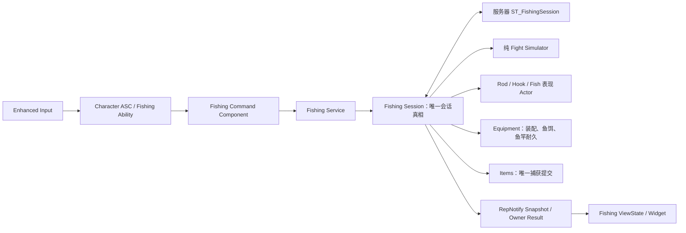

# Catfishing 钓鱼系统可玩竖切迁移设计

- 日期：2026-08-14
- 目标工程：`D:\develop\Catfishing`
- 参考 Demo：`D:\UE5\Fishing_System`
- 文档状态：对话设计已确认，等待书面规格复核

## 1. 目标

本设计把 Demo 中已经验证过的钓鱼规则、算法和表现概念接入 Catfishing 正式框架，但不复制 Demo 的权威框架。

第一轮交付是一个服务器权威、可自动化验证的单人完整竖切：

`放置鱼竿 → 操作鱼竿 → 点击水面抛竿 → 等待 → 试探 → 真咬窗口 → 提竿 → 搏鱼 → 自动拖岸 → 近岸抄鱼 → 个人鱼护恰好增加一条鱼`

同时必须满足：

- 取消、超时、空钩、落水、断杆和依赖失效都产生明确终态。
- 相同请求重放不会重复扣鱼饵、扣耐久或生成鱼。
- 鱼竿是独立 Actor，支持不同功能类型和独立换肤。
- 普通收线与鱼挣扎时收线都会消耗猫和鱼的体力，挣扎状态通过统一系数增加消耗。
- 鱼饵和三轴窝料现在进入正式选择契约，后续增加鱼种和内容时不改写 Session 主流程。
- StateTree、GAS、Actor、Equipment、Items 和 UI 各自只有一类职责，不形成第二份可写真相。

## 2. 已有工程事实

正式工程已经具备以下基础，迁移必须复用：

- `UCatFishingService`：服务器 Fishing 入口。
- `ACatFishingSession`：会话 Actor、公开快照和当前 StateTree 宿主。
- `UCatItemsService::CommitCapture`：捕获实物鱼的唯一首胜事务。
- Character-owned ASC 与 `UCatSurvivalAttributeSet`：持有 `FishingStrength` 和 `FightStamina`。
- `UCatEquipmentComponent` 与装备定义：持有装配和耐久事实。
- `ACatWaterRegion`、`UCatWaterQuerySubsystem` 和共享 `FCatChumVector`。
- Run、Environment、Items、Profile、Collection 和 Online 的正式生命周期边界。

当前不能直接形成玩法闭环的原因：

- Session 阶段缺少抛竿、等待和自动拖岸等公开状态。
- Fishing StateTree 没有事件桥，现有 Wait Task 不会结束。
- Controller 的 Start、Assist、Scoop RPC 丢弃结构化结果。
- 没有正式 Fishing Ability、AbilitySet、GameplayEffect、GameplayTags 或 GameplayCue。
- 没有鱼竿、Hook/Bobber、FishEncounter Actor。
- 鱼在 Session 创建时过早选择，尚未使用抛竿落点、鱼饵和实时窝料。
- Session 快照没有 RepNotify、本地订阅和明确的 Fisher 关联。
- `DefaultGame.ini` 尚未装配运行 Gate、StateTree 和数据资产。
- TestMap 当前使用裸 `GameModeBase`，正式 Fishing 命令会 fail-closed。

### 2.1 当前工作树保护规则

当前工作树包含用户尚未提交的 C++、配置和二进制资产。整个迁移期间执行以下硬规则：

- 禁止对现有改动执行 `reset`、`stash`、`checkout --`、`clean` 或批量覆盖。
- `Framework/Game/CatGameplayTypes.h/.cpp` 中现有 Move、Look、Jump、Sprint、IMC 安装和速度修改逐行保留；Fishing 只做增量接线。
- `UI/CatLocalPlayerUISubsystem.cpp` 中已有的 Widget 创建注释保持原样；Fishing ViewState 优先放入新文件，再以最小增量订阅。Online/Travel Widget 的现有回归不在本次迁移中静默恢复，也不被 Fishing 改动扩大。
- `Config/DefaultEditor.ini` 和 `Config/DefaultEngine.ini` 的现有用户改动不重写。运行设置新增到 `DefaultGame.ini`；TestMap 的 GameMode 由用户在 World Settings 中切换。
- `/Game/Character/BP_CatCharacter`、`/Game/Player/BP_CatFishingController`、`/Game/Game/BP_CatFishingGamemode` 原地复用，不迁移、不重命名、不重建。
- `/Game/Game/BP_TestGamemode` 保留为基础移动测试资产，不 reparent。
- 未跟踪的 `Content/Animalia`、`Content/NaturePackage`、TestMap、Input、Character、Game、Player 资产均视为用户资产；不删除、不批量保存、不自动迁移。

每次修改与 dirty 文件重叠前先读取当前 diff，补丁只触及本功能所需行；构建失败时也不得用还原用户修改的方式修复。

## 3. 范围与非目标

### 3.1 本轮实现

- 单人完整钓鱼流程。
- 为未来多人保留 Session participant、Assist 和首胜抄鱼契约。
- 独立鱼竿 Actor、功能定义与纯表现皮肤定义。
- 服务器抛竿校验和每次抛竿的 Attempt 身份。
- 等待、试探、真咬、提竿、搏鱼、自动拖岸、近岸和终态。
- 鱼饵权重、三轴窝料权重和确定性鱼种选择。
- 纯 C++ 搏鱼模拟器与自动化测试。
- GAS 输入动作层和结果表现入口。
- Session 复制快照、拥有者命令结果和 Fishing ViewState。
- 捕获成功后复用现有 Items 事务，只产生一条实物鱼。

### 3.2 本轮不完整制作

以下内容只保留窄接口，不在第一竖切中扩展为完整玩法：

- 巨鱼多人协作、角色分工和拖尾救援。
- 完整窝料投射物、自然聚鱼、衰减曲线和多河段 WaterBodyGroup。
- 全部鱼种、四种浮漂、全部鱼饵与最终平衡数据。
- 复杂岸线、多覆层河道、深度、流速和 Water Plugin 集成。
- 最终 UI、美术、动画、音效和镜头润色。
- FishActor 自己的 StateTree。未来若需要，它只能产生鱼行为意图，不能结算体力或捕获。
- Replication Graph 专项优化。第一轮 Session 数量上限按 8 个设计，直接全局相关。
- GDD 的“按品质和装备提供不少于两次重试”完整循环、救援后续和剪影资格。本轮保留现有重试/剪影代码与扩展契约，但不把未完成的重试流程伪装成验收通过；第一竖切中的搏鱼失败直接结束本次 Session。
- Demo 的“回收 Hook 后回到 Waiting”循环。本轮采用一次抛竿对应一个 Session：Waiting/Probe 提前提竿为空钩终态，真咬窗口超时为明确终态。该差异是有意的首轮裁剪。
- Demo 允许在 Fighting/AutoHauling 中鱼偶然进入抄网半圆时提前挥网；第一竖切有意收紧为只有公开 Phase=`NearShore` 才能 Scoop。提前反应玩法保留为以后单独规则，不能靠客户端位置偶然命中绕过阶段。
- 活动 Session 中离开鱼竿、他人接管和回来继续。本轮必须先 Cancel 才能 Leave，避免在协作所有权尚未裁决时留下无人操作的权威会话。

## 4. 总体架构与唯一真相



职责固定如下：

| 单元 | 拥有的事实 | 明确禁止 |
|---|---|---|
| `ACatFishingSession` | Session ID、Revision、阶段、结果、鱼体力/意图/线状态、Attempt、参与者、终态缓存 | 不持有猫属性、装备耐久、鱼护内容或 Fish 世界 Transform 的第二份真相 |
| `UCatFishingService` | 创建、查询、提交命令、终止和每位 Fisher 的活动 Session 索引 | 不承担每帧搏鱼和 UI 表现 |
| Fishing StateTree | 服务器长流程拓扑、低频计时与事件驱动转移 | 不直接改 Attribute、Equipment、Items、Profile 或复制状态 |
| GAS | 猫的可取消动作、动作互斥、身体效果和结果演出 | 不拥有 Session 阶段、鱼体力、捕获与鱼竿耐久 |
| Command Component | 客户端/服务器命令传输、RequestId 关联和 owner-only Result | 不作为会话真相，不自行奖励或决定阶段 |
| Equipment | 装备选择、特殊鱼饵库存、鱼竿耐久与活动预留 | 不决定鱼是否捕获 |
| Items | 实物鱼、容器和捕获 Compare-and-Commit | 不决定咬口或搏鱼结果 |
| Rod/Hook/Fish Actor | 世界表现、碰撞采样和服务器位置 | 不发放鱼、不扣属性、不决定终态 |
| UI | 只读显示和输入意图 | 不轮询、不写 Session、不直接调用 Items |

Session 的公开阶段是唯一复制阶段。StateTree 当前活动节点、Ability Tag、AnimBP 状态和 Actor 动画都不能再保存一份可写 `FishingPhase`。

## 5. Session 生命周期

鱼竿放置和瞄准发生在 Session 外。客户端先发送不依赖 SessionId 的 `FCatBeginCastCommand`。服务器完成基础只读校验后，先生成但不公开 SessionId 与 CastAttemptId，再以该 SessionId 原子预留 Equipment，随后用 deferred spawn 完成 `Configure → Spawn Hook → Start StateTree`。只有全部成功后才登记可查询 Session 并向客户端返回启动成功；任何一步失败都释放预留，未公开的 ID 允许作废但不得复用。

公开阶段固定为：

1. `Created`：瞬态初始化，禁止玩家玩法命令。
2. `CastFlight`：Hook/Bobber 在飞行，等待服务器落点或失败事件。
3. `Waiting`：落点合法，尚未选鱼。
4. `Probe`：产生试探信号；进入时进行一次鱼种选择。
5. `TrueBiteWindow`：可合法提竿，内部记录完美响应子窗口。
6. `HookedFight`：鱼已上钩，运行纯搏鱼模拟。
7. `AutoHauling`：鱼体力耗尽后由服务器拖向合法近岸目标。
8. `NearShore`：允许抄网，捕获尚未提交。
9. `Resolved`：Items 捕获提交已成功，终态不可逆。
10. `Terminated`：取消、空钩、超时、落水、断杆、脱钩、局末或依赖失效。

`Resolved` 和 `Terminated` 都是不可逆终态。终态发布后保留一个短复制窗口，再清理 Hook、Fish 和 Session；鱼竿按操作和收杆规则单独存在。

### 5.1 Outcome 与 Phase 分离

`ECatFishingOutcome` 固定包含：

- `None`
- `Caught`
- `EmptyHook`
- `HookWindowExpired`
- `Escaped`
- `RodBroken`
- `CatInWater`
- `Cancelled`
- `Invalidated`

Phase 描述流程位置，Outcome 描述结束原因。UI 和 Montage 不从 `Terminated` 猜结果。

### 5.2 转移规则

| 当前阶段 | 输入结果/事件 | 下一阶段/结果 |
|---|---|---|
| `Created` | StateTree 启动成功 | `CastFlight` |
| `CastFlight` | `CastLanded` | `Waiting` |
| `CastFlight` | `CastFailed` | `Terminated / Invalidated` |
| `Waiting` | `ProbeTriggered` | `Probe` |
| `Probe` | `ProbeCompleted` | `TrueBiteWindow` |
| `Probe` | `EarlyHook` | `Terminated / EmptyHook` |
| `TrueBiteWindow` | `HookAccepted` | `HookedFight` |
| `TrueBiteWindow` | `WindowExpired` | `Terminated / HookWindowExpired` |
| `HookedFight` | `FishStaminaDepleted` | `AutoHauling` |
| `HookedFight` | `CatStaminaDepleted` 或 `CatOverpowered` | `Terminated / CatInWater` |
| `HookedFight` | `RodBroken` | `Terminated / RodBroken` |
| `AutoHauling` | `AutoHaulReachedShore` | `NearShore` |
| `AutoHauling` | `AutoHaulFailed` | `Terminated / Invalidated` |
| `Waiting` | `EarlyHook` | `Terminated / EmptyHook` |
| `Probe` | `FishSelectionFailed` | `Terminated / Invalidated` |
| `NearShore` | Items 捕获提交成功 | Session 同一调用栈直接写 `Resolved / Caught` |
| `HookedFight` 或更晚 | Fisher 主动取消 | `Terminated / Escaped` |
| 其他任意非终态 | `Interrupted` | Session 直接写 `Terminated`，使用事件携带的明确 Outcome |

拒绝的命令不会驱动转移。例如 `NearShore` 的非法抄网只返回失败结果并保持原阶段。

`Resolved` 和 `Terminated` 只能由 Session 的领域终结入口直接写入，StateTree 的 `EnterPhase` 不允许进入终态。原因是 Items、Equipment 或其他不可逆提交成功后，不能再依赖一条可能丢失或配置错误的 StateTree transition 才宣布结束。StateTree 不可用、停止或退出时，Session 仍必须能够 fail-closed 地终结并清理。

上表中的终态行是 Session 直接处理的领域结果，不是 StateTree transition：CastFailed、EarlyHook、FishSelectionFailed、WindowExpired、CatStaminaDepleted、CatOverpowered、RodBroken、AutoHaulFailed、主动 Cancel 和 Interrupted 都由 `HandleDomainEvent` 在同一调用栈进入 `FinalizeSession`。StateTree 只消费 CastLanded、ProbeTriggered、ProbeCompleted、HookAccepted、FishStaminaDepleted 和 AutoHaulReachedShore 这些非终态推进事件；发送失败或树不可用时，Session 直接以 Invalidated 收口。

## 6. 命令、事件与幂等

### 6.1 玩家命令

命令分为鱼竿域、预会话域和 Session 域：

- 鱼竿域：`PlaceRod`、`OperateRod`、`LeaveRod`、`PackRod`、`ChangeRodSkin`。
- 预会话域：`BeginCast`。
- Session 域：`RequestHook`、`SetReeling`、`CancelFishing`、`RequestScoop`。
- 预留域：`ContributeChum`、`AssistFight`、`TailRescue`。

`FCatBeginCastCommand` 不可能携带尚未创建的 Session 身份，固定携带：

- `RequestId`
- `RodActorId`
- `ExpectedEquipmentRevision`
- `ExpectedRodActorRevision`
- 客户端中心准星候选点，仅供一致性诊断

服务器成功结果 `FCatBeginCastResult` 返回新分配的 `FishingSessionId`、`Revision`、`PhaseEpoch` 和 `CastAttemptId`。任一预留、deferred spawn、Hook 创建或 StateTree 启动失败都会释放预留并返回失败，不泄漏半初始化 Session。

创建后的每个离散 Session 命令至少携带：

- `RequestId`
- `FishingSessionId`
- `ExpectedRevision`
- `CastAttemptId`

连续收线命令不使用 ExpectedRevision，只携带独立 RequestId、FishingSessionId、CastAttemptId、ActivationCorrelationId、单调递增的 `InputSequence` 和 `bReeling`。它只校验 Session/Attempt/锁存与 InputSequence；InputSequence 必须大于上次值且增量不超过配置上限，防止恶意大跳号永久压制后续合法输入。服务器身份始终从 RPC 所属 Controller、PlayerState 和当前 Pawn 重建，客户端不能自报 Fisher、装备、属性或容器所有权。

`Revision` 只在阶段、Outcome、选鱼、参与者或其他离散领域提交时递增，作为离散命令的乐观并发版本；鱼体力、bReeling 和张力等 Session 高频采样只递增 `SnapshotSequence`，不能使合法 Press/Release 因网络延迟持续陈旧。Fish 世界位置不进入 Session Snapshot，由 FishEncounter Actor Transform 独立复制。

每一条领域命令边沿都有独立 `RequestId`；同一服务器身份和同一 `RequestId` 只重放该边沿的首次终态结果。旧 Revision、旧 Attempt 和不递增的 InputSequence 返回明确拒绝，不产生副作用。一次 Primary 按下/释放可以另带共同的 `ActivationCorrelationId` 做配对诊断，但它不参与 `RequestId` 幂等键。

Cast、Hook、Reel、Cancel 只接受原 Fisher。`RequestScoop` 是例外：任何通过服务器空间、冷却和鱼护校验的玩家都可以提交，结果通过该请求者自己的 Command Component 返回。

### 6.2 StateTree 事件

所有 Fishing 领域结果使用 Native Gameplay Tag，并携带 SessionId、PhaseEpoch、CastAttemptId、事件时间和必要载荷。`PhaseEpoch` 只在阶段变化或新 Attempt 时递增；鱼体力、参与人数等普通 Snapshot 更新不会让当前阶段的合法 Timer/碰撞事件失效。核心 Tag：

- `Cat.Fishing.Event.CastLanded`
- `Cat.Fishing.Event.CastFailed`
- `Cat.Fishing.Event.ProbeTriggered`
- `Cat.Fishing.Event.ProbeCompleted`
- `Cat.Fishing.Event.FishSelectionFailed`
- `Cat.Fishing.Event.EarlyHook`
- `Cat.Fishing.Event.HookAccepted`
- `Cat.Fishing.Event.WindowExpired`
- `Cat.Fishing.Event.FishStaminaDepleted`
- `Cat.Fishing.Event.CatStaminaDepleted`
- `Cat.Fishing.Event.CatOverpowered`
- `Cat.Fishing.Event.RodBroken`
- `Cat.Fishing.Event.AutoHaulReachedShore`
- `Cat.Fishing.Event.AutoHaulFailed`
- `Cat.Fishing.Event.ScoopCommitted`
- `Cat.Fishing.Event.Interrupted`

命令和外部 Actor 回调都先进入 Session 的 `HandleDomainEvent`，校验 SessionId、Attempt 和阶段，不能直接调用 StateTree 或写阶段。只有第 5.2 节列出的六个非终态推进 Tag 会封装为 `FCatFishingStateTreeEvent` 发送给树；所有终态 Tag 直接调用领域结算，完成后才作为只读观察通知发布。`ScoopCommitted` 同样只是 Caught 已提交后的观察通知，任何通知都不能成为领域终结的前置条件。

### 6.3 迟到回调

所有终态入口共用一个服务器 settlement lock，固定按以下顺序收口：

1. 设置 `bSettlementInProgress`，串行化终态与同帧 Scoop。非 Caught 路径同时设置 `bClosing`；Caught 在 Items 成功前只临时阻止并发结算。
2. 先幂等确认已发生的鱼饵事实，再调用 `CommitFishingRodWear`；RodBroken 改调用 `CommitFishingRodBreak`。这些是 Items 之前最后允许失败的必要领域写入。
3. 任一 Equipment 必要写入失败时设置 `bClosing` 并选择 `Invalidated`，不能发布虚假的 Caught 或 RodBroken。已经提交的事实只允许幂等补完，不回滚。
4. Caught 路径把 `UCatItemsService::CommitCapture` 放在最后，并按结果分类：首次成功，或 `AlreadyResolved` 且携带与本 Session 匹配的有效 `Committed` 捕获事实，都立即设置 `bClosing` 并只允许发布 `Resolved/Caught`；`RevisionConflict`、`CapacityExceeded`、`PermissionDenied`、`InvalidIdentity`、目标容器 `NotFound` 或提交前 `Cancelled` 且没有捕获事实，属于当前抄手局部失败，清除 `bSettlementInProgress`、保持 `NearShore`，刷新容器后用新 RequestId 允许当前或其他合法抄手重试；`CommandsClosed`、`DependencyUnavailable`、`PolicyUndecided`、`InvalidPayload`、`InvalidPhase`，以及没有有效 Committed 的异常 `AlreadyResolved`，属于系统/定义失败，直接以 `Invalidated` 终结。已提交的 RodWear 可幂等复用，Equipment 预留持续持有到真正终态。Items 一旦产生鱼，禁止再降级为 Invalidated。
5. 在同一服务器调用链原子写 Outcome、Phase、Revision 与最终 Snapshot。
6. 若本次已初始化短周期 FightStamina，则同步恢复；若 ASC ActorInfo 暂不可用，则先登记 pending reset。只有无需恢复、恢复成功或 pending 已登记后，才能移除 active-session 索引。
7. 停止 StateTree、服务器 Runner 和 Timer，释放未使用的 Equipment 预留。
8. 取消/结束 Fishing Ability，发送 Gameplay Event/Cue 和请求者 Result；这些表现步骤不能影响终态。
9. 延迟销毁每次会话 Actor。

之后到达的 Timer、碰撞、动画通知、Actor 销毁通知和网络命令只能获得终态重放或陈旧错误，不能重新打开会话。

## 7. GAS 与输入设计

### 7.1 AbilitySet 与输入映射

新增 `UCatAbilitySystemComponent`，替换 Character 当前构造的原生 ASC，但仍由 Character 同时作为 Owner 和 Avatar。它负责：

- InputTag 到 AbilitySpecHandle 的本地路由。
- Pressed、Released、Held Spec 集合。
- 对已激活 Ability 发送 GAS replicated input event。
- Possess/UnPossess 后清空瞬时输入，不清除服务器已授予集合。

新增 `UCatAbilitySet` 与 `FCatGrantedAbilitySetHandles`。每条授予记录包含 Ability 类、动态 Input Tag、等级、激活策略和可选初始 Effect。Character 在服务器完成 ASC ActorInfo 初始化后授予默认集合；Handle 容器负责成组撤销，重新 Possess 不重复授予，Character 销毁才随 ASC 清理。

`UCatAbilitySettings` 增加默认 AbilitySet 和 AbilityInputConfig 软引用，分别供 Character 授予和 PlayerController 输入绑定。新增 `UCatAbilityInputConfig`，复用当前已有资产，不创建第二套 `/Game/Input`：

| Input Action | Input Tag |
|---|---|
| `/Game/Input/InputAction/IA_PutDownFishingRod` | `Cat.Input.Fishing.RodInteract` |
| `/Game/Input/InputAction/IA_LMB` | `Cat.Input.Fishing.Primary` |
| `/Game/Input/InputAction/IA_CancelFishing` | `Cat.Input.Fishing.Cancel` |
| `/Game/Input/InputAction/IA_CatchFish` | `Cat.Input.Fishing.Scoop` |
| `/Game/Input/InputAction/IA_BaitSpot` | `Cat.Input.Fishing.Chum` |

PlayerController 继续安装现有 `/Game/Input/InputContext/IMC_InputContext`。它从 InputConfig 把 `Started` 转给 `AbilityInputTagPressed`，把 `Completed/Canceled` 转给 `AbilityInputTagReleased`；Fishing 按键不再同时绑定直接 RPC。现有 Move、Look、Jump、Run 代码保持原样。`IA_RMB` 第一竖切不绑定，明确保留给后续副操作/镜头模式。

输入集合的唯一帧宿主是本地 `ACatfishingPlayerController::PostProcessInput`：调用 `Super` 后恰好一次执行当前 Pawn ASC 的 `ProcessAbilityInput(DeltaTime, bGamePaused)`。处理结束时清空 Pressed/Released，Held 只在对应 Released 后移除。`OnPossess`、`OnRep_Pawn` 和 Pawn restart 只做幂等 ActorInfo/路由重绑；`OnUnPossess` 清空三组输入、Primary latch 和待发边沿，避免旧 Pawn 输入泄漏或重复绑定。

Primary 的服务器锁存语义固定为：

| 接受 Press 时的权威上下文 | 动作 | Release 语义 |
|---|---|---|
| 已操作 Rod、无 Session | BeginCast | 无持续动作，不发送第二条命令 |
| `Waiting` 或 `Probe` | EarlyHook | 空钩终态，无持续动作 |
| `TrueBiteWindow` | RequestHook | 无持续动作 |
| `HookedFight` | `SetReeling(true)` | 只结束该次已接受的 Reel latch，发送 `SetReeling(false)` |
| 其他阶段 | 拒绝 | Release 无副作用 |

Primary Press/Release 通过同一 PlayerController 可靠命令通道按序发送，共享的只是 `ActivationCorrelationId`，每个边沿各自生成独立 `RequestId`。Release 不等待 Press Result，而是发送通用 `PrimaryReleased`；服务器 Command Component 记录实际接受的 latch、CorrelationId 和 InputSequence。若 Press 接受为 Reel，Release 由服务器依据该 latch 生成 `SetReeling(false)`，只校验当前 Session、Attempt、CorrelationId 和递增 InputSequence，不使用客户端 Press 时的旧 ExpectedRevision。即使 Press/Release 之间阶段变化，Release 也只能结束原先锁存的 Reel，不能根据新阶段误触发另一动作。重复 Release 按自己的 RequestId 幂等，无 latch 时返回无副作用成功。

Local Predicted Ability 只允许本地控制实例为每个输入边沿发出一次领域命令；远端服务器 Ability 实例不重复提交。客户端为各边沿生成独立 RequestId，并在同一次按住周期贯穿 ActivationCorrelationId；Listen Server 本地玩家通过同一 Command Component 直接进入服务器路径一次。

### 7.2 第一批 Ability

- `UCatGA_FishingRodInteract`：放置、操作、离开或收起鱼竿。
- `UCatGA_FishingPrimaryAction`：按当前只读上下文执行抛竿、提竿或按住/释放收线。
- `UCatGA_FishingCancel`：请求完整取消。
- `UCatGA_FishingScoop`：提交抄网请求并等待结果。
- `UCatGA_FishingChum`：本轮接现有聚鱼命令的最小入口，使用服务器解析的当前唯一 WaterRegion；不实现蓄力、投射物和落点表现。
- `UCatGA_FishingOutcomeBase`：服务器结果驱动的演出基类。

玩家输入 Ability 使用 Local Predicted 激活，但领域结果永远由服务器决定。Outcome Ability 使用 Server Initiated，通过 Gameplay Event Tag 激活。

### 7.3 瞄准与点击水面

第一竖切沿用 Demo 的屏幕中心准星，而不是显示鼠标光标：

1. `/Game/Character/BP_CatCharacter` 增加 `CameraBoom` 和 `FollowCamera`，Controller 的现有 Look 输入控制视角。
2. 本地 Primary Press 使用 Viewport 中心反投影产生候选点，只用于即时准星反馈。
3. 服务器从 `PlayerController::GetPlayerViewPoint` 和权威 ControlRotation 重建中心射线，使用 Fishing Trace Channel 与配置的最大 Trace 距离重新命中。
4. 服务器命中点必须满足视角夹角、LOS、射程和唯一 WaterRegion 校验；客户端候选点不能授权命中。

因此“点击水面”表示 LMB 确认准星中心当前指向的水面，不进入 UI cursor 模式。后续若改成鼠标光标反投影，只替换 Target Provider，不修改 BeginCast 命令或 Session。

### 7.4 Tag 边界

建立以下 Tag 根：

- `Cat.Input.Fishing.*`
- `Cat.Ability.Fishing.*`
- `Cat.State.Fishing.Aiming`
- `Cat.State.Fishing.Reeling`
- `Cat.State.Fishing.Scooping`
- `Cat.State.Fishing.RodOperating`
- `Cat.Fishing.Event.*`：StateTree/领域事件
- `Cat.Ability.Event.Fishing.Outcome.*`：GAS 结果事件
- `Cat.GameplayCue.Fishing.*`
- `Cat.Data.Fishing.*`

`Cat.State.Fishing.*` 只表达猫当前动作限制，不能复制 Session Phase。Session 或 StateTree 通过 Gameplay Event 请求结果 Ability；Ability 失败或 Montage 缺失不得回滚已经提交的捕获或耐久。

### 7.5 属性修改

搏鱼时猫体力只能通过原生 `UCatGE_FishingStaminaDelta` 的 SetByCaller 数值修改。禁止 Session 继续调用 `SetNumericAttributeBase`。

第一竖切明确把 `FightStamina` 定义为“每次搏鱼的短周期池”：HookAccepted 的 StateTree 推进到达后，由 `TryEnterHookedFight` 用幂等初始化 GE 设置为 `UCatAbilitySettings::InitialFightStamina`，Session 结束时用恢复 GE 回到同一基线。FishingStrength 不重置。未来 Fatigue/Condition 若要影响初始池，只能替换初始化公式，不能让 Session 保存第二个猫体力。

恢复由服务器在 Session 收口中同步调用，不依赖 Outcome Ability、Montage 或 Cue。`UCatAbilitySystemComponent` 保存 `bPendingFishingStaminaReset`：ActorInfo 有效时立即应用恢复 GE；暂不可用时登记 pending，并在下一次 `InitAbilityActorInfo` 后、任何默认 Ability 激活或 BeginCast readiness 检查之前补偿。Service 只有在恢复已应用或 pending 已可靠登记后才移除 active-session 索引；新 Session 的 readiness 先调用 `EnsureFishingStaminaReadyForNewSession`，不会被上一次耗尽值永久阻塞。

服务器 Runner 按固定步计算，第一竖切每个产生猫体力变化的固定步都立即应用一次 Instant GE，再读取下一步；不做跨微步 GE 合批，保证精确归零时间和胜负不依赖批量频率。未来若性能实测要求合批，必须先引入仅属于 Runner 的 PendingDrain、以 `ASC - PendingDrain` 计算有效体力，并在终态前强制 flush 及补齐等价性测试；该缓冲不能成为第二份持久属性真相。鱼体力由 Session 持有，鱼竿耐久由 Equipment 持有。

## 8. StateTree 设计与编辑器工作

StateTree 是服务器长流程编排器，不是动画状态机，也不是 Ability 的总调度中心。

输入驱动路径：

`Input → Ability → Command → Session 校验 → StateTree Event → 状态转移`

流程驱动演出路径：

`StateTree/Session 结果 → Gameplay Event → Outcome Ability → Montage/Cue`

### 8.1 C++ 节点

正式节点放在 `Fishing/`，至少提供：

- Enter Phase Task：调用 Session 的受限阶段入口。
- Phase Driver Task：启动该阶段的服务器计时/Runner 并保持 Running；退出状态时成对取消。
- Select Fish For Probe Task：建立选择上下文并只选择一次。
- Open True Bite Window Task：只调用 Session 专用 `TryEnterTrueBiteWindow`。该入口先只读校验并计算普通/完美 Deadline，再幂等提交特殊饵，最后一次性写 Deadline、Phase 与 Snapshot；任一步失败都不暴露半开放窗口，直接按结算规则进入 `Invalidated`。
- Hooked Fight Driver Task：EnterState 只调用 Session 专用 `TryEnterHookedFight`。该入口依次复核 Geometry/Attempt 和已选鱼，初始化 FightStamina，冻结普通/完美 FightConfig，求安全初始线长并投影鱼位，deferred spawn/configure FishEncounter，预备固定步 Runner，最后在同一服务器调用中一次性发布 HookedFight 并启动 Runner；任一步失败都销毁半成品 Actor、恢复已初始化体力并直接 `Invalidated`。Task 保持 Running，ExitState 成对停止 Runner，不在 StateTree Tick 中直接算高频逻辑。
- Start Auto Haul Task：计算动态近岸目标并启动 Actor 移动。
- Validate Near Shore Task：通过 Session helper 读取当前 FishEncounter Actor 的服务器 Transform，不使用资产固定世界坐标，也不在 Session 缓存第二份位置。
- Outcome/Phase Condition：只读 Session Snapshot，不保存第二份阶段。

事件只由 StateTree transition 消费；Task 不再维护第二套事件等待状态。Phase Driver Task 可以内部等待 Timer/Runner，但事件到来后由资产 transition 离开当前状态。

### 8.2 `ST_FishingSession` 资产

用户在 C++ 节点成功编译后创建 `/Game/Catfishing/StateTree/ST_FishingSession`，按第 5.2 节拓扑建立：

- Root
  - Active
    - CastFlight
    - Waiting
    - Probe
    - TrueBiteWindow
    - HookedFight
    - AutoHauling
    - NearShore

每个 Active 状态入口调用对应的受限阶段入口，并启动该阶段需要的一个有界执行/等待组合；TrueBiteWindow 必须使用专用 `TryEnterTrueBiteWindow`，HookedFight 必须使用专用 `TryEnterHookedFight`，两者都禁止先跑通用 Enter Phase。转移只消费第 5.2 节明确列出的六个非终态推进事件；终态 Tag 不配置资产 Transition。任何终态由 Session 直接提交并停止树，资产不建立能写 `Resolved` 或 `Terminated` 的 Task。

当前设计文档不是可直接点击的 StateTree 节点清单。C++ 节点 API 编译稳定后，Codex 必须生成 `Docs/Development/FishingEditorRunbook_zh-CN.md`，逐状态列出 Task 顺序、Instance Data 绑定、Event Transition、失败边和截图核对项；该 Runbook 交付前用户不要提前创建正式树。

### 8.3 `ST_RunFlow` 资产

`/Game/Catfishing/StateTree/ST_RunFlow` 继续使用正式工程现有 `FCatRun*` Task/Condition 和事件：

- `Cat.Run.QuotaReached`
- `Cat.Run.QuotaFailed`
- `Cat.Run.AllEligibleReady`
- `Cat.Run.SettlementComplete`

它只负责 Run 的白天、额度、夜晚与结算。Fishing 只读取 `bFishingAllowed`，不得把钓鱼子状态塞进 Run 树。

同一 Editor Runbook 也要提供 `ST_RunFlow` 的逐节点装配表；不能只把四个事件名交给用户自行推导。

## 9. 鱼竿、装备与皮肤

### 9.1 功能定义与表现定义分离

`UCatEquipmentDefinition` 已有 `MaximumRodDurability`。Rod 类别继续扩展：

- 鱼竿强度。
- 最大鱼线长度。
- 基础磨损和高张力磨损参数。
- 权威 `RodTipLocalTransform`、`StandLocalTransform` 和 `GripLocalTransform`。它们属于功能几何，不能随皮肤变化。

Float 类别增加独立字段：最大抛投距离、抛投误差标准差、最大误差半径和咬口信号稳定性。合法抛距取 Rod 最大线长与 Float 最大抛投距离的较小值；两者不是同一个字段。信号稳定性只调节 Hook/Bobber 在 Waiting/Probe 的视觉噪声幅度，不改变服务器真咬概率或窗口。

Bait 类别增加 `BiteRateMultiplier` 和 `MinimumBiteDelayMultiplier`；鱼种倾向仍由 FishDefinition 的 Bait 权重表表达。Chum 继续复用现有三轴 `ChumContribution`。

`FCatEquipmentLoadoutSnapshot` 和权威装配入口增加 `ScoopNetDefinitionId`。抄网是已装备工具，不靠 Ability 名称假定玩家天然持有。

新增 `UCatRodSkinDefinition`，只允许包含：

- 稳定 Skin ID。
- Skeletal/Static Mesh。
- Material Override。
- VFX/SFX 和 Animation Set ID。
- 纯表现 `VisualMeshRelativeTransform` 和 Attachment Socket 映射。
- `CompatibleRodDefinitionIds` 与 `RequiredUnlockId`。

皮肤不包含力量、线长、耐久、命中率、鱼种权重或任何权威 RodTip/Stand/Grip 位置。Rod Actor 的 canonical SceneComponent 从 Rod 功能定义初始化；抛竿原点、线长/张力圆心、操作站位和手部 IK 目标都只读 canonical anchors。Skin Mesh 只能附着/对齐到这些 anchors，Data Validation 可报告视觉 Socket 偏差但不能改服务器几何。

Equipment Snapshot 保存当前 `RodSkinDefinitionId`。`FCatChangeRodSkinCommand` 携带独立 RequestId、RodActorId、SkinId、ExpectedEquipmentRevision 和 ExpectedRodActorRevision；只允许 Owner、Rod 未被操作、无活动 Session/Equipment reservation、Skin 运行就绪、兼容当前 RodDefinition 且服务器 entitlement 含 RequiredUnlockId 时执行。Fishing/Integration 的服务器命令处理器从 Presentation Registry 与 Profile/Prototype entitlement 构造不可由客户端填写的 `FCatValidatedRodSkinSelection`，再让 Equipment 只按稳定 ID 原子更新选择并增加 Revision；Equipment 域不加载或依赖 Mesh/DataAsset。Rod Actor 依据结果复制最终 Skin ID；表现资源加载失败只显示默认外观并报错，不回滚已提交选择，也不改变玩法几何。第一竖切实现 C++ 命令和测试，不制作换肤 UI。

Profile 以后提供持久的 RodSkin entitlement/选择证明；客户端不能自报解锁。Prototype Gate 开启时，只允许 `UCatEquipmentSettings::StarterUnlockedRodSkinIds` 中的皮肤，并用 `StarterRodSkinDefinitionId` 初始化选择，以便测试皮肤确实有生产者。

`Fishing/Presentation/UCatFishingPresentationSettings` 以软类引用配置 Rod、Hook、FishEncounter 的默认 Blueprint Class，并登记 RodSkin Definition。它只解析表现类和资源；服务器生成 Actor 时读取类，但所有判定仍来自 Definition/Session。

### 9.2 `ACatFishingRodActor`

鱼竿 Actor 放在 `Fishing/Actors/`，复制：

- Rod Actor ID。
- Rod Actor Revision。
- Rod Definition ID。
- Rod Skin ID。
- 当前操作 PlayerState。
- 部署状态、破损状态和权威 Transform。

鱼竿 Actor 同时保存部署者 `OwnerPlayerState` 与当前操作人 `OperatorPlayerState`，提供由 Rod 功能定义初始化、皮肤不可修改的 canonical RodTip、Stand、Grip SceneComponent 和交互范围查询，但不持有耐久真相。Equipment 持有正式耐久；Actor 只表现破损结果。

Rod Actor Revision 在完成初始 Configure/部署时设为 1，此后 Operator、部署状态/权威 Transform、SkinId 或 Broken 状态任一权威变化都经单一 `ApplyAuthoritativeRodMutation` 入口递增一次；纯视觉异步加载、插值和材质变化不递增。所有 Rod 域命令与 BeginCast 的结构化结果都返回最新 RodActorRevision 和 EquipmentRevision，拒绝也返回当前双 Revision；`ExpectedRodActorRevision` 因此能拦截换肤、Leave/Operate、破损或重新部署前读取的陈旧命令。

第一竖切限制 `OperatorPlayerState == OwnerPlayerState`，每位玩家最多部署一根鱼竿。其他玩家接管接口返回 NotAuthorized；未来开放接管时再裁决使用谁的 Loadout 和 Equipment，不在当前实现中猜测。

`UCatFishingService` 持有服务器唯一的 `PlayerState → TWeakObjectPtr<ACatFishingRodActor>` 部署 Registry。Place 在生成前查询，成功生成后登记；Pack、Rod EndPlay 和 World teardown 都幂等注销，因此“一人一杆”不依赖遍历世界或客户端引用。

鱼竿可以在同一 Character/Pawn 生命周期内跨多个 Session 复用。断杆后 Actor 保留破损表现、拒绝再次抛竿；收杆、玩家离局或 World teardown 时销毁。第一竖切不让 Rod 跨 Pawn 保留：Owner Character 的 UnPossess/EndPlay 必须先终结活动 Session、完成 Equipment 预留清理，再清 Operator、注销并销毁 Rod，避免 Character-owned Equipment 消失后留下无耐久宿主。未来若要跨 Pawn 保留，必须先把 Equipment 真相迁到稳定宿主或实现显式重绑定，不能仅靠 PlayerState Owner 引用猜测。

Caught、EmptyHook、HookWindowExpired、Cancelled 或 Escaped 后，未破损 Rod 默认保持当前玩家操作，允许下一次抛竿；RodBroken 和 CatInWater 会强制清 Operator 与移动限制。任何 EndPlay/UnPossess 路径都执行同样的幂等清理。

鱼竿放置和操作规则固定为：

- Place：服务器从 Character 前方配置距离向下做 Ground Trace，验证坡度、胶囊净空、非 WaterRegion 和最大放置距离后生成 Rod；成功后自动 Operate。
- Operate：仅 Owner、无当前 Operator、在交互半径内且 Rod 未破损时成功；Character 对齐 Rod Stand Transform，添加 `Cat.State.Fishing.RodOperating` 并阻止 Move/Jump，Look 保留。
- Leave：第一竖切只在没有活动 Session 时允许，清 Operator 和动作限制；活动 Session 必须先 Cancel。
- Pack：仅 Owner、无 Operator、无活动 Session 且在交互半径内允许，销毁 Rod Actor 并释放部署索引。

`IA_PutDownFishingRod` 的上下文是“没有 Rod 则 Place+Operate；有未操作的自有 Rod 且在范围内则 Operate；正在 Operate 且无 Session 则 Leave”。`IA_CancelFishing` 在有 Session 时 Cancel；无 Session 但正在 Operate 时 Leave；无 Session、未操作且靠近自有 Rod 时 Pack。

### 9.3 Equipment 原子使用协议

Equipment 新增单个原子入口 `BeginFishingUse(SessionId, RodId, BaitId, FloatId, ExpectedRevision)`。SessionId 由 Service 在基础校验后先生成但尚未公开。该入口在一次校验中同时确认并预留 Rod、Float 和一份特殊鱼饵，返回 `FCatFishingUseReservationResult`。任一字段失败都不留下半预留。

活动预留阻止换装、维修、换肤和第二个 Session 使用同一鱼竿。后续入口固定为：

- `CommitFishingBait(SessionId)`：TrueBiteWindow 入口提交一次特殊饵。
- `SetAccumulatedFishingRodWear(SessionId, WearSequence, AbsoluteTotal)`：Session 每个固定步提交单调不减的绝对累计值；重复的同 Sequence/同值成功重放，低 Sequence 忽略，跳号或同 Sequence 不同值拒绝。它只更新 Equipment 私有预留记录，不改变公开 Revision。
- `CommitFishingRodWear(SessionId)`：终态前幂等应用累计磨损并更新公开 Revision。
- `CommitFishingRodBreak(SessionId)`：力量边界或磨损耗尽触发时，幂等把正式耐久提交为 0；它覆盖普通 Wear Commit，Actor 只能在该调用成功后显示 Broken。
- `ReleaseFishingUse(SessionId)`：释放未提交鱼饵和占用；已提交事实不回滚。

Begin/CommitBait/CommitWear/CommitBreak/Release 的幂等键使用 `SessionId + OperationKind`；高频磨损更新单独使用 `SessionId + WearSequence`，不能套用终态 OperationKind 键。不再引入未定义的 SettlementId。`CommitFishingRodWear` 与 `CommitFishingRodBreak` 都不自动释放活动预留，释放只发生在 Session 终态收口。

现有 `CommitFishingFailure`、`FCatFishingFailureBudgetTask` 和 `CommitFailureBudgetFromStateTree` 不进入新 StateTree 路径，保留为兼容代码并标记弃用。新模型中“真咬后的鱼饵成本”和“实际发生的鱼竿磨损”是两种使用事实，不再额外执行旧的随机失败惩罚，避免真咬扣饵后终态再次丢饵或伤竿。

## 10. 抛竿、水域与 Actor 生命周期

### 10.1 抛竿权威

客户端只提交准星候选点。服务器按第 7.3 节重建视线，再验证：

- 当前 Run 允许钓鱼。
- 玩家正在操作合法、未破损、未占用鱼竿。
- Loadout 和装备 Revision 与服务器一致。
- 权威命中点是有限坐标且没有被墙体遮挡。
- 命中点在 Rod 最大线长与 Float 最大抛距的共同范围内。
- 命中点唯一命中启用的 `ACatWaterRegion`。

第一竖切复用 WaterRegion 的 prototype bounds。所有几何调用经统一 Water Target Query 接缝完成，后续可以替换为旋转水域、岸线和 WaterBodyGroup，而不修改 Ability、Session 或 StateTree 命令。

服务器抛竿算法固定为：

1. 用服务器预分配的 `CastAttemptId + StableNetId + EquipmentRevision + ServerSecretSalt` 建立局部随机流；客户端生成的 RequestId 只用于幂等缓存，不能影响误差采样。服务器盐只存在本次进程权威内存，不复制给客户端。
2. 用 Box-Muller 生成二维高斯误差，标准差和最大半径来自 Float。
3. 误差后的点必须仍在同一 WaterRegion、共同射程和 LOS 约束内；失败时最多进行 6 次半径折半重试，仍失败则拒绝本次 BeginCast，不跨水域兜底。
4. `RangeAlpha = clamp(Distance / MaximumLegalRange, 0, 1)`，飞行时间按 `sqrt(RangeAlpha)` 在配置的最短/最长飞行时间间插值。
5. 用 `V0 = (Target - Origin - 0.5 * Gravity * T²) / T` 反解初速度。
6. Hook 的碰撞落地与飞行超时共用一个 `FinalizeCastLandingOnce(SessionId, CastAttemptId)` 入口；第二个回调只能获得首次结果。

Rod 最大线长继续约束搏鱼可活动半径，Float 最大抛距只约束抛投。二者不能合并成一个“范围”字段。

### 10.2 Actor

- `ACatFishingHookActor`：每次 Session 一个；包含 Hook、Bobber 和 Bait 表现；携带 SessionId 与 CastAttemptId；只报告落点或失败。
- `ACatFishEncounterActor`：提竿成功后生成；其服务器 Transform 是鱼世界位置的唯一真相并由 Actor movement replication/插值复制，同时复制当前运动意图、当前线长和 AutoHaul 表现；不持有鱼体力、捕获或终态。
- `UCatFishingLineComponent`：纯表现线段；读取 RodTip、Hook/Fish 位置，不参与判定。

生命周期：

1. 部署鱼竿 Actor。
2. 接受 BeginCast 后在 Rod Transform deferred spawn Session，设置 Fisher Controller 为 Owner、启用全局相关，再配置并创建 Hook Actor。
3. Hook 落水后进入 Waiting。
4. HookAccepted 推进事件到达后，由 `TryEnterHookedFight` deferred spawn/configure FishEncounter；全部初始化成功才公开 HookedFight。
5. Fish stamina 归零后进入 AutoHauling。
6. 到达 NearShore 后等待 Scoop。
7. 终态复制窗口结束后销毁 Hook 和 Fish；鱼竿保留供下一次使用。

## 11. 数据冻结、鱼饵与窝料选择

### 11.1 Cast Attempt Snapshot

服务器接受抛竿时冻结 `FCatFishingAttemptSnapshot`：

- RequestId、FishingSessionId、CastAttemptId。
- Fisher PlayerState 和 Rod Actor 引用。
- Rod、Float、Bait 的稳定 Definition ID、Equipment reservation Revision 与 Rod Actor Revision。
- 服务器修正后的落点。
- WaterRegion ID 与 `GeometryRevision`。
- 服务器随机种子。

从接受抛竿到 Session 结束，禁止修改本次 Rod、Float、Bait 和 Skin。

WaterRegion 拆分两个版本：

- `GeometryRevision`：关卡形状、启停和岸线规则；Attempt 锁定它，任何非终态阶段检测到几何变化都使本次会话失效。
- `AggregationRevision`：ChumPool 每次提交递增；聚鱼命令只比较它，Waiting/Probe 可以读取最新版。

`FCatWaterRegionSnapshot` 同时携带 RegionId、GeometryRevision、AggregationRevision、prototype bounds 和 ChumPool。`FCatContributeChumCommand` 固定携带 RegionId、ExpectedAggregationRevision 与 Chum Definition/数量；结构化 Result 返回最新 AggregationRevision 和 ChumPool。旧 `ExpectedRegionRevision` 改名迁移为 `ExpectedGeometryRevision`，旧单一 `RegionRevision` 不再出现在聚鱼 API。

现有编辑器 `RegionRevision` 迁移为 GeometryRevision 语义；`ContributeAggregation` 只增加 AggregationRevision，不再增加几何版本。Attempt 从接受抛竿到终态始终锁定 GeometryRevision：Cast 复核/落地、Waiting/Probe 的阶段驱动、HookedFight Motion Solver、AutoHaul、NearShore 验证和每次 Scoop 都必须在读取几何前比较它，失配即 `Invalidated`；AggregationRevision 的变化永不使会话失效。这样 Waiting 补窝不会让同一 Session 的搏鱼或拖岸错误失效。

### 11.2 Waiting 咬口调度

Waiting 使用服务器低频 Timer，不依赖帧率：

```text
Lambda = RegionBaseBiteRate
       * BaitBiteRateMultiplier
       * ChumBiteRateMultiplier

P(本次间隔至少一次咬口) = 1 - exp(-Lambda * DeltaSeconds)
```

- `MinimumBiteDelay` 之前概率固定为 0。
- 达到 `MaximumBiteDelay` 时强制发送 `ProbeTriggered`，保证竖切有界完成。
- 特殊/普通 Bait 可以提供 BiteRate 和 MinimumDelay 倍率。
- `ChumBiteRateMultiplier = 1 + MaxChumBiteRateBonus * (1 - exp(-TotalChum / ChumAmountForStrongEffect))`。
- Timer 间隔改变不得改变长期事件率；随机流只属于本次 Session。
- Timer 退出 Waiting 或 Session 终结时必须取消。

窝料总量影响速度，三轴方向影响鱼种组成。二者使用同一最新 ChumPool，但公式职责分开。
`RegionBaseBiteRate` 属于 WaterRegion；其余全局咬口倍率和等待边界属于 `UCatFishingSettings`；Bait 自身倍率属于 `UCatEquipmentDefinition`。

### 11.3 Probe 时选择鱼

Waiting 阶段不选择鱼。进入 Probe 时：

1. 使用冻结的 Region、Bait 和参与能力。
2. 重新读取当时最新的 ChumPool、Run 时间和 Environment 天气。
3. 过滤未启用、数据不完整、Region/时间/天气不匹配或单人能力不可达的鱼种。
4. 使用服务器种子进行一次确定性加权选择。
5. 选择结果在 Session 内冻结，不因后续换天气或继续投窝而变化。
6. FishDefinitionId 在 HookAccepted 前保持私有；上钩后才进入公共 Snapshot。

这样允许其他玩家在 Waiting 期间补窝，又不会让鱼在 Probe 后反复重抽。

选择器的唯一输入 DTO 为 `FCatFishSelectionContext`：RegionId、GeometryRevision、AggregationRevision、Run 时间、天气、冻结 BaitId、最新 ChumPool、当前可参与人数/力量/体力和服务器 Seed。选择器只返回 DefinitionId、抽取重量和诊断权重，不写 Session、Equipment 或 WaterRegion。

鱼表为空、无合法候选或总权重不为正时发送 `FishSelectionFailed`，释放未提交特殊饵并以 `Invalidated` 终结；不使用测试鱼兜底。

### 11.4 权重公式

`UCatFishDefinition` 增加：

- `FCatChumVector ChumFlavorPreference`
- 按 Bait Definition ID 配置的权重倍率表

现有 `FCatChumVector` 三轴字段增加编辑器可编辑元数据，使 Equipment 的 ChumContribution 和 Fish 的 ChumFlavorPreference 能在 DataAsset 中实际填写；运行写入仍只由服务器命令完成。

现有 `PreferredSpecialBaitIds` 迁移为显式倍率 `> 1` 的兼容数据；运行选择器只消费最终倍率表，未列出的 Bait 为 `1.0`，不再同时维护“偏好数组”和“倍率表”两种判断。

对非负三轴向量计算：

```text
FlavorMatch = clamp(dot(normalize(ChumPool), normalize(FishPreference)), 0, 1)
ChumIntensity = 1 - exp(-sum(ChumPool) / ChumAmountForStrongEffect)
ChumMultiplier = 1 + MaxChumBonus * ChumIntensity * FlavorMatch
FinalWeight = SpawnWeight * BaitMultiplier * ChumMultiplier
```

零 ChumPool、零偏好或未配置鱼饵倍率都返回中性倍率 `1.0`。所有倍率必须有限且非负。候选过滤发生在加权之前，零权重候选不参与抽取。

`ChumAmountForStrongEffect` 是权重饱和尺度，不是时间衰减常数。真正的窝料时间衰减属于后续 Aggregation 扩展，不能复用这个参数名。
`MaxChumBonus` 与 `ChumAmountForStrongEffect` 由 `UCatFishingSettings` 集中配置，鱼种只保存自己的偏好向量和 Bait 倍率。

### 11.5 完美提竿与 Personality

`Data/` 下新增 `UCatBitePersonalityDefinition` 与 `UCatFightPersonalityDefinition`。前者由 `BitePersonalityId` 查询，提供 Probe 时长和普通响应窗口；后者由 `FightPersonalityId` 查询，提供 Calm/Inward 与 StrugglingOutward 的确定性持续区间、移动速度和 `StruggleDrainMultiplier`。两个 Catalog 都由 Fishing Settings 以软引用清单配置，缺定义时鱼表不具备运行资格。

TrueBiteWindow 的最前 `PerfectHookWindowSeconds` 是完美子窗口。完美命中只修改本次 FightConfig：

- `CurrentFishStrength *= PerfectFishStrengthMultiplier`
- `CurrentFishStamina *= PerfectFishStaminaMultiplier`
- `InitialLineLength *= PerfectInitialLineLengthMultiplier`

三个倍率都必须位于 `(0, 1]`。它不直接捕获、不回写 FishDefinition，也不影响下一次 Session。

初始线长奖励必须经过与 Motion Solver 相同的几何安全步骤：先由 RodTip 与冻结 WaterRegion bounds 求 `MinimumReachableLineLength`，再把目标线长夹到 `[MinimumReachableLineLength + GeometryTolerance, RodMaximumLineLength]`，并在 `TryEnterHookedFight` 的同一提交中把鱼位置投影到 `bounds ∩ 当前线圆盘`。没有合法交集时拒绝公开 HookedFight 并 `Invalidated`，不能等首个固定步再瞬移或失败。这是对 Demo 固定拉近 180cm 的有意替代；倍率只改变奖励表达，不删除其“先求最小可达长度再投影”的安全算法。

### 11.6 特殊鱼饵事务

- 普通饵无限使用，不建立库存事务。
- 特殊饵在服务器接受抛竿时预留一份。
- StateTree 只能调用 Session 的 `TryEnterTrueBiteWindow`；该入口先只读校验/计算 Deadline，再幂等 `CommitFishingBait`，最后一次性发布 Deadline 与 `TrueBiteWindow` Phase/Snapshot。提交或发布失败时不允许出现可观察窗口，直接进入 `Invalidated`；若鱼饵已经成功提交，该事实不回滚。
- Cast 失败、Waiting 取消或 Waiting/Probe 提前提竿产生 EmptyHook 时释放预留，不消耗。
- 真咬后无论成功提竿、窗口超时或玩家放弃，都不能返还已经提交的特殊饵。

## 12. 搏鱼规则与资源所有权

### 12.1 纯模拟器

`Fishing/Simulation/FCatFishingFightSimulator` 不依赖 Actor、World、Timer、网络、GAS 或随机全局状态。每个固定步只接收不可变输入并返回：

- 猫体力减少量。
- 鱼体力减少量。
- 鱼竿磨损增量。
- 本步最先发生的终止事件和精确时间比例。

鱼位置不由资源模拟器计算。`FCatFishFightMotionSolver` 是无状态计算器，单独处理 WaterRegion AABB、RodTip、当前 Actor Transform、当前线长、鱼意图和目标速度，只返回 `CandidateWorldPosition`、是否到最大线长和 TensionAlpha；Runner 校验后写回 FishEncounter Actor，写回后的 Actor Transform 才是权威位置。服务器 Runner 以相同固定步先求运动/张力，再把资源输入交给资源模拟器。StateTree 只负责启动、停止和等待结果事件。

### 12.2 用户确认的双向体力规则

只要玩家正在收线，猫和鱼都减少体力：

```text
K = StruggleDrainMultiplier，鱼处于 StrugglingOutward 时
K = 1.0，鱼处于 CalmOrInward 时

CatDrain  = BaseCatDrainPerSecond  * K * DeltaSeconds
FishDrain = BaseFishDrainPerSecond * K * DeltaSeconds
```

约束：

- `StruggleDrainMultiplier >= 1.0`。
- 猫和鱼的基础消耗率独立配置，只共享状态系数。
- 不收线时本公式产生零消耗；未来若增加休息恢复，必须通过独立 GAS Effect，不混入收线公式。
- 同一固定步内按精确到达零点的时间判断先后。
- 完全同一时刻沿用 Demo 已验证顺序：`FishStaminaDepleted > CatStaminaDepleted > RodBroken`，保证只发布一个资源结果；其中 FishStaminaDepleted 是推进到 AutoHauling 的非终态事件。选中优先结果后，非获胜资源最多扣到配置的 `MinimumPositiveResource`，避免同一 Snapshot 同时声称第二个未发布的耗尽事实。

这是对 Demo 的一项明确规则覆盖：Demo 的 Inward Pull 不消耗体力；正式规则改为 Calm/Inward Pull 也按基础速率消耗双方。Demo 搏鱼测试必须先改期望再迁入，不能原样宣称通过。

### 12.3 力量、线长、张力与磨损

冻结符号：

- `X = Cat FishingStrength`
- `Y = Rod Strength`
- `Z = Current Fish Strength`

当鱼为 `StrugglingOutward` 且玩家收线时，先沿用 Demo 的力量边界：

```text
Y <= X 或 Y <= Z        → RodBroken
否则 X <= Z             → CatOverpowered / CatInWater
否则 X >= 2 * Z         → FishStaminaDepleted / AutoHauling
否则                     → 进入双向体力消耗，K = StruggleDrainMultiplier
```

当鱼为 `CalmOrInward` 且玩家收线时，不触发上述立即力量终态，只执行 `K=1` 的双向消耗并按 ReelInSpeed 缩短当前线长。

这些力量边界首先是 Simulator 的“结果提案”，提交给 Session `HandleDomainEvent` 后必须在同一次权威调用中同步资源真相：`Y <= X || Y <= Z` 的终态处理先走 `CommitFishingRodBreak` 把 Equipment 正式耐久置 0，再直接 Finalize RodBroken，最后才通知 Actor/观察者；`X >= 2Z` 先把 Session 当前鱼体力置 0，再把非终态推进事件送给 StateTree 进入 AutoHauling。写入或非终态事件投递失败按第 6.3 节转为 Invalidated，绝不允许 Actor、Snapshot 与正式资源互相矛盾。

运动约束固定为：

- 鱼合法位置属于 `WaterRegion prototype AABB ∩ 以 RodTip 为圆心、CurrentLineLength 为半径的圆盘`。
- 不收线时允许按 LineReleaseSpeed 增长 CurrentLineLength，但不超过 Rod MaximumLineLength。
- 收线时按 ReelInSpeed 缩短 CurrentLineLength，但不小于配置的最小线长。
- Motion Solver 每步从 FishEncounter Actor 当前服务器 Transform 读取起点，把候选位置夹回 WaterRegion，再由 Runner 唯一一次写回 Actor Transform；Session 不缓存可写位置。无法形成非空交集或 Actor 丢失时返回 `Invalidated`，不让 Actor 自行判逃脱或结算。
- `TensionAlpha = clamp(Distance(RodTip, Fish) / CurrentLineLength, 0, 1)`。
- StrugglingOutward 且达到最大线长时，即使玩家松手，也只对触边后的精确时间累计 `MaxLineRodWearPerSecond`。
- StrugglingOutward 收线的严格僵持区间按 `HighTensionRodWearPerSecond * StruggleDrainMultiplier` 累计磨损；Calm/Inward 默认不磨损鱼竿。
- 鱼竿磨损用 `WearSequence + AbsoluteTotal` 写入 Equipment 预留；累计可用耐久归零时走同一个 `CommitFishingRodBreak` 入口产生 RodBroken。

主动取消在 HookAccepted 之后产生 `Escaped`；Actor 丢失、几何无解或依赖失效产生 `Invalidated`。完整 GDD RetryBudget 尚未接入，因此第一竖切不把一次 Escaped 自动返回搏鱼。

### 12.4 真相位置

- 猫 `FishingStrength`、当前 `FightStamina`：Character ASC。
- 鱼力量与剩余体力：FishDefinition 初值加 Session runtime。
- 鱼世界位置：FishEncounter Actor 的服务器 Transform；Session 仅持 Actor 引用并通过只读 helper 采样。
- 鱼竿强度和当前耐久：Equipment。
- Fight Simulator：无状态计算器，不长期持有任一资源。

HookAccepted 时冻结本次计算参数和初始读数。每个服务器步重新读取 ASC 当前体力、计算 Delta，并通过 SetByCaller GE 应用；鱼 Delta 写入 Session；鱼竿磨损累计到预留事务。鱼的意图由冻结 Fight Personality 和服务器随机流产生，Fish Actor 只表现该意图。

## 13. AutoHaul、NearShore 与捕获

鱼体力归零不会直接捕获，而是进入 `AutoHauling`：

1. Environment 的 prototype Shore Query 把 Fisher/RodStand 的 XY 投影到 AABB 四条边，选择最近边界点作为 ShorePoint。
2. WaterDirection 从该边界指向 AABB 中心；WaterSurfaceZ 固定为 `WorldCenter.Z + HalfExtent.Z`，关卡必须让 AABB 顶面贴合水面。
3. NearShoreTarget 为 `ShorePoint + WaterDirection * NearShoreWaterInset`，并收紧到 AABB 内部容差。
4. FishEncounter Actor 以服务器 AutoHaulSpeed 向目标移动，每步重新夹回 AABB 内部。
5. 到达容差范围后发送 `AutoHaulReachedShore`。
6. 求解失败、超时或 GeometryRevision 失效时进入 `Invalidated`；AggregationRevision 变化不影响拖岸。

`RequestScoop` 的客户端候选来自已复制 Session：只看 NearShore、在本地获取半径内的对象，按平面距离后 SessionId 稳定排序，并发送首个候选的 SessionId、Revision 与 CastAttemptId。服务器不信任该选择，重新查询所有活跃 NearShore Session，用同样的距离/SessionId 排序和当前 GeometryRevision 验证；候选已变化时返回 StaleTarget 及当前建议 SessionId，不把一次按键应用到另一个鱼。

服务器先做挥网获取门槛：候选存在、NearShore、抄手身份/Pawn 有效、尚未处于个人 Scoop 冷却、装备运行就绪且位于 `ScoopAcquireRadius`。门槛失败不启动冷却。全部旧状态检查通过后，才把新 Deadline 写入冷却并视为一次真实挥网；之后无论精确几何失败、Items 提交竞争失败还是成功捕获都消费这次冷却，重复 RequestId 只重放结果、不重复延长冷却。

真实挥网随后进行只读预检：

- Session Phase 与 FishEncounter Actor 的权威服务器 Transform。
- 鱼位于 ShorePoint 朝水侧半圆：`dot(Fish-ShorePoint, WaterDirection) >= 0`，并在 NearShoreRadius 内。
- 抄手到鱼的平面距离、高差与配置 Reach 合法。
- 抄手朝向鱼的点积不小于 `cos(ScoopHalfAngleDegrees)`；默认完整锥角为 120°，即 HalfAngle 60°。
- 从抄手胸口/相机到鱼的 Visibility Trace 无阻挡；忽略抄手自身、Rod 和 Hook，命中 Fish 视为可见。
- 抄手当前 Equipment Snapshot 含运行就绪的 ScoopNet Definition。
- 服务器现场读取抄手个人鱼护当前 Revision 和容量，不接受客户端自报 Guard Revision。

预检成功后进入第 6.3 节 settlement lock：先幂等确认本次鱼饵事实，再提交 Fisher 的 `CommitFishingRodWear`。Equipment 失败则直接 Invalidated 且不调用 Items；成功后才把现有 `UCatItemsService::CommitCapture` 作为最后一个可能生成实物鱼的写入。

只有 `CommitCapture` 成功后才能：

- 设置 `Outcome=Caught`。
- 进入 `Resolved`。
- 发布 `ScoopCommitted` 观察通知。
- 触发上鱼 Outcome Ability、UI 和图鉴后续消费者。

这里的顺序是：Equipment 事实先完成，Items 最后提交；Items 首次成功或返回匹配的既有 Committed 后，Session 在同一服务器调用栈直接设置 Outcome/Resolved，再把 `ScoopCommitted` 当观察通知发送，不等待 StateTree 转移，也不允许任何后续失败把 Caught 降级。只有第 6.3 节列出的抄手局部错误会保持 NearShore 并在冷却结束后用新 RequestId 重试；服务关闭、定义/依赖错误和异常空 AlreadyResolved 必须 Invalidated，不能永久占用 Session 和 Equipment 预留。

Collection/Profile 等后续消费者只接收不可变 `FCatCaptureCommittedResult` 并按 CaptureRequestId 幂等处理；暂时失败进入各自的重试/诊断队列，不是 Caught 的必要写入，不能回滚实物鱼或 Session 终态。

同一 FishingSessionId 只能产生一条鱼。双客户端同帧抄鱼时，服务器首个成功 Compare-and-Commit 是唯一胜者。

## 14. 复制、结果与 UI

### 14.1 公开 Snapshot

`ACatFishingSession` 使用 `ReplicatedUsing` 的公开 Snapshot，至少包含：

- SessionId、Revision、SnapshotSequence、PhaseEpoch、CastAttemptId、Phase、Outcome。
- 阶段开始和窗口结束服务器时间。
- Fisher PlayerState。
- Rod、Hook、Fish Actor 引用。
- 上钩后公开的 FishDefinitionId。
- 参与者数量。
- 归一化鱼体力。
- `bReeling` 和鱼运动意图等必要表现状态。

短生命周期 Session 设置全局相关；Rod、Hook 和 Fish 使用空间相关与插值。Session 可以设置 Fisher Controller 为 Owner，但每位请求者的私有结果都通过其 PlayerController 上的 `UCatFishingCommandComponent` 可靠 Client RPC 或有界结果流投递。非 Fisher 的 Scoop/Assist 也因此能收到自己的结果，私有错误不进入公共 Snapshot。持续 Reel 只复制节流后的公开状态并递增 SnapshotSequence，不为每个微步发送可靠回执，也不递增离散 Revision。

### 14.2 结构化错误

新增 Fishing 专用 `ECatFishingCommandError`，不继续膨胀通用 Domain Error。拒绝原因至少覆盖：

- 功能或 Run 关闭。
- Pawn、ASC、装备、StateTree 或 Water 依赖不可用。
- 没有鱼竿、鱼竿占用、破损或装备 Revision 冲突。
- 水面目标非法、超距、未命中或命中歧义。
- 已有活动 Session、Session 不存在，或原 Fisher 专属命令的发送者不是 Fisher。
- Revision、CastAttempt 或 InputSequence 陈旧。
- 当前阶段不接受命令或窗口已关闭。
- 未到 NearShore、Scoop 候选已变化、抄网几何失败、冷却中或鱼护容量不足。
- 捕获已由其他请求提交。

拒绝必须返回 RequestId、SessionId、服务器当前 Revision、SnapshotSequence、PhaseEpoch、CastAttemptId 和明确错误枚举；Scoop 的 StaleTarget 另返回当前建议 SessionId。UI 不解析日志字符串。Scoop 不使用“不是 Session 拥有者”拒绝，改做抄手自身的空间、冷却和鱼护校验。

### 14.3 ViewState

新增 `FCatFishingViewState`，由 `UCatLocalPlayerUISubsystem` 订阅并组合：

- 当前是否正在操作鱼竿。
- Phase、Outcome 和剩余窗口时间。
- 是否可以抛竿、提竿、收线、取消或抄网。
- 猫体力、鱼体力、鱼竿耐久的归一化值。
- 最近一次结构化命令结果和本地化错误键。

Widget 不 Tick 轮询领域对象；刷新来自 Snapshot RepNotify、ASC 属性委托、Equipment Revision、Command Result 和 Ability/Cue 事件。窗口倒计时复制服务器 Deadline，Widget 只在窗口显示期间使用本地表现 Timer 和同步 ServerTime 计算剩余时间，不查询或写入 Session。

## 15. 演出和 Montage

StateTree/Session 决定事实，Ability 和 Cue 负责演出：

- `CatInWater`：先确定 Outcome，再触发落水 Ability；Condition 域应用 Wet 等身体后果。
- `RodBroken`：先幂等提交耐久并设置 Rod Actor Broken，再触发断杆 Ability/Cue。
- `Caught`：先完成 Items 捕获，再触发上鱼 Ability/Cue。
- `EmptyHook`、`HookWindowExpired`、`Escaped`：先发布终态，再播放对应反馈。

只有当流程确实依赖角色动作完成时，StateTree 才等待服务器 Ability 的完成事件，并且必须有超时。Montage、AnimNotify 或 Cue 不能成为捕获、扣饵或扣耐久的提交点。

## 16. 配置与资产路径

正式资产统一放在 `/Game/Catfishing`，避免覆盖现有 `/Game/Input`：

- `/Game/Catfishing/StateTree/ST_RunFlow`
- `/Game/Catfishing/StateTree/ST_FishingSession`
- `/Game/Catfishing/Data/Ability/DA_AbilitySet_Fishing`
- `/Game/Catfishing/Data/Ability/DA_AbilityInputConfig_Fishing`
- `/Game/Catfishing/Data/Fish/DA_Fish_Test`
- `/Game/Catfishing/Data/Fish/DA_BitePersonality_Test`
- `/Game/Catfishing/Data/Fish/DA_FightPersonality_Test`
- `/Game/Catfishing/Data/Equipment/DA_Rod_Test`
- `/Game/Catfishing/Data/Equipment/DA_RodSkin_Test`
- `/Game/Catfishing/Data/Equipment/DA_Float_Test`
- `/Game/Catfishing/Data/Equipment/DA_Bait_Test`
- `/Game/Catfishing/Data/Equipment/DA_Chum_Test`，父类仍为 `UCatEquipmentDefinition`、Kind=`Chum`
- `/Game/Catfishing/Data/Equipment/DA_ScoopNet_Test`
- `/Game/Catfishing/Blueprints/Fishing/BP_FishingRod_Test`
- `/Game/Catfishing/Blueprints/Fishing/BP_FishingHook_Test`
- `/Game/Catfishing/Blueprints/Fishing/BP_FishEncounter_Test`
- `/Game/Catfishing/Abilities/GA_FishingOutcome_Caught`
- `/Game/Catfishing/Abilities/GA_FishingOutcome_CatInWater`
- `/Game/Catfishing/Abilities/GA_FishingOutcome_RodBroken`
- `/Game/Catfishing/Abilities/GA_FishingOutcome_EmptyHook`
- `/Game/Catfishing/Abilities/GA_FishingOutcome_Escaped`
- `/Game/Catfishing/UI/WBP_FishingHUD`
- `/Game/Catfishing/GameplayCues/GCN_Fishing_*`

以下现有资产原地复用：

- `/Game/Input/InputContext/IMC_InputContext` 与第 7.1 节五个 Fishing IA。
- `/Game/Character/BP_CatCharacter`，只增量添加 CameraBoom/FollowCamera 和表现接线。
- `/Game/Player/BP_CatFishingController`，保留现有 Move/Look/Jump/Run 属性。
- `/Game/Game/BP_CatFishingGamemode`，作为 TestMap 最终正式 GameMode。
- `/Game/Game/BP_TestGamemode` 保持不变，仅用于基础移动冒烟。

`UCatGE_FishingStaminaDelta`、FightStamina 初始化/恢复 Effect 使用原生 C++ 类，不要求用户再创建 GE Blueprint。

`HookWindowExpired` 第一竖切复用 EmptyHook 的回收演出但保留独立 Outcome/UI 文案；`Cancelled` 使用当前动作的取消段，`Invalidated` 只做安全收口和结构化提示，不强制创建独立 Montage。

`DefaultGame.ini` 按 B/C/D Editor Checkpoint 增量装配，只在对应资产存在并通过校验后写入该系统配置：

- Run、Environment、Ability、Fishing、Items Gate。
- RunFlow 和 FishingSession StateTree 软引用。
- 初始 FishingStrength 与 FightStamina 正值。
- FishCatalog 和 Equipment Definitions。
- Bite/Fight Personality Catalog。
- Fishing Presentation Settings 中的 Rod/Hook/Fish Actor Class 和 RodSkin Catalog。
- Fishing 咬口率、最短/最大等待、普通/完美窗口、固定步与 MinimumPositiveResource、抛竿、线长、AutoHaul、NearShore、Scoop 和终态复制窗口参数。

为了让空 Equipment 的新 Character 能进入第一竖切，`UCatEquipmentSettings` 增加显式 `bEnablePrototypeStarterLoadout`、Starter Rod/Bait/Float/ScoopNet ID、`StarterRodSkinDefinitionId`、`StarterUnlockedRodSkinIds`，以及 `StarterConsumables` 映射（DefinitionId → Quantity）。Starter Skin 必须出现在解锁清单且兼容 Starter Rod；测试配置必须给特殊 `DA_Bait_Test` 正数量，并可给 `DA_Chum_Test` 正数量；普通无限饵不进入该映射。Character authority 初始化时调用 Equipment-owned bootstrap 一次；正式 Profile Loadout 接入后关闭该 Gate。`UCatAbilitySettings::DefaultAbilitySet` 同样是正式授予入口，不由 GameMode 或蓝图直接 GiveAbility。

任何缺失或未启用定义都保持 fail-closed，不以测试默认值伪造成功。

## 17. 实施顺序

### 阶段 A：基线和契约

- 记录并保护当前 dirty worktree。
- 建立 Native Tags、Outcome、命令、结果、Attempt Snapshot 和公开 Snapshot。
- 增加 Command Component、owner-only Result 与 Session 查询。
- 拆分 Water GeometryRevision/AggregationRevision，建立 Equipment 原子使用协议。
- 完成幂等、Revision、Attempt 和 InputSequence 自动化测试。

### 阶段 B：GAS 输入层

- 实现 `UCatAbilitySystemComponent`、AbilitySet、InputConfig 和正式 Fishing Ability。
- 用 GameplayEffect 修改 FightStamina。
- 现有 Controller Fishing RPC 暂时改为兼容转发，不能形成第二条逻辑路径。
- 验证授予、输入、取消和重复 Possess。

**Editor Checkpoint B**：代码编译后，用户创建 AbilitySet/InputConfig，引用现有五个 IA；Codex 随即只增量写入 Ability Gate、DefaultAbilitySet、InputConfig 和初始属性配置，再对照授予日志确认，之后才解锁输入联调。

### 阶段 C：鱼竿和抛竿

- 扩展 Equipment 功能字段和原子使用预留。
- 实现 Rod Skin entitlement/ChangeRodSkin、canonical anchors、Rod Actor、Hook Actor 和 Line Component。
- 接入相机中心射线、服务器 Water Target Query、高斯误差、解析抛物线和 CastAttempt。
- 验证非法目标、超距、误差不跨 Region、落点双回调和 Actor 清理。

**Editor Checkpoint C**：用户在现有 BP_CatCharacter 添加 CameraBoom/FollowCamera；创建 Rod/Float/Bait/Chum/ScoopNet/RodSkin 数据和三个 Actor BP，配置 Mesh/Socket。Codex 增量写入 Equipment Catalog、prototype starter loadout 和 Presentation 类引用，确认 Definition readiness 后继续。

### 阶段 D：咬口和选择

- 实现 StateTree Event Bridge 和 C++ 节点。
- 实现 Poisson Waiting、Probe、Personality 和 TrueBiteWindow Timer。
- 接鱼饵、实时 ChumPool 和确定性鱼种选择。

**Editor Checkpoint D**：Codex 先交付 `FishingEditorRunbook_zh-CN.md`；用户随后创建 `ST_RunFlow`、`ST_FishingSession`、测试鱼和两个 Personality 资产。Codex 检查节点、Transition 和 Data Validation，再增量写入 Run/Fishing Gate、两个 StateTree 引用、Fish/Personality Catalog 和对应调参。此检查点完成前不切换 TestMap GameMode。

### 阶段 E：搏鱼和终态

- 先写 Fight Simulator 测试，再实现模拟器。
- 接 FishEncounter、Motion Solver、固定步 Runner、ASC GE 和鱼竿磨损。
- 接 CatInWater、RodBroken、Escaped、AutoHauling 和 NearShore。

### 阶段 F：捕获、复制和 UI

- 接现有 Items 首胜提交。
- 完成 RepNotify、ViewState、Result 和 Outcome Ability/Cue 入口。
- 完成不依赖地图资产的 Session/Items/复制自动化；端到端 PIE 留到阶段 G 正式装配后执行。

### 阶段 G：编辑器正式装配

- 用户补齐 Outcome Ability Blueprint、Montage/Cue 和 HUD。
- 用户放置并配置 WaterRegion，使 prototype AABB 顶面贴合水面；水面 Mesh/碰撞体必须响应 Fishing Trace Channel，并与该 AABB 空间重合。
- Codex 检查 B/C/D 已写配置，补齐 HUD/Cue 和剩余表现引用；不重复覆盖前面已验证的配置段。
- 用户只把 TestMap World Settings 的 GameMode Override 切到现有 `/Game/Game/BP_CatFishingGamemode`；不 reparent `BP_TestGamemode`，不修改 Frontend/Lake 的 per-map GameMode，也不覆盖当前 `DefaultEngine.ini`。
- 最后执行单人全链与双客户端 PIE 验收，并按结构化结果修正接线。

## 18. 自动化与验收

### 18.1 自动化测试

- AbilitySet 授予/移除、PostProcessInput 帧清理、Possess/UnPossess 重绑，以及 Press/Release 独立 RequestId 与共享 CorrelationId。
- Rod 放置地面/坡度/净空校验、Service 部署 Registry 单人唯一、Operate/Leave/Pack 所有权，以及 UnPossess/EndPlay 的 Session→预留→Rod 清理顺序。
- Starter Skin 初始化和 ChangeRodSkin 的兼容/解锁/Equipment+Rod 双 Revision/活动预留校验；Operator、Transform、Skin、Broken 变化各推进一次 Actor Revision，不同皮肤不改变 canonical RodTip/Stand/Grip 权威 Transform。
- RequestId 重放与陈旧 Revision/PhaseEpoch/Attempt/InputSequence，以及恶意大跳号；高频 Reel 只推进 SnapshotSequence，Release 不受旧 Revision 阻塞。
- BeginCast 失败不会留下 Session、Hook 或 Equipment 半预留。
- 中心射线服务器复核、服务器盐播种的 Box-Muller 误差不受客户端 RequestId 控制且不跨 Region、解析轨迹和碰撞/超时共用首次落地结果。
- Poisson Timer 间隔不变性、最短等待、最大等待兜底、Bait/Chum 咬口率倍率。
- 选择器候选过滤、确定性随机、中性倍率、鱼饵倍率和三轴窝料倍率。
- 完美提竿只修改本次 FightConfig，不回写 DataAsset；奖励线长先求最小可达长度并同步投影鱼位置。
- `TryEnterHookedFight` 任一步失败都不公开半初始化 Phase，并清理 FishEncounter、Runner 与已初始化 FightStamina。
- 平静收线双方消耗、挣扎系数、停止收线零消耗、每固定步即时 GE、X/Y/Z 边界和首个归零精确判定；力量瞬时结果后 FishStamina/Equipment 耐久与 Outcome 一致。
- WaterRegion 与当前线长圆盘约束、FishEncounter Transform 唯一位置真相/Actor 丢失失效、最大线触边前后精确磨损和固定步长一致性。
- 鱼饵预留/提交/释放、WearSequence 绝对累计、Wear/Break 提交幂等，以及 Equipment 先于 Items 的 Caught 结算顺序。
- Water Snapshot 双 Revision、Chum ExpectedAggregationRevision、所有几何阶段失效与 Aggregation 变化不失效。
- FightStamina 终态恢复、ActorInfo 暂失 pending reset 和下一次 Session readiness 补偿。
- Session 各阶段事件、超时、Interrupted 和终态不可逆；所有终态 DomainEvent 不经过 StateTree Transition，六个推进事件投递失败会直接 Invalidated。
- 领域终态在 StateTree 停止/缺失时仍能关闭；终态原因只接受白名单。
- 终态后迟到 Actor/Timer 回调被忽略。
- `CommitCapture` 首胜且不重复生成鱼；有效 AlreadyResolved/Committed 可对账为 Caught，抄手局部失败可重试，CommandsClosed/依赖/定义错误会 Invalidated 并释放预留。
- Scoop 候选距离/SessionId 稳定排序、CastAttemptId 公开、跨玩家首胜；获取失败不冷却，首个合法挥网可执行并写新冷却，紧接的第二次才因冷却失败，真实挥网成功/几何失败/竞争失败均消费冷却。
- Rod、Hook、Fish、Session 的生命周期清理。

### 18.2 单人 PIE 验收

- DayActive、正式 GameMode、ASC、装备、鱼表和 WaterRegion Gate 全部就绪。
- 合法抛竿完成全链并只增加一条鱼。
- 非法水面目标不创建 Session、不预留资源、不残留 Actor。
- Waiting 取消释放特殊鱼饵；Probe 提前提竿为空钩且不消耗。
- 真咬窗口开始后特殊鱼饵只消耗一次；超时不产鱼。
- 完美提竿产生本次快照奖励，普通提竿不产生该奖励。
- 平静和挣扎时的双方体力消耗符合系数。
- 猫先耗尽产生 CatInWater；鱼竿先耗尽产生 RodBroken；鱼先耗尽进入 AutoHauling。
- 取消、倒地、局末和依赖失效均完整清理。

### 18.3 双客户端验收

- 两端观察到一致的 Session Phase、Outcome 和 Actor 生命周期。
- 高延迟/丢包下 Reel 顺序不会倒退，离散命令不会重复提交。
- 同帧 Scoop 只有一个成功，其他客户端收到已提交结果。
- 观察者看到公共状态，只有请求发送者收到私有错误。
- 玩家断线后旧 Session 不恢复，Run teardown 前无残留预留或会话。

### 18.4 完成定义

只有同时满足以下条件才算第一竖切完成：

- Editor Development 构建通过。
- Fishing 自动化测试通过。
- 单人全链 PIE 通过。
- 双客户端首胜和重复请求测试通过。
- 没有依赖 Demo C++ 类型、Demo redirect、Demo Config、Demo Input 或 Demo Map。
- 用户编辑器任务有逐节点、逐字段的中文操作清单。

## 19. 工作分工

### 19.1 Codex 完成

- 所有 C++ 契约、Subsystem、Session、StateTree 节点、GAS 基类、Actor、模拟器和 UI DTO。
- 自动化测试、构建修复和配置文本。
- 保留并绕开当前工作树中的用户改动。
- 每个编辑器阶段提供精确资产路径、父类、字段、节点、事件和转移清单。

### 19.2 用户在 UE 编辑器完成

- 按 B/C/D Checkpoint 和 Editor Runbook 的时序创建并连接 `ST_RunFlow`、`ST_FishingSession`。
- 创建 AbilitySet、InputConfig、Fish、Bite/Fight Personality、Rod、RodSkin、Float、Bait、Chum、ScoopNet DataAsset。
- 创建 Rod、Hook/Bobber、FishEncounter 蓝图子类并配置 Mesh、材质和 Socket。
- 在现有 BP_CatCharacter 中增量添加 CameraBoom/FollowCamera，不 reparent 或重建资产。
- 分配落水、断杆、空钩、脱钩、上鱼 Montage、Cue、VFX 和音效。
- 制作 Fishing HUD Widget。
- 在 TestMap 放置 WaterRegion；所有 Gate 和资产验证通过后，只把 World Settings 切到现有 BP_CatFishingGamemode。

用户不需要自行设计 C++ 接口或猜 StateTree 结构；上述资产在相应代码阶段稳定后按 Codex 提供的清单制作。

## 20. Demo 迁移边界

允许迁移：

- 纯算法和测试意图：抛物线、咬口概率、固定步搏鱼、AutoHaul、NearShore、首胜抄鱼。
- Rod、Hook/Bobber、FishEncounter 的表现概念。
- 经 UE Editor Migrate 选择出的 Mesh、动画、材质和纹理依赖。

Demo 没有正式 `ST_FishingSession` 资产，也没有可直接迁移为正式框架成品的 Rod/Hook/Fish 蓝图；可迁移的主要是算法、测试意图和经许可筛选的 Animalia/Underwater_life 美术依赖。

禁止直接复制或覆盖：

- `Fishing_System.uproject`、Demo `Config/*.ini`、Source 中的 authority Character/Controller/GameMode/FishingComponent/Session。
- Demo `/Game/Input`、ThirdPerson 蓝图、World Partition 地图和 ExternalActors。
- Demo 的 DataAsset 类型作为正式 Fish/Equipment 定义。
- Demo 的重定向配置。

Animalia 猫资产只使用普通 Mesh/ABP 依赖；`Animalia/Cat/Fur` 与 `Animalia/_Shaders/GFur` 引用了本机缺失的 GFur 插件，不进入第一竖切依赖，不自动安装插件，也不删除用户资产。验收时用 Reference Viewer/Asset Audit 检查 BP_CatCharacter、Cat Mesh、ABP 和 Cook 依赖闭包不得拉入 `/Script/GFur`。Animalia 当前体积较大，提交前另做资产许可和仓库体积确认。

## 21. 未来扩展接口

本轮只建立以下窄接口，不实现完整玩法：

- `FishSelectionContext`：可增加天气、季节、深度、自然事件和队伍能力，不改变 Session 命令。
- `FightIntent`：未来 FishActor StateTree 或人格模拟器只输出 Calm/Inward/StrugglingOutward 意图。
- `WaterTargetQuery`：未来替换 prototype bounds 为真实岸线和多覆层水体。
- `ParticipantRole`：未来支持协作、接管、救援和贡献记录。
- `RetryBudget`：未来按鱼品质和装备提供不少于两次尝试，并在耗尽时复用现有剪影 Grant；本轮不删除当前接口。
- `BaitReservation` 与 `RodDurabilityReservation`：未来增加更多消耗品和修理方式。
- `FishingPresentationRegistry`：按稳定 ID 解析 Actor Class、Skin、Montage 和 Cue，不把表现软引用塞入 Session。
- `FishingViewState`：未来 UI 增加张力、协作者和鱼人格提示，不让 Widget 读取服务器对象内部状态。

这些接口必须保持 Fishing 域专用。项目不建立万能全局事件总线、万能 Item 基类或第二套 Session 框架。

类型归属固定为：Water/岸线查询在 `Environment/`；Equipment reservation 在 `Equipment/`；ASC、Ability、AbilitySet、GE 在 `AbilitySystem/`；挂在 PlayerController 的 Command Component 位于 `Fishing/Integration/`；Fight 与 Motion solver 位于 `Fishing/Simulation/`；RodSkin 和 Presentation Registry 位于 `Fishing/Presentation/`；View DTO 与 Widget 位于 `UI/`。
