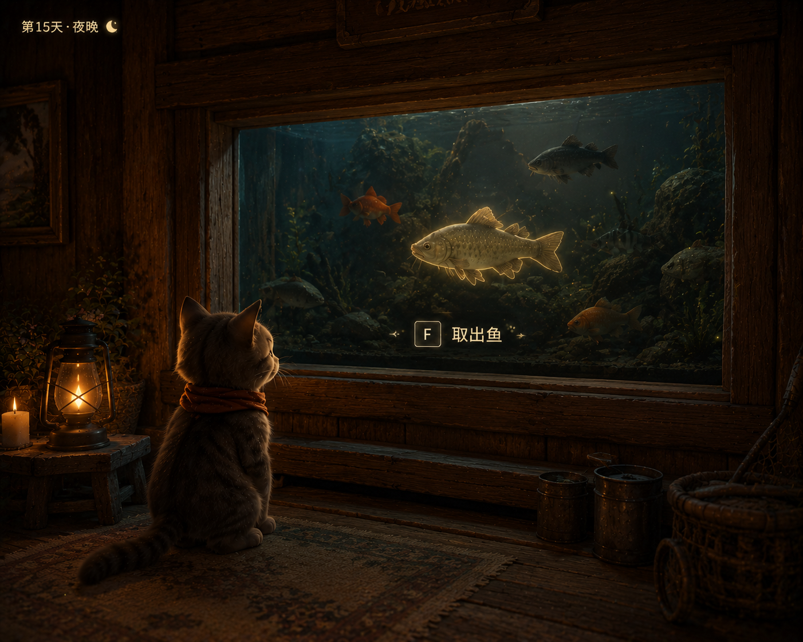

# 交互

> 属主：张佳 ｜ 状态：草稿（正文建设中）｜ 出处：本页与「ui」表共同承担交互总规；机制口径以各系统分册为准，数值以「数值模拟与参数记录」页为准

### 交互：鱼缸/鱼护取鱼

- 当小猫靠近鱼缸、鱼护进入交互范围时，镜头轻微转向目标。
- 可交互物体出现淡淡描边高亮效果。
- 显示提示：

> 【F】取出鱼

- 按下 F 后，播放取鱼动作，镜头推进到鱼的特写展示。
- 左上角显示鱼的信息（名称、品种、重量）。

---

### 交互：神像献祭

- **祭坛是石像前的一块地，不是容器。**入夜后把要献的鱼一趟趟叼过去扔在祭坛上就算摆好，谁想叼回去随时可以，直到石像被按下那一刻。白天只攒不献，见局与进程册。
- **与石像互动＝结算＋翻天。**全员到齐才能按下，倒地的猫豁免、已离开的玩家不计入。任一人按下即发起，随后一段短倒计时，倒计时里有人走出到场圈即中断（2026-09-11 拍）；倒计时走完，祭坛上的鱼一起消失，播过场，天亮。互动那一刻才锁定，之前搬进搬出都算数。
- 两个圈：摆鱼圈 2 米、到场圈 8 米（占位，见参数页）；互动锁定与叼鱼同刻按服务器判序。
- 显示提示：

> 【F】献给圣猫

- **祭坛空着也能按**，结算为当日任务没交齐，世界进度按降幅下跌。鱼的供奉点数按体重档取，见参数页。
- 呈现要区分三个量：当日任务点数、缸内可献点数、世界进度（见局与进程册 §7）。进度平时隐藏、靠近神像或打开界面时查看。⚠️ 下图参考稿画的是「按一次献一条、进度 2/3」的旧流程，已作废，重画时按上面的一次结算走。

### 交互：篝火（#）

- 夜晚时，小猫靠近篝火进入交互范围。
- 篝火出现柔和光效提示。
- 显示提示：

> 【F】坐下

- 按下 F 后，小猫坐到篝火旁，进入松弛状态；别的猫凑过来会叠成一堆。
- 播放温暖的篝火动画与轻柔音乐。
- 篝火不是流程里的一环，是玩家主动去的第四个去处，坐不坐都不影响翻天。印记功能 Demo 后置期间没有照片轮播，口径见营地册 §3.1.5。
- 翻天与篝火无关：夜晚无时限，坐不坐火边都不影响；翻天＝全员到祭坛、与石像互动（见局与进程册）。入夜即自动点亮，不需要献祭作为前置。

### 玩家靠近湖面

**交互描述：**

手持鱼竿即钓鱼待机，左键点水面抛竿（钓鱼规则 §3）；不设「F 钓鱼」模式入口。2026-09-09 晚定的方向：装备栏每槽一道具，选中后按使用键使用（选鱼竿＝朝对应位置抛漂如可行、选鱼护＝放下鱼护），键位待定；代码现行的上竿／离竿操作位是临时口径，不照它写。

系统检测当前位置附近是否存在已经投放的窝点。

- 如果附近没有窝：

  - 不显示任何提示。
- 如果附近存在窝：

  - 屏幕右下角显示当前区域窝点信息。
  - 玩家可以知道当前位置受到哪种窝影响。

⚠️ 上图参考稿里的「F 钓鱼」入口已作废（2026-09-09 晚），重出图时按装备栏方向画。

### 交互：换饵与窝料

- 岸边只能切换已带出的物品，不能凭空换。
- 搏斗中不能掏窝料；其他人可以补窝（钓鱼规则 §3、道具册）。
- 键位随「使用键」一起定（2026-09-09 晚方向，待定）。

### 交互：抛竿与投窝料的落点

- 点哪落哪，无蓄力。
- 超射程，或猫与点击点之间有遮挡，都抛不出，提示「够不到那边」（钓鱼规则 v1.7 §3）。
- 窝料落岸成掉落物，可捡回。
- 抛竿的输入形态按装备栏方向，现口径临时。

### 交互：求助与震动

- 手动求助＝急促猫叫加头顶图标；只有巨物给全体提示（钓鱼规则、多人钓鱼附篇）。
- 震动参数待定（张佳）。

### 归交互层的待定项

各册挂到交互层、还没定形式的条目；定完一条就搬进正文或 ui 表：

1. 渔获信息卡：钓上鱼的瞬间显示鱼种、重量、是否新图鉴、buff 提示（猫册 08-21）。
2. 吃鱼瞬时浮层：限时 buff 与黄色体力的即时反馈（猫册 08-21）。
3. 三选一卡面：每项带描述，按「出现次序」限制刷出（猫册「升级效果」）。
4. 选猫界面的非数值示意：力气＝鱼骨 icon 数量之类，加性格文案（猫册 v1.15）。
5. 三选一的选择演出：三条小鱼干选叼哪条（升级效果页）。
6. 公款余额对全队常时可见的位置与形态（商店册 §7）。
7. 白天「缸内可献点数 vs 今日任务」的形式；进度条呈现方向＝祭坛本体即进度可视化（局与进程册 §7）。
8. 多猫同看图鉴的同步表现（图鉴册 §1.2、§7）。
9. 跨局相册的局外入口形式（印记册 §3.1.6，Demo 后置）。
10. 印记一键隐藏的入口要顺手、不能有「举报」既视感（印记册 §7，Demo 后置）。
11. 换人濒死强提示、线长余量的世界内表现、主钓手与辅助手的角色区分样式（ui 表待办）。
12. 窝点标记浓／中／淡三档表现，等窝点模型定（2026-09-09 挂起）。

修订：2026-09-10 Claude 代写——「玩家靠近湖面」删「F 钓鱼」入口改按装备栏方向；神像献祭补两圈；新增换饵与窝料、落点、求助与震动三节与待定项清单（张佳核，不同意直接改）。
